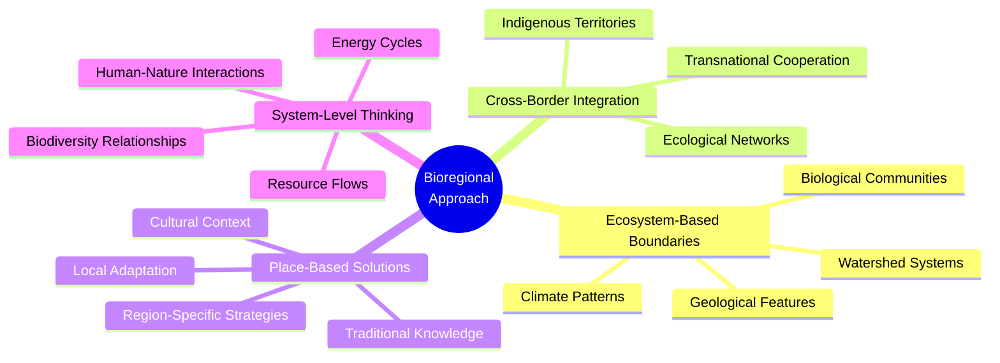
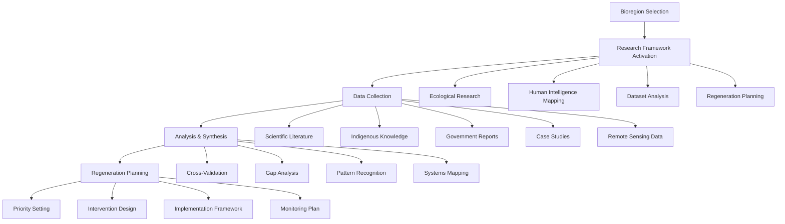
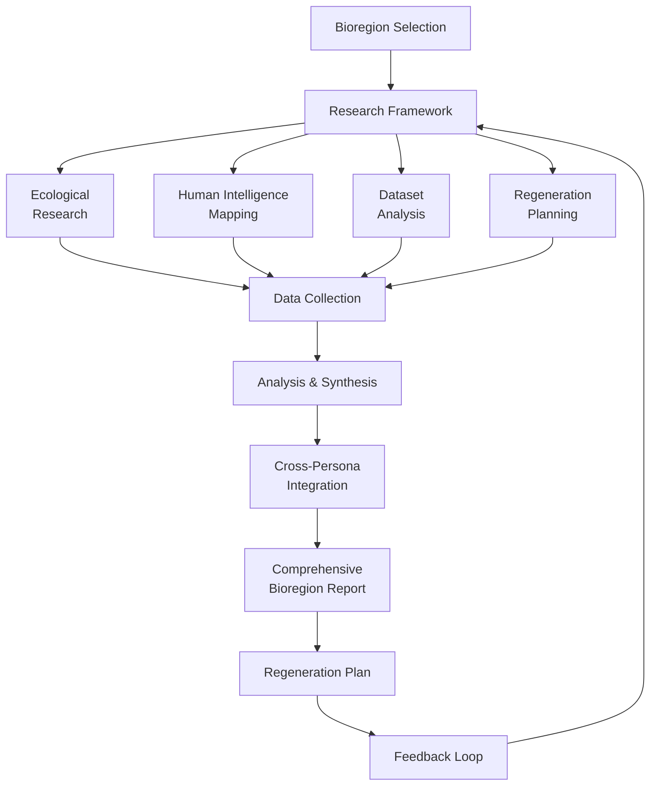
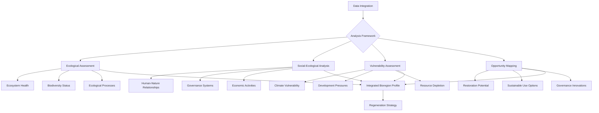
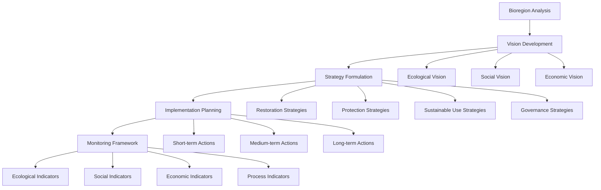
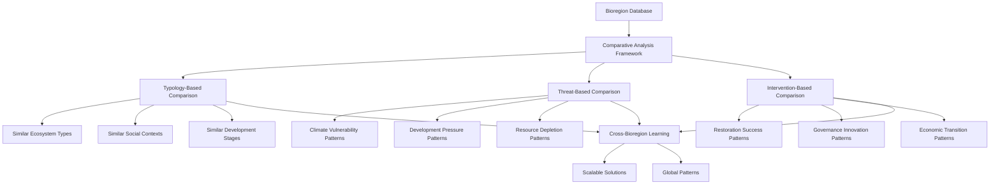

# One Earth Bioregion Methodology

This document explains the methodology used by the One Earth Bioregion Analysis System for researching, analyzing, and developing regeneration plans for Earth's bioregions.

## Overview of the Bioregion Approach

The One Earth system uses a bioregional approach to ecological analysis and regeneration planning. This approach recognizes that Earth's ecosystems can be divided into distinct bioregions - geographical areas defined by natural characteristics rather than political boundaries.



### Bioregion Classification System

The One Earth system uses a comprehensive classification of Earth's terrestrial bioregions based on a synthesis of multiple ecological classification systems, including:

1. Terrestrial Ecoregions of the World (Olson et al., 2001)
2. Biogeographic Realms (Wallace, 1876)
3. Biodiversity Hotspots (Conservation International)
4. Indigenous Cultural Areas

This integrated classification results in 142 distinct bioregions globally, each with unique ecological characteristics and human-environment relationships.

## Research Methodology

The research methodology employs a structured approach using specialized research personas, systematic data collection, and multi-perspective analysis.



### Research Personas

The One Earth system employs four specialized research personas to ensure comprehensive analysis of each bioregion:

#### 1. Ecological Researcher

**Focus Areas:**
- Ecosystem composition, structure, and function
- Biodiversity patterns and processes
- Environmental threats and vulnerabilities
- Ecological resilience factors

**Methodology:**
- Systematic review of scientific literature
- Analysis of ecological monitoring data
- Compilation of species inventories
- Identification of ecosystem services

**Key Questions:**
- What are the defining ecological characteristics of this bioregion?
- What are the key ecological processes maintaining biodiversity?
- What are the critical threats to ecological integrity?
- What are the priority conservation targets?

#### 2. Human Intelligence Mapper

**Focus Areas:**
- Stakeholder identification and relationships
- Power dynamics and decision-making structures
- Cultural relationships with land and resources
- Knowledge systems and practices

**Methodology:**
- Stakeholder mapping and analysis
- Identification of governance structures
- Documentation of land use practices
- Assessment of community capacities

**Key Questions:**
- Who are the key stakeholders influencing ecological outcomes?
- What are the traditional and contemporary management systems?
- How do different knowledge systems understand the bioregion?
- What are the power dynamics affecting resource management?

#### 3. Dataset Specialist

**Focus Areas:**
- Available data resources for the bioregion
- Data gaps and limitations
- Integration of multiple data types
- Quantitative analysis methods

**Methodology:**
- Database identification and access
- Data quality assessment
- Cross-referencing multiple sources
- Temporal and spatial data analysis

**Key Questions:**
- What datasets exist for this bioregion?
- What are the critical data gaps?
- How can diverse data sources be integrated?
- What quantitative metrics can be used to track change?

#### 4. Regeneration Planner

**Focus Areas:**
- Strategic intervention approaches
- Implementation frameworks
- Stakeholder engagement methods
- Monitoring and evaluation systems

**Methodology:**
- Analysis of regeneration case studies
- Development of bioregion-specific strategies
- Creation of phased implementation plans
- Design of adaptive management frameworks

**Key Questions:**
- What are the highest leverage intervention points?
- What regeneration approaches are appropriate for this context?
- How can implementation be structured for success?
- What metrics should be used to track progress?

### Research Process Integration



The research personas work in parallel, focused on their specialty areas while maintaining ongoing dialogue through structured integration points. This ensures that ecological insights are connected to human systems, data resources inform understanding, and regeneration planning is grounded in both ecological and social realities.

## Data Collection Methodology

The One Earth system employs a systematic approach to data collection that draws from multiple sources:

### 1. Scientific Literature

- Peer-reviewed journals
- Research monographs
- Technical reports
- Conference proceedings

### 2. Indigenous and Local Knowledge

- Traditional ecological knowledge
- Cultural practices and management systems
- Oral histories and community documentation
- Participatory research findings

### 3. Government and NGO Reports

- Conservation assessments
- Land use plans
- Environmental impact studies
- Policy documents

### 4. Remote Sensing and Spatial Data

- Satellite imagery
- Land cover classifications
- Protected area boundaries
- Infrastructure mapping

### 5. Biodiversity Databases

- Species occurrence records
- Conservation status assessments
- Genetic diversity information
- Ecosystem inventories

## Analysis Framework

The analysis framework integrates qualitative and quantitative approaches to develop a comprehensive understanding of each bioregion:



### Core Analysis Components

#### 1. Ecological Assessment

The ecological assessment examines the status, trends, and functions of ecosystems within the bioregion:

- **Ecosystem Composition**: Analysis of species diversity, community structure, and trophic relationships
- **Ecosystem Function**: Assessment of ecological processes, energy flows, and nutrient cycles
- **Ecosystem Condition**: Evaluation of habitat quality, fragmentation, and degradation
- **Conservation Status**: Identification of threatened species, habitats, and ecological communities

#### 2. Social-Ecological Analysis

The social-ecological analysis examines the relationships between human communities and natural systems:

- **Land Use Patterns**: Mapping and analysis of historical and current land use
- **Resource Governance**: Assessment of formal and informal governance arrangements
- **Cultural Connections**: Documentation of cultural values, practices, and knowledge systems
- **Economic Activities**: Analysis of livelihoods, market systems, and economic dependencies

#### 3. Vulnerability Assessment

The vulnerability assessment identifies key threats and pressures affecting the bioregion:

- **Climate Change Impacts**: Projection of climate change effects on ecosystems and communities
- **Development Pressures**: Assessment of infrastructure expansion, resource extraction, and urbanization
- **Pollution Impacts**: Evaluation of various pollution sources and their ecological effects
- **Invasive Species**: Identification of non-native species and their impacts

#### 4. Opportunity Mapping

The opportunity mapping identifies potential leverage points for positive change:

- **Restoration Potential**: Identification of degraded areas with high restoration potential
- **Sustainable Use Options**: Exploration of sustainable economic activities aligned with ecological capacity
- **Conservation Priorities**: Mapping of areas with high conservation value
- **Governance Innovations**: Identification of promising governance arrangements and policies

## Regeneration Planning Methodology

The regeneration planning methodology translates analysis into actionable strategies for bioregion restoration and sustainable development:



### 1. Vision Development

The regeneration planning begins with the development of a compelling vision for the bioregion that integrates ecological, social, and economic dimensions:

- **Ecological Vision**: Targets for ecosystem health, biodiversity, and ecological processes
- **Social Vision**: Goals for human wellbeing, cultural vitality, and social equity
- **Economic Vision**: Objectives for sustainable livelihoods, circular economy, and ecological economics

### 2. Strategy Formulation

Based on the vision, the system develops integrated strategies across four domains:

#### Restoration Strategies

Approaches for actively restoring degraded ecosystems:

- **Ecosystem Restoration**: Technical approaches for ecological recovery
- **Species Reintroduction**: Protocols for reintroducing lost species
- **Landscape Connectivity**: Approaches for reconnecting fragmented habitats
- **Ecological Engineering**: Techniques for accelerating ecosystem recovery

#### Protection Strategies

Approaches for safeguarding intact ecosystems:

- **Protected Area Systems**: Design of representative and connected protected areas
- **Indigenous & Community Conservation**: Support for community-led conservation
- **Buffer Zone Management**: Approaches for managing areas around core protection zones
- **Ecological Networks**: Design of corridors and stepping stones

#### Sustainable Use Strategies

Approaches for human activities that sustain rather than degrade ecosystems:

- **Regenerative Agriculture**: Farming practices that build soil and biodiversity
- **Sustainable Forestry**: Timber and non-timber forest product harvesting approaches
- **Sustainable Fisheries**: Aquatic resource management systems
- **Ecotourism**: Low-impact visitor experiences that support conservation

#### Governance Strategies

Approaches for decision-making and management systems:

- **Multi-stakeholder Governance**: Inclusive decision-making platforms
- **Policy Reform**: Changes to legal and regulatory frameworks
- **Rights Recognition**: Recognition of indigenous and community rights
- **Financial Mechanisms**: Funding models for long-term sustainability

### 3. Implementation Planning

The implementation planning translates strategies into concrete actions across different time horizons:

- **Short-term Actions (1-2 years)**: Immediate priorities and quick wins
- **Medium-term Actions (3-5 years)**: Building blocks for transformative change
- **Long-term Actions (5-10+ years)**: Fundamental system shifts

Each action is specified with:
- Clear objectives and outcomes
- Required resources and inputs
- Responsible stakeholders
- Timeline and milestones
- Success indicators

### 4. Monitoring Framework

The monitoring framework enables adaptive management through systematic tracking of progress:

- **Ecological Indicators**: Metrics for ecosystem health and biodiversity
- **Social Indicators**: Measures of human wellbeing and equity
- **Economic Indicators**: Metrics for sustainable livelihoods and economic resilience
- **Process Indicators**: Measures of implementation progress and governance effectiveness

## Bioregion Comparative Analysis

The One Earth system enables comparative analysis across bioregions to identify patterns, transfer learnings, and scale approaches:



### Comparative Analysis Applications

The comparative analysis framework supports:

1. **Knowledge Transfer**: Identification of approaches that can be transferred between similar bioregions
2. **Pattern Recognition**: Detection of global patterns in threats, opportunities, and effective interventions
3. **Resource Allocation**: Prioritization of interventions based on comparative analysis
4. **Policy Development**: Informing policy based on cross-bioregion evidence

## Case Application Methodology

The case application methodology provides a structured approach for applying the One Earth system to specific bioregions:

```mermaid
gantt
    title Bioregion Analysis Process Timeline
    dateFormat  YYYY-QQ
    section Research Phase
    Bioregion Selection            :a1, 2023-Q1, 1q
    Initial Data Collection        :a2, after a1, 2q
    Stakeholder Engagement         :a3, after a1, 3q
    Field Research                 :a4, after a2, 2q
    section Analysis Phase
    Ecological Assessment          :b1, after a4, 2q
    Social-Ecological Analysis     :b2, after a4, 2q
    Vulnerability Assessment       :b3, after b1, 1q
    Opportunity Mapping            :b4, after b2, 1q
    section Planning Phase
    Vision Development             :c1, after b3, 1q
    Strategy Formulation           :c2, after c1, 2q
    Implementation Planning        :c3, after c2, 2q
    Monitoring Framework           :c4, after c3, 1q
    section Implementation Phase
    Initial Implementation         :d1, after c3, 4q
    Adaptive Management            :d2, after d1, ongoing
```

### Application Phases

#### 1. Preparation Phase

- Bioregion selection and boundary definition
- Assembly of research team
- Stakeholder mapping and engagement planning
- Research protocol development

#### 2. Research Phase

- Data collection across all domains
- Field research and verification
- Stakeholder consultations
- Knowledge integration

#### 3. Analysis Phase

- Data analysis and synthesis
- Threat and opportunity assessment
- System dynamics mapping
- Future scenario development

#### 4. Planning Phase

- Vision co-creation with stakeholders
- Strategy development
- Implementation planning
- Resource mobilization

#### 5. Implementation Phase

- Pilot interventions
- Scaled implementation
- Monitoring and evaluation
- Adaptive management

## Conclusion: Evolving Methodology

The One Earth Bioregion Methodology is continuously evolving based on:

1. **Field Application Learnings**: Refinements based on application in diverse contexts
2. **Emerging Research**: Integration of new scientific understanding
3. **Indigenous Knowledge**: Deeper incorporation of traditional ecological knowledge
4. **Technology Advances**: Utilization of new tools for data collection and analysis
5. **Policy Developments**: Alignment with evolving policy frameworks

This living methodology provides a robust framework while maintaining adaptability to specific contexts and emerging challenges. By applying this methodology, the One Earth system enables comprehensive understanding of bioregions and development of context-appropriate regeneration strategies.

---

*For more detailed information on specific methodological components, please refer to the technical appendices and case studies.* 