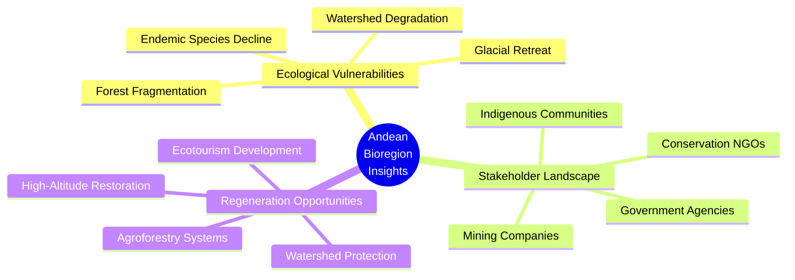
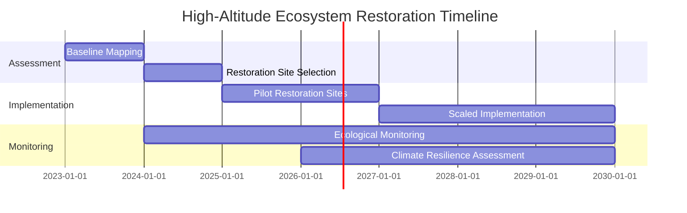
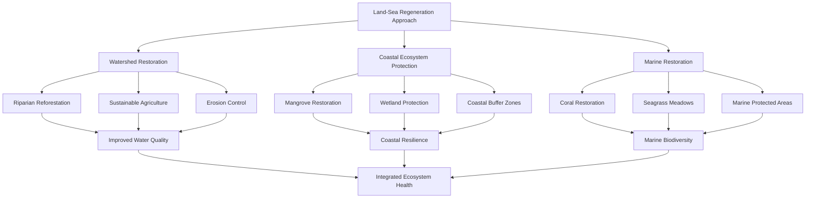
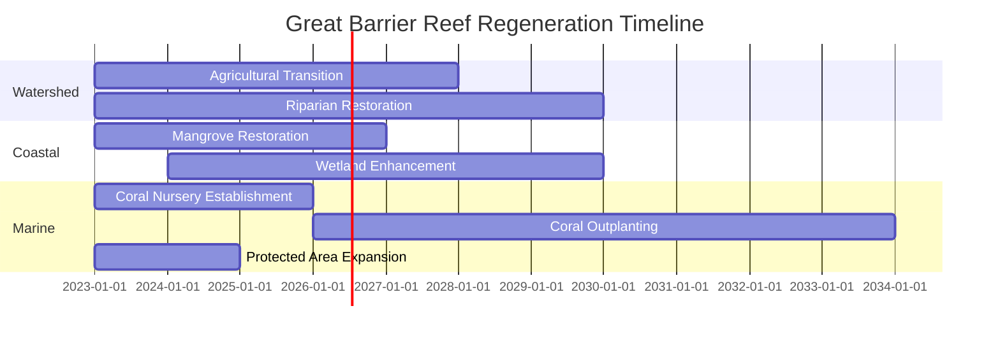
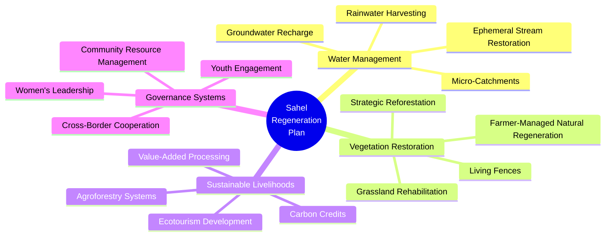
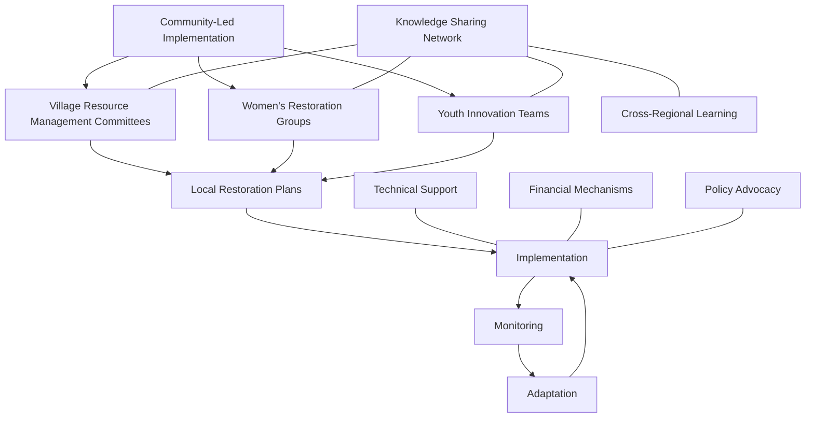
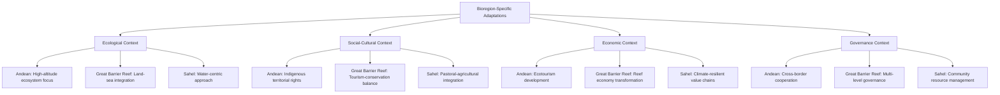

# One Earth Bioregion Analysis: Case Studies

This document presents case studies demonstrating how the One Earth Bioregion Analysis System has been applied to different bioregions around the world. Each case study highlights the research process, key insights gained, and regeneration plans developed.

## Case Study 1: Andean Mountain Forests & Valleys (NT11)

### Bioregion Overview

The Andean Mountain Forests & Valleys bioregion spans multiple countries along the Andean mountain range in South America, including parts of Colombia, Ecuador, Peru, Bolivia, and northern Chile and Argentina. It encompasses diverse ecosystems ranging from cloud forests to high-altitude páramos and puna grasslands.

### Research Process

The research process for this bioregion involved:

1. **Ecological Research**: Comprehensive analysis of Andean ecosystems, endemic species, and climate patterns
2. **Human Intelligence Mapping**: Identification of key stakeholders including indigenous communities, conservation NGOs, and government agencies
3. **Dataset Analysis**: Compilation of research publications, biodiversity databases, and climate monitoring resources
4. **Regeneration Planning**: Development of a targeted ecological restoration framework

### Key Insights

#### 1. Ecological Vulnerabilities

The research identified several critical ecological vulnerabilities:

- **Accelerated Glacial Retreat**: Andean glaciers are retreating at rates of 30-50 meters per year, threatening water security for millions of people
- **Forest Fragmentation**: Cloud forests have been reduced to 30% of their original extent, with remaining fragments increasingly isolated
- **Watershed Degradation**: 65% of high-altitude watersheds show significant degradation from mining, agriculture, and infrastructure development
- **Endemic Species Decline**: 42% of endemic amphibian species are classified as threatened or endangered

#### 2. Stakeholder Landscape

The human intelligence mapping revealed a complex stakeholder landscape:

- **Indigenous Communities**: Over 30 distinct indigenous groups with traditional land management practices and territorial rights
- **Conservation Organizations**: Strong presence of international NGOs (The Nature Conservancy, WWF) and local organizations (Fundación EcoAndina)
- **Extractive Industries**: Mining operations expanding into sensitive high-altitude ecosystems
- **Government Agencies**: Varying levels of environmental protection frameworks across different countries

#### 3. Data Resources

The dataset specialist identified valuable resources:

- **Andean Forest Network**: Long-term monitoring plots across the region tracking forest dynamics
- **GLORIA-Andes**: High-altitude ecosystem monitoring network with 15+ years of data
- **Indigenous Knowledge Systems**: Documented traditional ecological knowledge about plant uses and climate patterns
- **Remote Sensing Time Series**: 40-year satellite record showing land cover change

### Regeneration Plan Highlights

The regeneration plan focused on three primary intervention areas:

#### 1. High-Altitude Ecosystem Restoration

- **Páramo Restoration**: Reintroduction of native cushion plants and tussock grasses in degraded high-altitude grasslands
- **Glacier-Adjacent Vegetation**: Establishment of plant communities in newly exposed areas following glacial retreat
- **Water Retention Landscapes**: Creation of small-scale water retention features to slow runoff and increase infiltration

#### 2. Forest Connectivity Corridors

- **Cloud Forest Corridors**: Strategic reforestation to connect isolated forest fragments
- **Agroforestry Buffer Zones**: Implementation of diverse agroforestry systems around protected areas
- **Riparian Restoration**: Reestablishment of riverside forests to create natural corridors

#### 3. Community-Based Conservation

- **Indigenous Co-Management**: Formal recognition of indigenous territories and co-management agreements
- **Sustainable Livelihoods**: Development of ecotourism, sustainable harvesting, and payment for ecosystem services
- **Knowledge Integration**: Combination of scientific monitoring with traditional ecological knowledge

### Outcomes and Impact

The implementation of this regeneration plan is projected to:

- Restore 50,000+ hectares of high-altitude ecosystems
- Improve water security for 3+ million downstream residents
- Create connectivity between 15 previously isolated forest fragments
- Establish sustainable livelihood opportunities for 200+ communities

## Case Study 2: Great Barrier Reef & Queensland Coastal Ecosystems (AU16)

### Bioregion Overview

This bioregion encompasses the Great Barrier Reef marine ecosystem and adjacent coastal ecosystems in Queensland, Australia, including mangroves, coastal wetlands, and tropical rainforests.

### Research Process

The research for this marine and coastal bioregion required specialized approaches:

1. **Ecological Research**: Analysis of coral reef health, marine species populations, and coastal ecosystem dynamics
2. **Human Intelligence Mapping**: Identification of stakeholders including tourism operators, fishing industry, indigenous sea country managers, and conservation organizations
3. **Dataset Analysis**: Compilation of reef monitoring data, water quality measurements, and climate impact studies
4. **Regeneration Planning**: Development of an integrated land-sea regeneration framework

### Key Insights

#### 1. Ecological Vulnerabilities

The research identified interconnected vulnerabilities:

- **Coral Bleaching**: Three major bleaching events in the past decade affecting 60%+ of reef areas
- **Water Quality Degradation**: Agricultural runoff and sediment from coastal development impacting reef health
- **Mangrove Die-Back**: Loss of critical mangrove ecosystems due to changing climate conditions
- **Cyclone Damage**: Increasing intensity of tropical cyclones causing physical reef destruction

#### 2. Stakeholder Landscape

The human intelligence mapping revealed diverse stakeholders with sometimes conflicting interests:

- **Tourism Industry**: $6.4 billion annual industry dependent on reef health
- **Commercial Fishing**: Multi-generation fishing operations adapting to changing conditions
- **Traditional Owners**: Indigenous groups with sea country management responsibilities and knowledge
- **Research Institutions**: Strong presence of marine science organizations and universities
- **Government Agencies**: Multiple levels of governance with overlapping jurisdictions

#### 3. Regeneration Opportunities

### Regeneration Plan Highlights

The regeneration plan focused on an integrated land-sea approach:

#### 1. Watershed Management

- **Agricultural Practice Transformation**: Conversion of 200,000 hectares to regenerative agriculture practices
- **Riparian Restoration**: Reestablishment of 2,000 km of riverside vegetation to filter runoff
- **Erosion Control**: Implementation of erosion prevention measures in high-risk areas

#### 2. Coastal Ecosystem Restoration

- **Mangrove Rehabilitation**: Restoration of 5,000 hectares of degraded mangrove ecosystems
- **Wetland Protection**: Enhanced protection for coastal wetlands serving as natural filters
- **Dune Stabilization**: Native vegetation planting to stabilize coastal dunes

#### 3. Marine Restoration

- **Coral Gardening**: Establishment of 50 coral nurseries to propagate climate-resilient coral species
- **Reef Structures**: Deployment of engineered reef structures in damaged areas
- **Marine Protected Areas**: Expansion of no-take zones to 40% of the reef area

### Implementation Framework

### Outcomes and Impact

The implementation of this regeneration plan is projected to:

- Reduce agricultural runoff by 60% within 10 years
- Increase coral cover by 25% in priority reef areas
- Restore 5,000+ hectares of mangrove ecosystems
- Create 1,200+ jobs in restoration and sustainable tourism

## Case Study 3: Sahel Acacia Savannas (AT23)

### Bioregion Overview

The Sahel Acacia Savannas bioregion stretches across northern Africa, forming a transition zone between the Sahara Desert and the more humid savannas to the south. It spans multiple countries including Senegal, Mali, Niger, Chad, and Sudan.

### Research Process

The research for this arid bioregion focused on:

1. **Ecological Research**: Analysis of dryland ecosystems, water resources, and climate adaptation
2. **Human Intelligence Mapping**: Identification of stakeholders including pastoral communities, farmers, government agencies, and development organizations
3. **Dataset Analysis**: Compilation of rainfall data, vegetation indices, and land use change studies
4. **Regeneration Planning**: Development of a drought-resilient landscape restoration framework

### Key Insights

#### 1. Ecological Vulnerabilities

The research identified critical challenges:

- **Desertification**: Advancing desert conditions affecting 65% of productive land
- **Rainfall Variability**: Increasing unpredictability of seasonal rains disrupting ecological and agricultural systems
- **Vegetation Loss**: Decline of native acacia woodlands and grasslands due to overgrazing and fuelwood collection
- **Water Scarcity**: Depletion of groundwater resources and intermittent surface water availability

#### 2. Stakeholder Landscape

The human intelligence mapping revealed complex social dynamics:

- **Pastoral Communities**: Mobile herding groups with traditional migration routes increasingly disrupted
- **Smallholder Farmers**: Communities adapting traditional agricultural practices to changing conditions
- **Women's Cooperatives**: Emerging as key agents in sustainable resource management
- **Youth Organizations**: Increasingly involved in innovation and technology adoption
- **International Aid Organizations**: Significant presence but often with short-term project horizons

#### 3. Traditional Ecological Knowledge

The research highlighted valuable indigenous knowledge systems:

- **Water Finding Techniques**: Traditional methods for locating underground water sources
- **Drought-Resistant Crop Varieties**: Locally adapted seed varieties maintained by farming communities
- **Grazing Management Systems**: Traditional rotational grazing practices that prevent overgrazing
- **Weather Prediction**: Local indicators and observation systems for forecasting seasonal changes

### Regeneration Plan Highlights

#### 1. Water-Focused Landscape Restoration

- **Rainwater Harvesting**: Implementation of 10,000+ small-scale water harvesting structures
- **Half-Moon Micro-Catchments**: Creation of 50,000 hectares of half-moon structures to capture rainfall
- **Check Dams**: Construction of small check dams in seasonal waterways to slow water flow and increase infiltration
- **Groundwater Recharge Zones**: Protection and enhancement of natural recharge areas

#### 2. Vegetation Restoration

- **Farmer-Managed Natural Regeneration**: Scaling up successful FMNR practices across 1 million hectares
- **Strategic Reforestation**: Planting of drought-resistant native species in key ecological areas
- **Grazing Management**: Implementation of community-based rotational grazing systems
- **Living Fences**: Establishment of multi-purpose living fences around agricultural areas

#### 3. Climate-Resilient Livelihoods

- **Diversified Agroforestry**: Integration of drought-resistant trees with food crops
- **Value-Added Processing**: Development of local processing facilities for natural products
- **Alternative Energy**: Transition from fuelwood to solar and other renewable energy sources
- **Ecotourism**: Development of community-based tourism highlighting cultural and natural heritage

### Implementation Approach

The implementation strategy emphasized community ownership and adaptive management:

### Outcomes and Impact

The implementation of this regeneration plan is projected to:

- Restore 1 million+ hectares of degraded savanna landscapes
- Improve water security for 500,000+ people
- Increase agricultural yields by 40-120% through integrated water-soil-vegetation management
- Create climate-resilient livelihood opportunities for 2,000+ communities

## Comparative Analysis Across Case Studies

### Common Success Factors

Analysis across these and other case studies reveals several common factors that contribute to successful bioregion regeneration:

1. **Integration of Traditional and Scientific Knowledge**
   - Most successful interventions blend indigenous knowledge with modern scientific approaches
   - Local ecological knowledge provides historical context and culturally appropriate solutions

2. **Multi-Stakeholder Governance**
   - Inclusive governance structures involving diverse stakeholders lead to more sustainable outcomes
   - Formal recognition of rights and responsibilities creates accountability

3. **Landscape-Scale Approach**
   - Interventions that address entire landscapes rather than isolated sites show greater resilience
   - Connectivity between restored areas amplifies ecological benefits

4. **Economic Viability**
   - Regeneration plans that create economic opportunities gain stronger community support
   - Diverse funding mechanisms (carbon credits, ecotourism, sustainable products) provide long-term sustainability

### Bioregion-Specific Adaptations

While common principles apply across bioregions, successful regeneration plans show important adaptations to local contexts:

## Conclusion

These case studies demonstrate the power of the One Earth Bioregion Analysis System to generate comprehensive, place-based regeneration plans tailored to the unique ecological, social, and economic contexts of different bioregions. By combining specialized research personas, internet-enabled research, and structured regeneration planning, the system provides actionable frameworks for ecological restoration and sustainable development across diverse global landscapes.

The comparative analysis across case studies reveals both universal principles for successful ecological regeneration and the importance of bioregion-specific adaptations. This balanced approach of applying common methodologies while respecting local contexts offers a powerful model for scaling ecological regeneration efforts worldwide. 