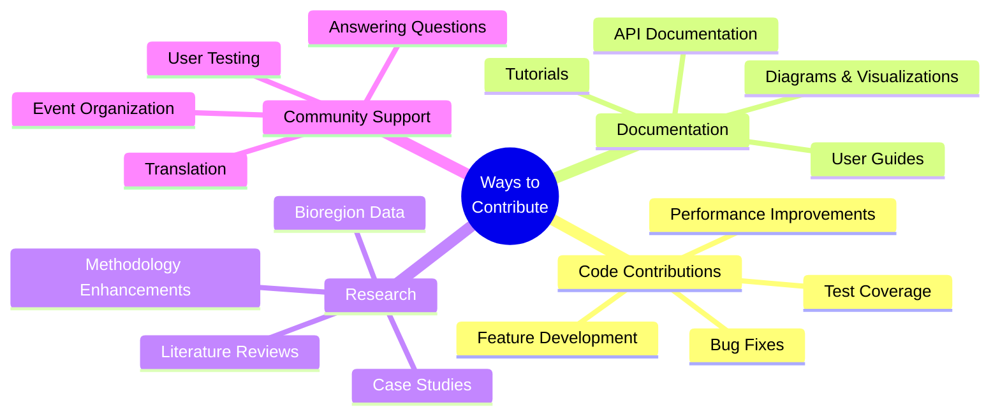
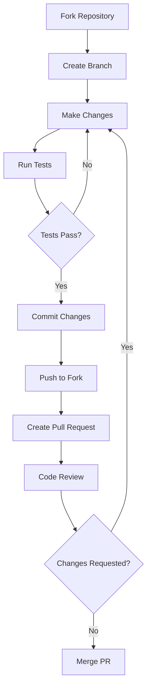
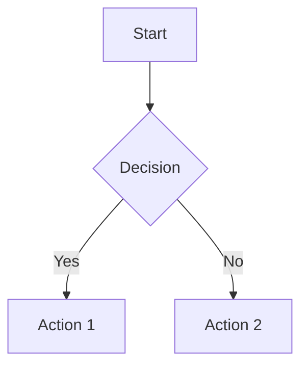

# Contributing to One Earth

Thank you for your interest in contributing to the One Earth Bioregion Analysis System! This guide provides information on how you can contribute to this project and help improve our understanding and regeneration of Earth's bioregions.

## Table of Contents

- [Code of Conduct](#code-of-conduct)
- [Ways to Contribute](#ways-to-contribute)
- [Setting Up Your Development Environment](#setting-up-your-development-environment)
- [Contribution Workflow](#contribution-workflow)
- [Development Guidelines](#development-guidelines)
- [Documentation Guidelines](#documentation-guidelines)
- [Research Contributions](#research-contributions)
- [Community and Communication](#community-and-communication)

## Code of Conduct

The One Earth project is committed to providing a welcoming and inclusive environment for all contributors. We expect all participants to adhere to the following principles:

- Be respectful and considerate of differing viewpoints and experiences
- Use inclusive language and avoid discriminatory or harassing behavior
- Focus on constructive feedback and collaboration
- Show empathy towards other community members
- Prioritize the collective good of the project and its mission

## Ways to Contribute



There are many ways to contribute to the One Earth project, regardless of your technical background:

### Code Contributions

- **Bug fixes**: Help identify and fix issues in the codebase
- **New features**: Implement new functionality that enhances the system's capabilities
- **Performance improvements**: Optimize code for better speed and resource utilization
- **Test development**: Enhance test coverage to ensure system reliability

### Documentation

- **User guides**: Create or improve guides for different user types
- **API documentation**: Document interfaces for developers
- **Tutorials**: Create step-by-step guides for specific tasks
- **Translation**: Translate documentation into different languages

### Research Contributions

- **Bioregion data**: Contribute additional data for specific bioregions
- **Case studies**: Document applications of the One Earth methodology
- **Methodology enhancement**: Suggest improvements to research approaches
- **Literature reviews**: Compile relevant research for specific bioregions

### Community Support

- **Answering questions**: Help other users in forums and discussion boards
- **User testing**: Provide feedback on new features and usability
- **Event participation**: Join or help organize community events
- **Outreach**: Help spread awareness about the project

## Setting Up Your Development Environment

Follow these steps to set up your local development environment:

### 1. Fork and Clone the Repository

```bash
# Fork the repository on GitHub, then clone your fork
git clone https://github.com/yourusername/OneEarth.git
cd OneEarth

# Add the original repository as an upstream remote
git remote add upstream https://github.com/originalowner/OneEarth.git
```

### 2. Set Up a Virtual Environment

```bash
# Create a virtual environment
python3 -m venv venv

# Activate the virtual environment
# On macOS/Linux:
source venv/bin/activate
# On Windows:
# venv\Scripts\activate
```

### 3. Install Dependencies

```bash
# Install development dependencies
pip install -r requirements.txt
pip install -r requirements-dev.txt  # If exists
```

### 4. Run Setup Verification

```bash
# Run tests to ensure your environment is correctly set up
python -m pytest tests/
```

## Contribution Workflow



### 1. Create a Branch

Before making changes, create a new branch:

```bash
# Ensure you're on the main branch and up-to-date
git checkout main
git pull upstream main

# Create a new branch for your feature or fix
git checkout -b feature/your-feature-name
# or
git checkout -b fix/issue-description
```

### 2. Make Your Changes

- Make focused changes addressing a specific issue or feature
- Write clean, well-commented code following the project's style guidelines
- Include tests for new functionality or bug fixes

### 3. Test Your Changes

```bash
# Run the test suite
python -m pytest

# Run linting checks
flake8
```

### 4. Commit Your Changes

```bash
# Stage your changes
git add .

# Commit with a descriptive message
git commit -m "Description of changes made"
```

### 5. Push to Your Fork

```bash
git push origin feature/your-feature-name
```

### 6. Create a Pull Request

- Go to your fork on GitHub and click "New Pull Request"
- Select the appropriate branches
- Fill out the PR template with details about your changes
- Link any related issues

### 7. Code Review Process

- Maintainers will review your PR
- Address any feedback or requested changes
- Once approved, your changes will be merged

## Development Guidelines

### Code Style

- Follow PEP 8 guidelines for Python code
- Use meaningful variable and function names
- Include docstrings for all functions, classes, and modules
- Keep functions focused on a single responsibility
- Comment complex logic or algorithms

### Testing

- Write tests for all new functionality
- Update tests when modifying existing functionality
- Aim for high test coverage (>80%)
- Include both unit tests and integration tests where appropriate

### Version Control

- Make regular, small commits with clear messages
- Use present tense in commit messages ("Add feature" not "Added feature")
- Reference issue numbers in commit messages where applicable
- Keep pull requests focused on a single feature or fix

### Dependency Management

- Avoid adding unnecessary dependencies
- Document any new dependencies in requirements.txt
- Specify version constraints to ensure reproducibility

## Documentation Guidelines

### General Principles

- Write clear, concise documentation accessible to the target audience
- Use examples to illustrate concepts and usage
- Include diagrams where they aid understanding
- Keep documentation up-to-date with code changes

### Markdown Style

- Use proper heading hierarchy (H1 for title, H2 for sections, etc.)
- Include a table of contents for longer documents
- Use code blocks with language specification for code examples
- Use bullet points and numbered lists for clarity

### Mermaid Diagrams

The project uses Mermaid for diagrams. When creating diagrams:

```
# Example Mermaid diagram syntax

```

- Keep diagrams simple and focused
- Use consistent styling and terminology
- Include explanatory text around diagrams

## Research Contributions

### Bioregion Data Contributions

When contributing data for bioregions:

1. **Data Format**: Follow the template in `templates/bioregion_data_template.json`
2. **Data Sources**: Document all sources with proper citations
3. **Data Quality**: Ensure data meets quality criteria outlined in `RESEARCH_QUALITY.md`
4. **Review Process**: All data contributions undergo peer review

### Case Study Contributions

To contribute a case study:

1. **Structure**: Follow the case study template in `templates/case_study_template.md`
2. **Content**: Include clear methodology, findings, and lessons learned
3. **Evidence**: Provide supporting evidence for claims and outcomes
4. **Permission**: Ensure you have permission to share all included information

### Methodology Enhancements

For suggesting improvements to the research methodology:

1. **Background**: Provide scientific background for the suggested change
2. **Implementation**: Describe how to implement the methodological improvement
3. **Validation**: Include evidence of the enhancement's effectiveness
4. **Integration**: Explain how it integrates with existing approaches

## Community and Communication

### Where to Ask Questions

- **GitHub Issues**: For bug reports and feature requests
- **Discussion Forum**: For general questions and discussions
- **Slack Channel**: For real-time communication with the community

### Community Meetings

- **Developer Meetings**: Bi-weekly calls to discuss development progress
- **Research Working Groups**: Monthly meetings focused on methodology and research
- **Community Calls**: Quarterly open calls for all community members

### Becoming a Core Contributor

After consistent contributions, you may be invited to become a core contributor with additional repository access. This involves:

1. Demonstrated understanding of the project's goals and codebase
2. History of quality contributions
3. Active participation in community discussions
4. Commitment to the project's long-term success

## Recognition

All contributors are recognized in the following ways:

- **Contributors file**: All contributors are listed in CONTRIBUTORS.md
- **Release notes**: Significant contributions are highlighted in release notes
- **Website recognition**: Major contributors are featured on the project website

## Thank You!

Your contributions help make the One Earth Bioregion Analysis System a more powerful tool for understanding and regenerating Earth's ecosystems. We're grateful for your time and expertise!

---

*This document was last updated: March, 2024* 