# OneEarth Data Processing Pipeline

This document provides a detailed technical overview of the data processing pipeline used in the OneEarth system, with comprehensive diagrams illustrating the flow of data from input to analysis and visualization.

## Pipeline Overview

The OneEarth data processing pipeline transforms raw input data into actionable insights through a series of well-defined stages:

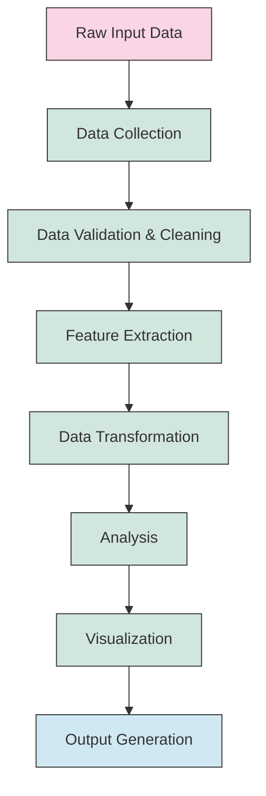

## Data Flow Architecture

This diagram shows the detailed architecture of how data flows through the OneEarth system:

```mermaid
flowchart TD
    subgraph Input
        A1[Document Files]
        A2[API Data]
        A3[User Input]
    end
    
    subgraph Collection
        B1[File Reader]
        B2[API Client]
        B3[Input Parser]
    end
    
    subgraph "Validation & Cleaning"
        C1[Schema Validation]
        C2[Data Cleaning]
        C3[Normalization]
        C4[Deduplication]
    end
    
    subgraph "Feature Extraction"
        D1[Text Processing]
        D2[Entity Recognition]
        D3[Topic Extraction]
        D4[Keyword Analysis]
        D5[Semantic Analysis]
    end
    
    subgraph Transformation
        E1[Vectorization]
        E2[Dimensionality Reduction]
        E3[Aggregation]
        E4[Enrichment]
    end
    
    subgraph Analysis
        F1[Regional Analysis]
        F2[Statistical Analysis]
        F3[Network Analysis]
        F4[Comparative Analysis]
        F5[Trend Analysis]
    end
    
    subgraph Visualization
        G1[Chart Generation]
        G2[Map Visualization]
        G3[Network Graphs]
        G4[Text Visualization]
    end
    
    subgraph Output
        H1[Reports]
        H2[Interactive Visualizations]
        H3[Data Exports]
        H4[API Responses]
    end
    
    A1 & A2 & A3 --> B1 & B2 & B3
    B1 & B2 & B3 --> C1
    C1 --> C2 --> C3 --> C4
    
    C4 --> D1 --> D2 --> D3 --> D4 --> D5
    
    D5 --> E1 --> E2 --> E3 --> E4
    
    E4 --> F1 & F2 & F3 & F4 & F5
    
    F1 & F2 & F3 & F4 & F5 --> G1 & G2 & G3 & G4
    
    G1 & G2 & G3 & G4 --> H1 & H2 & H3 & H4
    
    classDef inputClass fill:#f9d5e5,stroke:#333
    classDef processClass fill:#d1e7dd,stroke:#333
    classDef outputClass fill:#d0e8f2,stroke:#333
    classDef subgraphClass fill:none,stroke:#333,stroke-dasharray: 5 5
    
    class A1,A2,A3 inputClass
    class B1,B2,B3,C1,C2,C3,C4,D1,D2,D3,D4,D5,E1,E2,E3,E4,F1,F2,F3,F4,F5,G1,G2,G3,G4 processClass
    class H1,H2,H3,H4 outputClass
    class Input,Collection,"Validation & Cleaning","Feature Extraction",Transformation,Analysis,Visualization,Output subgraphClass
```

## Core Data Processing Sequence

The sequence of data processing operations in the pipeline:

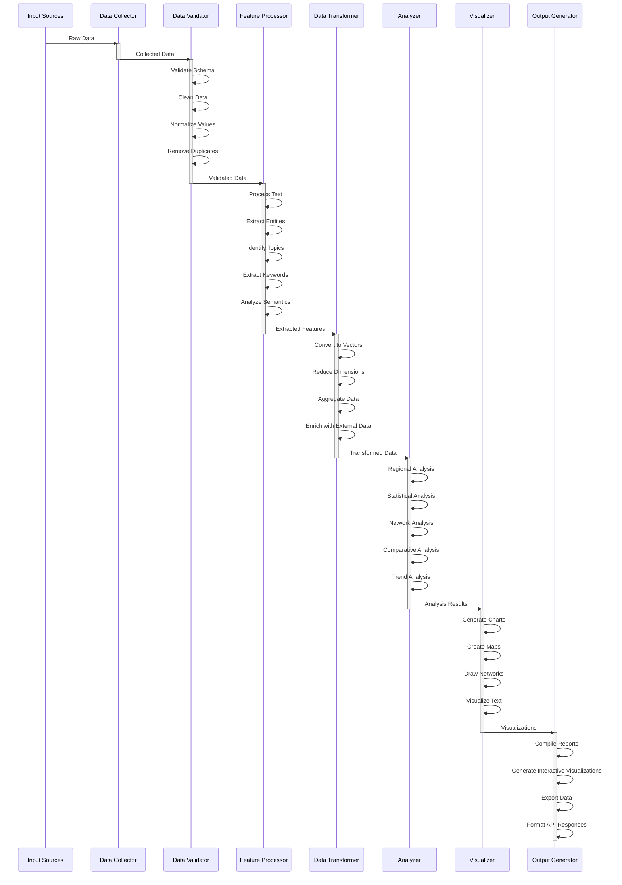

## Data Model

The core data model used in the processing pipeline:

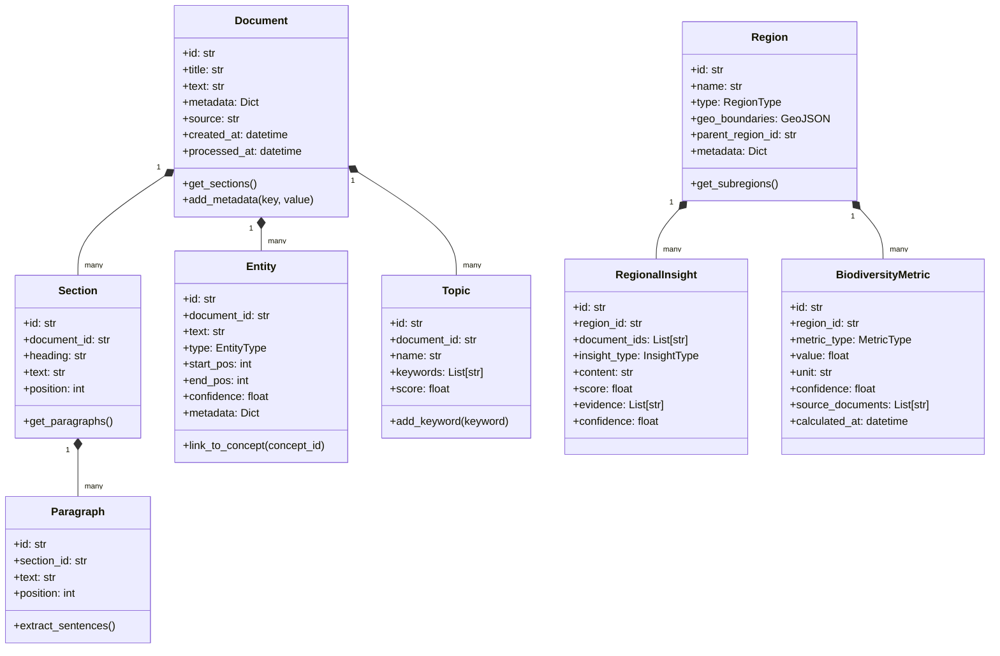

## Text Processing Pipeline

The detailed flow of text processing in the system:

```mermaid
flowchart LR
    A[Raw Text] --> B[Tokenization]
    B --> C[Normalization]
    C --> D[Stop Word Removal]
    D --> E[Lemmatization]
    
    E --> F1[Named Entity Recognition]
    E --> F2[Topic Modeling]
    E --> F3[Keyword Extraction]
    E --> F4[Sentiment Analysis]
    
    F1 --> G1[Entity Linking]
    F2 --> G2[Topic Clustering]
    F3 --> G3[Keyword Vectorization]
    F4 --> G4[Sentiment Aggregation]
    
    G1 & G2 & G3 & G4 --> H[Feature Matrix]
    
    classDef start fill:#f9d5e5,stroke:#333
    classDef process fill:#d1e7dd,stroke:#333
    classDef end fill:#d0e8f2,stroke:#333
    
    class A start
    class B,C,D,E,F1,F2,F3,F4,G1,G2,G3,G4 process
    class H end
```

## Data Validation Process

The validation process ensures data quality before proceeding with analysis:

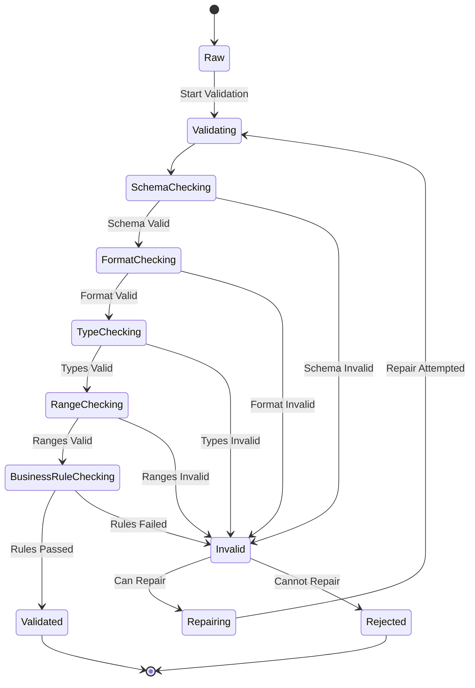

## Regional Analysis Process

The detailed flow of regional data analysis:

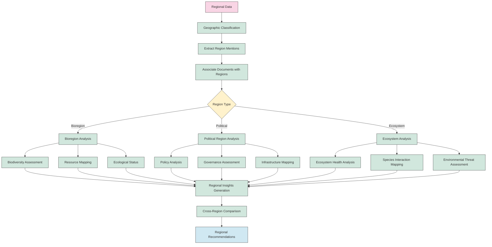

## Network Analysis Process

The process of generating and analyzing networks from document data:

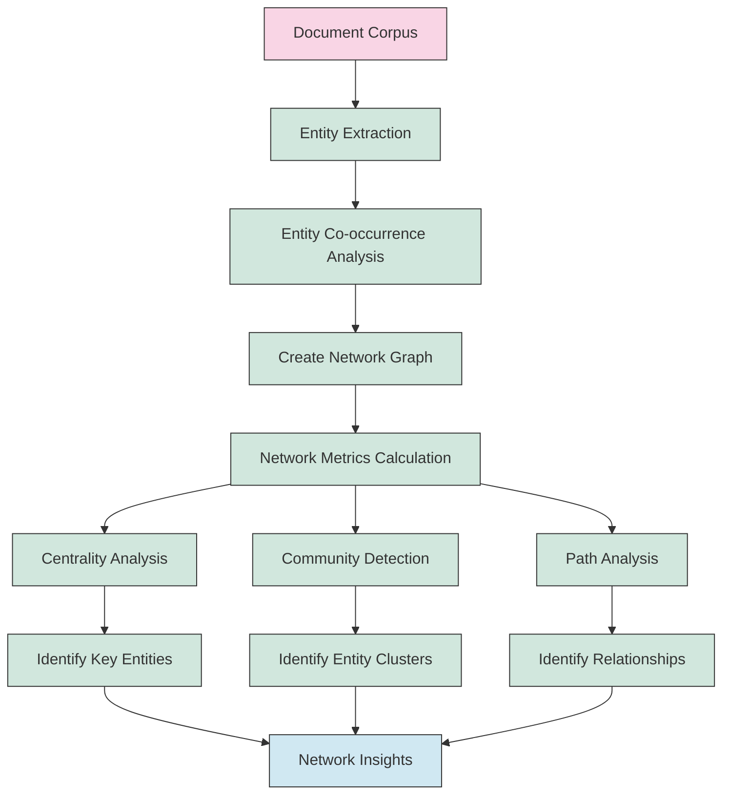

## Comparative Analysis

The process of comparing different regions or datasets:

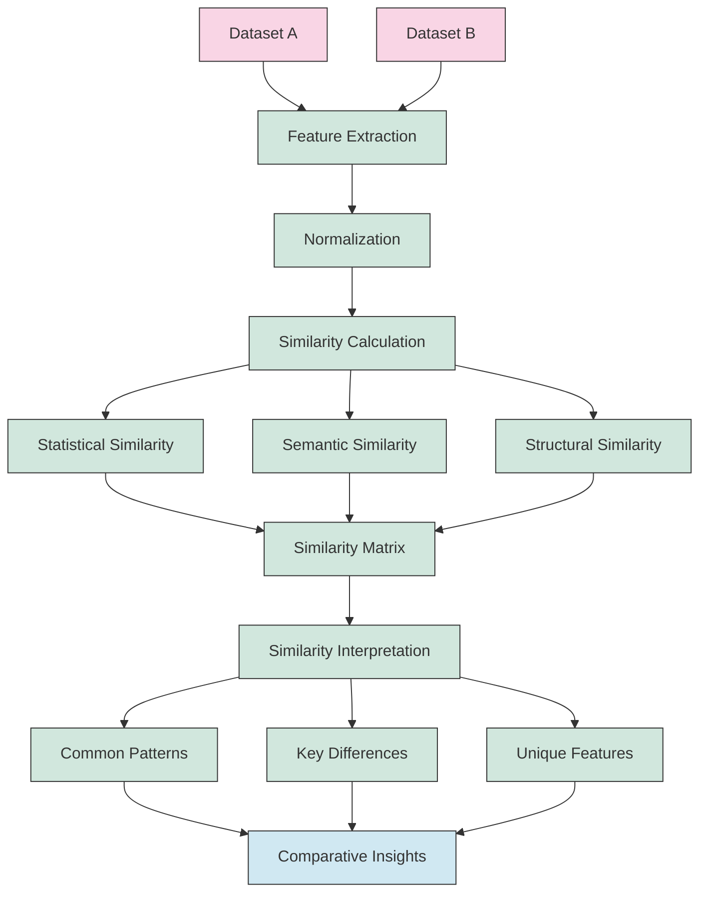

## Data Transformation Pipeline

The detailed flow of data transformations in the system:

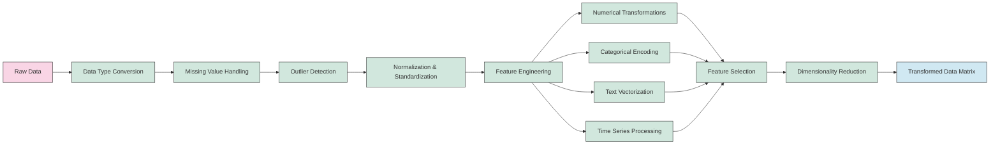

## Memory Management During Processing

This diagram illustrates how the system manages memory during the processing of large datasets:

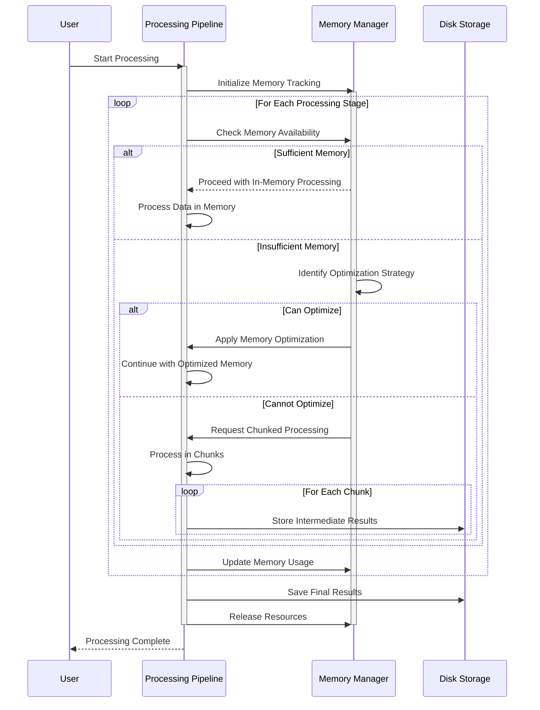

## Parallel Processing Capabilities

The system can process data in parallel to improve performance:

```mermaid
flowchart TD
    A[Input Data] --> B[Data Partitioning]
    
    B --> C1[Partition 1]
    B --> C2[Partition 2]
    B --> C3[Partition 3]
    B --> C4[Partition 4]
    
    subgraph "Worker 1"
        C1 --> D1[Process Partition]
        D1 --> E1[Intermediate Results]
    end
    
    subgraph "Worker 2"
        C2 --> D2[Process Partition]
        D2 --> E2[Intermediate Results]
    end
    
    subgraph "Worker 3"
        C3 --> D3[Process Partition]
        D3 --> E3[Intermediate Results]
    end
    
    subgraph "Worker 4"
        C4 --> D4[Process Partition]
        D4 --> E4[Intermediate Results]
    end
    
    E1 & E2 & E3 & E4 --> F[Result Aggregation]
    F --> G[Final Output]
    
    classDef input fill:#f9d5e5,stroke:#333
    classDef process fill:#d1e7dd,stroke:#333
    classDef output fill:#d0e8f2,stroke:#333
    classDef worker fill:none,stroke:#333,stroke-dasharray: 5 5
    
    class A input
    class B,C1,C2,C3,C4,D1,D2,D3,D4,E1,E2,E3,E4,F process
    class G output
    class "Worker 1","Worker 2","Worker 3","Worker 4" worker
```

## Data Caching Strategy

How the system caches and reuses computed results:

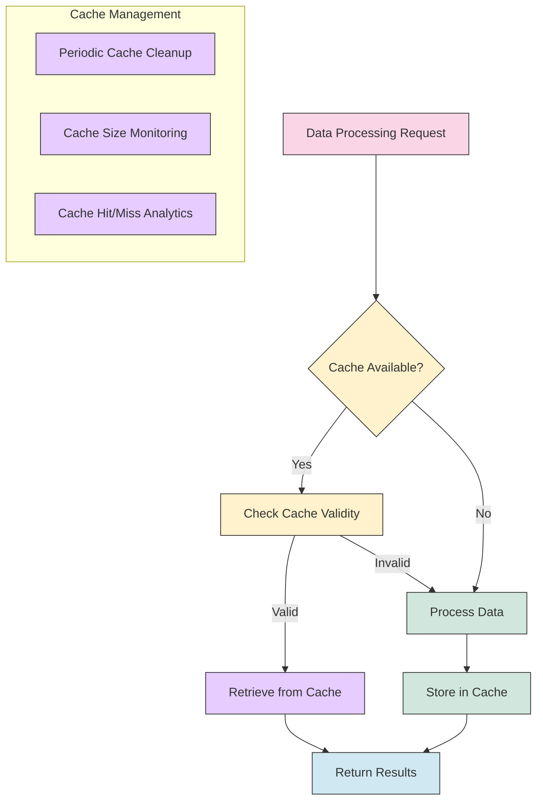

## Processing Workflow Management

The system manages complex processing workflows through a state machine:

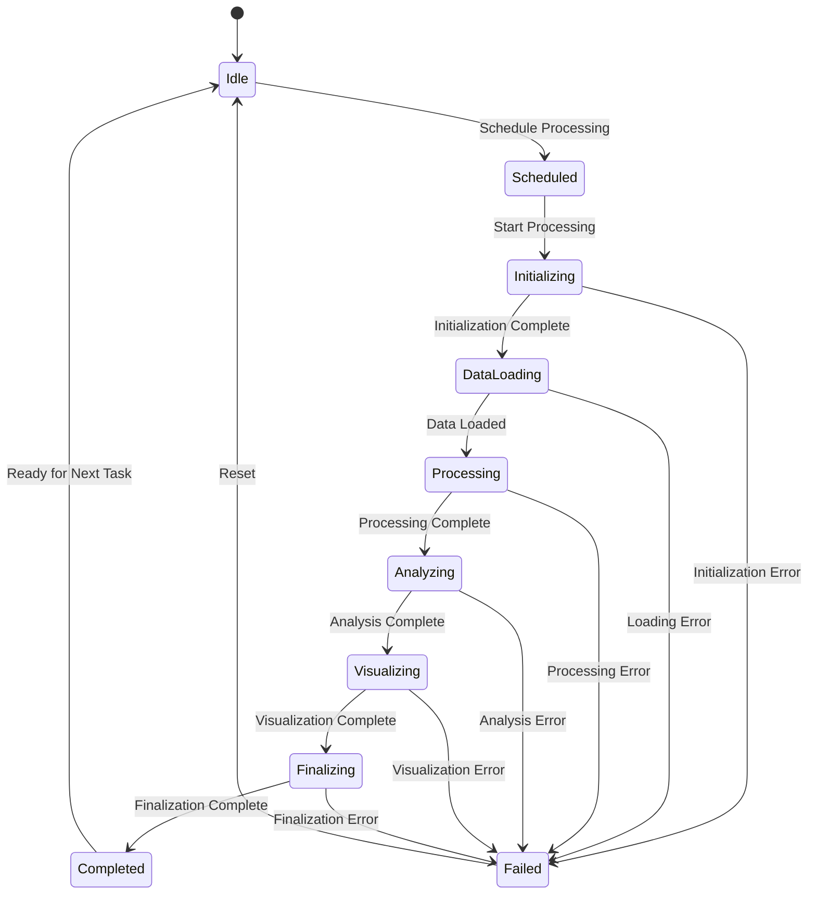

## Integration with External Data Sources

This diagram shows how the system integrates with external data sources:

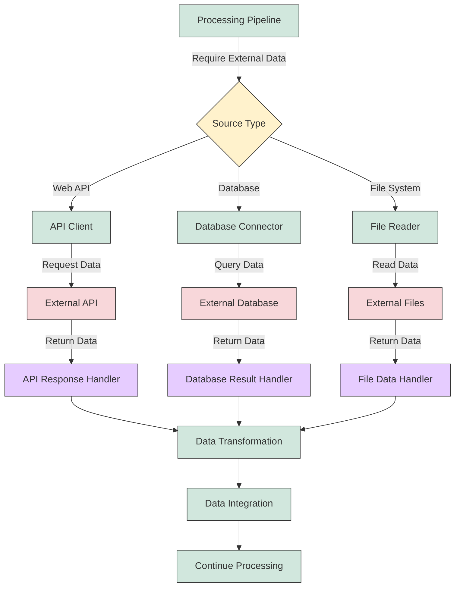

## Processing Performance Metrics

This diagram illustrates how the system tracks performance metrics during processing:

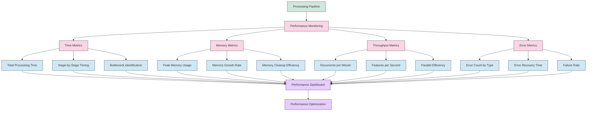

---

This technical documentation provides a comprehensive view of the OneEarth data processing pipeline. By understanding the data flow, transformations, and analysis steps, developers can effectively work with and extend the system's data processing capabilities. 