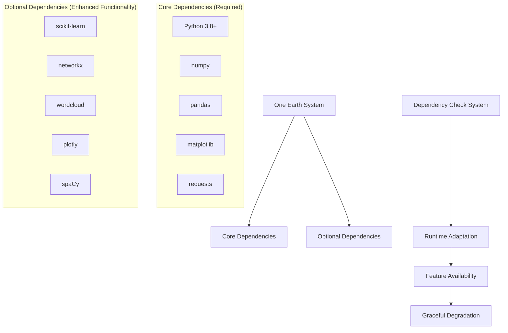

# Dependency Management in One Earth

This technical guide explains how the One Earth system handles dependencies, particularly in the visualization module. It includes information about dependency detection, fallback mechanisms, and guidance for users in different environments.

## Overview

The One Earth system is designed to be robust and adaptable to different environments and available libraries. While the system functions best with all dependencies installed, it can operate effectively even when certain libraries are unavailable.



## Dependency Categories

The system groups dependencies into two main categories:

### 1. Core Dependencies

These are required for basic functionality and are listed in `requirements.txt`:

```
openai>=1.3.5
numpy>=1.24.0
pandas>=2.0.0
matplotlib>=3.7.0
seaborn>=0.12.0
requests>=2.28.0
argparse>=1.4.0
pathlib>=1.0.1
python-dotenv>=1.0.0
tqdm>=4.65.0
```

### 2. Optional Dependencies

These enhance functionality but are not strictly required:

```
scikit-learn>=1.3.0  # For machine learning and dimensionality reduction
networkx>=3.1        # For network analysis and visualization
wordcloud>=1.9.0     # For word cloud generation
plotly>=5.15.0       # For interactive visualizations
spacy                # For advanced NLP (installed separately)
```

## Dependency Detection System

The One Earth system uses a runtime detection mechanism to identify available libraries:

```python
# Initialize flags for optional dependencies
SKLEARN_AVAILABLE = False
WORDCLOUD_AVAILABLE = False
NETWORKX_AVAILABLE = False
PLOTLY_AVAILABLE = False

# Check for scikit-learn
try:
    from sklearn.feature_extraction.text import TfidfVectorizer
    from sklearn.decomposition import PCA, TruncatedSVD
    from sklearn.manifold import TSNE
    SKLEARN_AVAILABLE = True
    logger.info("scikit-learn is available")
except ImportError:
    logger.warning("scikit-learn not available. Some visualization features will be limited.")

# Similar checks for other dependencies...
```

## Fallback Mechanisms

When dependencies are missing, the system implements various fallback strategies:

### 1. Substitute Implementation

For critical functionality, the system provides simplified alternatives:

```python
# Example: Fallback for missing scikit-learn
if not SKLEARN_AVAILABLE:
    def perform_tfidf_and_dim_reduction(*args, **kwargs):
        """Fallback implementation that returns empty results but doesn't crash."""
        logger.warning("scikit-learn is not available. Cannot perform TF-IDF and dimension reduction.")
        return None, None, None, None, None, None, None
```

### 2. Feature Skipping

For optional visualizations, the system simply skips generation:

```python
# Example: Conditional visualization generation
if WORDCLOUD_AVAILABLE and VISUALIZATION_METHODS_AVAILABLE:
    try:
        create_word_cloud(
            preprocessed_docs, f"Word Cloud for {region}",
            "word_cloud.png", region_dir
        )
    except Exception as e:
        logger.error(f"Error creating word cloud for region {region}: {str(e)}")
```

### 3. Dummy Classes

In some cases, the system creates dummy class implementations to maintain API compatibility:

```python
# Example: Dummy classes when scikit-learn is missing
if not SKLEARN_AVAILABLE:
    class DummyModel:
        def __init__(self, *args, **kwargs):
            pass
        def fit_transform(self, *args, **kwargs):
            return np.zeros((1, 2))
        def fit(self, *args, **kwargs):
            return self
        def transform(self, *args, **kwargs):
            return np.zeros((1, 2))
    
    TfidfVectorizer = DummyModel
    PCA = DummyModel
    TruncatedSVD = DummyModel
    TSNE = DummyModel
```

## Dependency Map and Fallback Strategy

| Dependency | Features Enabled | Fallback Strategy | Impact When Missing |
|------------|-------------------|-------------------|---------------------|
| scikit-learn | Machine learning algorithms, dimensionality reduction, clustering | Returns zero matrices and empty results | No ML-based visualizations, basic statistics only |
| networkx | Network graphs, term relationship visualization, community detection | Skip network visualization generation | No network graphs, concept maps not available |
| wordcloud | Word cloud generation, term importance visualization | Skip word cloud generation | No word clouds, textual summaries only |
| plotly | Interactive 3D visualizations, complex interactive plots | Use static matplotlib plots only | Static images only, no interactive elements |
| spaCy | Advanced NLP, lemmatization, entity recognition | Use regex-based text processing | Reduced text preprocessing quality |

## Installation Guidance for Different Environments

### Basic Environment (Minimal Requirements)

For users with limited resources or simple needs:

```bash
# Install only core dependencies
pip install numpy pandas matplotlib requests
```

This configuration will allow basic analysis but with limited visualization capabilities.

### Standard Environment (Recommended)

For most users, install the core dependencies plus scikit-learn:

```bash
# Install core and primary optional dependencies
pip install -r requirements.txt
```

This provides most visualization features except for specialized ones like word clouds and network analysis.

### Full-Featured Environment

For complete functionality:

```bash
# Install all dependencies including optional ones
pip install -r requirements.txt
pip install networkx wordcloud plotly
python -m spacy download en_core_web_sm
```

### Managed Environments (Conda)

For Conda users:

```bash
# Create a dedicated environment
conda create -n oneearth python=3.9
conda activate oneearth

# Install dependencies
conda install numpy pandas matplotlib scikit-learn
conda install -c conda-forge networkx wordcloud plotly spacy
python -m spacy download en_core_web_sm
```

## Checking Dependency Status

Users can verify which features are available by checking the visualization log:

```bash
# Run the visualization script
python 3_OneEarth_Vizualization.py

# Check dependency status in the log
grep "available" visualization.log
```

Example output:
```
2023-08-09 10:15:27,766 - __main__ - INFO - Visualization libraries available:
2023-08-09 10:15:27,766 - __main__ - INFO - - sklearn: True
2023-08-09 10:15:27,766 - __main__ - INFO - - wordcloud: False
2023-08-09 10:15:27,766 - __main__ - INFO - - networkx: True
2023-08-09 10:15:27,766 - __main__ - INFO - - plotly: False
```

## Technical Implementation Details

### Dependency Check Methods

The system uses several techniques to detect dependencies:

1. **Try-Except Import Blocks**:
   ```python
   try:
       import networkx as nx
       NETWORKX_AVAILABLE = True
   except ImportError:
       NETWORKX_AVAILABLE = False
   ```

2. **Module Attribute Checking**:
   ```python
   if hasattr(nlp, 'pipe') and callable(getattr(nlp, 'pipe', None)):
       # Use advanced NLP features
   else:
       # Use fallback processing
   ```

3. **Version Checking** (where needed):
   ```python
   try:
       import sklearn
       from packaging import version
       if version.parse(sklearn.__version__) >= version.parse('1.0.0'):
           SKLEARN_MODERN_VERSION = True
   except (ImportError, AttributeError):
       SKLEARN_MODERN_VERSION = False
   ```

### Global Flag Coordination

The system maintains consistent global flags across modules:

```python
# In main script
global VISUALIZATION_METHODS_AVAILABLE, WORDCLOUD_AVAILABLE, NETWORKX_AVAILABLE, SKLEARN_AVAILABLE, PLOTLY_AVAILABLE

# Import from visualization module with fallback
try:
    from Visualization_Methods import (
        # ... functions ...
        WORDCLOUD_AVAILABLE, NETWORKX_AVAILABLE, PLOTLY_AVAILABLE
    )
    VISUALIZATION_METHODS_AVAILABLE = True
except ImportError:
    # Set default values
    WORDCLOUD_AVAILABLE = False
    NETWORKX_AVAILABLE = False
    PLOTLY_AVAILABLE = False
    VISUALIZATION_METHODS_AVAILABLE = False
```

## Dependency Installation in Externally Managed Environments

For Python 3.12+ users with externally managed environments (like Homebrew Python installations), automatic installation may fail with messages like:

```
error: externally-managed-environment
× This environment is externally managed
```

This is a safety feature in newer Python versions. Options for users:

1. **Create a virtual environment**:
   ```bash
   python -m venv .venv
   source .venv/bin/activate
   pip install -r requirements.txt
   ```

2. **Use system package manager**:
   ```bash
   # For Homebrew on macOS
   brew install python-networkx python-wordcloud
   ```

3. **Use pipx for isolated packages**:
   ```bash
   brew install pipx
   pipx install oneearth
   ```

## Advanced: Adding New Dependencies

When extending the system with new dependencies:

1. **Add to requirements.txt as optional**:
   ```
   # Optional: for new visualization features
   new-package>=1.0.0
   ```

2. **Implement detection in the code**:
   ```python
   try:
       import new_package
       NEW_PACKAGE_AVAILABLE = True
   except ImportError:
       NEW_PACKAGE_AVAILABLE = False
       # Define fallback functionality
   ```

3. **Use conditional execution**:
   ```python
   if NEW_PACKAGE_AVAILABLE:
       # Use new package features
   else:
       # Use fallback approach
   ```

4. **Document the dependency**:
   - Add to this dependency management guide
   - Update the README with installation instructions
   - Document the enhanced features when installed

## Conclusion

The One Earth system's dependency management strategy ensures that the application remains functional across different environments and installation scenarios. The adaptive approach allows users to start with minimal requirements and gradually add optional dependencies as needed based on their specific needs and resources. 