# OneEarth Error Handling System

This document provides a technical overview of the error handling mechanisms implemented in the OneEarth system, with detailed diagrams illustrating how errors are handled, logged, and recovered from throughout the application.

## Error Handling Philosophy

The OneEarth system implements a robust error handling strategy based on several key principles:

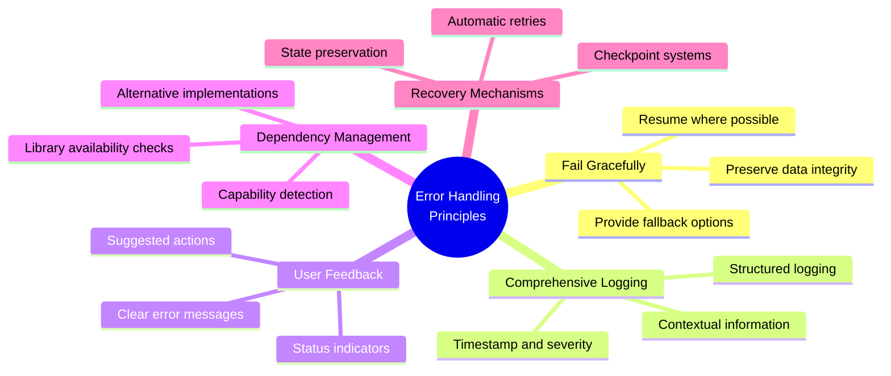

## Error Type Hierarchy

The system classifies errors into categories to enable appropriate handling strategies:

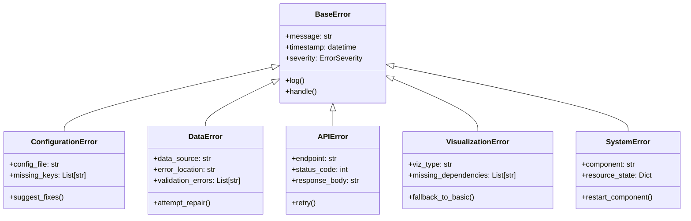

## Error Propagation Flow

This diagram illustrates how errors propagate through the system:

```mermaid
flowchart TD
    A[Error Occurs] --> B{Error Type?}
    
    B -->|Configuration| C[Configuration Error Handler]
    B -->|Data| D[Data Error Handler]
    B -->|API| E[API Error Handler]
    B -->|Visualization| F[Visualization Error Handler]
    B -->|System| G[System Error Handler]
    
    C & D & E & F & G --> H[Log Error]
    H --> I{Is Fatal?}
    
    I -->|Yes| J[Terminate Process]
    I -->|No| K{Can Recover?}
    
    K -->|Yes| L[Apply Recovery Strategy]
    K -->|No| M[Notify User]
    
    L --> N{Recovery Successful?}
    
    N -->|Yes| O[Resume Operation]
    N -->|No| P[Fallback to Safe Mode]
    
    M --> Q[Continue with Limited Functionality]
    P --> Q
    
    J --> R[Generate Detailed Report]
    
    classDef error fill:#f8d7da,stroke:#333
    classDef decision fill:#fff2cc,stroke:#333
    classDef process fill:#d1e7dd,stroke:#333
    classDef end fill:#d0e8f2,stroke:#333
    
    class A,C,D,E,F,G error
    class B,I,K,N decision
    class H,L,M,O,P,Q,R process
    class J end
```

## Error Logging System

The error logging system captures detailed information about errors to aid in debugging and resolution:

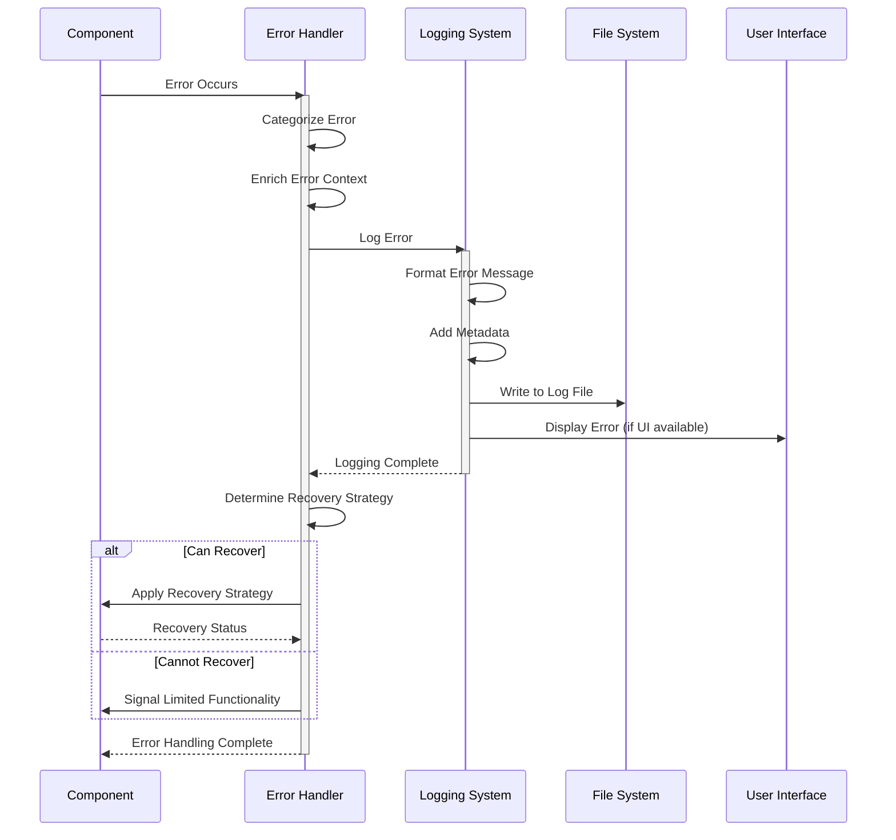

## Dependency Error Handling

The system includes specialized handling for dependency-related errors, particularly for visualization libraries:

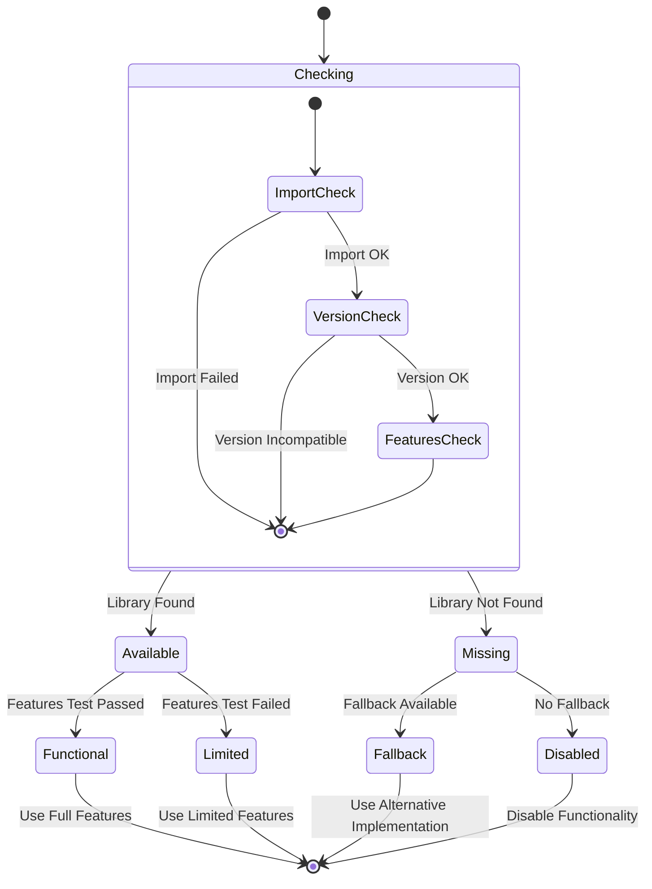

## Visualization Error Recovery

This diagram illustrates the error recovery process for visualization errors:

```mermaid
flowchart TD
    A[Visualization Requested] --> B{Check Dependencies}
    
    B -->|All Available| C[Generate Visualization]
    B -->|Some Missing| D[Check Fallbacks]
    
    C --> E{Generation Successful?}
    
    E -->|Yes| F[Return Visualization]
    E -->|No| G[Log Detailed Error]
    
    G --> D
    
    D --> H{Fallbacks Available?}
    
    H -->|Yes| I[Use Fallback Method]
    H -->|No| J[Generate Text Summary]
    
    I --> K{Fallback Successful?}
    
    K -->|Yes| L[Return Limited Visualization]
    K -->|No| J
    
    J --> M[Return Text-Only Result]
    
    F & L & M --> N[Log Outcome]
    
    classDef start fill:#f9d5e5,stroke:#333
    classDef decision fill:#fff2cc,stroke:#333
    classDef process fill:#d1e7dd,stroke:#333
    classDef error fill:#f8d7da,stroke:#333
    classDef end fill:#d0e8f2,stroke:#333
    
    class A start
    class B,E,H,K decision
    class C,D,I,J process
    class G error
    class F,L,M,N end
```

## API Error Handling

For external API interactions, the system employs a sophisticated retry and fallback mechanism:

```mermaid
sequenceDiagram
    participant C as Client Component
    participant API as API Handler
    participant EH as Error Handler
    participant Cache as Data Cache
    
    C->>API: Request Data
    activate API
    
    API->>API: Prepare Request
    
    API->>EH: Set Retry Parameters
    
    loop Retry Logic
        API->>API: Make API Call
        
        alt API Call Successful
            API-->>C: Return Data
            break
        else API Call Failed
            API->>EH: Handle Error
            activate EH
            
            EH->>EH: Log Error
            EH->>EH: Check Retry Count
            
            alt Can Retry
                EH->>EH: Calculate Backoff
                EH-->>API: Retry After Delay
            else Max Retries Exceeded
                EH->>Cache: Check for Cached Data
                
                alt Cache Available
                    Cache-->>C: Return Cached Data
                else No Cache
                    EH-->>C: Return Error
                end
                break
            end
            
            deactivate EH
        end
    end
    
    deactivate API
```

## Error Monitoring System

The error monitoring system collects and analyzes errors to improve system reliability:

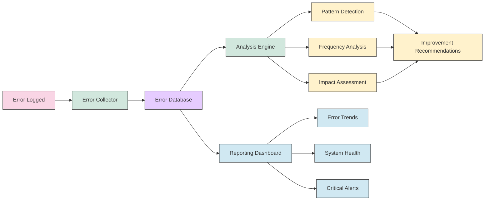

## Error Handling in Data Processing Pipeline

This diagram shows how errors are handled in the data processing pipeline:

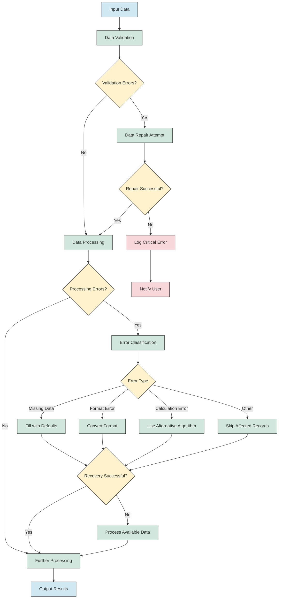

## Memory Management and Error Prevention

The system employs proactive memory management to prevent memory-related errors:

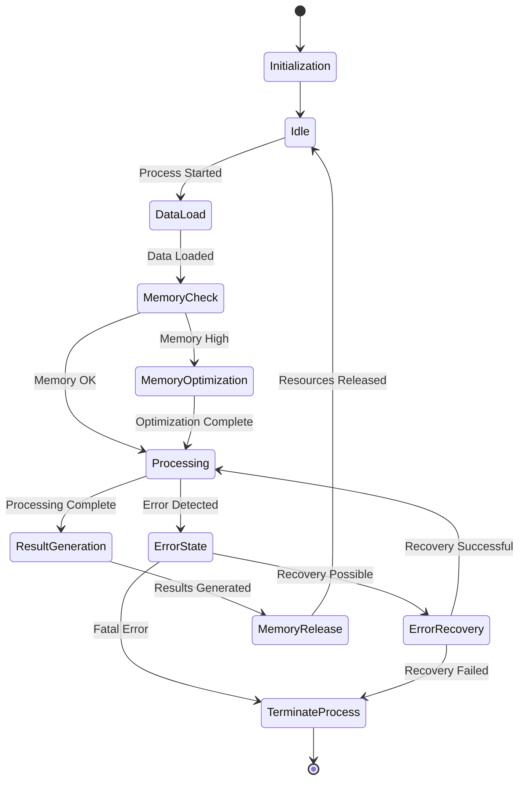

## User-Facing Error Communication

This diagram shows how errors are communicated to users:

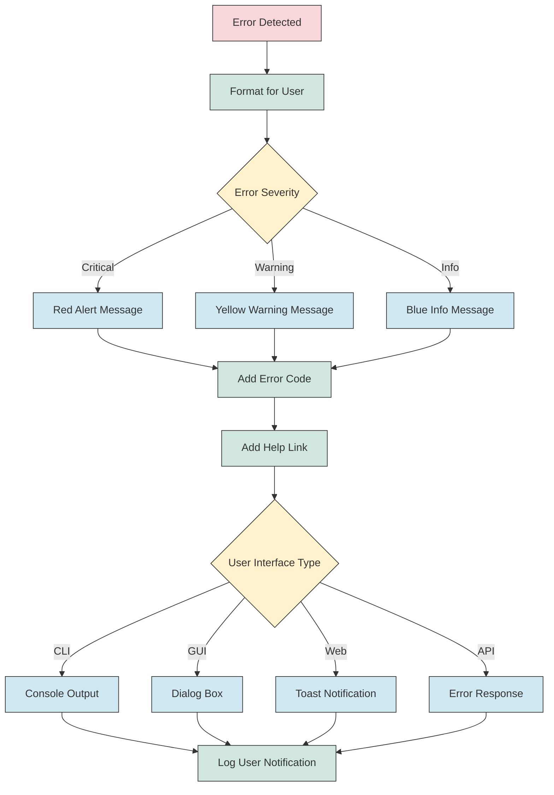

## Error Code Reference

The system uses standardized error codes to facilitate troubleshooting:

```mermaid
graph TD
    A[Error Codes] --> B[Configuration Errors]
    A --> C[Data Errors]
    A --> D[API Errors]
    A --> E[Visualization Errors]
    A --> F[System Errors]
    
    B --> B1[CFG-001: Missing Config File]
    B --> B2[CFG-002: Invalid Configuration]
    B --> B3[CFG-003: Missing Required Key]
    
    C --> C1[DAT-001: Invalid Data Format]
    C --> C2[DAT-002: Missing Required Fields]
    C --> C3[DAT-003: Data Type Mismatch]
    
    D --> D1[API-001: Connection Failed]
    D --> D2[API-002: Authentication Failed]
    D --> D3[API-003: Rate Limit Exceeded]
    
    E --> E1[VIZ-001: Missing Library]
    E --> E2[VIZ-002: Invalid Data for Viz]
    E --> E3[VIZ-003: Rendering Failed]
    
    F --> F1[SYS-001: Memory Allocation Failed]
    F --> F2[SYS-002: Disk Space Exhausted]
    F --> F3[SYS-003: Thread Creation Failed]
    
    classDef category fill:#f9d5e5,stroke:#333
    classDef code fill:#d1e7dd,stroke:#333
    
    class A category
    class B,C,D,E,F category
    class B1,B2,B3,C1,C2,C3,D1,D2,D3,E1,E2,E3,F1,F2,F3 code
```

## Implementing Your Own Error Handlers

For developers extending the OneEarth system, this template shows how to implement custom error handlers:

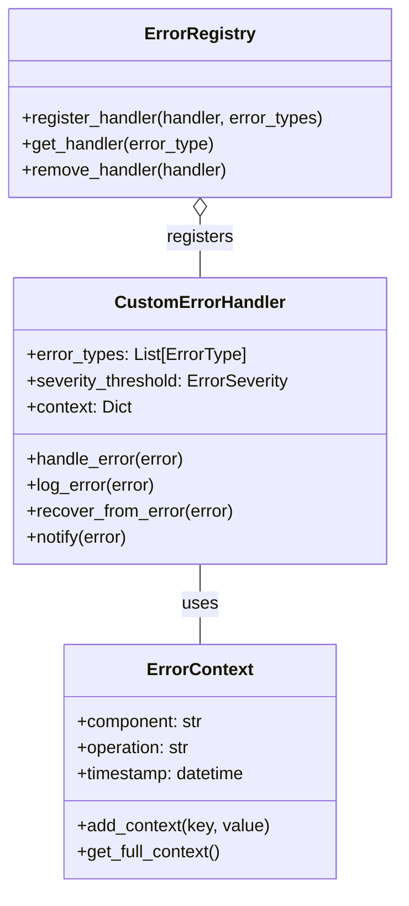

## Integration with Monitoring Systems

The error handling system integrates with monitoring tools to provide comprehensive visibility:

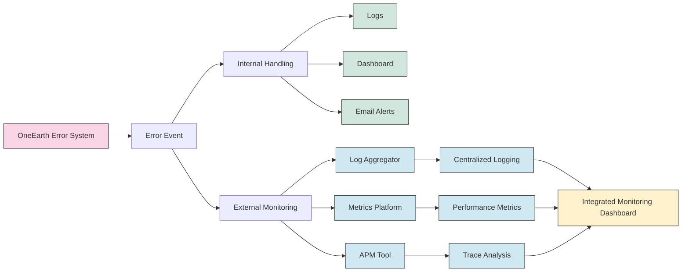

---

This technical documentation provides a comprehensive overview of the error handling mechanisms in the OneEarth system. By following these patterns and understanding the error flow, developers can effectively troubleshoot issues and extend the system with robust error handling capabilities. 