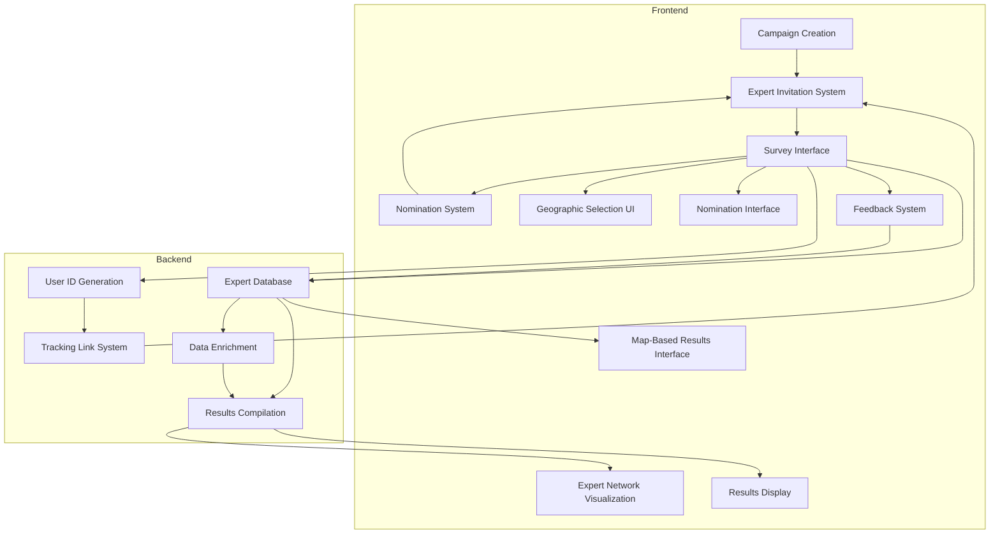
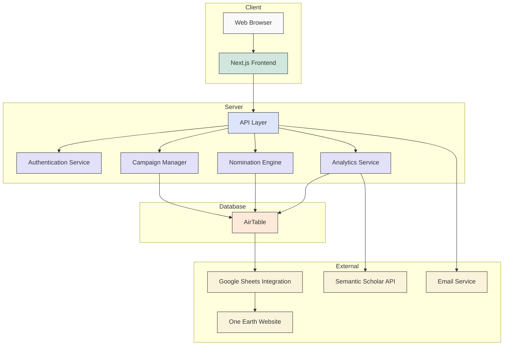
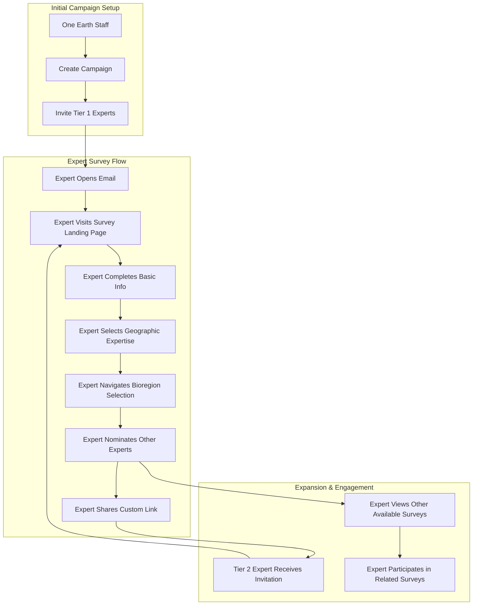
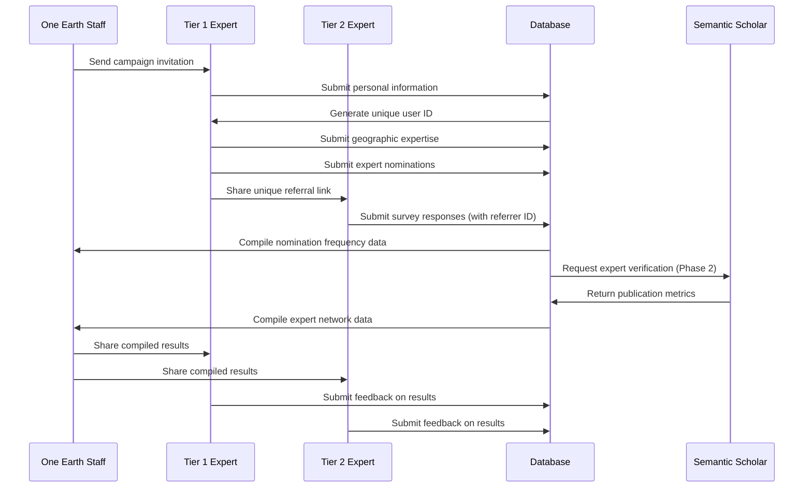
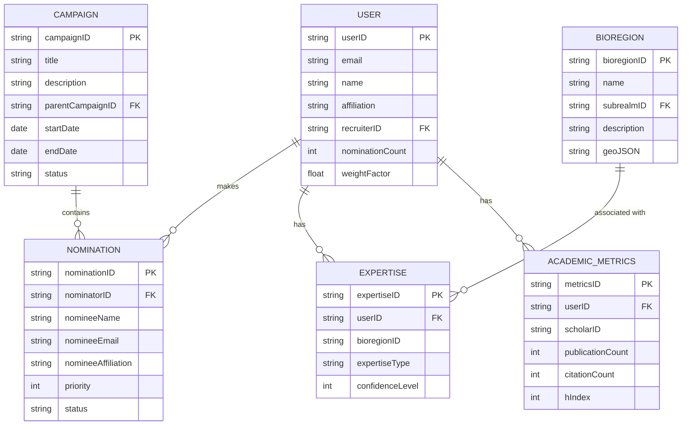

Note that we are running the full pipeline on March 8, with the cheaper Sonor model. We could use deep research, and other costlier + more effective methods in the future.

# OE Expert Network Tool - Next Steps

## Project Overview
The OE Expert Network Tool aims to largely automate One Earth's process of identifying and engaging with subject matter experts across all 185 bioregions. The tool serves as a key component of One Earth's Knowledge Management system, enabling the organization to build a comprehensive expert network organized by topical expertise within specific geographic boundaries.

The tool focuses on the three pillars of One Earth's action framework:
- Renewable Energy
- Nature Conservation
- Regenerative Agriculture

## Key Features
- Frictionless expert recruitment via email campaigns
- Simple survey interface with minimal time commitment (1-2 minutes)
- Geographic expertise mapping using One Earth's bioregional framework
- Expert nomination system to build a social graph of recommendations
- No logins required for initial participation
- Campaign-based approach to target specific areas of expertise
- Multi-tier expert recruitment through referrals
- Weighted results based on nomination frequency

## Implementation Roadmap

### Phase 1: MVP Development (4-6 weeks)
- Create basic survey flow with campaign management
- Implement expert invitation system with tracking links
- Develop database backend (likely using AirTable)
- Build simple nomination tracking system
- Implement geographic expertise selection UI
- Deploy initial version for Land Cover SME campaign

### Phase 2: Enhanced Features (6-8 weeks)
- Social graph visualization and analytics
- Expert weighting algorithm based on nomination frequency
- Automated result compilation and reporting
- Integration with Semantic Scholar API for expert verification
- Improved map-based navigation for bioregions

### Phase 3: Integration & Expansion (8-12 weeks)
- Full integration with One Earth website
- Expert profile creation and management
- Advanced campaign types (question, vote, validation)
- Results visualization and reporting features
- API for third-party integrations
- GreenCheck ID integration for enhanced verification

## Project Timeline

```mermaid
gantt
    title OE Expert Network Tool Development Roadmap
    dateFormat  YYYY-MM-DD
    section Planning
    Requirements Gathering        :done, req, 2023-08-01, 14d
    UX Design                     :active, ux, after req, 21d
    Technical Architecture        :active, arch, after req, 14d
    
    section Phase 1 - MVP
    Survey Flow Implementation    :p1_1, after ux, 14d
    Database Setup                :p1_2, after arch, 7d
    Tracking System Development   :p1_3, after p1_2, 14d
    Bioregion Selection UI        :p1_4, after p1_1, 14d
    Integration & Testing         :p1_5, after p1_3, after p1_4, 7d
    MVP Launch                    :milestone, p1_launch, after p1_5, 0d
    
    section Phase 2 - Enhanced Features
    Social Graph Implementation   :p2_1, after p1_launch, 21d
    Weighting Algorithm           :p2_2, after p1_launch, 14d
    Semantic Scholar Integration  :p2_3, after p2_2, 14d
    Advanced Reporting            :p2_4, after p2_1, 14d
    Enhanced UI/UX                :p2_5, after p2_3, after p2_4, 14d
    
    section Phase 3 - Integration
    Website Integration           :p3_1, after p2_5, 21d
    Expert Profiles               :p3_2, after p2_5, 14d
    Advanced Campaign Types       :p3_3, after p3_2, 21d
    Public API Development        :p3_4, after p3_1, 21d
    Final Launch                  :milestone, final, after p3_3, after p3_4, 0d
```

## Technical Architecture



## Technical Stack Architecture



## User Journey



## Survey Flow Diagram

```mermaid
stateDiagram-v2
    [*] --> LandingPage
    
    state LandingPage {
        [*] --> Welcome
        Welcome --> CollectBasicInfo
        CollectBasicInfo --> [*]
    }
    
    LandingPage --> GeographicExpertise
    
    state GeographicExpertise {
        [*] --> RealmSelection
        RealmSelection --> [*]
    }
    
    GeographicExpertise --> BioregionSelection
    
    state BioregionSelection {
        [*] --> MapView
        MapView --> SelectMultipleBioregions
        SelectMultipleBioregions --> [*]
    }
    
    BioregionSelection --> NominationScreen
    
    state NominationScreen {
        [*] --> ExpertEntryForm
        ExpertEntryForm --> AddMoreExperts
        AddMoreExperts --> ExpertEntryForm: Add another
        AddMoreExperts --> [*]: Done
    }
    
    NominationScreen --> InvitationScreen
    
    state InvitationScreen {
        [*] --> GenerateCustomLink
        GenerateCustomLink --> EmailTemplate
        EmailTemplate --> CopyToClipboard
        CopyToClipboard --> [*]
    }
    
    InvitationScreen --> ThankYouPage
    
    state ThankYouPage {
        [*] --> Confirmation
        Confirmation --> RelatedSurveys
        RelatedSurveys --> [*]
    }
    
    ThankYouPage --> [*]
```



## Data Flow



## Data Model Visualization



## Survey Flow Design

### Survey Screens Sequence
1. **Landing Page / Welcome Screen**
   - Survey title
   - Brief introduction
   - Basic information collection (name, email, affiliation)
   - GDPR compliance information

2. **Geographic Expertise Selection**
   - Select relevant geographical realms
   - Hierarchical selection UI
   - Information tooltips for each region

3. **Bioregion Selection** (Dynamic screens based on previous selection)
   - Map visualization of bioregions
   - Selection checkboxes for relevant bioregions
   - Information icons with description for each bioregion
   - Interactive map elements (highlighting on hover)

4. **Nomination Screen**
   - Input fields for up to 10 nominees (name, affiliation, email if known)
   - Priority/relevance indicators
   - Encouragement to invite nominees directly

5. **Invitation Screen**
   - Pre-formatted invitation text
   - Custom referral link generation
   - Copy/paste functionality for email

6. **Survey Completion / Thank You**
   - Confirmation of submission
   - Links to other relevant surveys
   - Expected timeline for results

### User Experience Considerations
- Mobile-responsive design (simplified navigation on small screens)
- Minimal data entry requirements
- Progress indicators
- Save and continue functionality
- No user accounts required
- Estimated completion time: 1-2 minutes

## Campaign Types

### Campaign Concept 1: Land Cover SMEs
This initial campaign will focus on building a network of experts in regional Land Cover Mapping. The process will follow a hierarchical nomination pattern:

1. **Realm Level Experts** (14 geographic realms)
   - Initial 50+ experts recruited directly by One Earth
   - Each nominates 5-10 experts at subrealm level

2. **Subrealm Level Experts** (52 subrealms)
   - Nominated by realm experts
   - Each nominates experts at bioregion level

3. **Bioregion Level Experts** (185 bioregions)
   - Nominated by subrealm experts
   - Provide detailed local expertise

**Future Application:** Experts will be invited to use a map markup tool to create a library of sample mapping tiles for training AI models to accurately differentiate between natural and anthropogenic land cover.

### Campaign Concept 2: Pollinator Plants
This campaign will focus on identifying optimal plants for creating pollinator meadows within each bioregion:

1. **Campaign Structure**
   - Parent survey: "Pollinator Meadows"
   - 185 bioregion-specific child surveys
   - Organized within 14 geographic realms

2. **Data Collection**
   - Plant recommendations (10-20 per bioregion)
   - Priority ratings (1-5 stars) for each plant
   - Supporting notes/information
   - Links to references if available

3. **Expert Validation**
   - Multi-tier nomination process
   - Weighted results based on nomination frequency
   - Publication under Creative Commons 4.0 license

**Output:** Region-specific plant lists to help property owners convert turf or degraded land into functioning pollinator meadows.

## Data Collection & Storage Strategy

### Primary Data
- Expert personal information (name, email, affiliation)
- Geographic expertise selections
- Survey responses
- System-generated identifiers:
  - Unique User ID (based on email)
  - Campaign-specific Recruiter ID
  - "Recruited by" ID linking to referrer

### Secondary Data (Nomination Data)
- Names and affiliations of nominated experts
- Email addresses (when provided)
- Priority/relevance indicators
- Relationship to nominator

### Tertiary Data (Enrichment Data)
- Nomination frequency counts
- Academic metrics (publications, citations)
- Semantic Scholar integration data
- Expertise weighting factors

### Database Structure
1. **Primary User Table**
   - UserID (PK)
   - Name, Email, Affiliation
   - Geographic Expertise
   - RecruiterID (FK)
   - NominationCount
   - WeightFactor

2. **Campaign Table**
   - CampaignID (PK)
   - Title, Description
   - ParentCampaignID (for nested campaigns)
   - StartDate, EndDate
   - Status

3. **Nominations Table**
   - NominationID (PK)
   - NominatorID (FK)
   - NomineeInfo
   - Status (Pending/Invited/Completed)

4. **Academic Metrics Table** (Phase 2)
   - UserID (FK)
   - ScholarID
   - PublicationCount
   - CitationCount
   - H-Index

### Implementation Approach
- Initial implementation using AirTable
- Staff dashboard via Google Sheets integration
- Future migration to custom GraphDB for social network analysis

## Results Processing & Display

### Data Processing Methods
1. **Compiled Results**
   - Ranked compilation of all responses
   - Sorting by vote count, relevance, or geographic region
   - Filtering capabilities by various parameters

2. **Social Graph Analysis**
   - Visualization of expert connections
   - Identification of central nodes (highly nominated experts)
   - Community/cluster detection

3. **Weighted Results**
   - Application of weighting factors based on nomination frequency
   - Quadratic voting implementation (star ratings as multipliers)
   - Normalization procedures for fair representation

### Visualization Approaches
1. **Map-Based Interface**
   - Interactive world map with bioregion overlays
   - Hover information showing expert count and top names
   - Drill-down capability to view region-specific data

2. **List/Table Display**
   - Sortable expert directory
   - Filtering by expertise, region, or nomination count
   - Export functionality

3. **Network Graph**
   - Visual representation of the expert social graph
   - Node size indicating nomination frequency
   - Edge thickness showing relationship strength

### Publishing Mechanism
- Results hosted on one.earth website
- Similar to Citations Library implementation
- Backed by Google Sheets data source initially
- Future API-based integration

## Implementation Ideas

### Survey Interface Options
1. **Custom Build using Next.js/React**
   - Pros: Full control, seamless design
   - Cons: More development time, higher cost

2. **Customized SaaS Solution**
   - Options: SurveyPlanet, MakeForms, Coda
   - Pros: Faster implementation, built-in analytics
   - Cons: Limited customization, potential integration challenges

3. **AI-Assisted Development**
   - Use Cursor or other AI-powered coding tools
   - Pros: Rapid development, cost-effective
   - Cons: May require significant refinement

### Database Considerations
1. **AirTable Solution**
   - Pros: Easy to set up, flexible, good visualization options
   - Cons: Scaling limitations, potential cost increases with growth

2. **Custom Database with GraphDB Component**
   - Pros: Better for social graph analytics, more scalable
   - Cons: Higher development complexity, more maintenance

3. **Hybrid Approach**
   - Start with AirTable for MVP
   - Migrate to custom solution for Phase 2/3

### Expert Identification Methods
1. **Email-Based Unique IDs**
   - Pros: Simple, frictionless
   - Cons: Limited validation, potential duplicates

2. **Semantic Scholar Integration**
   - Pros: Better validation, richer metadata
   - Cons: Additional complexity, not all experts will have profiles
   - Implementation: API integration (est. 40 hours at $80/hr)

3. **GreenCheck ID (Future Phase)**
   - Pros: Stronger validation, cross-platform compatibility
   - Cons: Added friction, development requirements

## Technical Stack Recommendations

### Frontend Technologies
1. **Next.js + React**
   - Server-side rendering for improved SEO
   - Component-based architecture for reusability
   - Fast development with extensive community libraries

2. **Mapbox GL JS**
   - Interactive bioregion visualization
   - Custom styling for One Earth branding
   - Support for GeoJSON boundaries

3. **TailwindCSS**
   - Rapid UI development
   - Consistent design system
   - Mobile-first responsive design

### Backend Technologies
1. **Node.js + Express**
   - Fast API development
   - Integration with AirTable and other services
   - Scalable for future growth

2. **Serverless Functions (Vercel/Netlify)**
   - Cost-effective for early stages
   - Automatic scaling
   - Simplified deployment

### Storage Options
1. **MVP Phase: AirTable**
   - Quick setup, minimal development
   - Built-in views and filtering
   - API for custom integrations

2. **Growth Phase: PostgreSQL + Neo4j**
   - PostgreSQL for relational data
   - Neo4j for social graph analysis
   - More scalable for larger datasets

## Security & Privacy Considerations

### Data Protection
1. **GDPR Compliance**
   - Clear consent mechanisms
   - Privacy policy documentation
   - Data export/deletion capabilities
   - Minimization of data collection

2. **Data Encryption**
   - TLS for all connections
   - Encryption at rest for sensitive data
   - Secure API key management

3. **Access Controls**
   - Role-based permissions for OE staff
   - Audit logging of access
   - Secure admin dashboard

### Anonymization Options
1. **Public Data Display**
   - Aggregated results without personal identifiers
   - Optional expert listing with consent
   - Clear attribution policies

2. **Internal Processes**
   - Pseudonymization where possible
   - Limited access to full datasets
   - Regular security reviews

## Testing Strategy

### User Testing
1. **Internal Testing Phase**
   - OE staff usability testing
   - Survey flow validation
   - Mobile responsiveness verification

2. **Limited Expert Testing**
   - 10-15 trusted experts
   - Complete survey flow testing
   - Feedback collection

3. **Pilot Campaign**
   - Small-scale initial campaign (25-50 participants)
   - Single bioregion focus
   - Full process validation

### Technical Testing
1. **Unit Testing**
   - Core functionality components
   - ID generation and tracking
   - Database operations

2. **Integration Testing**
   - API endpoint validation
   - Email delivery verification
   - Database consistency checks

3. **Performance Testing**
   - Survey load time optimization
   - Database query performance
   - Concurrent user handling

## Risk Mitigation Strategy

### Potential Risks
1. **Low Expert Participation**
   - **Mitigation**: Personalized outreach, simplified survey flow, clearly communicated purpose
   - **Contingency**: Direct OE staff engagement, phased rollout by region

2. **Data Quality Issues**
   - **Mitigation**: Clear form validation, expert verification processes
   - **Contingency**: Manual review process, follow-up communication

3. **Technical Limitations of SaaS Tools**
   - **Mitigation**: Early prototype development, thorough evaluation
   - **Contingency**: Hybrid approach with custom components where needed

4. **Privacy Concerns from Experts**
   - **Mitigation**: Clear data usage policies, opt-out options
   - **Contingency**: Enhanced anonymization features, reduced data collection

5. **Scaling Challenges**
   - **Mitigation**: Modular architecture, early performance testing
   - **Contingency**: Staged migration to more robust database solutions

## Cost Estimates

### Development Costs
1. **Phase 1 (MVP)**
   - Survey platform customization: $8,000-12,000
   - Database setup and integration: $3,000-5,000
   - Frontend development: $10,000-15,000
   - Total: $21,000-32,000

2. **Phase 2 (Enhanced Features)**
   - Social graph implementation: $8,000-12,000
   - Semantic Scholar integration: $3,000-5,000
   - Advanced reporting: $5,000-8,000
   - Total: $16,000-25,000

3. **Phase 3 (Integration)**
   - Website integration: $5,000-8,000
   - Advanced campaign types: $8,000-12,000
   - Public API: $7,000-10,000
   - Total: $20,000-30,000

### Operational Costs (Annual)
1. **Infrastructure**
   - Hosting and services: $1,200-2,400/year
   - AirTable premium plan: $240-1,200/year
   - Email service: $600-1,200/year

2. **Maintenance**
   - Ongoing development: $10,000-20,000/year
   - Support and updates: $5,000-10,000/year

3. **Content & Community**
   - Expert engagement: $5,000-10,000/year
   - Campaign management: $8,000-15,000/year

### Alternative Cost Model
1. **SaaS-First Approach**
   - Leverage existing platforms (Coda, SurveyPlanet)
   - Development costs: $10,000-15,000
   - Higher ongoing subscription costs: $3,000-5,000/year
   - Limited customization but faster implementation

2. **AI-Assisted Development**
   - Use tools like Cursor for rapid development
   - 40-60% reduction in frontend development time
   - Estimated savings: $8,000-12,000 across phases

## Maintenance Plan

### Regular Maintenance
1. **Technical Upkeep**
   - Monthly security updates
   - Quarterly feature enhancements
   - Semi-annual technology review

2. **Content Management**
   - Ongoing campaign creation
   - Expert database curation
   - Results publishing workflow

3. **Performance Optimization**
   - Database query optimization
   - Frontend performance monitoring
   - API response time targets

### Long-term Evolution
1. **Year 1: Stabilization**
   - Bug fixes and performance improvements
   - User feedback implementation
   - Minor feature enhancements

2. **Year 2: Expansion**
   - Additional campaign types
   - Enhanced analytics
   - Deeper integrations with external platforms

3. **Year 3: Ecosystem Development**
   - Developer API for partners
   - Community-led campaigns
   - Advanced visualization tools

## Integration with Other OE Systems

### Current OE Ecosystem
1. **One Earth Website**
   - Expert directory integration
   - Campaign results publishing
   - Cross-linking with related resources

2. **Citations Library**
   - Connecting experts to their publications
   - Leveraging existing metadata
   - Enriching citation context with expert insights

3. **Bioregion Framework**
   - Utilizing existing geographic boundaries
   - Enhancing bioregion data with expert input
   - Creating bioregion-specific knowledge repositories

### Future Integration Opportunities
1. **OE Knowledge Graph**
   - Expert network as a layer in knowledge graph
   - Connection of experts to topics, publications, and regions
   - API for cross-system querying

2. **Expert Engagement Platform**
   - Evolution toward collaborative workspace
   - Facilitated discussions on specific topics
   - Working groups for ongoing collaboration

3. **Data Visualization Portal**
   - Interactive expert map interfaces
   - Dynamic network visualizations
   - Geographic distribution analytics

## First Campaign: Land Cover Experts

### Target Timeline
- Week 1-2: Develop and test survey interface
- Week 3: Create initial expert list (50+ experts, at least one per subrealm)
- Week 4: Launch initial invitation campaign
- Week 5-6: Monitor nominations, send follow-up invitations
- Week 7-8: Compile results, create visualization

### Success Metrics
- Reach 1000+ identified experts across all bioregions
- Achieve at least 3 experts per bioregion
- Complete 4 tiers of expert nominations
- Generate a comprehensive visualization of expert distribution

### Expert Propagation Strategy
- Initial seed: 50 OE-identified experts (at least one per subrealm)
- Each expert nominates 5 others (average 2.5 complete surveys)
- Four-tier nomination process targeting 1250+ total experts
- Estimated timeline: 1-2 weeks for initial data collection

## Positioning & Branding

### Positioning Statement
"The One Earth Expert Network is a planetary community of scientists grown by invitation that acts as a medium for communication, collaboration, and consensus-building. Because of it, scientists can contribute their knowledge to global challenges outside of institutional constraints. This is important because addressing climate change and biodiversity loss requires coordinated global expertise."

### Value Proposition
- For scientists: Connection to peers, recognition, impactful contribution
- For One Earth: Access to distributed expertise, data collection, community building
- For the public: Credible, region-specific knowledge made accessible

### Branding Considerations
- Use "One Earth Expert Group" branding (less intimidating than "network")
- Position as invitation-only, high-credibility platform
- Frame participation as contributing to global knowledge commons
- Emphasize Chatham House rules and data privacy

## Feedback System

### Implementation
- Simple feedback form on all survey pages
- Direct routing to One Earth staff
- Categories: Bug report, Feature request, Content suggestion, Other

### Usage
- Collect user experience issues
- Identify potential improvements
- Gather expert suggestions for future campaigns
- Build ongoing engagement

## Future Research Directions

### Knowledge Network Expansion
1. **Cross-disciplinary Connections**
   - Mapping relationships between different expert groups
   - Identifying unexpected collaboration opportunities
   - Bridging knowledge gaps between disciplines

2. **Geographic Knowledge Gaps**
   - Using nomination patterns to identify underrepresented regions
   - Targeted campaigns for regions with limited expert coverage
   - Special initiatives for developing region engagement

3. **Expert Opinion Consensus**
   - Methods for generating consensus on contentious topics
   - Weighted voting systems based on expertise validation
   - Transparency in methodology and confidence levels

### Technical Innovations
1. **Machine Learning Applications**
   - Expert recommendation algorithms
   - Automatic expertise classification
   - Publication analysis for expert identification

2. **Decentralized Knowledge Networks**
   - Exploration of Web3 technologies for expert coordination
   - Transparent attribution and recognition mechanisms
   - Collective ownership of knowledge products

## Additional Campaign Concepts

### Campaign Concept 3: Regional Climate Solutions
A campaign to identify the most effective regional climate solutions based on local expertise:

1. **Structure**
   - Two-stage survey process
   - First stage: Solution nomination by experts
   - Second stage: Prioritization and feasibility assessment

2. **Output Applications**
   - Region-specific climate solution portfolio
   - Implementation feasibility analysis
   - Policy recommendation documentation

### Campaign Concept 4: Ecosystem Restoration Monitoring
A campaign to build consensus on key indicators for monitoring ecosystem restoration success:

1. **Methodology**
   - Expert nomination of indicator species/metrics
   - Weighted ranking based on scientific validity
   - Region-specific adaptations

2. **Output Applications**
   - Standardized monitoring protocols by ecosystem type
   - Early warning indicator sets
   - Restoration success benchmarks
