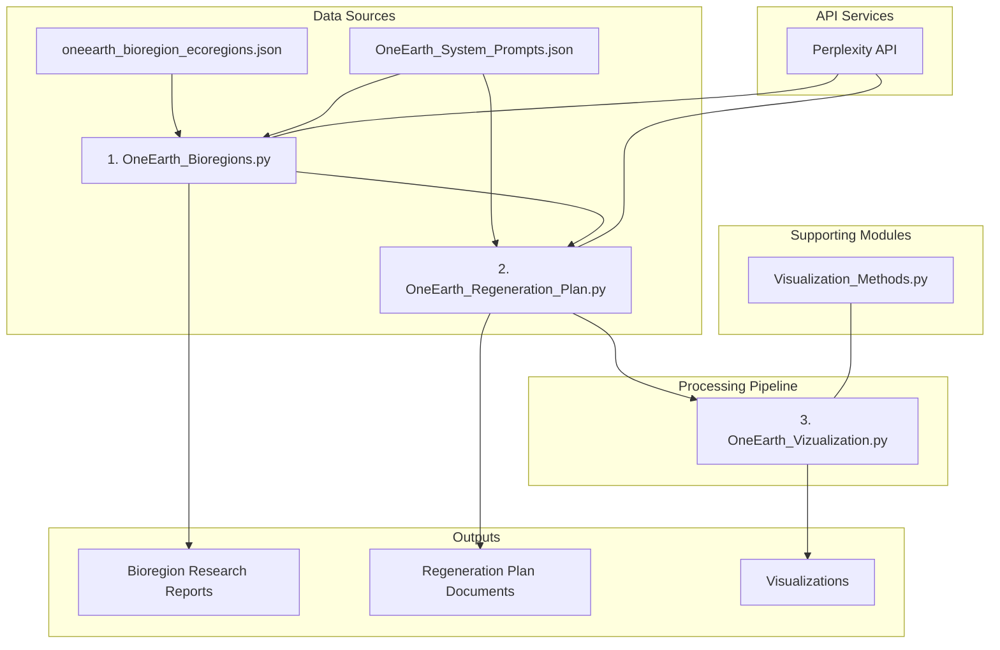
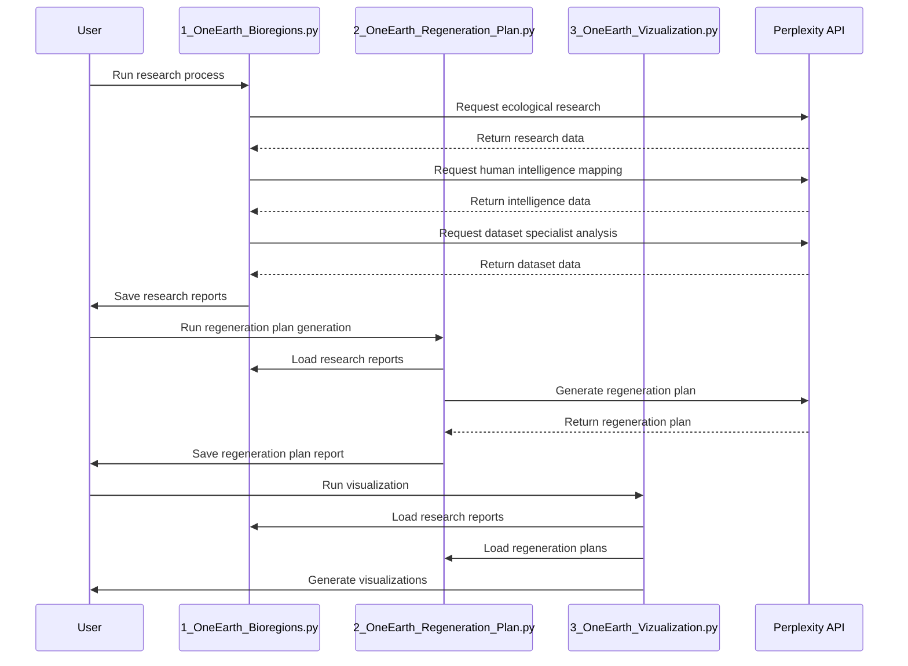

# OneEarth Architecture

This document provides a detailed explanation of the OneEarth system architecture, data flow, and component interactions.

## System Overview

The OneEarth system is designed to analyze bioregions from the OneEarth framework, generate regeneration plans for sustainable ecosystems, and visualize insights to inform decision-making. The system follows a sequential pipeline architecture with three main stages:

1. **Bioregion Research**: Analyzes bioregions through multiple expert perspectives
2. **Regeneration Plan Generation**: Creates comprehensive regeneration plans based on research
3. **Visualization & Analysis**: Generates visual insights and comparisons across regions

## System Architecture Diagram



## Component Details

### 1. Data Sources

#### oneearth_bioregion_ecoregions.json
- **Purpose**: Provides hierarchical bioregion data from the OneEarth framework
- **Structure**: 
  - Hierarchical tree representing realm, region, and ecoregion relationships
  - Contains metadata for each region including unique IDs, names, and image references
  - Used to identify target regions for analysis

#### OneEarth_System_Prompts.json
- **Purpose**: Defines specialized research personas for AI-assisted analysis
- **Structure**:
  - Collection of role definitions with specialized expertise:
    - Ecological Researcher
    - Human Intelligence Officer
    - Dataset Specialist
    - Regeneration Planner
  - Each role includes detailed system prompts to guide AI analysis

### 2. Processing Components

#### 1_OneEarth_Bioregions.py
- **Purpose**: Conducts specialized research on each bioregion
- **Key Functions**:
  - `load_json_file()`: Loads bioregion and system prompt data
  - `generate_research_prompt()`: Creates context-specific research prompts
  - `get_perplexity_response()`: Calls Perplexity API with research personas
  - `research_bioregion()`: Orchestrates multi-perspective research
  - `save_consolidated_markdown()`: Consolidates insights into reports

#### 2_OneEarth_Regeneration_Plan.py
- **Purpose**: Generates regeneration plans from research data
- **Key Functions**:
  - `load_research_reports()`: Loads research data from previous stage
  - `generate_regeneration_prompt()`: Creates regeneration plan generation prompt
  - `process_region_regeneration_plan()`: Orchestrates regeneration plan creation
  - `save_regeneration_plan()`: Saves regeneration plans in markdown and JSON

#### 3_OneEarth_Vizualization.py
- **Purpose**: Analyzes and visualizes research and regeneration plan data
- **Key Functions**:
  - `collect_regional_files()`: Aggregates all research and regeneration plan documents
  - `analyze_regional_research()`: Applies NLP and visual analytics
  - Uses various visualization methods from Visualization_Methods.py

#### Visualization_Methods.py
- **Purpose**: Provides specialized visualization and analysis functions
- **Key Functions**:
  - Text preprocessing and NLP functions
  - Dimension reduction methods (PCA, t-SNE)
  - Statistical visualization (confidence intervals, term frequency)
  - Network analysis and visualization

### 3. Data Flow



## Directory Structure

```
OneEarth/
├── 1_OneEarth_Bioregions.py             # Research generation script
├── 2_OneEarth_Regeneration_Plan.py      # Regeneration plan generation script
├── 3_OneEarth_Vizualization.py          # Visualization script
├── OneEarth_README.md                   # Project README
├── OneEarth_Architecture.md             # This architecture documentation
├── OneEarth_System_Prompts.json         # System prompts for research personas
├── oneearth_bioregion_ecoregions.json   # Bioregion data
├── Visualization_Methods.py             # Visualization utility functions
├── requirements.txt                     # Project dependencies
├── RR_LLM_keys.key                      # API keys (not included in repo)
├── Outputs/                             # Generated research and regeneration plans
│   └── Region_State_County/             # Organized by region
│       ├── region_ecological_researcher_*.md
│       ├── region_human_intelligence_officer_*.md
│       ├── region_dataset_specialist_*.md
│       ├── region_consolidated_research_*.md
│       └── region_regeneration_plan_*.md
└── Visualizations/                      # Generated visualizations
    ├── regional/                        # Region-specific visualizations
    ├── comparative/                     # Cross-region comparisons
    ├── topic_analysis/                  # Topic modeling results
    └── network_analysis/                # Term network visualizations
```

## Customization and Extension

The OneEarth system is designed to be extensible in several ways:

1. **Additional Bioregions**: New bioregions can be added to the input JSON
2. **Enhanced System Prompts**: The expert personas can be refined or expanded
3. **New Visualizations**: Additional visualization methods can be added to the module
4. **Model Upgrades**: The system can be updated to use new AI models as they become available

## Limitations and Considerations

- **API Rate Limits**: The system incorporates delay mechanisms between API calls to respect rate limits
- **Processing Time**: Large-scale analyses may require significant processing time
- **Cost Considerations**: API usage incurs costs based on token usage
- **Data Storage**: Large research outputs require adequate storage capacity

## Potential Future Enhancements

1. **Interactive Dashboard**: Web-based visualization dashboard
2. **Real-time Updates**: Continuous monitoring of bioregion changes
3. **Comparative Analysis**: Enhanced cross-regional comparative analysis
4. **Integration with GIS**: Geographic information system integration
5. **Stakeholder Feedback Loop**: Mechanisms to incorporate human feedback 