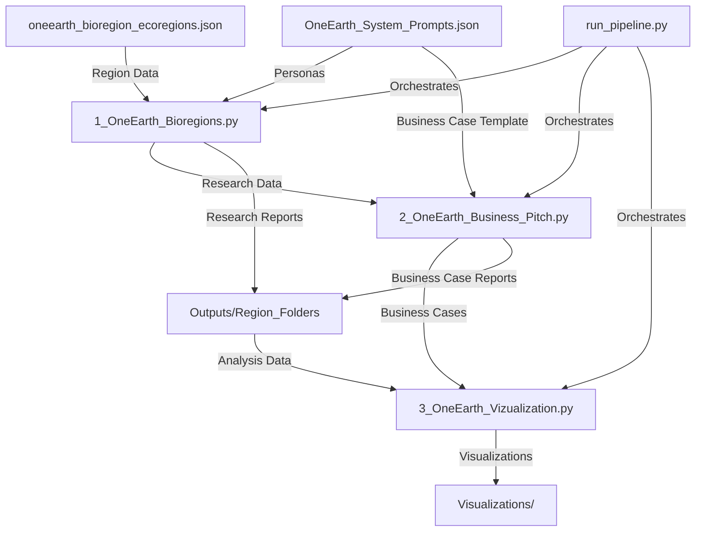

# OneEarth Bioregion Analysis System

This project adapts the Bio_Perplexity scripts and methods to the OneEarth use case. It provides a comprehensive system for analyzing bioregions, generating business cases, and visualizing the insights derived from the analyses.

## Project Overview

The OneEarth project analyzes geographical bioregions using internet-enabled LLM search (currently with Perplexity API calls) to:
1. Research bioregions through multiple specialized perspectives
2. Generate business cases and opportunities for each region
3. Visualize and compare the results across different regions

## System Architecture

The system consists of three main components:



## Quick Start

For the fastest way to get started with OneEarth:

```bash
# 1. Install dependencies
pip install -r requirements.txt
python -m spacy download en_core_web_sm

# 2. Create necessary directories
python create_dirs.py

# 3. Run the full pipeline (testing mode with limited regions)
python run_pipeline.py --model testing --max-regions 2
```

See [QUICKSTART.md](QUICKSTART.md) for more options and detailed instructions.

## Complete Setup Instructions

1. Clone this repository
2. Install required dependencies:
   ```bash
   pip install -r requirements.txt
   python -m spacy download en_core_web_sm
   ```
3. Set up API key:
   - The system requires a Perplexity API key to function
   - By default, it will use the included `OneEarth_Perplexity_keys.key` file
   - To use your own API key, edit that file or create a new one with your key:
     ```
     PERPLEXITY_API_KEY=your_api_key_here
     ```
4. Create the required directory structure:
   ```bash
   python create_dirs.py
   ```
5. Verify the data files are in place:
   - `oneearth_bioregion_ecoregions.json`: Contains bioregion data
   - `OneEarth_System_Prompts.json`: Contains system prompts for research personas

## Running the Full Pipeline

The simplest way to run the complete system is with the orchestration script:

```bash
# Run all steps with default settings
python run_pipeline.py

# Run all steps with best research model (more expensive)
python run_pipeline.py --model production

# Run all steps with limited regions (for testing)
python run_pipeline.py --max-regions 2

# Skip specific pipeline stages
python run_pipeline.py --skip-research --skip-business
```

## Running Individual Components

The system is designed to be run sequentially, but you can also run each component separately:

### 1. Bioregion Research

```bash
# Default settings
python 1_OneEarth_Bioregions.py

# With options
python 1_OneEarth_Bioregions.py --model [testing|production] --max-regions [number]
```

This script:
- Reads in the bioregion data from `oneearth_bioregion_ecoregions.json`
- Loads research personas from `OneEarth_System_Prompts.json`
- For each bioregion, generates research using multiple specialized personas:
  - Ecological Researcher
  - Market Analyst
  - Supply Chain Strategist
  - Regulatory Compliance Expert
- Saves individual and consolidated research reports to the `Outputs` directory

### 2. Business Case Generation

```bash
# Default settings
python 2_OneEarth_Business_Pitch.py

# With options
python 2_OneEarth_Business_Pitch.py --model [testing|production]
```

This script:
- Reads the research reports generated in step 1
- Uses the Business Case Manager persona to generate comprehensive business proposals
- Saves business cases to the same regional folders in the `Outputs` directory

### 3. Visualization and Analysis

```bash
# Default settings
python 3_OneEarth_Vizualization.py

# With options (specify input/output directories)
python 3_OneEarth_Vizualization.py --input-dir [path] --output-dir [path]
```

This script:
- Analyzes all research reports and business cases
- Generates visualizations including:
  - PCA and dimension reduction plots
  - Topic modeling
  - Regional comparisons
  - Term networks
  - Word clouds
- Saves all visualizations to the `Visualizations` directory

## Model Options

The system supports different Perplexity API models:

| Mode | Model | Description | Cost |
|------|-------|-------------|------|
| `testing` | `sonar` | Cheaper option, suitable for testing | $1/$1 per million tokens |
| `production` | `sonar-deep-research` | Best for detailed research | $2/$8 per million tokens |

## Customization

You can customize the system by:
- Modifying the system prompts in `OneEarth_System_Prompts.json`
- Adding new bioregions to the input data
- Creating new visualization methods in the `Visualization_Methods.py` module

## Logging and Monitoring

The system includes comprehensive logging functionality:
- Pipeline execution logs are saved to `pipeline.log`
- Each operation is logged with timing information
- Error handling with detailed tracebacks for troubleshooting
- Progress indicators for long-running operations

## Documentation

- [QUICKSTART.md](QUICKSTART.md): Fast reference guide for common commands
- [WORKFLOW.md](WORKFLOW.md): Detailed workflow diagrams and process flow
- [OneEarth_Architecture.md](OneEarth_Architecture.md): System architecture and component descriptions

## Requirements

- Python 3.8+
- Perplexity API access
- Required packages (see requirements.txt):
  - openai, numpy, pandas
  - matplotlib, seaborn, plotly
  - scikit-learn, wordcloud, networkx
  - spaCy with en_core_web_sm model
  - requests, tqdm, and others

## Troubleshooting

If you encounter issues:
1. Check the `pipeline.log` file for error messages and tracebacks
2. Verify your API key is valid and properly formatted
3. Ensure all dependencies are installed correctly
4. Make sure the required directories exist (run `python create_dirs.py`)
5. Confirm input data files are present and properly formatted