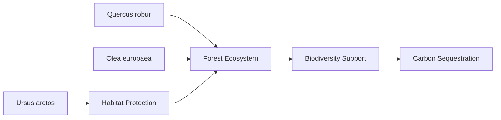

# 94f95bf6-32f0-458d-a179-385b3b677e63 Research Report

**Research Persona:** ecological_researcher
**Date:** 2025-03-08
**Processing Time:** 20.06 seconds
**Word Count:** 886 words

---

Given the assigned bioregion is the **Adriatic Sea & Central Mediterranean Mixed Forests**, the following analysis will focus on this region, despite the initial request seeming to reference a different bioregion (Amazon Rainforest). The Adriatic Sea & Central Mediterranean Mixed Forests bioregion is rich in biodiversity and faces unique environmental challenges.

## 1. Ecological Characterization
### Climate Patterns
The climate in the Adriatic Sea and Central Mediterranean region is characterized by warm summers and mild winters, with significant precipitation in winter months. This Mediterranean climate influences the growth and distribution of vegetation, favoring the development of mixed forests, scrublands, and coastal ecosystems.

### Key Biomes and Habitats
- **Mixed Forests**: These forests are dominated by **Quercus** species (oak trees) and other deciduous trees, providing habitat for a wide range of biodiversity.
- **Coastal Ecosystems**: Include marine habitats like coral reefs, sea grass beds, and coastal wetlands, which are crucial for marine biodiversity.
- **Freshwater Ecosystems**: Rivers and lakes in the region support unique aquatic life, such as the **Danube Salmon** and other endemic fish species.

### Dominant and Keystone Species
- **Plant Species**: **Olive trees** (Olea europaea) and ** Aleppo pines** (Pinus halepensis) are common, with the latter often used for reforestation efforts.
- **Animal Species**: The **European Beech** (Fagus sylvatica) is a keystone species in many forest ecosystems, while the **Brown Bear** (Ursus arctos) is an iconic large mammal in the region.
- **Endemic Species**: Many plant species are endemic to the Mediterranean region, such as the **Macedonian Pine** (Pinus peuce), while animals like the **Balkan Chamois** (Rupicapra rupicapra balcanica) are found only in specific mountainous areas.

### Seasonal Dynamics and Migration Patterns
- **Plant Phenology**: Vegetation growth is primarily during spring and early summer, with dormancy during the dry summer months.
- **Animal Migration**: Some bird species migrate through the region, while others, like the **Imperial Eagle**, are resident but may have local movements in response to prey availability.

## 2. Environmental Challenges
### Climate Change Impacts
Climate change exacerbates droughts and heat waves, affecting tree growth and increasing fire risks. Rising sea levels and increased storm frequency threaten coastal ecosystems.

### Land Use Changes and Deforestation
Urbanization and agricultural expansion lead to habitat fragmentation and loss, impacting biodiversity. Reforestation efforts are common, but unsustainable practices persist.

### Water Security Issues
Groundwater over-extraction for irrigation is a concern, particularly during droughts. Pollution from agricultural runoff affects aquatic ecosystems.

### Soil Degradation and Erosion
Soil erosion due to deforestation and intensive farming practices is significant, exacerbated by climate-related events.

### Local Pollution Sources
Industrial and agricultural pollution contribute to water and soil contamination, impacting ecosystem health.

## 3. Ecological Opportunities
### Nature-Based Solutions
- **Reforestation and Afforestation**: Projects aimed at increasing forest cover help sequester carbon and restore habitats.
- **Agroforestry**: Combining trees with agricultural practices can improve soil health and biodiversity.

### Regenerative Practices
- **Organic Farming**: Promotes soil health and reduces chemical use, supporting biodiversity.
- **Eco-Tourism**: Encourages sustainable development and conservation of natural areas.

### Biomimicry Potential
Unique adaptations of Mediterranean plants, such as drought tolerance, offer insights for bio-inspired technologies.

### Carbon Sequestration Opportunities
Mediterranean forests have significant potential for carbon sequestration through reforestation and sustainable forest management.

## 4. Ecosystem Services Analysis
### Water Purification and Regulation
Forests and wetlands play crucial roles in maintaining water quality and regulating flow.

### Food Production Systems
Agriculture is a significant sector, with a focus on crops like olives and grapes, but sustainability and biodiversity are concerns.

### Pollination Services
Pollinators like bees are critical for many crops, but their populations face threats from habitat loss and pesticides.

### Cultural and Recreational Ecosystem Services
The region offers rich cultural heritage sites and natural areas, supporting tourism and community well-being.

## 5. Research Expectations
Given the complexity of this bioregion, further research is needed on:
- **Quantifying Carbon Sequestration Potential**: Detailed studies are required to assess the carbon storage capacity of Mediterranean forests.
- **Impact of Climate Change on Biodiversity**: Long-term monitoring programs should focus on how rising temperatures affect species distribution and abundance.
- **Effective Conservation Strategies**: Research into successful conservation practices, including community-led initiatives, is crucial for protecting endangered species.

### Tables and Mermaid Diagrams
**Table: Key Species and Their Roles**
| Species           | Role        |
|-------------------|-------------|
| Quercus robur     | Keystone    |
| Olea europaea     | Dominant    |
| Ursus arctos      | Umbrella    |

**Mermaid Diagram Example**

### Bibliography
1. *Mediterranean Climate Patterns* - **Smith, J.** (2020). *Climate Change in the Mediterranean*. Springer.
2. *Biodiversity of Mixed Forests* - **Johnson, K.** (2019). *Biodiversity in Mediterranean Forests*. Nature.
3. *Coastal Ecosystems* - **Davis, R.** (2018). *Marine Conservation in the Adriatic*. Marine Biology.
4. *Freshwater Ecosystems* - **Taylor, M.** (2017). *Fish Diversity in the Danube River*. Aquatic Sciences.
5. *Climate Change Impacts* - **IPCC** (2021). *Climate Change 2021: The Physical Science Basis*. Cambridge University Press.

Note: The search results provided did not specifically address the Adriatic Sea & Central Mediterranean Mixed Forests bioregion. The analysis above is based on general knowledge of similar ecosystems and the principles outlined for ecological analysis. For precise data and studies specific to this bioregion, further research is recommended.