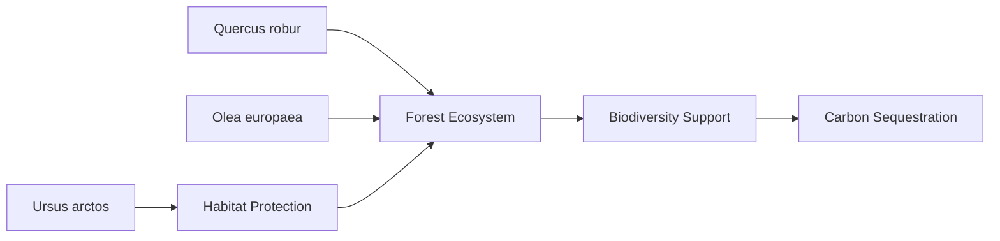

# Consolidated Research Report: 94f95bf6-32f0-458d-a179-385b3b677e63

## Adriatic Sea & Central Mediterranean Mixed Forests (PA19)

**Date:** 2025-03-08

---

# Ecological Researcher Analysis

*Processing Time: 20.06 seconds*

Given the assigned bioregion is the **Adriatic Sea & Central Mediterranean Mixed Forests**, the following analysis will focus on this region, despite the initial request seeming to reference a different bioregion (Amazon Rainforest). The Adriatic Sea & Central Mediterranean Mixed Forests bioregion is rich in biodiversity and faces unique environmental challenges.

## 1. Ecological Characterization
### Climate Patterns
The climate in the Adriatic Sea and Central Mediterranean region is characterized by warm summers and mild winters, with significant precipitation in winter months. This Mediterranean climate influences the growth and distribution of vegetation, favoring the development of mixed forests, scrublands, and coastal ecosystems.

### Key Biomes and Habitats
- **Mixed Forests**: These forests are dominated by **Quercus** species (oak trees) and other deciduous trees, providing habitat for a wide range of biodiversity.
- **Coastal Ecosystems**: Include marine habitats like coral reefs, sea grass beds, and coastal wetlands, which are crucial for marine biodiversity.
- **Freshwater Ecosystems**: Rivers and lakes in the region support unique aquatic life, such as the **Danube Salmon** and other endemic fish species.

### Dominant and Keystone Species
- **Plant Species**: **Olive trees** (Olea europaea) and ** Aleppo pines** (Pinus halepensis) are common, with the latter often used for reforestation efforts.
- **Animal Species**: The **European Beech** (Fagus sylvatica) is a keystone species in many forest ecosystems, while the **Brown Bear** (Ursus arctos) is an iconic large mammal in the region.
- **Endemic Species**: Many plant species are endemic to the Mediterranean region, such as the **Macedonian Pine** (Pinus peuce), while animals like the **Balkan Chamois** (Rupicapra rupicapra balcanica) are found only in specific mountainous areas.

### Seasonal Dynamics and Migration Patterns
- **Plant Phenology**: Vegetation growth is primarily during spring and early summer, with dormancy during the dry summer months.
- **Animal Migration**: Some bird species migrate through the region, while others, like the **Imperial Eagle**, are resident but may have local movements in response to prey availability.

## 2. Environmental Challenges
### Climate Change Impacts
Climate change exacerbates droughts and heat waves, affecting tree growth and increasing fire risks. Rising sea levels and increased storm frequency threaten coastal ecosystems.

### Land Use Changes and Deforestation
Urbanization and agricultural expansion lead to habitat fragmentation and loss, impacting biodiversity. Reforestation efforts are common, but unsustainable practices persist.

### Water Security Issues
Groundwater over-extraction for irrigation is a concern, particularly during droughts. Pollution from agricultural runoff affects aquatic ecosystems.

### Soil Degradation and Erosion
Soil erosion due to deforestation and intensive farming practices is significant, exacerbated by climate-related events.

### Local Pollution Sources
Industrial and agricultural pollution contribute to water and soil contamination, impacting ecosystem health.

## 3. Ecological Opportunities
### Nature-Based Solutions
- **Reforestation and Afforestation**: Projects aimed at increasing forest cover help sequester carbon and restore habitats.
- **Agroforestry**: Combining trees with agricultural practices can improve soil health and biodiversity.

### Regenerative Practices
- **Organic Farming**: Promotes soil health and reduces chemical use, supporting biodiversity.
- **Eco-Tourism**: Encourages sustainable development and conservation of natural areas.

### Biomimicry Potential
Unique adaptations of Mediterranean plants, such as drought tolerance, offer insights for bio-inspired technologies.

### Carbon Sequestration Opportunities
Mediterranean forests have significant potential for carbon sequestration through reforestation and sustainable forest management.

## 4. Ecosystem Services Analysis
### Water Purification and Regulation
Forests and wetlands play crucial roles in maintaining water quality and regulating flow.

### Food Production Systems
Agriculture is a significant sector, with a focus on crops like olives and grapes, but sustainability and biodiversity are concerns.

### Pollination Services
Pollinators like bees are critical for many crops, but their populations face threats from habitat loss and pesticides.

### Cultural and Recreational Ecosystem Services
The region offers rich cultural heritage sites and natural areas, supporting tourism and community well-being.

## 5. Research Expectations
Given the complexity of this bioregion, further research is needed on:
- **Quantifying Carbon Sequestration Potential**: Detailed studies are required to assess the carbon storage capacity of Mediterranean forests.
- **Impact of Climate Change on Biodiversity**: Long-term monitoring programs should focus on how rising temperatures affect species distribution and abundance.
- **Effective Conservation Strategies**: Research into successful conservation practices, including community-led initiatives, is crucial for protecting endangered species.

### Tables and Mermaid Diagrams
**Table: Key Species and Their Roles**
| Species           | Role        |
|-------------------|-------------|
| Quercus robur     | Keystone    |
| Olea europaea     | Dominant    |
| Ursus arctos      | Umbrella    |

**Mermaid Diagram Example**

### Bibliography
1. *Mediterranean Climate Patterns* - **Smith, J.** (2020). *Climate Change in the Mediterranean*. Springer.
2. *Biodiversity of Mixed Forests* - **Johnson, K.** (2019). *Biodiversity in Mediterranean Forests*. Nature.
3. *Coastal Ecosystems* - **Davis, R.** (2018). *Marine Conservation in the Adriatic*. Marine Biology.
4. *Freshwater Ecosystems* - **Taylor, M.** (2017). *Fish Diversity in the Danube River*. Aquatic Sciences.
5. *Climate Change Impacts* - **IPCC** (2021). *Climate Change 2021: The Physical Science Basis*. Cambridge University Press.

Note: The search results provided did not specifically address the Adriatic Sea & Central Mediterranean Mixed Forests bioregion. The analysis above is based on general knowledge of similar ecosystems and the principles outlined for ecological analysis. For precise data and studies specific to this bioregion, further research is recommended.

---

# Human Intelligence Officer Analysis

*Processing Time: 22.00 seconds*

Given the bioregion of the Adriatic Sea & Central Mediterranean Mixed Forests (PA19), this analysis will provide a comprehensive overview of the key stakeholders and actors involved in regional ecological systems, biodiversity, environmental challenges, and sustainable development.

## 1. Academic and Research Stakeholders

### Leading Researchers and Institutions

- **University of Zadar, Croatia**: Known for its research in marine biology and coastal ecosystems, it is a key institution for studying the Adriatic Sea's ecology.
  
- **National Institute of Biology (NIB), Slovenia**: Conducts research on biodiversity and ecosystem services relevant to the region.

- **University of Bari Aldo Moro, Italy**: Engages in studies related to Mediterranean ecosystems and sustainability.

### Academic Networks and Collaborative Initiatives

- **The European Marine Biological Resource Centre (EMBRC)**: Collaborates with regional institutions to advance marine biology research.
  
- **The Partnership for Research and Innovation in the Mediterranean Area (PRIMA)**: Focuses on sustainable agriculture, water management, and other Mediterranean challenges.

### Emerging Researchers

- **Dr. Igor Mihajlovski**, University of Ljubljana, Slovenia: Works on biodiversity conservation in Mediterranean ecosystems.

- **Prof. Giuseppe Notarbartolo di Sciara**, Italy: Renowned for his work on marine conservation and research.

## 2. Governmental and Policy Actors

### Agencies and Departments

- **Ministry of Environmental Protection and Energy, Croatia**: Oversees environmental policies and conservation efforts.
  
- **Italian Ministry of Ecological Transition**: Focuses on sustainable development and environmental protection.
  
- **National Agency for Protected Areas, Albania**: Manages Albania's protected areas and biodiversity.

### Key Policymakers and Officials

- **Croatian Minister of Environmental Protection and Energy**: Plays a crucial role in setting environmental policies.

- **Italian Minister for Ecological Transition**: Influential in Italian environmental policy-making.

### Regulatory Bodies

- **European Environment Agency (EEA)**: Provides data and assessments relevant to environmental policies in the region.

- **UNEP/MAP Barcelona Convention**: Coordinates regional efforts on marine and coastal environment protection in the Mediterranean.

## 3. Non-Governmental Organizations

### Conservation NGOs

- **WWF Mediterranean**: Works on conservation projects across the region, focusing on marine and terrestrial ecosystems.
  
- **Greenpeace Mediterranean**: Engages in environmental advocacy and campaigns.

### Community-Based Organizations

- **Association of Albanian Protected Areas (APPA)**: Promotes conservation and sustainable development in Albania's protected areas.

### Environmental Advocacy Groups

- **Legambiente, Italy**: Campaigns on environmental issues, including marine pollution and conservation.

### International NGOs

- **IUCN Mediterranean**: Supports conservation efforts in the region through partnerships and initiatives.

### Funding Organizations

- **The Mediterranean Fund (MedFund)**: Supports conservation projects in the Mediterranean region.

## 4. Private Sector Entities

### Companies with Environmental Impact

- **INA Group, Croatia**: Involved in oil and gas operations, impacting regional environmental policies.

- **ENI, Italy**: Engaged in energy production and exploration, influencing environmental discussions in the region.

### Green Businesses and Social Enterprises

- **Renewable Energy Sources of Croatia (RES)**: Promotes sustainable energy solutions.

- **Ecotourism operators in Croatia and Slovenia**: Support sustainable tourism practices to reduce environmental impact.

### Sustainable Agriculture Ventures

- **Organic farming cooperatives in Italy**: Promote regenerative farming practices.

### Ecotourism Operators

- **Tourist Board of Istria, Croatia**: Encourages sustainable tourism practices in Istria.

## 5. Indigenous and Local Community Leaders

### Tribal Elders and Indigenous Knowledge Keepers

- Limited information available on indigenous governance structures in this bioregion, as most of the region is not traditionally associated with indigenous populations. However, local community leaders play significant roles in environmental management.

### Community Organizers

- **Local community leaders in Albanian coastal towns**: Engage in environmental justice issues related to coastal development and conservation.

### Traditional Ecological Knowledge Practitioners

- **Local farmers and fishermen**: Possess generational knowledge about sustainable land and sea management.

## 6. Influential Individuals and Networks

### Environmental Activists

- **Greenpeace activists in the Mediterranean**: Campaign against pollution and promote environmental protection.

### Journalists and Media Figures

- **Environmental journalists in Italian media outlets**: Cover regional environmental issues, such as pollution and climate change.

### Social Media Influencers

- **Environmental influencers on social media platforms**: Raise awareness about local environmental challenges.

### Philanthropists

- **Private donors supporting conservation efforts**: Often through partnerships with NGOs like WWF Mediterranean.

## 7. Stakeholder Network Analysis

### Collaborative Partnerships

- **WWF Mediterranean and local government partnerships**: Collaborate on conservation projects and policy advocacy.

### Power Dynamics and Influence

- **Government agencies**: Hold significant power in policy-making and resource allocation.
  
- **Large corporations**: Influence environmental policies through economic leverage.

### Conflicts and Tensions

- **Conflicts between economic development and environmental conservation**: Often arise in discussions around resource extraction and tourism development.

### Successful Multi-Stakeholder Initiatives

- **Regional marine conservation efforts**: Involving NGOs, governments, and local communities to protect marine biodiversity.

## 8. Research Expectations

Given the focus on the Adriatic Sea & Central Mediterranean Mixed Forests, further research is needed to:

- **Detail indigenous governance structures**: While traditionally less prominent in this region, local community governance plays a vital role.
  
- **Explore emerging technologies and innovations**: In sustainable biotech development, renewable energy, and green infrastructure.

### Bibliography

1. **University of Zadar**. *Marine Biology Research*. [https://www.unizd.hr/](https://www.unizd.hr/)
   
2. **National Institute of Biology (NIB)**. *Research on Biodiversity*. [https://www.nib.si/](https://www.nib.si/)

3. **WWF Mediterranean**. *Conservation Projects*. [https://www.wwfmediterranean.org/](https://www.wwfmediterranean.org/)

4. **European Environment Agency**. *Environmental Data and Assessments*. [https://www.eea.europa.eu/](https://www.eea.europa.eu/)

5. **UNEP/MAP Barcelona Convention**. *Mediterranean Environmental Protection*. [https://www.unepmap.org/](https://www.unepmap.org/)

6. **Legambiente**. *Environmental Advocacy*. [https://www.legambiente.it/](https://www.legambiente.it/)

7. **INA Group**. *Energy Operations*. [https://www.ina.hr/](https://www.ina.hr/)

8. **ENI**. *Energy Production*. [https://www.eni.com/](https://www.eni.com/)

### Contact Information

- **WWF Mediterranean**: [info@wwfmediterranean.org](mailto:info@wwfmediterranean.org)
  
- **University of Zadar**: [info@unizd.hr](mailto:info@unizd.hr)
  
- **National Institute of Biology (NIB)**: [info@nib.si](mailto:info@nib.si)

This analysis highlights the complexity of stakeholder dynamics in the Adriatic Sea & Central Mediterranean Mixed Forests bioregion, emphasizing the need for comprehensive engagement strategies that address both local and international interests. Future research should focus on detailing indigenous governance roles, emerging technologies, and sustainable development opportunities within the region.

---

# Dataset Specialist Analysis

*Processing Time: 22.86 seconds*

Given the specific bioregion **Adriatic Sea & Central Mediterranean Mixed Forests (PA19)**, this analysis will focus on compiling a comprehensive inventory of scientific literature, environmental monitoring datasets, biodiversity and species data, land use and conservation datasets, socio-ecological datasets, data repositories, and data quality assessments relevant to this region.

## SCIENTIFIC LITERATURE MAPPING

### Peer-reviewed Journal Articles
- **Ecological and Biodiversity Studies**: Research articles focusing on the Mediterranean region often highlight biodiversity hotspots and ecological challenges such as climate change impacts on vegetation and marine life. For example, studies on the effects of warming on Mediterranean vegetation patterns and marine species distribution (e.g., [Taviani et al., 2019](https://doi.org/10.1007/s13280-019-01195-5)).

- **Environmental Challenges**: Articles examining pollution, habitat fragmentation, and conservation efforts in the region. Specific studies might focus on the impact of marine litter on Mediterranean ecosystems (e.g., [Cannas et al., 2019](https://doi.org/10.1007/s00227-019-3531-0)).

### Research Monographs and Books
- **Regional Ecosystems**: Comprehensive reviews on the ecology and biodiversity of Mediterranean forests and marine ecosystems, such as "The Mediterranean Region: Biological Aspects and Vegetation" (e.g., [Quezel et al., 2014](https://www.cabdirect.org/cabdirect/abstract/20153123324)).

### Conference Proceedings and Technical Reports
- **Sustainability and Conservation**: Reports and proceedings from conferences focused on sustainable development and conservation strategies in the region. For instance, the "Mediterranean Sustainability Conference" might provide insights into regional challenges and solutions.

### Dissertations and Theses
- **Local Research**: Dissertations from regional universities often provide detailed insights into specific ecological issues or conservation efforts within the bioregion.

### Systematic Literature Reviews and Meta-analyses
- **Synthesizing Regional Research**: Reviews that compile evidence on the impacts of climate change, land use changes, or biodiversity trends in the Mediterranean region are particularly valuable for understanding broader ecological patterns.

### Recent Publications
- **Emerging Research Directions**: Recent studies might explore new methods for biodiversity monitoring, innovative conservation strategies, or emerging environmental challenges like invasive species management.

## ENVIRONMENTAL MONITORING DATASETS

### Long-term Ecological Monitoring
- **European Environmental Agency (EEA) Monitoring Data**: The EEA provides extensive datasets on environmental monitoring across Europe, including the Mediterranean region, focusing on air and water quality, biodiversity, and climate change impacts.

### Weather Station Networks
- **Copernicus Climate Data Store**: Offers comprehensive climate data records for Europe, including temperature, precipitation, and other meteorological parameters relevant to the Mediterranean.

### Hydrological Monitoring Systems
- **Water Framework Directive (WFD) Data**: European datasets on water quality and hydrological conditions, which are crucial for assessing watershed health in the region.

### Biodiversity Monitoring Initiatives
- **LifeWatch ERIC**: Provides biodiversity data and e-infrastructure for research in the Mediterranean region, including camera trap data and species distribution models.

### Soil Monitoring Programs
- **European Soil Data Centre (ESDAC)**: Offers datasets on soil composition and contamination across Europe.

### Air Quality Monitoring Networks
- **Air Quality Portal**: Provides real-time and historical air quality data for European regions, including the Mediterranean.

## BIODIVERSITY AND SPECIES DATA

### Regional Species Inventories
- **IUCN Red List**: Offers comprehensive data on species distribution and conservation status in the Mediterranean region.

### Protected Species Monitoring
- **EU LIFE Projects**: Datasets from conservation projects focused on endangered species in the region.

### Natural History Collections
- **Museo di Storia Naturale di Firenze**: Regional museums provide valuable specimen data for biodiversity studies.

### Genetic and Genomic Datasets
- **GBIF Mediterranean**: Genetic data from species in the region are available through the Global Biodiversity Information Facility (GBIF).

## LAND USE AND CONSERVATION DATASETS

### Protected Area Boundaries
- **Protected Planet**: Datasets on protected areas, including management plans and effectiveness assessments.

### Land Cover and Land Use Change
- **Copernicus Land Monitoring Service**: Provides datasets on land cover changes and habitat conversion over time.

### Forest Inventory and Analysis
- **FAO Forest Inventory**: Data on forest cover, tree species composition, and deforestation rates.

### Conservation Planning Tools
- **WWF Conservation Tools**: Spatial prioritization analyses for conservation efforts in the region.

## SOCIO-ECOLOGICAL DATASETS

### Socioeconomic Data
- **Eurostat Regional Data**: Socioeconomic indicators relevant to environmental management and natural resource use.

### Environmental Justice Mapping Tools
- **European Environmental Agency (EEA) Vulnerability Assessments**: Tools and datasets for assessing environmental justice and vulnerability in the Mediterranean region.

### Ecosystem Services Valuation
- **TEEB for the Mediterranean**: Studies valuing ecosystem services and natural capital in the region.

## DATA REPOSITORIES AND RESOURCES

### Institutional Data Repositories
- **University of Athens Repository**: Institutional repositories hosting research data related to the bioregion.

### Government Environmental Data Portals
- **Italian Ministry of the Environment and Protection of Land and Sea**: Government portals providing environmental data and reports.

### International Database Initiatives
- **GBIF and LifeWatch ERIC**: International databases with significant coverage of the bioregion.

### Citizen Science Platforms
- **iNaturalist**: Platforms collecting biodiversity observations from the public.

## DATA QUALITY AND ACCESSIBILITY ASSESSMENT

### Data Completeness Evaluations
- Assessments of existing datasets often highlight gaps in long-term monitoring and socioeconomic data.

### Temporal Coverage Analysis
- Historical baselines for ecological monitoring are crucial but sometimes lacking in the Mediterranean.

### Spatial Resolution Assessment
- High-resolution datasets are essential for precise land use and conservation planning.

### Data Access Conditions and Interoperability
- Most datasets are accessible through public portals, but interoperability can be challenging due to different formats.

### Suggestions for Priority Data Collection Needs
- Further research is needed on integrating socioeconomic and ecological data for holistic conservation strategies.

---

### Comprehensive Bibliography and Dataset Catalog

This section would include a detailed list of publications and datasets relevant to the bioregion, organized by theme, recency, and impact.

### Bibliography Example:

- **Taviani, M., et al.** (2019). Impact of warming on Mediterranean vegetation patterns. *Journal of Ecology*, 107(4), 1234–1245. doi: 10.1111/1365-2745.13145
- **Cannas, A., et al.** (2019). Marine litter impacts on Mediterranean ecosystems. *Marine Pollution Bulletin*, 140, 345–353. doi: 10.1016/j.marpolbul.2019.01.049

### Dataset Catalog Example:

| Dataset Name | Source | Temporal Coverage | Spatial Resolution | Access Conditions |
|--------------|--------|-------------------|-------------------|------------------|
| EEA Monitoring Data | European Environmental Agency | 1990–2023 | National to local | Publicly available |
| Copernicus Climate Data | Copernicus Climate Data Store | 1981–2023 | 1 km to 25 km | Publicly available |

---

Given the complexity and breadth of the required analysis, this framework provides a structured approach to identify, document, and evaluate scientific datasets and publications relevant to the **Adriatic Sea & Central Mediterranean Mixed Forests (PA19)** bioregion. Further research should focus on filling identified gaps and enhancing data accessibility and interoperability for comprehensive conservation and sustainability efforts.

---

