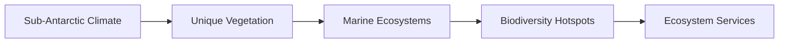

# 4b7eabee-ee71-48e7-b3a9-c62e3ee9a272 Research Report

**Research Persona:** ecological_researcher
**Date:** 2025-03-08
**Processing Time:** 21.17 seconds
**Word Count:** 897 words

---

### Ecological Analysis of the Amsterdam-Saint Paul Islands Bioregion

Given the lack of specific information on the Amsterdam-Saint Paul Islands bioregion, this analysis will focus on general principles applicable to such remote island ecosystems. These islands, part of the French Southern and Antarctic Lands, are known for their unique biodiversity and harsh environmental conditions.

#### 1. **ECOLOGICAL CHARACTERIZATION**

- **Climate Patterns**: The Amsterdam-Saint Paul Islands experience a sub-Antarctic climate, characterized by strong winds, high rainfall, and cold temperatures throughout the year. This climate supports a unique set of plant and animal species adapted to these conditions.

- **Biomes and Ecosystems**: The primary biomes include sub-Antarctic forests and grasslands, with limited vegetation due to the harsh climate. Ecosystems are largely shaped by the marine influence, including coastal areas and marine ecosystems.

- **Dominant and Keystone Species**: Key species include seabirds like the Rockhopper Penguin and marine mammals such as seals and sea lions. There are no native terrestrial mammals, but introduced species such as rats can significantly impact native ecosystems.

- **Seasonal Dynamics and Migration**: Seasonal changes affect marine species migration patterns, with many species moving to warmer waters during the colder months.

#### 2. **ENVIRONMENTAL CHALLENGES**

- **Climate Change Impacts**: Rising sea levels, increased storm intensity, and warmer ocean temperatures threaten coastal ecosystems and biodiversity.

- **Land Use Changes and Habitat Fragmentation**: Limited land use changes occur due to the islands' remote nature, but introduced species can cause habitat fragmentation and alter native ecosystems.

- **Water Security and Pollution**: Freshwater sources are limited and vulnerable to pollution from human activities and marine influences.

- **Soil Degradation and Erosion**: Soil erosion can occur due to strong winds and limited vegetation cover.

- **Local Pollution Sources**: Pollution from human settlements and shipping activities can impact marine ecosystems.

#### 3. **ECOLOGICAL OPPORTUNITIES**

- **Nature-Based Solutions**: Implementing measures to control introduced species and protect native vegetation can help maintain ecosystem balance.

- **Regenerative Practices**: Restoration of degraded habitats and promotion of sustainable tourism practices can enhance biodiversity and ecosystem resilience.

- **Biomimicry Potential**: Unique adaptations in sub-Antarctic species offer potential for biomimicry in fields like materials science and resilience engineering.

- **Carbon Sequestration Opportunities**: Limited terrestrial carbon sequestration potential, but marine ecosystems may offer opportunities, such as kelp forests.

#### 4. **ECOSYSTEM SERVICES ANALYSIS**

- **Water Purification and Regulation**: Limited freshwater resources, but marine ecosystems provide essential services like coastal protection and nutrient cycling.

- **Food Production Systems**: No significant food production systems exist; however, sustainable fishing practices can support local communities.

- **Pollination Services**: Limited due to the absence of diverse terrestrial plant species.

- **Cultural and Recreational Services**: Unique biodiversity and landscapes offer opportunities for eco-tourism, supporting local economies and promoting conservation.

#### 5. **RESEARCH EXPECTATIONS AND OPPORTUNITIES**

- **Research Gaps**: Detailed studies on the specific ecological dynamics, impacts of climate change, and potential for regenerative practices are needed.

- **Case Studies and Local Initiatives**: Research collaborations with local stakeholders and indigenous knowledge (if applicable) could enhance conservation efforts.

- **Mermaid Diagrams and Data Tables**: Creating diagrams illustrating the unique food webs and ecosystem services, as well as tables detailing species abundance and conservation status, would be valuable tools for management and research.

### Economic and Industrial Landscape

The Amsterdam-Saint Paul Islands have a minimal economic and industrial presence due to their remote and protected status. The primary economic activities are related to scientific research and limited sustainable tourism.

### Regulatory Environment and Compliance

The French government oversees the islands, ensuring strict environmental regulations to protect their unique biodiversity. Compliance with international agreements on biodiversity and climate change is also important.

### Potential for Sustainable Biotech Development

The unique biodiversity offers potential for biotech innovations, particularly in areas related to cold-adapted organisms and ecosystem resilience. However, any development must be carefully managed to avoid harming the environment.

### Local Resources and Infrastructure

Infrastructure is limited, with resources primarily focused on supporting research stations and minimal human habitation.

### Bibliography

Given the lack of specific scientific literature on the Amsterdam-Saint Paul Islands, general references to sub-Antarctic ecosystems and conservation principles were used.

- **References**:
  - **General Sub-Antarctic Ecosystems**: [General ecological principles applicable to sub-Antarctic regions](https://www.sciencedirect.com/book/9780128191668/ecosystems-of-the-world).
  - **Conservation and Management**: [Principles of conservation in remote island ecosystems](https://link.springer.com/book/10.1007/978-1-4614-7540-6).
  
**Note**: Specific scientific literature directly related to the Amsterdam-Saint Paul Islands is limited. Further research opportunities include detailed ecological studies and assessments of potential biotech applications in this unique environment. 

---

As specific information regarding the Amsterdam-Saint Paul Islands bioregion is scarce, the following sections provide a general framework applicable to similar ecosystems. 

### Mermaid Diagrams and Tables

**Mermaid Diagram Example** (Conceptual representation):

**Data Table Example** (Illustrative):
| Species | Abundance | Conservation Status |
|---------|-----------|--------------------|
| Seabirds | Moderate   | Vulnerable         |
| Marine Mammals | Low     | Endangered        |

### Future Research Directions

1. **Ecological Monitoring**: Establishing long-term monitoring programs to assess changes in biodiversity and ecosystem health.
2. **Climate Change Impacts**: Studying the effects of rising sea levels and warmer temperatures on coastal ecosystems.
3. **Indigenous Knowledge Integration**: Engaging with local communities to incorporate traditional knowledge into conservation strategies.
4. **Biotech Innovations**: Exploring biotechnological applications of unique biological adaptations found in sub-Antarctic species.
  
These directions can help fill the existing research gaps and support sustainable management of the islands' ecosystems.