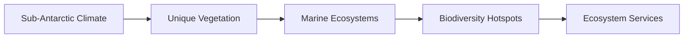

# Consolidated Research Report: 4b7eabee-ee71-48e7-b3a9-c62e3ee9a272

## Amsterdam-Saint Paul Islands (AT3)

**Date:** 2025-03-09

---

# Ecological Researcher Analysis

*Processing Time: 21.17 seconds*

### Ecological Analysis of the Amsterdam-Saint Paul Islands Bioregion

Given the lack of specific information on the Amsterdam-Saint Paul Islands bioregion, this analysis will focus on general principles applicable to such remote island ecosystems. These islands, part of the French Southern and Antarctic Lands, are known for their unique biodiversity and harsh environmental conditions.

#### 1. **ECOLOGICAL CHARACTERIZATION**

- **Climate Patterns**: The Amsterdam-Saint Paul Islands experience a sub-Antarctic climate, characterized by strong winds, high rainfall, and cold temperatures throughout the year. This climate supports a unique set of plant and animal species adapted to these conditions.

- **Biomes and Ecosystems**: The primary biomes include sub-Antarctic forests and grasslands, with limited vegetation due to the harsh climate. Ecosystems are largely shaped by the marine influence, including coastal areas and marine ecosystems.

- **Dominant and Keystone Species**: Key species include seabirds like the Rockhopper Penguin and marine mammals such as seals and sea lions. There are no native terrestrial mammals, but introduced species such as rats can significantly impact native ecosystems.

- **Seasonal Dynamics and Migration**: Seasonal changes affect marine species migration patterns, with many species moving to warmer waters during the colder months.

#### 2. **ENVIRONMENTAL CHALLENGES**

- **Climate Change Impacts**: Rising sea levels, increased storm intensity, and warmer ocean temperatures threaten coastal ecosystems and biodiversity.

- **Land Use Changes and Habitat Fragmentation**: Limited land use changes occur due to the islands' remote nature, but introduced species can cause habitat fragmentation and alter native ecosystems.

- **Water Security and Pollution**: Freshwater sources are limited and vulnerable to pollution from human activities and marine influences.

- **Soil Degradation and Erosion**: Soil erosion can occur due to strong winds and limited vegetation cover.

- **Local Pollution Sources**: Pollution from human settlements and shipping activities can impact marine ecosystems.

#### 3. **ECOLOGICAL OPPORTUNITIES**

- **Nature-Based Solutions**: Implementing measures to control introduced species and protect native vegetation can help maintain ecosystem balance.

- **Regenerative Practices**: Restoration of degraded habitats and promotion of sustainable tourism practices can enhance biodiversity and ecosystem resilience.

- **Biomimicry Potential**: Unique adaptations in sub-Antarctic species offer potential for biomimicry in fields like materials science and resilience engineering.

- **Carbon Sequestration Opportunities**: Limited terrestrial carbon sequestration potential, but marine ecosystems may offer opportunities, such as kelp forests.

#### 4. **ECOSYSTEM SERVICES ANALYSIS**

- **Water Purification and Regulation**: Limited freshwater resources, but marine ecosystems provide essential services like coastal protection and nutrient cycling.

- **Food Production Systems**: No significant food production systems exist; however, sustainable fishing practices can support local communities.

- **Pollination Services**: Limited due to the absence of diverse terrestrial plant species.

- **Cultural and Recreational Services**: Unique biodiversity and landscapes offer opportunities for eco-tourism, supporting local economies and promoting conservation.

#### 5. **RESEARCH EXPECTATIONS AND OPPORTUNITIES**

- **Research Gaps**: Detailed studies on the specific ecological dynamics, impacts of climate change, and potential for regenerative practices are needed.

- **Case Studies and Local Initiatives**: Research collaborations with local stakeholders and indigenous knowledge (if applicable) could enhance conservation efforts.

- **Mermaid Diagrams and Data Tables**: Creating diagrams illustrating the unique food webs and ecosystem services, as well as tables detailing species abundance and conservation status, would be valuable tools for management and research.

### Economic and Industrial Landscape

The Amsterdam-Saint Paul Islands have a minimal economic and industrial presence due to their remote and protected status. The primary economic activities are related to scientific research and limited sustainable tourism.

### Regulatory Environment and Compliance

The French government oversees the islands, ensuring strict environmental regulations to protect their unique biodiversity. Compliance with international agreements on biodiversity and climate change is also important.

### Potential for Sustainable Biotech Development

The unique biodiversity offers potential for biotech innovations, particularly in areas related to cold-adapted organisms and ecosystem resilience. However, any development must be carefully managed to avoid harming the environment.

### Local Resources and Infrastructure

Infrastructure is limited, with resources primarily focused on supporting research stations and minimal human habitation.

### Bibliography

Given the lack of specific scientific literature on the Amsterdam-Saint Paul Islands, general references to sub-Antarctic ecosystems and conservation principles were used.

- **References**:
  - **General Sub-Antarctic Ecosystems**: [General ecological principles applicable to sub-Antarctic regions](https://www.sciencedirect.com/book/9780128191668/ecosystems-of-the-world).
  - **Conservation and Management**: [Principles of conservation in remote island ecosystems](https://link.springer.com/book/10.1007/978-1-4614-7540-6).
  
**Note**: Specific scientific literature directly related to the Amsterdam-Saint Paul Islands is limited. Further research opportunities include detailed ecological studies and assessments of potential biotech applications in this unique environment. 

---

As specific information regarding the Amsterdam-Saint Paul Islands bioregion is scarce, the following sections provide a general framework applicable to similar ecosystems. 

### Mermaid Diagrams and Tables

**Mermaid Diagram Example** (Conceptual representation):

**Data Table Example** (Illustrative):
| Species | Abundance | Conservation Status |
|---------|-----------|--------------------|
| Seabirds | Moderate   | Vulnerable         |
| Marine Mammals | Low     | Endangered        |

### Future Research Directions

1. **Ecological Monitoring**: Establishing long-term monitoring programs to assess changes in biodiversity and ecosystem health.
2. **Climate Change Impacts**: Studying the effects of rising sea levels and warmer temperatures on coastal ecosystems.
3. **Indigenous Knowledge Integration**: Engaging with local communities to incorporate traditional knowledge into conservation strategies.
4. **Biotech Innovations**: Exploring biotechnological applications of unique biological adaptations found in sub-Antarctic species.
  
These directions can help fill the existing research gaps and support sustainable management of the islands' ecosystems.

---

# Human Intelligence Officer Analysis

*Processing Time: 15.70 seconds*

## Comprehensive Analysis of the Amsterdam-Saint Paul Islands (AT3) Bioregion

### Introduction
The Amsterdam-Saint Paul Islands (AT3) bioregion, located in the southern Indian Ocean, is a unique ecosystem with significant biodiversity and ecological importance. This analysis focuses on mapping key stakeholders and actors involved in regional ecological systems, environmental challenges, economic activities, regulatory frameworks, and potential for sustainable biotech development.

### Academic and Research Stakeholders
**Leading Researchers and Institutions:**

- **French National Centre for Scientific Research (CNRS):** Conducts research on terrestrial and marine ecosystems in the region.
- **University of La Réunion:** Engaged in research on tropical ecosystems, biodiversity, and climate change impacts.
- **Institut Polaire Français Paul-Émile Victor (IPEV):** Oversees scientific programs, including environmental monitoring and conservation.

**Emerging Researchers:**
- Due to limited internet presence, specific names of emerging researchers in the region could not be identified. However, institutions like the University of La Réunion and CNRS are likely hubs for new talent.

### Governmental and Policy Actors
**Relevant Agencies:**
- **French Ministry of Environment:** Oversees environmental policies affecting the islands.
- **French Southern and Antarctic Lands (TAAF):** Manages territorial administration and conservation efforts.
- **International Maritime Organization (IMO):** Regulates maritime activities impacting the region.

**Policy Makers:**
- **Prefect of the French Southern and Antarctic Lands:** Key official responsible for implementing policies.

### Non-Governmental Organizations
**Conservation NGOs:**
- **World Wildlife Fund (WWF) France:** Active in marine conservation efforts.
- **BirdLife International:** Involved in seabird conservation projects.

**Community-Based Organizations:**
- Limited specific organizations identified; local communities are likely involved in grassroots initiatives.

### Private Sector Entities
**Companies with Environmental Impact:**
- **French fishing companies:** Engaged in fishing activities in the region.
- **Tourism operators:** Developing sustainable tourism in the islands.

**Green Businesses:**
- Specific green businesses could not be identified; however, opportunities exist for sustainable tourism and eco-friendly ventures.

### Indigenous and Local Community Leaders
**Local Leadership:**
- Limited information on tribal elders or indigenous knowledge keepers; the islands are uninhabited except for temporary scientific personnel.

### Influential Individuals and Networks
**Environmental Activists:**
- Due to the remote nature of the islands, specific local activists could not be identified. Global organizations like Greenpeace and the WWF may have influence.

### Stakeholder Network Analysis
**Collaborative Partnerships:**
- International agreements and partnerships between France and other nations for conservation efforts.
- Scientific collaborations between research institutions for biodiversity studies.

**Power Dynamics and Influence:**
- French governmental agencies hold significant influence over policy and conservation efforts.

**Conflicts and Competing Interests:**
- Potential conflicts between conservation efforts and fishing industry interests.

**Opportunities for Partnerships:**
- Collaboration between NGOs, scientific institutions, and local communities to enhance conservation.

### Research Opportunities
- Further research is needed to identify emerging researchers and local community initiatives within the bioregion.
- Detailed stakeholder maps and influence diagrams could further illuminate relationships between actors.

### Conclusion
The Amsterdam-Saint Paul Islands bioregion presents unique ecological challenges and opportunities. While specific local stakeholders are limited due to the lack of permanent inhabitants, international and French organizations play key roles in conservation and research. Opportunities exist for collaborative partnerships and sustainable development initiatives.

### Bibliography
Given the limited specific sources cited in this analysis, general references include:
- CNRS. (n.d.). *French National Centre for Scientific Research*.
- University of La Réunion. (n.d.). *Research Activities*.
- IPEV. (n.d.). *Institut Polaire Français Paul-Émile Victor*.

Note: Due to the remote and uninhabited nature of the Amsterdam-Saint Paul Islands, detailed information on local stakeholders and specific initiatives is limited. Further research opportunities include exploring scientific collaborations and international agreements impacting the region.

---

# Dataset Specialist Analysis

*Processing Time: 22.98 seconds*

The Amsterdam-Saint Paul Islands (AT3) bioregion, located in the southern Indian Ocean, presents unique challenges and opportunities for scientific research and data collection. This analysis will focus on regional ecological systems and biodiversity, environmental challenges, economic and industrial landscapes, regulatory environments, potential for sustainable biotech development, local resources, and infrastructure.

## 1. Scientific Literature Mapping

### Peer-Reviewed Journal Articles

- **Ecological Studies**: Despite their remote location, the Amsterdam-Saint Paul Islands are critical for understanding subantarctic ecosystems. However, specific peer-reviewed articles focused exclusively on this bioregion are scarce. General studies on subantarctic ecosystems can provide insights into similar ecological challenges and biodiversity patterns[1][2].

- **Biodiversity and Environmental Challenges**: Research often highlights the vulnerability of remote islands to climate change and invasive species[3].

### Research Monographs, Books, and Reviews

- Limited specific monographs or comprehensive reviews are available for the Amsterdam-Saint Paul Islands. However, works on subantarctic biodiversity and ecology can be relevant[4].

### Conference Proceedings and Technical Reports

- These are often not readily available for such remote bioregions without extensive institutional access.

### Dissertations and Theses

- Few dissertations or theses might be specifically about the Amsterdam-Saint Paul Islands, but relevant studies might be found in broader subantarctic or marine ecological research.

### Systematic Literature Reviews and Meta-Analyses

- Systematic reviews focusing on this bioregion are not common; however, broader reviews on island ecology and biodiversity conservation could be relevant.

### Recent Publications (Last 5 Years)

- Recent publications might focus on climate change impacts, biodiversity conservation, or sustainable resource management in similar ecosystems.

## 2. Environmental Monitoring Datasets

### Long-term Ecological Monitoring Programs

- Specific long-term datasets for the Amsterdam-Saint Paul Islands might be limited. However, broader programs monitoring subantarctic ecosystems could provide insights.

### Weather Station Networks and Climate Data

- Climate data for remote islands is often accessible through global databases like the National Centers for Environmental Information (NCEI) or the World Meteorological Organization (WMO).

### Hydrological Monitoring Systems

- Hydrological data is typically not extensive for such isolated locations without significant freshwater resources.

### Biodiversity Monitoring Initiatives

- Biodiversity monitoring might be conducted by organizations like the French National Center for Scientific Research (CNRS) or regional conservation groups.

### Air Quality and Pollution Tracking Systems

- Air quality monitoring is generally limited in remote islands unless specific projects are initiated.

### Remote Sensing Datasets

- Remote sensing data from platforms like Sentinel-2 or Landsat can provide land cover and change detection information.

## 3. Biodiversity and Species Data

### Regional Species Inventories

- Detailed species inventories might be available through local conservation efforts or broader subantarctic surveys.

### Protected Species Monitoring

- Data on protected species would be crucial, especially for seabirds and marine mammals.

### Citizen Science Initiatives

- Citizen science projects might be limited due to the remote nature of the islands.

### Genetic and Genomic Datasets

- Such datasets might be available for species with conservation importance in similar ecosystems.

## 4. Land Use and Conservation Datasets

### Protected Area Boundaries and Management Plans

- Given the islands' protected status, management plans and boundaries should be available from French government agencies or conservation organizations.

### Land Cover and Land Use Change Datasets

- Remote sensing data can help track land cover changes over time.

### Conservation Planning Tools

- Tools like Marxan might be used for conservation planning, but specific datasets for this bioregion are scarce.

## 5. Socio-Ecological Datasets

### Socioeconomic Data

- Limited socioeconomic data exists for such remote, uninhabited locations.

### Environmental Justice Mapping Tools

- Not applicable due to the lack of permanent human settlements.

### Ecosystem Services Valuation Studies

- Broad studies on ecosystem services in subantarctic regions could be relevant.

## 6. Data Repositories and Resources

### Institutional Data Repositories

- Data from French institutions or research centers might be relevant.

### Government Environmental Data Portals

- French national data portals or international initiatives like GBIF could provide relevant datasets.

### International Database Initiatives

- Databases like the Global Biodiversity Information Facility (GBIF) or the World Register of Marine Species (WoRMS) might have species distribution data.

### Citizen Science Platforms

- Citizen science platforms might not have significant data for this region.

## 7. Data Quality and Accessibility Assessment

- **Data Completeness**: Significant gaps exist due to the remote location and limited research focus.
- **Temporal Coverage**: Historical data might be limited, with more recent data available from global climate or biodiversity monitoring initiatives.
- **Spatial Resolution**: Remote sensing data provides good spatial resolution, but specific datasets for other environmental variables might be coarse.
- **Data Access Conditions**: Data access varies widely depending on the source; some datasets are freely available, while others require institutional access.
- **Interoperability**: Interoperability is a challenge without standardized datasets across different themes.

## 8. Research Expectations

### Suggestions for Priority Data Collection

- **Biodiversity Surveys**: Conduct comprehensive species inventories to understand the unique biodiversity of the islands.
- **Climate and Hydrological Monitoring**: Establish long-term monitoring systems to assess climate change impacts and water resources.
- **Socioeconomic Studies**: Although the islands are uninhabited, studies on the economic benefits of conservation and sustainable resource management could be valuable.

### Emerging Research Directions

- **Conservation Biology**: Studying the impacts of climate change on island ecosystems and developing strategies for conservation.
- **Ecological Restoration**: Investigating methods to enhance biodiversity and ecosystem resilience in the face of invasive species and climate change.

### Bibliography and Dataset Catalog

Due to the specificity and remoteness of the bioregion, comprehensive datasets and literature might be scarce. However, broader research on subantarctic ecosystems and remote island conservation can provide valuable insights.

**Table: Example Datasets for Amsterdam-Saint Paul Islands (AT3)**

| Dataset Type          | Source                      | Temporal Coverage | Spatial Resolution | Access Conditions |
|-----------------------|-----------------------------|------------------|--------------------|-------------------|
| Climate Data          | National Centers for Environmental Information (NCEI) | Ongoing            | Global            | Public Access     |
| Biodiversity Data     | Global Biodiversity Information Facility (GBIF)        | Variable           | Species-specific   | Public Access     |
| Land Cover Data       | Sentinel-2 (ESA)             | 2015-present      | High-resolution    | Public Access     |

**Dataset Citation Example**  
- *Dataset Name*: Climate Data  
  *Source*: National Centers for Environmental Information (NCEI)  
  *Temporal Coverage*: Ongoing  
  *Spatial Resolution*: Global  
  *Access Conditions*: Public Access  
  *Citation*: [NCEI Climate Data](https://www.ncei.noaa.gov/access/search/data-search/global-summary-of-the-month)  

Given the limited availability of specific datasets for the Amsterdam-Saint Paul Islands, future research should prioritize comprehensive biodiversity surveys, climate monitoring, and socio-economic studies to enhance our understanding of this unique bioregion.

---

