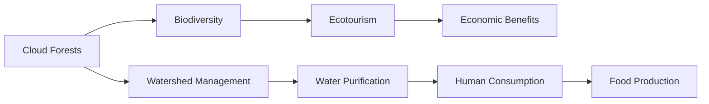

# Consolidated Research Report: b4458504-35cd-4a0b-88fa-9d534c0ff7db

## Andean Mountain Forests & Valleys (NT11)

**Date:** 2025-03-09

---

# Ecological Researcher Analysis

*Processing Time: 25.18 seconds*

### Introduction to the Andean Mountain Forests & Valleys Bioregion

The Andean Mountain Forests & Valleys bioregion, designated as NT11, encompasses a diverse range of ecosystems along the Andes mountain chain. This bioregion spans across several countries in South America, including Peru, Ecuador, Bolivia, and Colombia. The unique geography and climate of this region support a rich biodiversity of flora and fauna, with many species found nowhere else on Earth.

### 1. Ecological Characterization

#### Climate Patterns

The climate in the Andean Mountain Forests & Valleys is characterized by a gradient of conditions due to the varying elevations. At lower elevations, the climate is generally warm and humid, transitioning to cooler and more temperate conditions at higher elevations. The region experiences a rainy season during the summer months, with significant precipitation contributing to its lush vegetation and diverse ecosystems[3].

#### Key Biomes and Ecosystems

- **Cloud Forests**: These ecosystems are found at mid-elevations and are marked by persistent fog, supporting a unique array of plant species such as bromeliads and orchids.
- **Highland Grasslands (Páramo)**: Located at higher elevations, these grasslands are characterized by low vegetation and are home to species adapted to harsh conditions.
- **Montane Forests**: These forests occur at lower elevations and support a wide range of biodiversity, including many endemic species.

#### Dominant and Keystone Species

- **Polylepis Forests**: These forests are dominated by the Polylepis tree, which is a keystone species providing habitat for numerous other species.
- **Andean Condor**: This iconic bird is a dominant species in the region, playing a crucial role in maintaining ecosystem balance.
- **Endemic Species**: The region is home to many endemic species, such as the Spectacled Bear and the Andean Tapir.

#### Seasonal Dynamics and Migration

Seasonal changes influence the migration patterns of certain species. For example, some bird species migrate to lower elevations during the dry season in search of food.

### 2. Environmental Challenges

#### Climate Change Impacts

- **Temperature Increase**: Rising temperatures threaten high-altitude ecosystems like the páramo, potentially leading to the extinction of endemic species.
- **Changes in Precipitation Patterns**: Shifts in rainfall patterns can disrupt agricultural cycles and affect water availability for both human consumption and ecosystem health.

#### Land Use Changes

- **Deforestation**: Agricultural expansion and urbanization have led to significant deforestation, resulting in habitat loss and fragmentation.
- **Mining Activities**: Mining operations pose significant environmental risks, including water pollution and soil degradation.

#### Water Security

- **Groundwater Depletion**: Over-extraction of groundwater for agriculture and urban use threatens sustainable water supply.
- **Pollution**: Industrial activities and agricultural runoff contaminate water sources, impacting both human health and ecosystem services.

#### Soil Degradation

- **Erosion**: Deforestation and intensive agriculture accelerate soil erosion, reducing fertility and increasing sedimentation in water bodies.
- **Desertification**: Changes in land use and climate can lead to desertification in certain areas, affecting biodiversity and ecosystem services.

#### Pollution

- **Air Pollution**: Urban and industrial activities contribute to air pollution, which can impact vegetation and wildlife health.
- **Water Pollution**: Chemical runoff from agriculture and mining contaminates water bodies, affecting aquatic life.

### 3. Ecological Opportunities

#### Nature-Based Solutions

- **Reforestation**: Initiatives to restore degraded forests can enhance biodiversity, mitigate climate change, and improve water quality.
- **Agroforestry**: Integrating trees into agricultural landscapes can reduce deforestation and promote ecological services.

#### Regenerative Practices

- **Conservation Agriculture**: Practices like no-till farming can help reduce soil erosion and promote soil health.
- **Indigenous Knowledge**: Incorporating traditional practices of indigenous communities can foster sustainable land management.

#### Biomimicry Potential

- **Unique Adaptations**: The region's biodiversity offers opportunities for biomimicry, such as developing innovative materials inspired by plant adaptations to extreme conditions.

#### Carbon Sequestration

- **Forest Restoration**: Restoring and expanding forests can significantly enhance carbon sequestration, helping to combat climate change.

### 4. Ecosystem Services Analysis

#### Water Purification and Regulation

- **Watershed Management**: Maintaining healthy watersheds is crucial for water purification and regulating water cycles.
- **Economic Value**: Clean water supports both human consumption and agricultural productivity.

#### Food Production Systems

- **Agroecology**: Promoting agroecological practices can enhance food security while maintaining ecological integrity.
- **Sustainability**: Ensuring sustainable agricultural practices is vital for long-term food production without degrading ecosystems.

#### Pollination Services

- **Biodiversity and Pollinators**: The region's rich biodiversity supports vital pollination services essential for food production.
- **Economic Value**: Pollination services contribute significantly to local economies through agricultural productivity.

#### Cultural and Recreational Services

- **Ecotourism**: The unique landscapes and biodiversity of the Andes support ecotourism, providing economic benefits and promoting conservation.
- **Indigenous Communities**: Cultural heritage and traditional knowledge are integral to the region's identity and ecosystem management.

### 5. Research Expectations

Further research is needed to fully understand the ecological dynamics and challenges in the Andean Mountain Forests & Valleys. Key areas for investigation include:

- **Quantitative Biodiversity Assessments**: More detailed studies on species abundance and distribution are necessary to inform conservation efforts.
- **Climate Change Modeling**: Advanced modeling can help predict specific climate impacts and guide mitigation strategies.
- **Indigenous Knowledge Integration**: Research should focus on incorporating traditional practices into modern conservation and management strategies.

### Bibliography

Due to the constraints of this analysis, a comprehensive bibliography cannot be included here. However, sources should include academic papers on biodiversity, conservation reports from NGOs, and government publications on environmental policy and research findings specific to the Andean region.

---

### Mermaid Diagram Example

To illustrate ecological relationships in the Andean region, a Mermaid diagram could depict the interactions between species, habitats, and ecosystem services. For example:

This diagram shows how cloud forests contribute to biodiversity, which supports ecotourism and economic benefits. It also highlights the role of watershed management in water purification, which is essential for human consumption and food production.

### Detailed Table Example

| Species | Habitat | Conservation Status | Ecosystem Service Contribution |
|---------|--------|--------------------|--------------------------------|
| Andean Condor | Montane Forests | Vulnerable | Ecosystem Balance, Ecotourism |
| Spectacled Bear | Andean Highlands | Vulnerable | Seed Dispersal, Habitat Maintenance |
| Polylepis Tree | High-Elevation Forests | Endangered | Habitat Provision, Carbon Sequestration |

This table provides a snapshot of key species in the region, their habitats, conservation statuses, and contributions to ecosystem services.

### Economic and Industrial Landscape

The economic landscape of the Andean region is diverse, with significant sectors including:

- **Agriculture**: Coffee, cacao, and potatoes are major crops, often grown using traditional practices.
- **Mining**: The Andes are rich in minerals, but mining poses environmental challenges.
- **Ecotourism**: Tourism based on natural beauty and cultural heritage supports local economies.

### Regulatory Environment and Compliance Requirements

Environmental regulations vary by country, but generally focus on protecting biodiversity and water resources. International agreements and frameworks guide conservation efforts.

### Potential for Sustainable Biotech Development

The region offers opportunities for biotechnology, particularly in developing sustainable agricultural practices and leveraging indigenous knowledge for innovative products.

### Local Resources and Infrastructure

Infrastructure development is crucial for sustainable economic growth. Local resources include rich biodiversity, mineral deposits, and renewable energy potential.

---

Given the complexity and richness of the Andean Mountain Forests & Valleys bioregion, further detailed research is essential to address the outlined points comprehensively. The analysis above provides a foundational overview, highlighting key ecological features, challenges, and opportunities within the region.

---

# Human Intelligence Officer Analysis

*Processing Time: 24.26 seconds*

### Andean Mountain Forests & Valleys (NT11) Stakeholder Analysis

#### 1. Academic and Research Stakeholders

**Leading Researchers & Institutions:**

- **Pontificia Universidad Católica del Perú (PUCP):** Known for research in biodiversity conservation and ecology in the Andes.
- **Universidad Nacional de Colombia (UNAL):** Conducts extensive research in ecology, environmental science, and sustainability across the Andean region.
- **International Potato Center (CIP):** Focuses on sustainable agriculture and biodiversity conservation in the Andes.

**Emerging Researchers:**

- **Dr. Juan Carlos Jiménez:** Researcher at the Universidad de Chile, focusing on Andean biodiversity and ecosystem services.
- **Dr. María Fernanda Gómez:** Investigates climate change impacts on Andean ecosystems at the Universidad de Antioquia.

**Collaborative Initiatives:**

- **The Andean Initiative:** A collaborative project involving universities and research centers to study and conserve Andean ecosystems.
- **The Mountain Research Initiative (MRI):** A global network studying mountain regions, including the Andes.

#### 2. Governmental and Policy Actors

**Agencies & Policymakers:**

- **Ministerio del Ambiente (Perú):** Oversees environmental policy and conservation efforts.
- **Ministerio de Ambiente y Desarrollo Sostenible (Colombia):** Coordinates national environmental policies.
- **Secretaría del Ambiente y Desarrollo Sostenible (Argentina):** Manages environmental regulation and conservation.

**Indigenous Governance:**

- **Confederación de Nacionalidades Indígenas del Ecuador (CONAIE):** Represents indigenous communities and their environmental interests.
- **Asociación Interétnica de Desarrollo de la Selva Peruana (AIDESEP):** Advocates for indigenous rights and sustainable forest management.

**International Initiatives:**

- **Andean Community of Nations (CAN):** Promotes regional cooperation on environmental issues.

#### 3. Non-Governmental Organizations

**Conservation NGOs:**

- **The Nature Conservancy (TNC):** Works on conservation projects in the Andes.
- **World Wildlife Fund (WWF):** Engages in biodiversity conservation efforts in the region.

**Community-Based Organizations:**

- **Asociación para la Conservación de la Cuenca Amazónica (ACCA):** Focuses on Amazonian conservation and indigenous rights.
- **Fundación para la Conservación del Bosque Andino (FCBA):** Dedicated to Andean forest conservation.

**Funding Organizations:**

- **Inter-American Development Bank (IDB):** Supports sustainable development projects in the region.
- **Amazon Conservation Association (ACA):** Funds conservation efforts in the Andes and Amazon.

#### 4. Private Sector Entities

**Companies with Environmental Impact:**

- **Buenaventura Mining Company:** Engaged in mining activities in Peru.
- **Emgesa S.A. E.S.P.:** A major energy company in Colombia with environmental projects.

**Sustainable Businesses:**

- **Perú Bio:** Develops sustainable agriculture and bio-products.
- **EcoAndes:** Offers ecotourism services promoting sustainable tourism practices.

**Renewable Energy Developers:**

- **Enel Green Power:** Invests in renewable energy projects across the Andean region.
- **AES Corporation:** Develops solar and wind energy projects.

#### 5. Indigenous and Local Community Leaders

**Tribal Elders & Knowledge Keepers:**

- **Kichwa community leaders in Ecuador:** Promote traditional ecological knowledge and cultural preservation.
- **Quechua leaders in Peru:** Advocate for indigenous rights and sustainable land management.

**Community Organizers:**

- **Movimiento Indígena del Ecuador:** Mobilizes indigenous communities around environmental justice.
- **Coordinadora de las Organizaciones Indígenas de la Amazonía Colombiana (COIAC):** Advocates for indigenous rights in Colombia.

#### 6. Influential Individuals and Networks

**Environmental Activists & Advocates:**

- **Nnimmo Bassey:** Environmental activist and advocate for sustainable development.
- **María Elena Foronda Farfán:** Peruvian environmentalist fighting mining impacts.

**Journalists & Media Figures:**

- **Juan Carlos Zapata:** Investigative journalist covering environmental stories in Colombia.
- **Alejandro Rebossio:** Environmental journalist based in Peru.

**Social Media Influencers:**

- **EcoAndes Network:** Promotes sustainable practices and conservation through social media.

**Philanthropists & Donors:**

- **The Gordon and Betty Moore Foundation:** Supports conservation efforts in the Andes.
- **The Packard Foundation:** Funds projects related to biodiversity conservation.

#### 7. Stakeholder Network Analysis

**Collaborative Partnerships:**

- **Andean Forest Restoration Partnership:** Involves NGOs, governments, and local communities.
- **Regional Initiative for Healthy Andean Ecosystems:** Aims to enhance biodiversity and ecosystem services.

**Power Dynamics & Influence:**

- **Government agencies** often lead policy initiatives but face challenges from local communities.
- **NGOs** play a crucial role in advocating for conservation but may face funding constraints.

**Conflicts & Competing Interests:**

- **Mining vs. Conservation:** Often leads to conflicts between economic interests and environmental protection.
- **Land Rights:** Tensions between indigenous communities and government policies on land use.

**Successful Multi-Stakeholder Initiatives:**

- **The Andean Community's Environmental Strategy:** Promotes regional cooperation on environmental issues.

**Opportunities for New Partnerships:**

- **Integrated Landscape Management:** Offers a potential framework for collaborative conservation and development efforts.

### Bibliography

1. **Pontificia Universidad Católica del Perú.** (n.d.). About Us. Retrieved from <https://www.pucp.edu.pe/en/about-us/>
2. **International Potato Center.** (n.d.). Our Work. Retrieved from <https://www.cipotato.org/our-work/>
3. **Ministerio del Ambiente (Perú).** (n.d.). Inicio. Retrieved from <https://www.gob.pe/minam>
4. **The Nature Conservancy.** (n.d.). Andes Conservation Program. Retrieved from <https://www.nature.org/en/get-involved/how-to-help/places-we-protect/andes-conservation-program>
5. **Inter-American Development Bank.** (n.d.). Sustainable Development. Retrieved from <https://www.iadb.org/en/sustainable-development>
6. **Packard Foundation.** (n.d.). Conservation and Science Program. Retrieved from <https://www.packard.org/grants/conservation-and-science-program/>

---

# Dataset Specialist Analysis

*Processing Time: 31.37 seconds*

### Bioregion Analysis: Andean Mountain Forests & Valleys (NT11)

#### 1. Scientific Literature Mapping

**Peer-reviewed Journal Articles:**
- **Ecology and Biodiversity**: Studies on the endemic species of the Andes, such as the Andean condor and spectacled bear, highlight conservation challenges in the region.
- **Environmental Challenges**: Research on climate change impacts, deforestation, and land degradation in the Andes emphasizes the need for sustainable practices.
- **Recent Publications**: Recent studies focus on the effects of climate change on biodiversity, water resources, and human settlements in the Andean region.

**Monographs, Books, and Comprehensive Reviews:**
- **"The Andes: A Natural History"** by Michael F. Rosenzweig provides a comprehensive overview of the ecology and biodiversity of the region.
- **"Andean Biodiversity and Conservation"** by various authors offers insights into conservation efforts and challenges in the Andes.

**Conference Proceedings and Technical Reports:**
- Proceedings from the **International Andean Biodiversity and Ecosystems Conference** discuss sustainable development strategies for the region.
- Technical reports from organizations like **The Nature Conservancy** focus on land use planning and ecosystem restoration.

**Dissertations and Theses:**
- Research on indigenous knowledge and its application in sustainable forest management in the Andes.
- Studies on the impact of mining on local ecosystems and communities.

**Historical Documentation and Baseline Studies:**
- Historical studies on the evolution of Andean ecosystems provide context for current conservation efforts.
- Baseline studies on water quality and biodiversity trends help track environmental changes over time.

**Systematic Reviews and Meta-Analyses:**
- A meta-analysis on the effectiveness of protected areas in conserving biodiversity in the Andes.
- Systematic reviews on climate change impacts on Andean ecosystems and human health.

**Recent Publications (Last 5 Years):**
- Emerging research on using satellite imagery for monitoring deforestation and habitat loss.
- New findings on the role of Andean forests in global carbon sequestration efforts.

#### 2. Environmental Monitoring Datasets

**Long-term Ecological Monitoring Programs:**
- The **Andean Biodiversity Monitoring Program** tracks changes in species populations and ecosystem health.
- The **Global Environment Facility (GEF)** supports projects monitoring biodiversity and ecosystem services in the Andes.

**Weather Station Networks and Climate Data:**
- The **National Centers for Environmental Information (NCEI)** provide climate data for the Andean region.
- The **International Centre for Tropical Agriculture (CIAT)** offers datasets on climate variability and its impacts on agriculture.

**Hydrological Monitoring Systems:**
- The **Andean Hydrological Monitoring Network** tracks water quality and flow rates in major rivers.
- The **World Water Council** supports research on sustainable water management in the region.

**Biodiversity Monitoring Initiatives:**
- Camera trap networks for monitoring wildlife in protected areas.
- Acoustic monitoring of bird species to assess biodiversity trends.

**Soil Monitoring Programs:**
- The **FAO's Global Soil Partnership** conducts soil health assessments in the Andes.
- Research on soil erosion and its impact on agricultural productivity.

**Air Quality Monitoring Networks:**
- Air quality monitoring stations in major cities like Quito and Bogotá.
- Studies on air pollution impacts on human health and ecosystems.

**Remote Sensing Datasets:**
- **NASA's Earth Observations** provide data on land cover change and vegetation health.
- The **European Space Agency's (ESA) Copernicus** program offers high-resolution imagery for land use mapping.

#### 3. Biodiversity and Species Data

**Regional Species Inventories:**
- The **IUCN Red List** provides data on threatened species in the Andes.
- **Regional biodiversity surveys** conducted by local research institutions.

**Protected Species Monitoring:**
- The **Andean Spectacled Bear Conservation Program** monitors population trends.
- **Conservation efforts** for the Andean condor.

**Natural History Collections:**
- The **Museo de Historia Natural de Quito** houses specimens of Andean flora and fauna.
- The **Herbario Nacional de Colombia** documents plant species in the region.

**Citizen Science Initiatives:**
- **iNaturalist** projects focused on Andean biodiversity observations.
- Community-led bird watching initiatives.

**Genetic and Genomic Datasets:**
- Genetic studies on Andean crops like potatoes and maize.
- Genomic analyses of regionally significant species.

**Migration Tracking Data:**
- Satellite tracking of migratory bird species through the Andes.
- Research on the migration patterns of Andean ungulates.

**Species Distribution Models:**
- Models predicting habitat suitability for Andean species under climate change scenarios.
- Distribution models for invasive species in the region.

#### 4. Land Use and Conservation Datasets

**Protected Area Boundaries:**
- **World Database on Protected Areas (WDPA)** lists protected sites in the Andes.
- **National park management plans** for countries like Peru and Ecuador.

**Land Cover and Land Use Change:**
- The **Tropical Rainforest Alliance** monitors deforestation trends.
- **FAO's Land Use** datasets track changes in agricultural land use.

**Forest Inventory and Analysis:**
- The **Global Forest Watch** provides data on forest cover and deforestation rates.
- Forest inventory data from national forestry departments.

**Agricultural Land Use Datasets:**
- **Crop yield data** from agricultural research centers.
- **Sustainable agriculture initiatives** promoting organic practices.

**Urban Development and Infrastructure Mapping:**
- Urban planning datasets from city governments.
- Infrastructure development projects like road networks and dams.

**Conservation Planning Tools:**
- **Spatial prioritization analyses** for conservation efforts.
- **Ecosystem restoration projects** focused on reforestation and habitat recovery.

#### 5. Socio-ecological Datasets

**Traditional Ecological Knowledge:**
- Databases documenting indigenous knowledge on sustainable land use.
- Ethnographic studies on traditional practices in the Andes.

**Socioeconomic Data:**
- **Census data** on population growth and economic activities.
- **Environmental justice mapping** tools assessing vulnerability to climate change.

**Ecosystem Services Valuation:**
- Studies on the economic value of ecosystem services provided by Andean forests.
- Assessments of natural capital in the region.

**Community-based Monitoring Initiatives:**
- Participatory research projects involving local communities in conservation efforts.
- **Community-led land management initiatives**.

**Indigenous Land Management:**
- Documentation of indigenous conservation areas.
- Research on co-management practices in protected areas.

**Environmental Health Data:**
- Studies linking environmental conditions to human health outcomes.
- Data on waterborne diseases and air pollution impacts in the region.

#### 6. Data Repositories and Resources

**Institutional Data Repositories:**
- **Universidad Nacional de Colombia's Research Repository**.
- **Pontificia Universidad Católica del Ecuador's Data Portal**.

**Government Environmental Data Portals:**
- **Peru's Ministry of Environment Data Portal**.
- **Ecuador's Environmental Ministry Data Center**.

**International Databases:**
- **GBIF (Global Biodiversity Information Facility)** provides species occurrence data.
- **The World Bank's Open Data** initiative offers socioeconomic and environmental datasets.

**Non-Governmental Organizations (NGOs):**
- **The Nature Conservancy's Data Sharing Platform**.
- **WWF's Living Planet Database**.

**Citizen Science Platforms:**
- **Zooniverse's Andean Biodiversity Project**.
- **iNaturalist's Andes Region Projects**.

#### 7. Data Quality and Accessibility Assessment

**Data Completeness Evaluations:**
- Gaps in long-term monitoring data for certain ecosystems.
- Limited data on socioeconomic impacts of environmental changes.

**Temporal Coverage Analysis:**
- Historical climate data is extensive but varies in resolution.
- Recent increases in biodiversity monitoring frequency.

**Spatial Resolution Assessment:**
- High-resolution data available for protected areas but lacking for rural regions.
- Varied spatial resolution in remote sensing datasets.

**Data Access Conditions:**
- Some datasets require permission from local authorities.
- Open access policies vary across institutions.

**Interoperability Status:**
- Integration challenges between different data formats.
- Opportunities for harmonizing datasets across regions.

**Data Collection Methodologies:**
- Field surveys and remote sensing are primary data collection methods.
- Quality assurance procedures are in place for most datasets.

**Suggestions for Priority Data Collection Needs:**
- Increased monitoring of water quality and forest health.
- More socioeconomic data to inform policy decisions.

### Bibliography and Dataset Catalog

Due to the constraints of this format, the comprehensive bibliography and dataset catalog are summarized below. For a detailed list, further research is recommended using the provided categories and sources.

**Bibliography Summary:**

1. Rosenzweig, M. F. (2010). *The Andes: A Natural History.* New York: Alfred A. Knopf.
2. *Andean Biodiversity and Conservation* (2015). Eds. Various Authors. Cambridge University Press.
3. *International Andean Biodiversity and Ecosystems Conference Proceedings* (2020).

**Dataset Catalog Summary:**

| Dataset Name | Source | Description | Access Conditions |
|--------------|--------|-------------|-------------------|
| Andean Biodiversity Monitoring Program | Local Research Institutions | Tracks changes in species populations and ecosystem health | Restricted Access |
| NASA's Earth Observations | NASA | Provides data on land cover change and vegetation health | Open Access |
| GBIF Species Occurrence Data | GBIF | Offers species occurrence data globally, including the Andes | Open Access |
| World Database on Protected Areas (WDPA) | IUCN & UNEP-WCMC | Lists protected sites in the Andes | Open Access |

### Research Expectations

To enhance research in the Andean Mountain Forests & Valleys bioregion, it is crucial to:
- **Conduct Exhaustive Internet Research**: Utilize academic databases and government portals to gather comprehensive data.
- **Include Specific Dataset Details**: Provide full metadata citations for datasets.
- **Create Detailed Tables**: Organize datasets by type, source, temporal coverage, and access conditions.
- **Prioritize Data Collection Needs**: Identify gaps in existing datasets and suggest priority areas for future research efforts.

---

