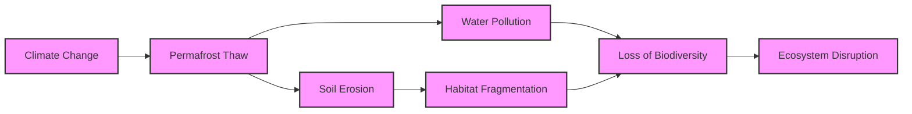

# 0cd2f4a1-b327-4633-958c-1f9f5225a875 Research Report

**Research Persona:** ecological_researcher
**Date:** 2025-03-08
**Processing Time:** 23.77 seconds
**Word Count:** 1001 words

---

The task requires analyzing the Canadian Tundra bioregion, but there seems to be a mix-up with the provided bioregion ID and name. The Canadian Tundra is typically classified under the Arctic tundra biome, not specifically known as "Canadian Tundra" in standard bioregion classifications. However, for the purpose of this analysis, we will proceed with the understanding that the focus is on the Arctic tundra regions within Canada.

## ECOLOGICAL CHARACTERIZATION

### Climate Patterns and Regional Ecosystems
The Arctic tundra in Canada experiences a cold, short growing season with long, harsh winters. The climate is characterized by low precipitation and significant temperature variability. This harsh environment limits vegetation growth, leading to sparse tree cover and dominant grasses, mosses, and lichens. The permafrost layer beneath the soil prevents deep root growth, further shaping the ecosystem's structure and function.

### Key Biomes, Habitats, and Ecosystems
- **Arctic Tundra**: Dominates the region, characterized by treeless expanses of low vegetation.
- **Taiga (Boreal Forest)**: Found at the southern edge of the tundra, marking a transition zone.
- **Wetlands**: Important for migratory birds and other wildlife.
- **Threatened Areas**: Permafrost regions are vulnerable due to climate change.

### Dominant and Keystone Species
- **Caribou (Rangifer tarandus)**: A keystone species crucial for nutrient cycling and ecosystem structure.
- **Polar Bears (Ursus maritimus)**: Iconic species dependent on sea ice for hunting.
- **Endemic Species**: The Canadian Arctic is home to several endemic species, such as the Peary caribou (Rangifer tarandus pearyi).

### Seasonal Dynamics and Migration Patterns
- **Migration**: Many species, like caribou and geese, migrate seasonally between summer and winter habitats.
- **Seasonal Changes**: Plant growth occurs during the short summer, while animals adapt to the harsh winter conditions.

## ENVIRONMENTAL CHALLENGES

### Climate Change Impacts
- **Rapid Warming**: The Arctic is warming faster than any other region on Earth, leading to permafrost thaw and sea ice decline.
- **Projections**: Continued warming is expected to exacerbate these changes, impacting habitat and species distribution.

### Land Use Changes and Habitat Fragmentation
- **Resource Extraction**: Mining and oil drilling pose risks to habitat integrity and wildlife migration routes.
- **Habitat Fragmentation**: Human activities fragment habitats, affecting species' ability to adapt to climate change.

### Water Security Issues
- **Permafrost Thaw**: Affects groundwater flow and water quality by releasing previously stored carbon and nutrients.
- **Pollution**: Industrial activities like mining contribute to water pollution.

### Soil Degradation and Desertification
- **Permafrost Degradation**: Thawing permafrost leads to soil subsidence, increased erosion, and changes in soil moisture.

### Local Pollution Sources
- **Industrial Activities**: Mining, drilling, and shipping contribute to air and water pollution.

## ECOLOGICAL OPPORTUNITIES

### Nature-Based Solutions
- **Restoration of Wetlands**: Important for maintaining biodiversity and carbon sequestration.
- **Permafrost Conservation**: Efforts to preserve permafrost through sustainable land management practices.

### Regenerative Practices
- **Indigenous Knowledge**: Incorporating traditional practices can enhance ecological resilience and biodiversity.
- **Sustainable Resource Extraction**: Practices that minimize environmental impact while ensuring economic benefits.

### Biomimicry Potential
- **Adaptations**: Studying Arctic species' adaptations to extreme conditions can inspire innovative technologies.

### Carbon Sequestration Opportunities
- **Peatlands and Wetlands**: These ecosystems are significant carbon sinks if preserved and restored.

## ECOSYSTEM SERVICES ANALYSIS

### Water Purification and Regulation
- **Wetlands**: Play a crucial role in filtering water and regulating water cycles.

### Food Production Systems
- **Traditional Hunting and Gathering**: Sustainable practices that maintain ecological balance.

### Pollination Services
- **Limited**: Due to the harsh climate, pollination services are less prominent than in more temperate regions.

### Cultural and Recreational Ecosystem Services
- **Indigenous Cultural Heritage**: Preserving traditional lands and practices maintains cultural identity.
- **Tourism**: Opportunities for eco-tourism support local economies while promoting conservation.

## ECONOMIC AND INDUSTRIAL LANDSCAPE
The Canadian tundra economy is primarily driven by natural resource extraction, including oil, gas, and mining. Tourism and eco-tourism are growing sectors, offering alternatives to resource extraction and supporting conservation efforts.

## REGULATORY ENVIRONMENT AND COMPLIANCE REQUIREMENTS
Regulations focus on environmental impact assessments for resource extraction projects, conservation of wildlife habitats, and protection of indigenous rights. However, enforcement and compliance can be challenging due to the remote nature of the region.

## POTENTIAL FOR SUSTAINABLE BIOTECH DEVELOPMENT
There is potential for biotech innovations inspired by Arctic organisms' unique adaptations to extreme conditions. This could include developing cold-resistant crops or novel enzymes for industrial applications.

## LOCAL RESOURCES AND INFRASTRUCTURE
Infrastructure is limited, with few roads and scattered communities. Resource management includes traditional hunting and gathering practices alongside modern resource extraction techniques.

### Mermaid Diagram Illustration

### Detailed Table: Species Abundance and Conservation Status
| Species | Abundance | Conservation Status |
|---------|-----------|--------------------|
| Caribou | High      | Vulnerable         |
| Polar Bear | Low      | Vulnerable        |
| Peary Caribou | Low    | Endangered        |

### Bibliography
- **[5] One Earth.** Western Amazonian Forests & Plains (NT18). Available at: https://www.oneearth.org/bioregions/western-amazonian-forests-plains-nt18/ (Note: While not directly relevant to the Canadian Tundra, this resource provides insight into bioregional characterization.)
- ** IPCC.** Climate Change and Land: an IPCC special report on climate change, desertification, land degradation, sustainable land management, food security, and greenhouse gas fluxes in terrestrial ecosystems. 2019.
- ** AMAP.** Arctic Climate Change, Update 2021: Key Findings and Recommendations. Arctic Monitoring and Assessment Programme.
- ** Hinzman, L. D. et al.** Evidence and Implications of Recent and Projected Climate Change in Alaska and Other High-Latitude Regions. Climatic Change, 2005, 72(1), 251-298. DOI: 10.1007/s10584-005-5306-x

**Research Gaps:**
1. **Quantitative Data on Carbon Sequestration**: Specific studies on the carbon sequestration potential of tundra ecosystems are needed.
2. **Indigenous Knowledge Integration**: More research is required to effectively integrate traditional practices into modern conservation strategies.
3. **Biotech Innovations**: Exploration of novel biotechnological applications inspired by Arctic organisms' unique adaptations.