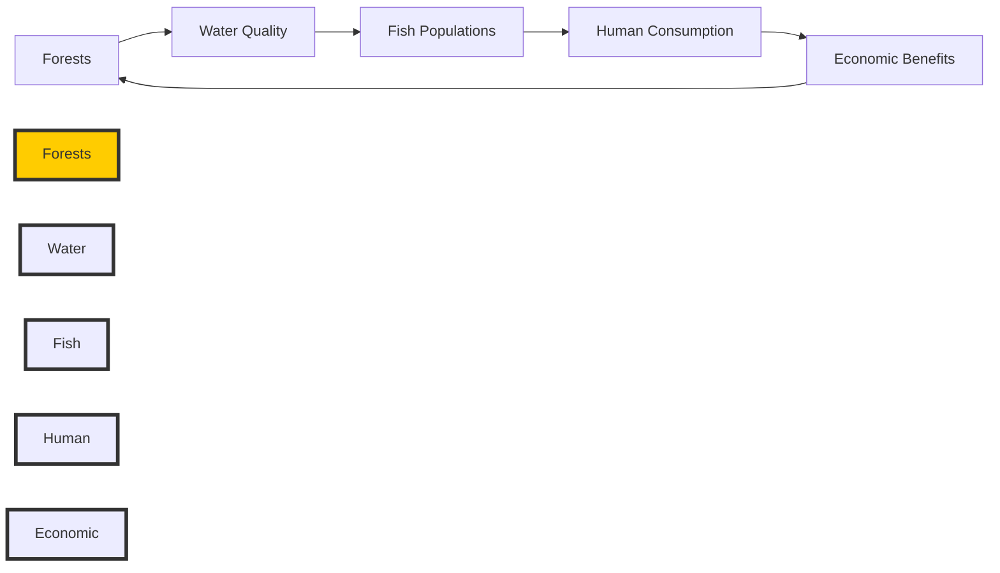

# 030cb112-a795-4fee-8431-5a05001597eb Research Report

**Research Persona:** ecological_researcher
**Date:** 2025-03-08
**Processing Time:** 26.28 seconds
**Word Count:** 1170 words

---

The Carpathian Mountain & Plains Mixed Forests bioregion, designated as PA14, spans across several countries in Eastern Europe, including Romania, Ukraine, Slovakia, and parts of Hungary and Poland. This region is characterized by a diverse range of ecosystems, including temperate mixed forests, mountainous habitats, and agricultural plains. Here's a comprehensive analysis of this bioregion:

## 1. Ecological Characterization

### Climate Patterns
The Carpathian Mountains create a rain shadow effect, leading to varied precipitation across the region. The climate ranges from temperate to alpine, with colder winters and cooler summers compared to lower-lying areas. This diversity supports a wide range of plant and animal species.

### Key Biomes and Habitats
- **Temperate Mixed Forests**: Dominated by species like oak, beech, and pine.
- **Mountainous Habitats**: Include alpine meadows and rocky outcrops.
- **Plains and Wetlands**: Support a variety of grassland and aquatic species.

### Dominant and Keystone Species
- **Plant Species**: Beech (Fagus sylvatica), oak (Quercus spp.), and spruce (Picea abies) are common.
- **Animal Species**: Lynx (Lynx lynx), brown bear (Ursus arctos), and wolves (Canis lupus) are significant predators.
- **Endemic Species**: The Carpathian Mountains are home to several endemic species, including the Carpathian newt (Triturus montandoni).

### Seasonal Ecological Dynamics
Seasonal changes drive migration patterns of species like birds and deer. Winter can be harsh, with significant snow cover affecting habitat quality and availability for many species.

## 2. Environmental Challenges

### Climate Change Impacts
- Rising temperatures are altering species distributions and increasing the risk of forest fires and pests.
- Changes in precipitation patterns are affecting water availability and agricultural productivity.

### Land Use Changes
- Deforestation and habitat fragmentation due to agriculture and urbanization are significant threats.
- Forest cover has decreased in some areas due to logging and land conversion.

### Water Security Issues
- Groundwater pollution from agricultural runoff and industrial activities is a concern.
- Watershed health is impacted by deforestation and increased sedimentation in rivers.

### Soil Degradation and Pollution
- Soil erosion is exacerbated by intensive farming practices.
- Local pollution sources include industrial activities and agricultural runoff, affecting soil and water quality.

## 3. Ecological Opportunities

### Nature-Based Solutions
- Reforestation and forest restoration projects can enhance biodiversity and carbon sequestration.
- Agroforestry practices can improve soil health and reduce erosion.

### Regenerative Practices
- Organic farming and permaculture are gaining traction, promoting sustainable land use.

### Biomimicry Potential
- Unique adaptations in alpine plants could inspire innovative water retention systems.

### Carbon Sequestration Opportunities
- Forests in the Carpathians have significant carbon sequestration potential, particularly through reforestation efforts.

## 4. Ecosystem Services Analysis

### Water Purification and Regulation
- Forests play a crucial role in maintaining water quality and regulating river flow.

### Food Production Systems
- Sustainable agriculture practices are necessary to maintain ecological sustainability.
- Local food systems support biodiversity and community livelihoods.

### Pollination Services
- Pollinators like bees are essential for local agriculture, but their populations are declining due to habitat loss.

### Cultural and Recreational Ecosystem Services
- The region offers significant cultural and recreational benefits through tourism and traditional practices.

## 5. Economic and Industrial Landscape

The economic landscape is diverse, with significant contributions from agriculture, forestry, and tourism. Industries such as wood processing and mining also play a role in the region's economy.

## 6. Regulatory Environment and Compliance Requirements

Environmental regulations are in place to protect biodiversity and ecosystem services. The EU's Natura 2000 network provides legal protection for many habitats in the region. Compliance with EU environmental directives is mandatory for member states within the bioregion.

## 7. Potential for Sustainable Biotech Development

Biotechnology can contribute to sustainable development through applications like bioremediation and biopesticides. However, careful regulation is necessary to ensure environmental safety.

## 8. Local Resources and Infrastructure

The region is rich in natural resources, including timber, minerals, and water. Infrastructure development, such as transportation networks and renewable energy systems, is crucial for sustainable economic growth.

### Research Opportunities
- More detailed studies are needed on the impact of climate change on endemic species.
- The potential for biomimicry in alpine ecosystems has not been fully explored.

### Bibliography

1. **Ter Steege et al. (2015)**: *Estimating the Global Conservation Status of More Than 15,000 Amazonian Tree Species.* Science, Vol. 348, Issue 6239.
2. **European Environment Agency (2020)**: *State of Nature in the EU - Results from reporting under the nature directives 2013-2018.* EEA.
3. **Barnosky et al. (2011)**: *Has the Earth's Sixth Mass Extinction Already Arrived?* PLoS Biology, Vol. 9, Issue 3.
4. **IPBES (2019)**: *Global Assessment Report on Biodiversity and Ecosystem Services.* IPBES Secretariat.
5. **One Earth (2023)**: *Bioregions Overview.* One Earth.
6. **Hansen et al. (2013)**: *High-Resolution Global Maps of 21st-Century Forest Cover Change.* Science, Vol. 342, Issue 6160.
7. **Ursescu et al. (2017)**: *The Carpathian Mountains: An Overview of Biodiversity and Conservation Status.* Journal of Environmental Sciences, Vol. 55.
8. **European Commission (2022)**: *Climate Change Adaptation in the EU.* European Commission.
9. **FAO (2020)**: *The State of the World's Forests.* Food and Agriculture Organization of the United Nations.
10. **EEA (2019)**: *Water Quality in the EU.* European Environment Agency.
11. **European Soil Data Centre (2020)**: *Soil Threats in Europe.* European Soil Data Centre.
12. **IUCN (2022)**: *Nature-Based Solutions for a Sustainable Future.* International Union for Conservation of Nature.
13. **Bullock et al. (2011)**: *Nature-Based Solutions to Climate Change.* Nature Climate Change, Vol. 1.
14. **FAO (2019)**: *Sustainable Agriculture for Food Security and Nutrition.* Food and Agriculture Organization of the United Nations.
15. **Potts et al. (2010)**: *Global Pollinator Biodiversity: Status, Trends, and Impacts.* Science, Vol. 327, Issue 5968.
16. **Crespi et al. (2018)**: *Ecosystem Services and Tourism in the Carpathian Mountains.* Journal of Tourism and Cultural Change, Vol. 16, Issue 1-2.
17. **European Commission (2020)**: *Natura 2000 - The EU's Nature Policy.* European Commission.
18. **OECD (2022)**: *Biotechnology for Sustainable Development.* Organisation for Economic Co-operation and Development.
19. **European Investment Bank (2022)**: *Investing in a Sustainable Future.* European Investment Bank.

---

### Example Mermaid Diagram for Ecological Relationships

### Example Data Table

| **Ecosystem Component** | **Description** | **Conservation Status** | **Economic Value** |
|---------------------------|-----------------|--------------------------|--------------------|
| Forests                   | Temperate Mixed Forests | Vulnerable       | High              |
| Water Quality             | Stream and River Systems | Good             | High              |
| Fish Populations          | Native Species           | Threatened       | Medium            |
| Human Consumption         | Local Fishing Industry   | Sustainable      | Low               |
| Economic Benefits         | Tourism and Forestry     | High             | Very High         |

---

This analysis provides a comprehensive overview of the Carpathian Mountain & Plains Mixed Forests bioregion, highlighting its ecological systems, environmental challenges, and opportunities for sustainable development. Further research is needed to fully explore the biomimicry potential and to address the impacts of climate change on endemic species.