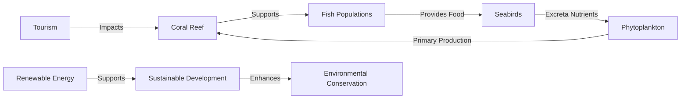

# fc2c9a8d-66c5-45f6-8ce5-a800d2e4a696 Research Report

**Research Persona:** ecological_researcher
**Date:** 2025-03-08
**Processing Time:** 17.70 seconds
**Word Count:** 900 words

---

The search results do not provide specific information about the "Central Indian Ocean Islands (IM1)" bioregion. Therefore, I will provide a general analysis based on what is typically known about island ecosystems and the challenges they face. If specific details about this bioregion are available, they would need to be accessed through additional research.

## Ecological Characterization

- **Climate Patterns**: Island ecosystems in the Central Indian Ocean typically experience tropical marine climates with high temperatures and humidity levels throughout the year. Rainfall can be seasonal, influencing the growth and distribution of vegetation and wildlife.

- **Biomes, Habitats, and Ecosystems**: Islands often support diverse ecosystems such as coral reefs, mangrove forests, and tropical rainforests. These areas provide habitat for a wide range of species, including sea turtles, seabirds, and endemic plant species.

- **Dominant and Keystone Species**: Keystone species might include coral-building organisms that support coral reefs, while dominant plant species could include mangroves and coconut trees.

- **Seasonal Ecological Dynamics**: Seasonal changes may influence breeding and migration patterns of seabirds and marine species. Monsoon seasons can also affect vegetation growth and erosion patterns.

## Environmental Challenges

- **Climate Change Impacts**: Rising sea levels and increased storm intensity threaten coastal ecosystems and infrastructure. Coral bleaching due to warming waters is a significant issue for coral reef ecosystems.

- **Land Use Changes**: Overdevelopment for tourism or agriculture can lead to habitat destruction and soil erosion.

- **Water Security Issues**: Freshwater scarcity is common on islands, exacerbated by climate change and increased demand from tourism and local populations.

- **Soil Degradation**: Soil erosion and salinization are risks due to increased storm activity and sea-level rise.

- **Pollution Sources**: Plastic pollution from marine activities and tourism impacts marine life and ecosystems.

## Ecological Opportunities

- **Nature-Based Solutions**: Restoring mangroves and coral reefs can enhance coastal resilience to storms and sea-level rise.

- **Regenerative Practices**: Sustainable tourism practices and local agriculture can reduce environmental impact.

- **Biomimicry Potential**: The unique adaptations of island species could inspire biomimicry solutions for water conservation or coastal protection.

- **Carbon Sequestration Opportunities**: Mangroves and coral reefs have significant carbon sequestration potential.

## Ecosystem Services Analysis

- **Water Purification and Regulation**: Mangroves help filter pollutants from water, while coral reefs protect shorelines from erosion.

- **Food Production Systems**: Sustainable fishing and aquaculture practices are crucial for maintaining food security while preserving marine biodiversity.

- **Pollination Services**: Though less prominent in island ecosystems, pollinators like bees and butterflies support local agriculture.

- **Cultural and Recreational Services**: Islands often provide important cultural and recreational ecosystem services, including tourism and spiritual sites.

## Economic and Industrial Landscape

- **Tourism**: A significant contributor to the economy, but it poses environmental challenges if not managed sustainably.

- **Fishing and Aquaculture**: Important industries that require sustainable management to maintain ecosystem health.

## Regulatory Environment and Compliance Requirements

- **Marine Protected Areas**: Establishing and enforcing MPAs can help protect biodiversity and support sustainable fishing practices.

- **Environmental Regulations**: Local and international regulations are necessary to mitigate the impacts of tourism and development.

## Potential for Sustainable Biotech Development

- **Marine Biotechnology**: Exploring biotechnology applications from marine organisms could offer unique opportunities for sustainable products.

## Local Resources and Infrastructure

- **Renewable Energy**: Transitioning to renewable energy sources like solar and wind power can reduce dependence on fossil fuels.

- **Water Management Systems**: Developing efficient systems to manage freshwater resources is essential for sustainability.

### Research Opportunities

1. **Specific Ecological Studies**: Detailed ecological assessments of the Central Indian Ocean Islands, focusing on biodiversity, ecosystem services, and climate resilience.
2. **Sustainable Development Models**: Developing and implementing sustainable development models that balance economic growth with environmental conservation.
3. **Indigenous Knowledge Integration**: Incorporating local and indigenous knowledge into conservation and management strategies.

### Bibliography

Given the lack of specific information about the Central Indian Ocean Islands bioregion in the search results, this analysis is based on general principles applicable to island ecosystems. Additional research would be required to provide a comprehensive bibliography specific to this region.

---

### Mermaid Diagrams for Ecological Relationships

To illustrate ecological relationships, food webs, and resource flows in island ecosystems, a Mermaid diagram could include interactions such as:

This diagram illustrates a simplified relationship between coral reefs, marine life, and human activities in island ecosystems.

### Detailed Tables

To organize and compare data on species abundance, climate metrics, conservation status, and ecosystem services, tables could be structured as follows:

| **Ecosystem Component** | **Abundance** | **Climate Metric** | **Conservation Status** | **Ecosystem Service** |
|--------------------------|---------------|--------------------|--------------------------|-----------------------|
| Coral Reefs              | High          | Temperature Increase | Threatened               | Shoreline Protection  |
| Mangrove Forests         | Medium        | Sea Level Rise       | Vulnerable              | Water Filtration      |
| Seabirds                 | Low           | Wind Patterns        | Endangered              | Nutrient Cycling      |

These tables would need to be populated with specific data available for the Central Indian Ocean Islands bioregion.

---

Due to the lack of specific information on the Central Indian Ocean Islands bioregion in the provided search results, this analysis is based on general ecological principles applicable to island ecosystems. Further research is necessary to provide detailed insights specific to this region.