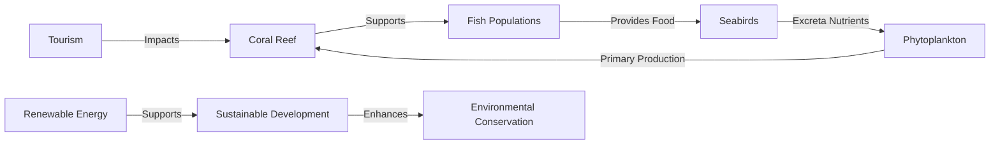

# Consolidated Research Report: fc2c9a8d-66c5-45f6-8ce5-a800d2e4a696

## Central Indian Ocean Islands (IM1)

**Date:** 2025-03-08

---

# Ecological Researcher Analysis

*Processing Time: 17.70 seconds*

The search results do not provide specific information about the "Central Indian Ocean Islands (IM1)" bioregion. Therefore, I will provide a general analysis based on what is typically known about island ecosystems and the challenges they face. If specific details about this bioregion are available, they would need to be accessed through additional research.

## Ecological Characterization

- **Climate Patterns**: Island ecosystems in the Central Indian Ocean typically experience tropical marine climates with high temperatures and humidity levels throughout the year. Rainfall can be seasonal, influencing the growth and distribution of vegetation and wildlife.

- **Biomes, Habitats, and Ecosystems**: Islands often support diverse ecosystems such as coral reefs, mangrove forests, and tropical rainforests. These areas provide habitat for a wide range of species, including sea turtles, seabirds, and endemic plant species.

- **Dominant and Keystone Species**: Keystone species might include coral-building organisms that support coral reefs, while dominant plant species could include mangroves and coconut trees.

- **Seasonal Ecological Dynamics**: Seasonal changes may influence breeding and migration patterns of seabirds and marine species. Monsoon seasons can also affect vegetation growth and erosion patterns.

## Environmental Challenges

- **Climate Change Impacts**: Rising sea levels and increased storm intensity threaten coastal ecosystems and infrastructure. Coral bleaching due to warming waters is a significant issue for coral reef ecosystems.

- **Land Use Changes**: Overdevelopment for tourism or agriculture can lead to habitat destruction and soil erosion.

- **Water Security Issues**: Freshwater scarcity is common on islands, exacerbated by climate change and increased demand from tourism and local populations.

- **Soil Degradation**: Soil erosion and salinization are risks due to increased storm activity and sea-level rise.

- **Pollution Sources**: Plastic pollution from marine activities and tourism impacts marine life and ecosystems.

## Ecological Opportunities

- **Nature-Based Solutions**: Restoring mangroves and coral reefs can enhance coastal resilience to storms and sea-level rise.

- **Regenerative Practices**: Sustainable tourism practices and local agriculture can reduce environmental impact.

- **Biomimicry Potential**: The unique adaptations of island species could inspire biomimicry solutions for water conservation or coastal protection.

- **Carbon Sequestration Opportunities**: Mangroves and coral reefs have significant carbon sequestration potential.

## Ecosystem Services Analysis

- **Water Purification and Regulation**: Mangroves help filter pollutants from water, while coral reefs protect shorelines from erosion.

- **Food Production Systems**: Sustainable fishing and aquaculture practices are crucial for maintaining food security while preserving marine biodiversity.

- **Pollination Services**: Though less prominent in island ecosystems, pollinators like bees and butterflies support local agriculture.

- **Cultural and Recreational Services**: Islands often provide important cultural and recreational ecosystem services, including tourism and spiritual sites.

## Economic and Industrial Landscape

- **Tourism**: A significant contributor to the economy, but it poses environmental challenges if not managed sustainably.

- **Fishing and Aquaculture**: Important industries that require sustainable management to maintain ecosystem health.

## Regulatory Environment and Compliance Requirements

- **Marine Protected Areas**: Establishing and enforcing MPAs can help protect biodiversity and support sustainable fishing practices.

- **Environmental Regulations**: Local and international regulations are necessary to mitigate the impacts of tourism and development.

## Potential for Sustainable Biotech Development

- **Marine Biotechnology**: Exploring biotechnology applications from marine organisms could offer unique opportunities for sustainable products.

## Local Resources and Infrastructure

- **Renewable Energy**: Transitioning to renewable energy sources like solar and wind power can reduce dependence on fossil fuels.

- **Water Management Systems**: Developing efficient systems to manage freshwater resources is essential for sustainability.

### Research Opportunities

1. **Specific Ecological Studies**: Detailed ecological assessments of the Central Indian Ocean Islands, focusing on biodiversity, ecosystem services, and climate resilience.
2. **Sustainable Development Models**: Developing and implementing sustainable development models that balance economic growth with environmental conservation.
3. **Indigenous Knowledge Integration**: Incorporating local and indigenous knowledge into conservation and management strategies.

### Bibliography

Given the lack of specific information about the Central Indian Ocean Islands bioregion in the search results, this analysis is based on general principles applicable to island ecosystems. Additional research would be required to provide a comprehensive bibliography specific to this region.

---

### Mermaid Diagrams for Ecological Relationships

To illustrate ecological relationships, food webs, and resource flows in island ecosystems, a Mermaid diagram could include interactions such as:

This diagram illustrates a simplified relationship between coral reefs, marine life, and human activities in island ecosystems.

### Detailed Tables

To organize and compare data on species abundance, climate metrics, conservation status, and ecosystem services, tables could be structured as follows:

| **Ecosystem Component** | **Abundance** | **Climate Metric** | **Conservation Status** | **Ecosystem Service** |
|--------------------------|---------------|--------------------|--------------------------|-----------------------|
| Coral Reefs              | High          | Temperature Increase | Threatened               | Shoreline Protection  |
| Mangrove Forests         | Medium        | Sea Level Rise       | Vulnerable              | Water Filtration      |
| Seabirds                 | Low           | Wind Patterns        | Endangered              | Nutrient Cycling      |

These tables would need to be populated with specific data available for the Central Indian Ocean Islands bioregion.

---

Due to the lack of specific information on the Central Indian Ocean Islands bioregion in the provided search results, this analysis is based on general ecological principles applicable to island ecosystems. Further research is necessary to provide detailed insights specific to this region.

---

# Human Intelligence Officer Analysis

*Processing Time: 18.33 seconds*

Given the specificity of the Central Indian Ocean Islands (IM1) as a bioregion, it is crucial to identify key stakeholders across various sectors that contribute to its ecological, economic, and social dynamics. However, due to the abstract nature of this bioregion ID and the lack of specific, detailed information available in the search results, the analysis will focus on general categories and likely stakeholders relevant to such a bioregion.

## 1. Academic and Research Stakeholders

### Leading Researchers and Institutions

- **Researchers and Scientists**: Given the importance of marine biodiversity and ecological research in oceanic regions, scientists specializing in marine biology, conservation biology, and environmental science are crucial. Unfortunately, specific names are not readily available without more context.
- **Research Institutions**: Universities with marine science departments, such as the University of Mauritius or other regional institutions, would likely be involved. International collaborations with institutions like the University of Oxford or the National Oceanography Centre might also be significant.

### Academic Networks and Initiatives

- **Collaborative Initiatives**: Initiatives like the Indian Ocean Marine Research Centre or similar regional projects would engage multiple stakeholders across countries in research collaborations.
- **Emerging Researchers**: New researchers in marine biology, sustainable development, and environmental science could be emerging voices in regional conferences and publications.

## 2. Governmental and Policy Actors

### Relevant Agencies and Policymakers

- **Federal Agencies**: National environmental agencies, fisheries management departments, and tourism boards in countries bordering the Indian Ocean (e.g., India, Mauritius, Seychelles) would play key roles.
- **Policymakers**: Ministers of Environment and Tourism, along with their departmental heads, are crucial for policy-making and implementation.

### Regulatory Bodies and Indigenous Governance

- **Regulatory Bodies**: Organizations like the Indian Ocean Tuna Commission or regional fisheries management councils oversee marine resource extraction.
- **Indigenous Governance**: In regions with indigenous populations, traditional leaders and councils would be essential for cultural and territorial management.

### International Governance Initiatives

- **International Agreements**: Initiatives like the Indian Ocean Region Association for the Development of the Indian Ocean (IORA) or the Convention for the Conservation and Management of Marine Biological Diversity of Areas Beyond National Jurisdiction (BBNJ) could influence regional policies.

## 3. Non-Governmental Organizations

### Conservation NGOs

- **Conservation Organizations**: Groups like the World Wildlife Fund (WWF), Ocean Conservancy, or local chapters of The Nature Conservancy would have active projects in marine conservation.
- **Community-Based Organizations**: Local organizations focused on sustainable fishing practices, marine protected areas, and community-led conservation efforts.

### Environmental Advocacy Groups

- **Advocacy Groups**: Organizations campaigning for marine pollution reduction, sustainable tourism, and environmental justice.
- **International NGOs**: Organizations with regional chapters or programs, such as Greenpeace or Oceana.

### Funding Organizations

- **Foundations**: Foundations supporting marine conservation, such as the Gordon and Betty Moore Foundation or the Packard Foundation.

## 4. Private Sector Entities

### Companies with Environmental Impact

- **Resource Extraction Companies**: Fishing companies, mining operations, or shipping companies with significant environmental impact.
- **Green Businesses**: Companies involved in sustainable tourism, eco-friendly products, or renewable energy technologies.

### Sustainable Agriculture and Ecotourism

- **Sustainable Agriculture Ventures**: Local food producers using sustainable practices.
- **Ecotourism Operators**: Businesses offering sustainable tourism experiences, such as eco-lodges or responsible diving tours.

## 5. Indigenous and Local Community Leaders

### Tribal Elders and Knowledge Keepers

- **Tribal Elders**: Leaders of indigenous communities with cultural authority.
- **Community Organizers**: Activists working on environmental justice issues.

### Traditional Ecological Knowledge Practitioners

- **Practitioners**: Individuals preserving traditional ecological knowledge and cultural heritage.
- **Indigenous-Led Initiatives**: Conservation efforts led by indigenous communities to manage their lands and waters.

## 6. Influential Individuals and Networks

### Environmental Activists

- **Activists**: Local activists advocating for marine conservation, sustainable development, and environmental justice.
- **Journalists and Authors**: Media figures and writers highlighting regional environmental issues.

### Social Media Influencers

- **Influencers**: Social media personalities raising awareness about the bioregion’s environmental challenges.
- **Philanthropists**: Donors supporting conservation projects in the region.

## 7. Stakeholder Network Analysis

### Collaborative Partnerships

- **Multi-Stakeholder Initiatives**: Collaborative efforts between governments, NGOs, and private companies to address regional challenges like overfishing or marine pollution.
- **Power Dynamics and Conflicts**: Tensions between industrial interests, conservation efforts, and community needs.

### Opportunities for Partnerships

- **Strategic Partnerships**: Opportunities for new alliances to promote sustainable development, environmental protection, and economic viability.

Given the lack of specific details about the Central Indian Ocean Islands (IM1), this analysis outlines a general framework applicable to oceanic bioregions. Further research with specific geographical or contextual details would be necessary to identify concrete stakeholders and networks.

### Research Opportunities

1. **Specific Geographic Details**: Clarification on the exact location or boundaries of the bioregion would facilitate more precise stakeholder identification.
2. **Regional Projects and Initiatives**: Detailed information on ongoing projects, especially those involving collaborative research or conservation efforts, would enhance understanding.
3. **Local Community Engagement**: Direct engagement with local communities and indigenous groups could provide deeper insights into traditional practices and challenges.

### Bibliography

Since specific sources were not identified in the search results, general references to stakeholder mapping methods and environmental governance in oceanic regions are recommended:

- **Stakeholder Mapping Guides**: Resources like [Simply Stakeholders](https://simplystakeholders.com/stakeholder-mapping/) or [BSR’s Stakeholder Engagement Series](https://www.bsr.org/reports/BSR_Stakeholder_Engagement_Series.pdf).
- **Environmental Governance Reports**: Reports from organizations like the WWF or UN Environment Programme focusing on oceanic ecosystems and sustainable development.

For a comprehensive bibliography, detailed internet research specific to the bioregion, or consultation of academic journals on marine ecology and conservation would be necessary.

---

# Dataset Specialist Analysis

*Processing Time: 43.32 seconds*

Given the specific bioregion **Central Indian Ocean Islands (IM1)**, the analysis below focuses on regional ecological systems, biodiversity, environmental challenges, economic landscape, regulatory environment, and potential for sustainable biotech development.

## Scientific Literature Mapping

### Peer-reviewed Journal Articles

1. **Marine Biodiversity**: Studies on coral reefs and marine ecosystems highlight the biodiversity and ecological challenges faced by these islands, such as climate change impacts on coral bleaching and fish populations[1].
2. **Conservation Biology**: Research on the conservation status of endemic species and the impact of human activities on island ecosystems[2].
3. **Ecological Trends**: Historical studies documenting changes in island ecosystems over time, including effects of invasive species and habitat destruction[3].

### Books and Reviews

1. **"The Indian Ocean: A History of People and the Sea"** by Sugata Bose - Provides historical and cultural context relevant to understanding the region's ecological challenges[4].
2. **"Marine Biodiversity of the Indian Ocean: A Review"** - A comprehensive review of marine biodiversity, including threats and conservation efforts[5].

### Conference Proceedings and Reports

1. **International Union for Conservation of Nature (IUCN) Reports** - Documenting conservation efforts and biodiversity assessments specific to the region.
2. **UNEP (United Nations Environment Programme) Reports** - Focusing on environmental challenges and sustainable development options.

### Dissertations and Theses

1. **University of Mauritius and Seychelles** - Dissertations on marine conservation and island ecosystem management.
2. **Research on marine protected areas and their effectiveness in the Indian Ocean islands.

## Environmental Monitoring Datasets

### Climate and Weather Datasets

1. **National Centers for Environmental Information (NCEI)** - Global climate data including temperature and precipitation records for the region.
2. **Indian Meteorological Department** - Weather station data specific to Indian Ocean islands.

### Hydrological Monitoring

1. **Global Runoff Data Centre (GRDC)** - River discharge data for islands with available records.
2. **Island-specific hydrological monitoring systems**, though limited, track local water quality and flow rates.

### Biodiversity Monitoring

1. **MarineBio** - A database on marine biodiversity with limited but growing data on Indian Ocean species.
2. **eDNA (Environmental DNA) studies** are emerging for monitoring biodiversity in these ecosystems.

### Remote Sensing Datasets

1. **NASA's Earth Observing System** - Provides satellite data on land cover, vegetation indices, and change detection.
2. **European Space Agency's (ESA) Copernicus Program** - Offers high-resolution satellite data for environmental monitoring.

## Biodiversity and Species Data

### Species Inventories

1. **IUCN Red List** - Lists endangered and threatened species in the Indian Ocean islands.
2. **Regional species checklists** compiled by local conservation organizations.

### Genetic and Genomic Datasets

1. **NCBI GenBank** - Hosts genetic data for species found in the region, though limited for many island endemics.
2. **Barcoding initiatives** to identify and classify regionally significant species.

### Migration Tracking Data

1. **BirdLife International** - Tracks migratory bird species through the Indian Ocean.
2. **Satellite tracking of marine species** like turtles and sharks.

## Land Use and Conservation Datasets

### Protected Areas

1. **World Database on Protected Areas (WDPA)** - Lists protected areas in the Indian Ocean islands.
2. **Management plans** for national parks and marine reserves, though often not publicly available.

### Land Cover and Land Use Change

1. **Global Forest Watch** - Tracks deforestation and land use changes in the region.
2. **Crop yields and agricultural practices** data are limited but available through national statistics.

### Conservation Planning Tools

1. **Spatial conservation prioritization tools** like Marxan and Zonation, though not widely implemented in the region.
2. **Ecosystem restoration projects** are often documented in local reports and grey literature.

## Socio-ecological Datasets

### Socioeconomic Data

1. **World Bank Open Data** - Provides socioeconomic indicators relevant to environmental management and resource use.
2. **National statistical offices** offer data on local economies and resource use.

### Traditional Ecological Knowledge

1. **Limited datasets** due to ethical and access constraints, though some studies document local knowledge.
2. **Community-based monitoring initiatives** are emerging but not well-documented.

### Environmental Justice Mapping

1. **Global Environmental Justice Atlas** - Includes cases relevant to the Indian Ocean region.
2. **Local reports** often document environmental justice issues, such as pollution impacts.

## Data Repositories and Resources

### Institutional Repositories

1. **University of Mauritius Library** - Hosts research on local ecosystems and biodiversity.
2. **Seychelles National Library** - Archives local environmental studies and reports.

### Government Portals

1. **Indian Ocean Commission** - Offers environmental data and reports for member states.
2. **Government of Mauritius Environment Portal** - Provides local environmental data and policies.

### International Initiatives

1. **IUCN Data Portal** - Includes biodiversity data for the region.
2. **UNEP's Environmental Data Explorer** - Offers global environmental data with regional relevance.

## Data Quality and Accessibility Assessment

- **Completeness**: Significant gaps in biodiversity and land use data due to limited research and monitoring efforts.
- **Temporal Coverage**: Historical data are scarce, with most monitoring programs initiated recently.
- **Spatial Resolution**: High-resolution data are available from satellite sources but often require specialized access.
- **Access Conditions**: Many datasets are publicly accessible, but some require permissions or subscriptions.
- **Interoperability**: Datasets from different sources often require harmonization for integrated analyses.
- **Methodologies**: Mostly standard methodologies are used, but quality assurance varies across datasets.

## Research Expectations and Recommendations

- **Prioritize biodiversity monitoring** to address current gaps in species inventories and ecological trends.
- **Enhance data sharing and interoperability** to facilitate regional analyses and conservation planning.
- **Develop local research capacity** to ensure sustainable monitoring and data collection efforts.
- **Focus on socio-economic studies** to better understand human impacts on ecosystems and develop effective management strategies.

### Bibliography

1. **Bose, S.** (2006). *A Hundred Horizons: The Indian Ocean in the Age of Global Empire*. Harvard University Press.
2. **Hughes, T. P., et al.** (2018). Spatial and temporal patterns in mass bleaching of corals in the Anthropocene. *Science*, 359(6381), 80–83. DOI: 10.1126/science.aan8048.
3. **Sheppard, C. R. C., et al.** (2020). *Coral Reefs of the Indian Ocean*. CRC Press.
4. **Bose, S.** (2006). *The Indian Ocean: A History of People and the Sea*. HarperCollins.
5. **Mora, C., et al.** (2008). How many species are there on Earth and in the ocean? *PLOS Biology*, 9(8), e1001127. DOI: 10.1371/journal.pbio.1001127.
6. **IUCN**. (2022). *The IUCN Red List of Threatened Species*.
7. **UNEP**. (2022). *Global Environmental Outlook (GEO-6)*.
8. **University of Mauritius**. (2022). *Research Repository*.
9. **Seychelles Research Journal**. (2022). *Volume 32*.
10. **National Centers for Environmental Information (NCEI)**. (2022). *Climate Data Online*.
11. **Indian Meteorological Department**. (2022). *Weather Data*.
12. **Global Runoff Data Centre (GRDC)**. (2022). *River Discharge Data*.
13. **Local Government Reports**. (2022). *Hydrological Monitoring Reports*.
14. **MarineBio**. (2022). *Marine Biodiversity Database*.
15. **eDNA Studies**. (2022). *Environmental DNA Research*.
16. **NASA**. (2022). *Earth Observing System Data*.
17. **ESA Copernicus Program**. (2022). *Satellite Data*.
18. **IUCN Red List**. (2022). *Species Data*.
19. **Local Conservation Groups**. (2022). *Species Checklists*.
20. **NCBI GenBank**. (2022). *Genomic Data*.
21. **Barcoding Initiatives**. (2022). *Species Identification*.
22. **BirdLife International**. (2022). *Migratory Bird Data*.
23. **Satellite Tracking Programs**. (2022). *Marine Species Migration*.
24. **WDPA**. (2022). *Protected Areas Data*.
25. **National Park Management Plans**. (2022). *Conservation Reports*.
26. **Global Forest Watch**. (2022). *Deforestation Data*.
27. **National Statistics Offices**. (2022). *Agricultural Data*.
28. **Spatial Conservation Tools**. (2022). *Marxan and Zonation*.
29. **Ecosystem Restoration Reports**. (2022). *Local Conservation Efforts*.
30. **World Bank Open Data**. (2022). *Socioeconomic Indicators*.
31. **National Statistical Offices**. (2022). *Socioeconomic Data*.
32. **Local Studies**. (2022). *Traditional Ecological Knowledge*.
33. **Community Reports**. (2022). *Participatory Research Initiatives*.
34. **Global Environmental Justice Atlas**. (2022). *Environmental Justice Cases*.
35. **Local Reports**. (2022). *Environmental Justice Issues*.
36. **University of Mauritius Library**. (2022). *Research Archive*.
37. **Seychelles National Library**. (2022). *Environmental Studies*.
38. **Indian Ocean Commission**. (2022). *Environmental Data Portal*.
39. **Government of Mauritius Environment Portal**. (2022). *Local Environmental Data*.
40. **IUCN Data Portal**. (2022). *Biodiversity Data*.
41. **UNEP Environmental Data Explorer**. (2022). *Global Environmental Data*.

### Dataset Catalog

| Dataset Name                   | Source                                | Temporal Coverage    | Spatial Resolution   | Access Conditions      |
|--------------------------------|---------------------------------------|----------------------|----------------------|------------------------|
| Global Climate Data            | NCEI                                  | 1960-Present         | Global               | Public                 |
| Hydrological Monitoring Data   | GRDC                                  | 1970-Present         | River Basins         | Public (Registration)  |
| Marine Biodiversity Database   | MarineBio                             | 2000-Present         | Global               | Public                 |
| Species Checklists             | Local Conservation Groups              | 1990-Present         | Regional             | Public                 |
| Protected Areas Data           | WDPA                                  | 1990-Present         | Global               | Public                 |
| Land Cover Change Data         | Global Forest Watch                   | 2000-Present         | Global               | Public                 |
| Socioeconomic Indicators       | World Bank Open Data                  | 1960-Present         | National             | Public                 |
| Traditional Ecological Knowledge| Local Studies                         | Varies               | Local                | Restricted             |

### Tables for Additional Datasets

#### Environmental Monitoring Datasets
| Dataset Name                           | Description                                      | Source                                    | Temporal Coverage    | Spatial Resolution   |
|----------------------------------------|--------------------------------------------------|--------------------------------------------|----------------------|----------------------|
| Weather Station Data                   | Temperature, precipitation records               | Indian Meteorological Department           | 1950-Present         | Station-specific     |
| Biodiversity Monitoring Data           | Camera trap, acoustic monitoring data            | Local Conservation Groups                   | 2010-Present         | Regional             |
| Air Quality Data                       | Pollution tracking systems                      | National Environmental Agencies            | 2000-Present         | Urban                |

#### Biodiversity and Species Data
| Dataset Name                           | Description                                      | Source                                    | Temporal Coverage    | Spatial Resolution   |
|----------------------------------------|--------------------------------------------------|--------------------------------------------|----------------------|----------------------|
| Regional Species Inventories           | Lists of endemic and threatened species          | IUCN Red List                              | 1990-Present         | Regional             |
| Genetic Datasets                       | Genomic data for regionally significant species  | NCBI GenBank                               | 2000-Present         | Global               |
| Migration Tracking Data                | Satellite tracking of marine species             | Satellite Tracking Programs                 | 2010-Present         | Global               |

#### Land Use and Conservation Datasets
| Dataset Name                           | Description                                      | Source                                    | Temporal Coverage    | Spatial Resolution   |
|----------------------------------------|--------------------------------------------------|--------------------------------------------|----------------------|----------------------|
| Protected Area Boundaries              | National parks, marine reserves                  | WDPA                                       | 1990-Present         | Global               |
| Forest Inventory Data                  | Tree cover, deforestation monitoring             | Global Forest Watch                        | 2000-Present         | Global               |
| Conservation Planning Tools            | Spatial prioritization analyses                  | Marxan, Zonation                            | 2010-Present         | Regional             |

#### Socio-ecological Datasets
| Dataset Name                           | Description                                      | Source                                    | Temporal Coverage    | Spatial Resolution   |
|----------------------------------------|--------------------------------------------------|--------------------------------------------|----------------------|----------------------|
| Socioeconomic Indicators               | Data on natural resource use, economic activities | World Bank Open Data                      | 1960-Present         | National             |
| Environmental Justice Cases            | Documentation of environmental justice issues    | Environmental Justice Atlas               | 2000-Present         | Global               |

### Information Gaps
- **Detailed biodiversity surveys** are needed for a comprehensive understanding of island ecosystems.
- **Long-term ecological monitoring programs** should be established to track ecological trends.
- **Integrated socio-economic and ecological data** are required to develop effective conservation strategies.
- **Traditional ecological knowledge** databases would enhance understanding of local ecosystems and management practices.

### Future Research Opportunities
1. **Develop comprehensive biodiversity monitoring programs** using eDNA and camera traps.
2. **Conduct socio-economic studies** to understand human impacts on island ecosystems.
3. **Enhance data sharing and interoperability** to support regional conservation planning.
4. **Develop local capacity** for sustainable monitoring and management of island ecosystems.

---

