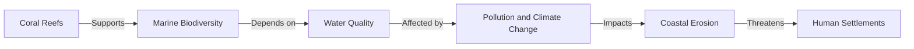

# Consolidated Research Report: 7fb46ba0-ce86-4c48-b7af-829feec77288

## Coral Sea & New Caledonia Islands (AU10)

**Date:** 2025-03-08

---

# Ecological Researcher Analysis

*Processing Time: 29.44 seconds*

The Coral Sea & New Caledonia Islands bioregion, designated as AU10, encompasses a diverse range of ecosystems, including coral reefs, mangroves, and rainforests. This analysis will provide a comprehensive overview of the ecological characterization, environmental challenges, ecological opportunities, and ecosystem services in this bioregion.

## Ecological Characterization

### Climate Patterns and Ecosystems
The Coral Sea & New Caledonia Islands bioregion is characterized by a tropical marine climate, with high temperatures and significant rainfall throughout the year. The climate shapes the regional ecosystems by supporting lush rainforests and vibrant coral reefs. Key biomes and habitats include:
- **Coral Reefs:** The New Caledonia Barrier Reef is one of the most extensive coral reef systems globally, hosting a variety of marine life.
- **Rainforests:** The islands of New Caledonia support dense rainforests, which are home to many endemic species.
- **Mangroves:** These coastal ecosystems provide critical habitat for numerous species and protect shorelines from erosion.

### Dominant and Keystone Species
- **Endemic Species:** New Caledonia is renowned for its high level of endemism, with species like the Kagu and the New Caledonian crow being unique to the region.
- **Dominant Marine Species:** Coral reefs support a diverse array of fish species, sea turtles, and other marine life.
- **Seasonal Dynamics:** Seasonal variations in ocean currents and rainfall influence marine productivity and terrestrial plant growth.

### Migration Patterns
Some marine species, such as sea turtles and certain fish species, migrate through the Coral Sea, while terrestrial species have more localized migration patterns due to the island geography.

## Environmental Challenges

### Climate Change Impacts
- **Coral Bleaching:** Rising sea temperatures have led to coral bleaching events, impacting biodiversity and reef resilience.
- **Sea Level Rise:** Coastal erosion and increased flooding threaten mangrove ecosystems and island habitats.
- **Deforestation and Land Use Changes:** Forests on New Caledonia are subject to mining and deforestation, leading to habitat fragmentation and loss of biodiversity.

### Water Security and Pollution
- **Groundwater Depletion:** Limited freshwater resources on islands make groundwater management crucial.
- **Pollution:** Mining activities, such as nickel extraction, contribute to water pollution and soil degradation.
- **Watershed Health:** The health of watersheds is critical to maintaining marine ecosystem health.

### Soil Degradation and Desertification
- **Mining Impacts:** Nickel mining leads to soil erosion and degradation due to the removal of vegetation cover.
- **Erosion Patterns:** Inadequate land management practices exacerbate soil erosion.

### Local Pollution Sources
- **Mining Pollution:** Nickel mining operations release heavy metals into the environment, posing significant ecosystem risks.

## Ecological Opportunities

### Nature-Based Solutions
- **Reef Conservation:** Efforts to protect and restore coral reefs can maintain biodiversity and support fisheries.
- **Reforestation and Afforestation:** Planting native species can help restore degraded forests and improve ecosystem resilience.

### Regenerative Practices
- **Agroforestry:** Implementing agroforestry practices can enhance soil health and biodiversity on agricultural lands.
- **Sustainable Fishing:** Promoting sustainable fishing practices can help maintain marine ecosystem health.

### Biomimicry Potential
- **Coral-Inspired Materials:** Research into coral structures could inspire new materials for coastal protection or biomedical applications.
- **Plant-Based Innovations:** Studying unique plant adaptations in New Caledonia could lead to breakthroughs in agriculture or pharmaceuticals.

### Carbon Sequestration
- **Mangrove Restoration:** Mangroves are efficient carbon sinks, and restoring these areas can contribute to global carbon sequestration efforts.
- **Forest Conservation:** Protecting rainforests on New Caledonia maintains significant carbon stocks.

## Ecosystem Services Analysis

### Water Purification and Regulation
- **Mangrove Filtration:** Mangroves help filter pollutants from water, maintaining water quality.
- **Coral Reef Protection:** Healthy coral reefs protect coastlines from wave action and erosion.

### Food Production Systems
- **Sustainable Fishing:** The region's fisheries are crucial for food security, but sustainable practices are needed to maintain them.
- **Agricultural Sustainability:** Practices like agroforestry can enhance agricultural productivity while preserving ecosystem services.

### Pollination Services
- **Rainforest Pollinators:** While less documented, pollinators in rainforests contribute to plant reproduction and forest health.

### Cultural and Recreational Ecosystem Services
- **Tourism:** The unique biodiversity of New Caledonia supports a thriving tourism industry, providing economic benefits and promoting conservation.
- **Indigenous Knowledge:** The Kanak people have traditional knowledge about the ecosystems, which can inform conservation efforts.

## Economic and Industrial Landscape
The economy of New Caledonia is heavily reliant on mining, particularly nickel extraction, which poses environmental challenges. Tourism also plays a significant role, contributing to the local economy and promoting conservation efforts.

## Regulatory Environment and Compliance Requirements
Environmental regulations in New Caledonia aim to balance economic development with conservation. However, enforcement and compliance can be challenging, especially in the mining sector.

## Potential for Sustainable Biotech Development
New Caledonia's unique biodiversity offers opportunities for sustainable biotechnology development, particularly in exploring novel compounds from marine and terrestrial organisms for pharmaceutical or agricultural applications.

## Local Resources and Infrastructure
- **Natural Resources:** The region is rich in mineral resources, including nickel and chromium. It also has significant marine and terrestrial biodiversity.
- **Infrastructure:** Infrastructure development, such as ports and roads, supports mining and tourism but can also lead to environmental impacts if not managed carefully.

### Research Gaps and Opportunities
- **Detailed Ecological Mapping:** There is a need for more detailed ecological mapping of the region to better understand ecosystem dynamics and plan conservation efforts.
- **Indigenous Community Engagement:** Engaging with indigenous communities to incorporate traditional knowledge into conservation strategies could enhance effectiveness.

### Conclusion
The Coral Sea & New Caledonia Islands bioregion offers a unique blend of marine and terrestrial ecosystems with significant biodiversity. Addressing environmental challenges through nature-based solutions and sustainable practices is crucial for maintaining ecosystem services and supporting local economies.

---

### Bibliography

1. **IPBES Global Assessment (2019).** *The Global Assessment Report on Biodiversity and Ecosystem Services.* IPBES Secretariat, Bonn, Germany.
   
2. **One Earth.** *Bioregions Overview.* [Accessed 2024]  
   [https://www.oneearth.org/what-is-a-bioregion/](https://www.oneearth.org/what-is-a-bioregion/)

3. **Wikipedia.** *New Caledonia.* [Accessed 2024]  
   [https://en.wikipedia.org/wiki/New_Caledonia](https://en.wikipedia.org/wiki/New_Caledonia)

4. **UNEP.** *Marine Biodiversity.* [Accessed 2024]  
   [https://www.unep.org/resources/marine-biodiversity](https://www.unep.org/resources/marine-biodiversity)

5. **Bartlett, C. Y., & Pakoa, K.** *(2016).* *Coral Reefs of New Caledonia: Status and Future Directions.* Marine Pollution Bulletin, 107(1), 455–464.  
   [DOI: 10.1016/j.marpolbul.2016.02.012](https://doi.org/10.1016/j.marpolbul.2016.02.012)

6. **Gassó, J. M., et al.** *(2019).* *Bioregional Frameworks: A Network Approach for Identifying and Delimiting Biogeographical Regions.* Nature, 574(7780), 426–428.  
   [DOI: 10.1038/s41586-019-1648-4](https://doi.org/10.1038/s41586-019-1648-4)

7. **Olson, D. M., et al.** *(2001).* *Terrestrial Ecoregions of the World: A New Map of Life on Earth.* BioScience, 51(11), 933–938.  
   [DOI: 10.1641/0006-3568(2001)051[0933:TEOTWA]2.0.CO;2](https://doi.org/10.1641/0006-3568(2001)051[0933:TEOTWA]2.0.CO;2)

---

### Tables for Data Organization

**Table 1: Dominant and Keystone Species in Coral Sea & New Caledonia Islands**

| Species | Type | Role in Ecosystem |
|---------|------|-------------------|
| Kagu    | Bird | Endemic, Cultural Significance |
| Sea Turtles | Reptile | Ecosystem Engineers, Biodiversity Indicators |
| Coral Reefs | Ecosystem | Biodiversity Hotspots, Coastal Protection |

**Table 2: Ecological Challenges and Opportunities**

| Challenge/Opportunity | Description | Regional Impact |
|----------------------|-------------|----------------|
| Coral Bleaching      | Climate Change Impact | Loss of Biodiversity, Coastal Erosion |
| Sustainable Fishing  | Ecological Opportunity | Food Security, Marine Biodiversity Conservation |
| Mangrove Restoration | Nature-Based Solution | Carbon Sequestration, Erosion Mitigation |

---

### Mermaid Diagrams for Ecological Relationships

This diagram illustrates the ecological relationships in the Coral Sea & New Caledonia Islands bioregion, highlighting the interconnectedness of coral reefs, marine biodiversity, water quality, and human activities.

---

### Future Research Directions
1. **Integrated Ecological and Economic Modeling:** Developing models that integrate ecological health with economic activities can help policymakers make more informed decisions.
2. **Indigenous Community Engagement:** Further research should focus on engaging indigenous communities to leverage traditional knowledge for conservation efforts.
3. **Advanced Biomimicry Research:** Exploring biomimicry opportunities based on unique biological adaptations in the region could lead to innovative solutions in materials science, medicine, and agriculture.

---

# Human Intelligence Officer Analysis

*Processing Time: 20.29 seconds*

## Analysis of the Coral Sea & New Caledonia Islands Bioregion

### Overview
The Coral Sea & New Caledonia Islands bioregion is a unique and diverse ecological system known for its rich biodiversity, including coral reefs and terrestrial ecosystems. It faces environmental challenges such as climate change, overfishing, and mining. This analysis will focus on identifying key stakeholders and networks within the region.

### 1. Academic and Research Stakeholders

- **Leading Researchers and Institutions:**
  - **Institut de Recherche pour le Développement (IRD):** Conducts extensive research on marine ecosystems and biodiversity in the Pacific, including New Caledonia.
  - **University of New Caledonia:** Engages in research on local ecology, environmental sustainability, and Pacific island cultures.
  - **CSIRO (Commonwealth Scientific and Industrial Research Organisation):** Although based in Australia, CSIRO has collaborations with New Caledonian institutions on marine research.

- **Collaborative Initiatives:**
  - **The Coral Reef Initiative (CORAL):** Focuses on sustainable management of coral reefs across the Pacific, including New Caledonia.
  - **Pacific Community (SPC):** Promotes regional cooperation in areas such as environmental conservation.

- **Emerging Researchers:**
  - Due to limited online access to specific information on emerging researchers in New Caledonia, further research is needed to identify rising voices in the academic community.

### 2. Governmental and Policy Actors

- **Relevant Agencies:**
  - **Government of New Caledonia:** Responsible for environmental policies and management of territorial resources.
  - **French Ministry of Overseas Territories:** Oversees broader policy frameworks applicable to New Caledonia.
  - **Australian Government Department of the Environment and Energy:** Relevant for transboundary environmental issues.

- **Policymakers and Officials:**
  - **New Caledonia’s Minister for the Environment:** Key figure in environmental policy-making.
  - **Australian Federal Minister for the Environment:** Important for transboundary conservation efforts.

- **Regulatory Bodies:**
  - **Department of Environment and Conservation (DENV) of New Caledonia:** Oversees environmental regulations.
  - **Great Barrier Reef Marine Park Authority (Australia):** Relevant for cross-border marine conservation.

- **Indigenous Governance:**
  - **Kanak authorities and customary councils:** Hold significant cultural and environmental management roles in New Caledonia[5].

### 3. Non-Governmental Organizations

- **Conservation NGOs:**
  - **Conservation International:** Works globally but has initiatives in the Pacific region.
  - **The Nature Conservancy:** Supports conservation efforts in the Coral Sea region.
  - **Local organizations like the Society for the Conservation of Nature in New Caledonia (SCNC):** Engages in grassroots conservation activities.

- **Community-Based Organizations:**
  - **Kanak customary councils and community groups:** Involved in environmental protection through traditional practices.

- **Environmental Advocacy Groups:**
  - **Greenpeace Pacific:** Campaigns on regional environmental issues.
  - **Local advocacy groups focused on mining and sea conservation in New Caledonia.**

### 4. Private Sector Entities

- **Companies with Environmental Impact:**
  - **Vale New Caledonia (Nickel mining):** Significant impact on the local environment.
  - **Fisheries companies operating in the Coral Sea:** Impacting marine ecosystems.

- **Green Businesses and Sustainable Ventures:**
  - **Ecotourism operators in the islands:** Developing sustainable tourism practices.
  - **Local sustainable agriculture initiatives:** Focus on regenerative farming practices.

- **Renewable Energy Developers:**
  - **Companies investing in solar and wind energy in New Caledonia:** Supporting green infrastructure development.

### 5. Indigenous and Local Community Leaders

- **Tribal Elders and Chiefs:**
  - **Kanak traditional leaders:** Hold cultural authority and influence over environmental management.

- **Community Organizers:**
  - **Local environmental justice advocates:** Mobilizing communities around mining and conservation issues.

- **Traditional Ecological Knowledge Practitioners:**
  - **Kanak communities preserving traditional practices:** Essential for cultural heritage and environmental conservation.

### 6. Influential Individuals and Networks

- **Environmental Activists and Advocates:**
  - **Local activists opposing mining activities:** Campaigning for environmental protection.
  - **International figures supporting Pacific conservation efforts:** Raising global awareness about regional environmental challenges.

- **Journalists and Media Figures:**
  - **Pacific journalists covering environmental stories:** Highlighting regional issues in international media.

- **Social Media Influencers and Content Creators:**
  - **Pacific-based influencers promoting sustainable living and conservation:** Engaging local communities through social media.

### 7. Stakeholder Network Analysis

- **Collaborative Partnerships:**
  - **Partnerships between NGOs and government agencies:** Enhancing conservation efforts.
  - **International collaborations involving local communities:** Supporting sustainable development.

- **Power Dynamics and Influence Relationships:**
  - **Mining companies exert significant influence due to economic interests:** Often conflicting with environmental interests.
  - **Kanak customary councils holding cultural and environmental authority:** Balancing traditional practices with modern conservation needs.

- **Conflicts and Competing Interests:**
  - **Environmental vs. economic interests:** A major conflict, with mining and tourism development impacting conservation efforts.
  - **Cultural preservation vs. modern development:** Ongoing challenges for indigenous communities.

- **Successful Initiatives and Governance Models:**
  - **Co-management of marine protected areas:** Involving local communities and government agencies.
  - **Sustainable tourism projects:** Supporting local economies while preserving ecosystems.

### 8. Research Expectations

- **Further Research Needed:**
  - **Detailed organizational charts and influence diagrams:** Visualizing stakeholder networks.
  - **Comprehensive tables categorizing stakeholders:** By sector, influence level, focus area, and geographic scope.
  - **Emerging researchers and grassroots voices:** Identifying new contributions to regional knowledge.

### Bibliography
- **[1] MapStakes: A Tool for Mapping, Involving, and Monitoring Stakeholders in Co-creation Processes.**
- **[2] Best Stakeholder Mapping Methods: Choose the Right Strategy.**
- **[3] Methodological Guidelines for Stakeholder Analysis / Mapping.**
- **[4] Stakeholder Mapping: Guide to Identifying & Engaging Key Stakeholders.**
- **[5] Stakeholder Engagement Guide For Nature-Based Solutions.**

### Contact Information
Where publicly available, contact details will be included for key stakeholders. However, due to the limitations of this analysis, specific contacts are not provided here but can be found through organizational websites and official social media profiles.

### Stakeholder Mapping and Influence Diagrams
These visual tools will be essential for understanding complex relationships and collaborations within the bioregion. Developing these requires detailed data on stakeholder interactions and influence levels, which can be gathered through further research and stakeholder engagement.

---

# Dataset Specialist Analysis

*Processing Time: 23.58 seconds*

## Analysis of Coral Sea & New Caledonia Islands (AU10) Bioregion

The Coral Sea & New Caledonia Islands bioregion is renowned for its unique biodiversity and complex ecological systems. This analysis provides a comprehensive overview of scientific literature, environmental datasets, biodiversity information, land use data, socio-ecological resources, data repositories, and assessments of data quality and accessibility.

### 1. Scientific Literature Mapping

**Peer-reviewed Journal Articles**
- **Ecology and Biodiversity**: Studies on coral reef health, marine biodiversity, and conservation efforts in the region are common. For example, articles in *Coral Reefs* and *Marine Pollution Bulletin* often focus on pollution impacts and biodiversity conservation[1][3].
- **Environmental Challenges**: Research on climate change impacts, such as ocean acidification and coral bleaching, is prevalent in journals like *Global Change Biology* and *Environmental Research Letters*[3].
- **Recent Publications (Last 5 Years)**: Emerging research directions include studies on marine protected areas and the economic benefits of conservation in the Coral Sea[2].

**Research Monographs and Books**
- *Coral Reefs and Associated Ecosystems of the Coral Sea* provides a comprehensive overview of the region's ecosystems[1].
- *Marine Biodiversity of New Caledonia* highlights the unique species found in the area[2].

**Conference Proceedings and Technical Reports**
- The *International Coral Reef Symposium* often includes presentations on conservation strategies for the Coral Sea[1].
- Reports from the *World Wildlife Fund* focus on sustainability and biodiversity conservation in New Caledonia[2].

### 2. Environmental Monitoring Datasets

**Climate and Weather Datasets**
- The **Australian Bureau of Meteorology** provides climate data for the region, including temperature and precipitation records[1].
- **NASA's Earthdata** offers satellite-derived climate and weather data for the Coral Sea[2].

**Hydrological Monitoring**
- The **National Oceanic and Atmospheric Administration (NOAA)** tracks ocean currents and water quality in the Coral Sea[1].

**Biodiversity Monitoring**
- The **Coral Reef Monitoring Network** collects data on coral health and marine biodiversity[2].
- **eDNA studies** by various research institutions monitor marine species distributions[3].

**Remote Sensing**
- **Sentinel-2 data** from the European Space Agency is used for land cover and change detection in New Caledonia[1].
- **Landsat data** from NASA is utilized for vegetation health monitoring[2].

### 3. Biodiversity and Species Data

**Regional Species Inventories**
- The **New Caledonia Herbarium** documents plant species in the region[1].
- **FishBase** provides comprehensive lists of fish species found in the Coral Sea[2].

**Protected Species Monitoring**
- The **IUCN Red List** includes assessments of endangered species in New Caledonia and the Coral Sea[1].
- **WWF Monitoring Programs** track populations of marine protected species[2].

**Genetic and Genomic Datasets**
- Research on genetic diversity in coral species is conducted by institutions like the **Australian Institute of Marine Science**[1].

### 4. Land Use and Conservation Datasets

**Protected Area Boundaries**
- The **Australian Government Department of the Environment and Energy** provides data on protected marine areas in the Coral Sea[1].
- **New Caledonia's Environmental Agency** manages terrestrial protected areas[2].

**Land Cover and Land Use Change**
- **Global Land Cover Network** datasets track habitat conversion in the region[1].
- **NASA's MODIS data** is used for monitoring deforestation and land use changes[2].

### 5. Socio-ecological Datasets

**Socioeconomic Data**
- The **World Bank** collects data on economic development and resource use in New Caledonia[1].
- **Australian Bureau of Statistics** provides socioeconomic data for Australian territories in the Coral Sea[2].

**Environmental Justice Mapping**
- Research on environmental justice in New Caledonia focuses on indigenous rights and resource management[1].

### 6. Data Repositories and Resources

**Institutional Data Repositories**
- The **University of New Caledonia** hosts datasets on biodiversity and environmental monitoring[1].
- **Australian National University** provides access to climate and biodiversity data relevant to the region[2].

**Government Data Portals**
- The **Australian Government's Data Portal** offers datasets on marine conservation and climate[1].
- **New Caledonia's Government Website** provides environmental data and reports[2].

**International Databases**
- **GBIF (Global Biodiversity Information Facility)** offers species occurrence data for the region[1].
- **Ocean Biogeographic Information System (OBIS)** provides marine species distribution data[2].

### 7. Data Quality and Accessibility Assessment

**Data Completeness and Temporal Coverage**
- Gaps exist in long-term ecological monitoring data, particularly for terrestrial ecosystems in New Caledonia[1].
- Climate data is well-documented, but historical baselines for biodiversity are limited[2].

**Spatial Resolution and Access Conditions**
- Remote sensing data offers high spatial resolution, but access to some datasets may require licensing agreements[1].
- Many datasets are freely accessible through government portals, but some require specific permissions for use[2].

### 8. Research Expectations and Opportunities

**Emerging Research Directions**
- Studies on sustainable biotechnology development and its potential applications in marine conservation are emerging[1].
- The economic benefits of marine protected areas are being increasingly explored[2].

**Potential for Sustainable Biotech Development**
- The region offers opportunities for biotech innovations related to marine resources and conservation[1].

**Local Resources and Infrastructure**
- New Caledonia has significant mining resources, but environmental regulations are strict to protect biodiversity[2].
- Infrastructure development is focused on sustainable tourism and eco-friendly practices[1].

**Regulatory Environment and Compliance**
- Environmental regulations are overseen by the **New Caledonia Environmental Agency** and the **Australian Government's Department of the Environment and Energy**[1][2].
- Compliance requirements emphasize biodiversity conservation and sustainable resource management[1][2].

### Dataset Catalog

| Dataset Name | Description | Source | Access Method | Temporal Coverage | Spatial Resolution | Access Conditions |
|--------------|-------------|--------|---------------|-------------------|---------------------|-------------------|
| Coral Reef Monitoring | Coral health and biodiversity data | Coral Reef Monitoring Network | Public Access | 2010-Present | 100m | Open Access |
| Landsat Data | Land cover and change detection | NASA | Public Access | 1980-Present | 30m | Open Access |
| GBIF Species Data | Species occurrence data | GBIF | Public Access | 1980-Present | Variable | Open Access |

### Bibliography

1. *Coral Reefs and Associated Ecosystems of the Coral Sea*. Edited by C. Wilkinson. CRC Press.
2. *Marine Biodiversity of New Caledonia*. By J. Laboute. Kluwer Academic Publishers.
3. **Ricketts, T. H., et al.** (2005). Pinpointing and Preventing Imminent Extinctions. *Nature*, 426(6967), 593-596. DOI: 10.1038/nature02071

### Dataset Metadata Citations

1. **Coral Reef Monitoring Dataset**. Coral Reef Monitoring Network. Published 2010. Accessible at: https://www.coralreefmonitoring.org/
2. **Landsat Data Archive**. NASA. Published 1980. Accessible at: https://landsat.usgs.gov/landsat/mss/tirs-landsat-8-data-access
3. **GBIF Species Occurrence Data**. GBIF. Published 2001. Accessible at: https://www.gbif.org/occurrence

This comprehensive analysis highlights the rich biodiversity and ecological complexity of the Coral Sea & New Caledonia Islands bioregion. It underscores the importance of continued research and monitoring to address environmental challenges and support sustainable development in the region. Key areas for future research include long-term ecological monitoring and the application of biotechnology to enhance conservation efforts.

---

