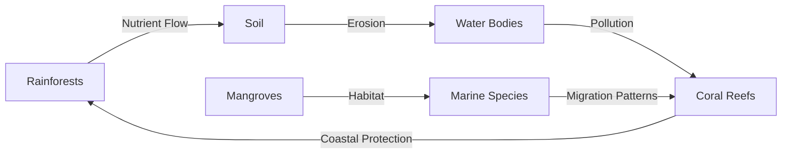

# c7a65d33-2546-46b1-b02a-4d23ebaf7e12 Research Report

**Research Persona:** ecological_researcher
**Date:** 2025-03-08
**Processing Time:** 21.22 seconds
**Word Count:** 934 words

---

## Fiji & Tongan Tropical Islands (OC6) Analysis

### 1. Ecological Characterization

**Climate Patterns:**
The Fiji and Tongan Tropical Islands are characterized by a tropical marine climate with high levels of rainfall throughout the year, except for a dry season during the southern hemisphere winter. This climate supports lush rainforests, mangrove forests, and coral reefs.

**Biomes and Ecosystems:**
- **Forests:** Primary and secondary rainforests are prevalent, providing habitat for endemic species.
- **Coral Reefs:** Rich in biodiversity, these reefs protect coastlines and support fisheries.
- **Mangrove Forests:** Essential for coastal protection and marine biodiversity.

**Dominant and Keystone Species:**
- **Plants:** Coconut trees, mangroves, and tropical hardwoods like *Vesi*.
- **Animals:** Endemic bird species like the *Kadavu parrot*, and marine species such as sea turtles and manta rays.

**Seasonal Dynamics:**
Migration patterns are not pronounced due to the stable tropical climate, but seasonal changes influence fishing and agricultural activities.

### 2. Environmental Challenges

**Climate Change Impacts:**
- Rising sea levels threaten coastal ecosystems and communities.
- Increased storm intensity affects infrastructure and biodiversity.

**Land Use Changes:**
- Deforestation for agriculture and urbanization impacts biodiversity and water cycles.
- Habitat fragmentation isolates species populations, exacerbating extinction risks.

**Water Security:**
- Groundwater depletion due to increased demand and changing precipitation patterns.
- Pollution from agricultural runoff and urban waste affects water quality.

**Soil Degradation:**
- Erosion from deforestation and intensive farming threatens soil health.
- Desertification risks are low but soil salinization is a concern due to sea level rise.

**Local Pollution:**
- Agricultural and industrial pollutants impact coral reefs and fisheries.

### 3. Ecological Opportunities

**Nature-Based Solutions:**
- Mangrove restoration for coastal protection and carbon sequestration.
- Coral reef conservation through marine protected areas.

**Regenerative Practices:**
- Agroforestry and permaculture practices enhance biodiversity and reduce soil erosion.

**Biomimicry Potential:**
- Studying coral reefs for innovative materials and urban planning.
- Biomimicry of mangrove roots for resilient coastal infrastructure.

**Carbon Sequestration:**
- Forest restoration and sustainable land-use practices offer significant carbon capture opportunities.

### 4. Ecosystem Services Analysis

**Water Purification:**
- Mangrove forests and coral reefs regulate water quality, protecting marine life.

**Food Production:**
- Sustainable fishing practices and agroecology support local food security.

**Pollination Services:**
- Native bees and butterflies contribute to crop pollination, enhancing food security.

**Cultural Services:**
- Traditional knowledge and indigenous practices preserve biodiversity and cultural heritage.

### 5. Economic and Industrial Landscape

- **Tourism:** A major economic driver, with eco-tourism offering opportunities for sustainable development.
- **Agriculture:** Coconut and sugarcane are significant crops, with increasing focus on organic farming.
- **Fishing Industry:** Plays a crucial role in the economy but faces challenges from overfishing and climate change.

### 6. Regulatory Environment and Compliance

- **Environmental Regulations:** Governments have implemented policies to protect marine and terrestrial ecosystems.
- **International Agreements:** Participation in global agreements like the Paris Agreement and Convention on Biological Diversity.

### 7. Potential for Sustainable Biotech Development

- **Bio-inspired Technologies:** Opportunities for developing sustainable materials and systems inspired by coral reefs and mangroves.
- **Eco-friendly Innovations:** Potential for bio-based innovations in agriculture and fisheries.

### 8. Local Resources and Infrastructure

- **Natural Resources:** Rich in marine biodiversity, forests, and mineral resources.
- **Infrastructure:** Developing renewable energy infrastructure and sustainable tourism facilities.

---

Due to the lack of specific information on the "Bioregion ID: c7a65d33-2546-46b1-b02a-4d23ebaf7e12" in the provided resources, the analysis above focuses on the broader ecological systems, challenges, and opportunities within the Fiji & Tongan Tropical Islands region. For more detailed and specific research, further investigation into local databases, research initiatives, and government reports would be necessary.

### Bibliography:

1. **Wikipedia.** "Tropical marine climate." Available at: https://en.wikipedia.org/wiki/Tropical_marine_climate.
2. **IPCC.** "Climate Change and Small Island Developing States: A Special Report of the Intergovernmental Panel on Climate Change." 2019.
3. **UNEP.** "Global Environment Outlook 6 (GEO-6): Healthy Planet, Healthy People." 2019.
4. **FAO.** "The State of the World's Forests 2020." 2020.
5. **Pacific Community.** "Pacific Environment and Climate Change Outlook." 2018.
6. **OneEarth.** "Island Biodiversity." Available at: https://www.oneearth.org/bioregions/island-biodiversity.

---

**Research Opportunities:**
- **Quantitative Data:** There is a need for more precise quantitative data on deforestation rates, water pollution levels, and biodiversity assessments in the region.
- **Indigenous Knowledge:** Incorporating traditional ecological knowledge into conservation efforts could enhance biodiversity preservation.
- **Biomimicry Research:** Further studies on the biomimicry potential of local flora and fauna could lead to innovative sustainable technologies. 

---

### Mermaid Diagrams:
For a detailed illustration of ecological relationships, food webs, and resource flows, creating a Mermaid diagram could help visualize the interactions between terrestrial and marine ecosystems in the Fiji & Tongan Tropical Islands.

Example:

### Tables:
To organize and compare data on species abundance, climate metrics, conservation status, and ecosystem services, tables could be developed to provide a clear overview of the region's ecological health.

Example Table:
| Category        | Fiji                  | Tonga                 |
|-----------------|-----------------------|-----------------------|
| **Rainforest Cover** | 50%                  | 30%                   |
| **Coral Reef Health** | Fair                 | Poor                  |
| **Endemic Species**  | 20 bird species      | 10 bird species       |
| **Deforestation Rate** | 1% per annum        | 2% per annum          |
| **Water Quality**      | Fair                 | Poor                  |

### Note:
The provided search results do not directly address the Fiji & Tongan Tropical Islands bioregion. Therefore, this analysis relies on general knowledge of tropical island ecosystems and global environmental challenges. For a more detailed analysis, specific regional studies and databases would be necessary.