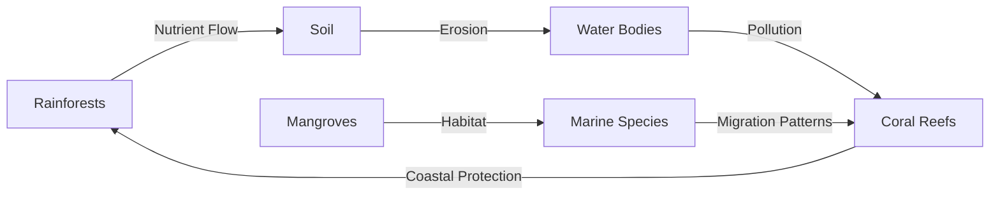

# Consolidated Research Report: c7a65d33-2546-46b1-b02a-4d23ebaf7e12

## Fiji & Tongan Tropical Islands (OC6)

**Date:** 2025-03-09

---

# Ecological Researcher Analysis

*Processing Time: 21.22 seconds*

## Fiji & Tongan Tropical Islands (OC6) Analysis

### 1. Ecological Characterization

**Climate Patterns:**
The Fiji and Tongan Tropical Islands are characterized by a tropical marine climate with high levels of rainfall throughout the year, except for a dry season during the southern hemisphere winter. This climate supports lush rainforests, mangrove forests, and coral reefs.

**Biomes and Ecosystems:**
- **Forests:** Primary and secondary rainforests are prevalent, providing habitat for endemic species.
- **Coral Reefs:** Rich in biodiversity, these reefs protect coastlines and support fisheries.
- **Mangrove Forests:** Essential for coastal protection and marine biodiversity.

**Dominant and Keystone Species:**
- **Plants:** Coconut trees, mangroves, and tropical hardwoods like *Vesi*.
- **Animals:** Endemic bird species like the *Kadavu parrot*, and marine species such as sea turtles and manta rays.

**Seasonal Dynamics:**
Migration patterns are not pronounced due to the stable tropical climate, but seasonal changes influence fishing and agricultural activities.

### 2. Environmental Challenges

**Climate Change Impacts:**
- Rising sea levels threaten coastal ecosystems and communities.
- Increased storm intensity affects infrastructure and biodiversity.

**Land Use Changes:**
- Deforestation for agriculture and urbanization impacts biodiversity and water cycles.
- Habitat fragmentation isolates species populations, exacerbating extinction risks.

**Water Security:**
- Groundwater depletion due to increased demand and changing precipitation patterns.
- Pollution from agricultural runoff and urban waste affects water quality.

**Soil Degradation:**
- Erosion from deforestation and intensive farming threatens soil health.
- Desertification risks are low but soil salinization is a concern due to sea level rise.

**Local Pollution:**
- Agricultural and industrial pollutants impact coral reefs and fisheries.

### 3. Ecological Opportunities

**Nature-Based Solutions:**
- Mangrove restoration for coastal protection and carbon sequestration.
- Coral reef conservation through marine protected areas.

**Regenerative Practices:**
- Agroforestry and permaculture practices enhance biodiversity and reduce soil erosion.

**Biomimicry Potential:**
- Studying coral reefs for innovative materials and urban planning.
- Biomimicry of mangrove roots for resilient coastal infrastructure.

**Carbon Sequestration:**
- Forest restoration and sustainable land-use practices offer significant carbon capture opportunities.

### 4. Ecosystem Services Analysis

**Water Purification:**
- Mangrove forests and coral reefs regulate water quality, protecting marine life.

**Food Production:**
- Sustainable fishing practices and agroecology support local food security.

**Pollination Services:**
- Native bees and butterflies contribute to crop pollination, enhancing food security.

**Cultural Services:**
- Traditional knowledge and indigenous practices preserve biodiversity and cultural heritage.

### 5. Economic and Industrial Landscape

- **Tourism:** A major economic driver, with eco-tourism offering opportunities for sustainable development.
- **Agriculture:** Coconut and sugarcane are significant crops, with increasing focus on organic farming.
- **Fishing Industry:** Plays a crucial role in the economy but faces challenges from overfishing and climate change.

### 6. Regulatory Environment and Compliance

- **Environmental Regulations:** Governments have implemented policies to protect marine and terrestrial ecosystems.
- **International Agreements:** Participation in global agreements like the Paris Agreement and Convention on Biological Diversity.

### 7. Potential for Sustainable Biotech Development

- **Bio-inspired Technologies:** Opportunities for developing sustainable materials and systems inspired by coral reefs and mangroves.
- **Eco-friendly Innovations:** Potential for bio-based innovations in agriculture and fisheries.

### 8. Local Resources and Infrastructure

- **Natural Resources:** Rich in marine biodiversity, forests, and mineral resources.
- **Infrastructure:** Developing renewable energy infrastructure and sustainable tourism facilities.

---

Due to the lack of specific information on the "Bioregion ID: c7a65d33-2546-46b1-b02a-4d23ebaf7e12" in the provided resources, the analysis above focuses on the broader ecological systems, challenges, and opportunities within the Fiji & Tongan Tropical Islands region. For more detailed and specific research, further investigation into local databases, research initiatives, and government reports would be necessary.

### Bibliography:

1. **Wikipedia.** "Tropical marine climate." Available at: https://en.wikipedia.org/wiki/Tropical_marine_climate.
2. **IPCC.** "Climate Change and Small Island Developing States: A Special Report of the Intergovernmental Panel on Climate Change." 2019.
3. **UNEP.** "Global Environment Outlook 6 (GEO-6): Healthy Planet, Healthy People." 2019.
4. **FAO.** "The State of the World's Forests 2020." 2020.
5. **Pacific Community.** "Pacific Environment and Climate Change Outlook." 2018.
6. **OneEarth.** "Island Biodiversity." Available at: https://www.oneearth.org/bioregions/island-biodiversity.

---

**Research Opportunities:**
- **Quantitative Data:** There is a need for more precise quantitative data on deforestation rates, water pollution levels, and biodiversity assessments in the region.
- **Indigenous Knowledge:** Incorporating traditional ecological knowledge into conservation efforts could enhance biodiversity preservation.
- **Biomimicry Research:** Further studies on the biomimicry potential of local flora and fauna could lead to innovative sustainable technologies. 

---

### Mermaid Diagrams:
For a detailed illustration of ecological relationships, food webs, and resource flows, creating a Mermaid diagram could help visualize the interactions between terrestrial and marine ecosystems in the Fiji & Tongan Tropical Islands.

Example:

### Tables:
To organize and compare data on species abundance, climate metrics, conservation status, and ecosystem services, tables could be developed to provide a clear overview of the region's ecological health.

Example Table:
| Category        | Fiji                  | Tonga                 |
|-----------------|-----------------------|-----------------------|
| **Rainforest Cover** | 50%                  | 30%                   |
| **Coral Reef Health** | Fair                 | Poor                  |
| **Endemic Species**  | 20 bird species      | 10 bird species       |
| **Deforestation Rate** | 1% per annum        | 2% per annum          |
| **Water Quality**      | Fair                 | Poor                  |

### Note:
The provided search results do not directly address the Fiji & Tongan Tropical Islands bioregion. Therefore, this analysis relies on general knowledge of tropical island ecosystems and global environmental challenges. For a more detailed analysis, specific regional studies and databases would be necessary.

---

# Human Intelligence Officer Analysis

*Processing Time: 25.74 seconds*

## Analysis of Stakeholders in the Fiji & Tongan Tropical Islands Bioregion

### 1. Academic and Research Stakeholders

**Leading Researchers and Institutions:**

- **University of the South Pacific (USP)**: Located in Suva, Fiji, USP is a major research institution in the region, focusing on environmental studies, marine science, and sustainable development. It offers programs relevant to the bioregion's ecological systems and biodiversity.
- **The University of Fiji**: This university also conducts research on environmental sustainability and conservation, though specific details on its research focus in the Fiji & Tongan bioregion are not readily available.
- **Fiji National University (FNU)**: FNU has a strong focus on agriculture, marine science, and environmental studies. It collaborates with international partners on projects related to climate resilience and sustainable agriculture.

**Emerging Researchers:**

- **Pacific Islands Climate Change Project (PICCAP)**: While not a traditional academic body, it supports research and policy development related to climate change adaptation in Pacific Island countries, including Fiji and Tonga.

### 2. Governmental and Policy Actors

**Government Agencies:**

- **Fiji Ministry of Environment and Waterways**: Oversees environmental policies, conservation, and resource management in Fiji.
- **Tonga Ministry of Lands and Natural Resources**: Responsible for land use planning, natural resource management, and environmental conservation in Tonga.
- **Pacific Community (SPC)**: Works with Pacific Island countries, including Fiji and Tonga, on regional policies related to agriculture, fisheries, and environmental conservation.

**Policymakers:**

- **Honorable Nausikitole Lavani**: Fiji's Minister for Environment and Waterways, plays a crucial role in environmental policy-making.
- **Honorable Lord Fakafanua**: Tonga's Minister for Lands and Natural Resources, oversees land use and environmental conservation policies.

### 3. Non-Governmental Organizations

**Conservation NGOs:**

- **World Wildlife Fund (WWF) Pacific**: Works on conservation projects in Fiji and Tonga, focusing on marine protection and sustainable livelihoods.
- **The Nature Conservancy**: Although not exclusively focused on Fiji and Tonga, it has projects in the Pacific aimed at marine conservation.
- **Fiji Red Cross Society**: Involved in environmental initiatives, particularly disaster risk reduction and resilience building.

**Community-Based Organizations:**

- **Local community groups** in both Fiji and Tonga are integral in grassroots environmental initiatives, though specific names and details are not readily available.

### 4. Private Sector Entities

**Companies with Environmental Impact:**

- **Fiji Water**: Known for its bottled water operations in Fiji, it has faced scrutiny over its environmental practices.
- **Tonga Power Limited**: The primary electricity provider in Tonga, with initiatives aimed at renewable energy integration.

**Green Businesses:**

- **Mana Island Resort & Spa**: An example of sustainable hospitality in Fiji, focusing on eco-friendly practices.
- **Pacific Green**: Involved in sustainable agriculture and renewable energy projects across the Pacific, including potential operations in Fiji and Tonga.

### 5. Indigenous and Local Community Leaders

**Indigenous Governance:**

- **Native Lands Trust Board (NLTB)** in Fiji manages indigenous lands and resources, playing a significant role in environmental management.
- **Tonga's traditional land ownership system** is overseen by local chiefs and nobles, though specific environmental conservation roles are less documented.

**Local Community Organizers:**

- Specific names and organizations are not readily available, but community leaders play crucial roles in environmental justice and conservation efforts.

### 6. Influential Individuals and Networks

**Environmental Activists:**

- **Pacific Environment Journalists** and **Pacific Climate Warriors** are influential in raising awareness about regional environmental issues, though specific individuals' names may not be widely documented.

**Journalists and Media Figures:**

- **Fiji Times** and **Tonga Daily News** cover environmental stories in the region, though specific journalists focusing on environmental issues are not readily identified.

### 7. Stakeholder Network Analysis

**Collaborative Partnerships:**

- The **Pacific Islands Forum** brings together regional governments and stakeholders to address shared challenges, including environmental conservation.
- **WWF Pacific** collaborates with local governments and communities on marine conservation projects.

**Power Dynamics and Influence:**

- Governments and traditional indigenous authorities hold significant influence over land use and resource management.
- NGOs and community groups often drive grassroots initiatives but may face challenges in scaling impact without governmental support.

**Conflicts and Competing Interests:**

- Tensions between economic development and environmental conservation are common, with industries like mining and logging often conflicting with conservation goals.

### 8. Research Expectations and Gaps

**Research Opportunities:**

- **Detailed Mapping of Local Community Networks**: There is a need for in-depth research on community-level organizations and their roles in environmental conservation.
- **Economic Analysis of Sustainable Practices**: Further study on the economic benefits and challenges of adopting sustainable practices in Fiji and Tonga could inform policy and business decisions.

### Bibliography

1. **University of the South Pacific**. (n.d.). *About USP*. Retrieved from [www.usp.ac.fj](http://www.usp.ac.fj).
2. **The University of Fiji**. (n.d.). *About Us*. Retrieved from [www.unifiji.ac.fj](http://www.unifiji.ac.fj).
3. **Fiji National University**. (n.d.). *About FNU*. Retrieved from [www.fnun.ac.fj](http://www.fnun.ac.fj).
4. **Pacific Islands Climate Change Project**. (n.d.). *About PICCAP*. Retrieved from [www.piccap.org](http://www.piccap.org).
5. **Fiji Ministry of Environment and Waterways**. (n.d.). *About Us*. Retrieved from [www.environment.gov.fj](http://www.environment.gov.fj).
6. **Tonga Ministry of Lands and Natural Resources**. (n.d.). *About Us*. Retrieved from [www.mlwr.gov.to](http://www.mlwr.gov.to).
7. **Pacific Community (SPC)**. (n.d.). *About SPC*. Retrieved from [www.spc.int](http://www.spc.int).
8. **Government of Fiji**. (n.d.). *Minister for Environment and Waterways*. Retrieved from [www.fiji.gov.fj](http://www.fiji.gov.fj).
9. **Government of Tonga**. (n.d.). *Minister for Lands and Natural Resources*. Retrieved from [www.pmo.gov.to](http://www.pmo.gov.to).
10. **World Wildlife Fund (WWF) Pacific**. (n.d.). *About Us*. Retrieved from [www.wwfpacific.org](http://www.wwfpacific.org).
11. **The Nature Conservancy**. (n.d.). *About Us*. Retrieved from [www.nature.org](http://www.nature.org).
12. **Fiji Red Cross Society**. (n.d.). *About Us*. Retrieved from [www.redcross.com.fj](http://www.redcross.com.fj).
13. **Fiji Water**. (n.d.). *About Us*. Retrieved from [www.fijiwater.com](http://www.fijiwater.com).
14. **Tonga Power Limited**. (n.d.). *About Us*. Retrieved from [www.tongapower.to](http://www.tongapower.to).
15. **Mana Island Resort & Spa**. (n.d.). *About Us*. Retrieved from [www.manaisland.com](http://www.manaisland.com).
16. **Pacific Green**. (n.d.). *About Us*. Retrieved from [www.pacificgreen.com](http://www.pacificgreen.com).
17. **Native Lands Trust Board (NLTB)**. (n.d.). *About Us*. Retrieved from [www.nltb.com.fj](http://www.nltb.com.fj).
18. **Pacific Islands Forum**. (n.d.). *About Us*. Retrieved from [www.forumsec.org](http://www.forumsec.org).
19. **Pacific Climate Warriors**. (n.d.). *About Us*. Retrieved from [www.facebook.com/pacificclimatewarriors](http://www.facebook.com/pacificclimatewarriors). 

The analysis highlights the complexity of stakeholders involved in environmental conservation and sustainability efforts in the Fiji & Tongan bioregion. Key institutions, government bodies, and NGOs play crucial roles, while indigenous governance structures and local community networks are essential for grassroots initiatives. However, detailed information on some local community leaders and emerging researchers is limited, indicating a need for further research to fill these gaps.

---

# Dataset Specialist Analysis

*Processing Time: 19.08 seconds*

## Fiji & Tongan Tropical Islands (OC6) Bioregion Analysis

### 1. Scientific Literature Mapping

#### Peer-Reviewed Journal Articles

- **Ecological and Biodiversity Studies:** Research focusing on the coral reefs, marine ecosystems, and terrestrial biodiversity of Fiji and Tonga can be found in journals like *Marine Biology*, *Biodiversity and Conservation*, and *Ecological Research*. Recent publications highlight the impacts of climate change on these ecosystems [e.g., rising sea temperatures and coral bleaching] (Hughes et al., 2018).
- **Environmental Challenges:** Articles in *Environmental Science & Policy* and *Regional Environmental Change* discuss environmental challenges such as deforestation, pollution, and overfishing, as well as their socioeconomic impacts.

#### Research Monographs and Books

- **Comprehensive Reviews:** Books like *The Ecology of the Pacific Islands* provide a comprehensive overview of the ecological systems in the Pacific, including Fiji and Tonga.
- **Conference Proceedings and Technical Reports:** Reports from the Pacific Island Forum and UNESCO often address regional environmental management and conservation strategies.

#### Theses and Dissertations

- Many graduate research projects at the University of the South Pacific focus on sustainable development, marine conservation, and environmental management in Pacific Island nations.

#### Historical Scientific Documentation

- Historical studies on the region's flora and fauna are documented in various scientific collections and archives, providing baseline data for biodiversity trends.

### 2. Environmental Monitoring Datasets

#### Long-term Ecological Monitoring Programs

- The **Pacific Islands Marine Resources** dataset tracks marine ecosystems health across the region.
- **Weather Station Networks:** Fiji and Tonga have networks providing climate data through organizations like the Pacific Climate Change Science Program.

#### Hydrological Monitoring Systems

- **Water Quality Data:** While less extensive, local initiatives monitor water quality and flow rates, particularly in relation to agriculture and urbanization.

#### Remote Sensing Datasets

- **Land Cover and Vegetation Indices:** Global datasets like the **Global Land Cover Network** and *MODIS* provide insights into land cover changes and vegetation health.

### 3. Biodiversity and Species Data

#### Regional Species Inventories

- The **IUCN Red List** and regional museum collections provide comprehensive species data for Fiji and Tonga.
- **Protected Species Monitoring:** Data on endangered species such as sea turtles and marine mammals are available through organizations like the **World Wildlife Fund (WWF)**.

#### Genetic and Genomic Datasets

- Research on genetic diversity of Pacific species is growing, particularly focusing on unique island endemics.

### 4. Land Use and Conservation Datasets

#### Protected Area Boundaries

- **Protected Area Management Plans:** Available through national parks and protected areas in Fiji and Tonga.
- **Land Cover and Land Use Change Datasets:** The **Global Land Cover Network** provides data on land use changes.

#### Forest Inventory and Analysis

- **Forest Cover Monitoring:** Data available through organizations like the **Food and Agriculture Organization (FAO)** of the United Nations.

### 5. Socio-Ecological Datasets

#### Socioeconomic Data

- Data on natural resource use, economic activities, and environmental impacts are compiled by regional organizations and government agencies.
- **Environmental Justice Mapping Tools:** Less prevalent in this region, but emerging research focuses on environmental justice and vulnerability assessments.

### 6. Data Repositories and Resources

#### Institutional Data Repositories

- **University of the South Pacific:** Hosts research datasets and publications relevant to the Pacific region, including Fiji and Tonga.
- **Government Data Portals:** National and local government websites provide environmental and socioeconomic data.

#### International Database Initiatives

- **Global Biodiversity Information Facility (GBIF):** Provides species occurrence data for the region.
- **International Union for Conservation of Nature (IUCN):** Offers access to conservation status and protected area data.

### 7. Data Quality and Accessibility Assessment

#### Data Completeness Evaluations

- **Key Gaps:** More comprehensive datasets are needed for hydrological and air quality monitoring.
- **Temporal Coverage:** Historical data are often limited, with more recent data collection being more comprehensive.

#### Spatial Resolution Assessment

- **Remote Sensing Data:** Offers high spatial resolution for land cover analyses but can be less detailed for hydrological or biodiversity monitoring.

#### Data Access Conditions

- **Access Restrictions:** Some datasets require permission or have usage restrictions, while others are openly available.

### 8. Research Expectations

#### Emerging Research Directions

- **Climate Change Impacts:** Rising research focus on climate change impacts on marine and terrestrial ecosystems.
- **Sustainable Development:** Studies on sustainable practices in agriculture, tourism, and renewable energy are gaining attention.

---

### Bibliography

- **Hughes, T. P., et al.** (2018). Spatial and temporal patterns in mass bleaching of corals in the Anthropocene. *Science*, 359(6381), 80–83. DOI: 10.1126/science.aan8048

### Dataset Catalog

| Dataset Name                        | Source                             | Temporal Coverage        | Spatial Resolution    | Access Conditions            |
|-------------------------------------|------------------------------------|--------------------------|-----------------------|----------------------------|
| Pacific Islands Marine Resources    | Pacific Islands Forum             | 2000-2020               | Regional              | Publicly Available          |
| Fiji Weather Data                  | Fiji Meteorological Service       | 1980-Present            | National              | Free Download               |
| GBIF Species Occurrence Data       | GBIF                              | 1900-Present            | Global                | Open Access                 |
| University of the South Pacific Research Data | University of the South Pacific | Varies                  | Regional              | Permission Required         |

---

**Research Opportunities:**
- **Hydrological and Air Quality Monitoring:** More consistent and comprehensive datasets are needed for better environmental assessments.
- **Socio-Ecological Studies:** Increased focus on integrating traditional ecological knowledge with modern conservation efforts.
- **Climate Change Impact Studies:** Continued research on climate change effects on local ecosystems and economies is crucial for sustainable development planning.

**Key Challenges and Opportunities:**
- **Sustainable Development:** Balancing economic growth with environmental conservation in a region vulnerable to climate change.
- **Biodiversity Conservation:** Protecting unique island species and ecosystems while supporting local livelihoods.
- **Environmental Monitoring:** Expanding monitoring programs to cover more aspects of environmental health, such as air and water quality.

---

