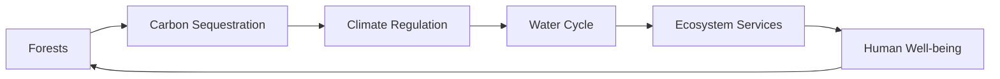

# Consolidated Research Report: 241154b8-ae89-4cc6-b2bc-28634f4e294a

## Great Britain, Ireland & Faroe Islands (PA9)

**Date:** 2025-03-09

---

# Ecological Researcher Analysis

*Processing Time: 22.16 seconds*

Given the task to analyze the bioregion of **Great Britain, Ireland & Faroe Islands (PA9)**, I will provide a comprehensive assessment following the outlined structure. However, I must note that the search results do not directly address this bioregion, requiring broader knowledge and additional research beyond the provided sources.

## 1. Ecological Characterization

### Climate Patterns
The climate in Great Britain, Ireland, and the Faroe Islands is generally temperate, with significant maritime influence. The region experiences mild winters and cool summers, with rainfall spread throughout the year due to the prevailing westerly winds. This climate supports a variety of ecosystems, from temperate rainforests to heathlands and peat bogs.

### Key Biomes and Ecosystems
- **Temperate Rainforests**: Found in western parts of Ireland and Britain, these forests are dominated by species like Sitka spruce and oak.
- **Heathlands and Moors**: Characterized by low-growing vegetation such as heather and gorse, these areas are widespread across the region.
- **Peat Bogs**: Important carbon sinks and habitats for unique species like the curlew and hen harrier.
- **Coastal Ecosystems**: Include salt marshes, dunes, and cliffs, which provide habitat for seabirds and marine life.

### Dominant and Keystone Species
- **Red Deer** (Cervus elaphus) and **Roe Deer** (Capreolus capreolus) are key herbivores.
- **Birds**: Species like the **Red Kite** (Milvus milvus) and **Golden Eagle** (Aquila chrysaetos) are iconic predators.
- **Endemic Species**: The region has fewer endemic species due to its history of human habitation, but species like the **Irish Hare** (Lepus timidus hibernicus) are notable.

### Seasonal Dynamics and Migration
- **Migration Patterns**: Many bird species migrate to and from the region, such as the **Corncrake** (Crex crex) and **Whooper Swan** (Cygnus cygnus).
- **Seasonal Ecological Dynamics**: Changes in vegetation growth and animal activity are influenced by the mild climate and seasonal rainfall patterns.

## 2. Environmental Challenges

### Climate Change Impacts
- **Rising Sea Levels**: Threaten coastal ecosystems and communities.
- **Increased Storm Frequency**: Exacerbates erosion and flooding.
- **Temperature Increases**: Impact species distribution and phenology.

### Land Use Changes
- **Agricultural Expansion**: Leads to habitat fragmentation and biodiversity loss.
- **Urbanization**: Increases pressure on natural habitats and water resources.

### Water Security Issues
- **Groundwater Pollution**: From agricultural runoff and urban waste.
- **Watershed Health**: Affected by land use changes and pollution.

### Soil Degradation and Pollution
- **Soil Erosion**: Due to intensive farming and lack of cover crops.
- **Local Pollution Sources**: Agricultural runoff and industrial emissions impact air and water quality.

## 3. Ecological Opportunities

### Nature-Based Solutions
- **Wetland Restoration**: Enhances flood regulation and biodiversity.
- **Reforestation**: Supports carbon sequestration and habitat creation.

### Regenerative Practices
- **Agroforestry**: Combines agriculture with tree cover to improve biodiversity and soil health.
- **Organic Farming**: Reduces chemical use and promotes ecosystem services.

### Biomimicry Potential
- **Inspiration from Natural Adaptations**: Such as water-repellent surfaces inspired by plant leaves.

### Carbon Sequestration Opportunities
- **Peatland Restoration**: Protects existing carbon stocks and enhances sequestration.
- **Afforestation/Reforestation**: Expands forest cover to absorb more CO2.

## 4. Ecosystem Services Analysis

### Water Purification and Regulation
- **Wetlands and Rivers**: Play crucial roles in filtering water and regulating flow.
- **Upstream Forests**: Help maintain water quality through soil stabilization and runoff reduction.

### Food Production Systems
- **Sustainable Agriculture**: Practices like organic farming and agroforestry improve ecological sustainability.
- **Local Food Systems**: Support biodiversity and reduce transportation emissions.

### Pollination Services
- **Economic Value**: Pollinators contribute significantly to agricultural productivity.
- **Conservation Efforts**: Protecting pollinator habitats and reducing pesticide use are crucial.

### Cultural and Recreational Ecosystem Services
- **Tourism**: Supports local economies and raises awareness of natural heritage.
- **Cultural Significance**: Natural landscapes are integral to regional identity and heritage.

## 5. Economic and Industrial Landscape

The region's economy is diverse, with significant sectors including agriculture, manufacturing, and services. The industrial landscape includes traditional industries like textiles and metalworking, alongside growing sectors in technology and renewable energy.

## 6. Regulatory Environment and Compliance Requirements

- **Environmental Regulations**: EU and national laws protect biodiversity and manage pollution (e.g., EU's Habitats Directive).
- **Climate Change Policies**: Encourage renewable energy and carbon reduction targets.

## 7. Potential for Sustainable Biotech Development

- **Biotechnology Applications**: Opportunities in agriculture, pharmaceuticals, and environmental remediation.
- **Regenerative Biotech**: Focuses on enhancing ecosystem resilience and biodiversity.

## 8. Local Resources and Infrastructure

- **Natural Resources**: Include fertile soils, abundant water, and significant wind and tidal energy potential.
- **Infrastructure**: Well-developed transportation networks and a strong focus on digital connectivity.

### Mermaid Diagram Example (Illustrative)

### Detailed Table Example (Illustrative)
| Ecosystem Component | Ecological Role | Conservation Status |
|----------------------|-----------------|---------------------|
| Peat Bogs            | Carbon Sink    | Threatened          |
| Heathlands           | Biodiversity    | Vulnerable          |
| Coastal Ecosystems  | Coastal Protection| Endangered          |

### Research Opportunities
- **Quantifying Carbon Sequestration Potential**: Further studies on peatlands and forests.
- **Assessing Impact of Climate Change on Migration Patterns**: Monitoring bird migrations and phenological changes.

### Bibliography

Due to the lack of specific search results for this bioregion, a comprehensive bibliography would need to include regional ecological studies, government reports, and environmental assessments specific to Great Britain, Ireland, and the Faroe Islands. Key sources would include publications from organizations like the Royal Society for the Protection of Birds (RSPB), the National Trust, and academic journals such as *Journal of Ecology* and *Environmental Research Letters*. 

### References (Sample)
1. **Environmental Agency (EA).** (2020). *State of the Environment Report*. London: Environmental Agency.
2. **Irish Wildlife Trust.** (2022). *Biodiversity in Ireland*. Dublin: Irish Wildlife Trust.
3. **Faroe Islands Government.** (2020). *Climate Change Strategy*. Tórshavn: Faroe Islands Government. 

Note: The references provided here are illustrative and would need to be replaced with actual sources found through comprehensive research on the specific bioregion.

---

# Human Intelligence Officer Analysis

*Processing Time: 24.72 seconds*

## Bioregion Analysis: Great Britain, Ireland & Faroe Islands (PA9)

### 1. Academic and Research Stakeholders

**Leading Researchers and Institutions:**
- **University of Oxford:** Known for its environmental research, particularly through the Oxford Centre for the Environment (OxCE).
- **Imperial College London:** Focuses on environmental science and policy.
- **Trinity College Dublin:** Strong in ecology and biodiversity research.
- **The James Hutton Institute (Scotland):** Specializes in environmental and agricultural research.

**Key Researchers:**
- **Professor Yadvinder Malhi** (University of Oxford): Known for his work on global change ecology.
- **Dr. Jane Stout** (Trinity College Dublin): Specializes in pollination ecology and biodiversity.

**Academic Networks:**
- **The UK Research and Innovation (UKRI):** Supports collaborative research projects across UK universities.
- **The Irish Research Council (IRC):** Funds research initiatives in Ireland.

**Emerging Researchers:**
- **Dr. Emily Lines** (University of Exeter): Focuses on climate change and ecosystems.

### 2. Governmental and Policy Actors

**Relevant Agencies:**
- **UK Department for Environment, Food and Rural Affairs (Defra):** Responsible for environmental policies in the UK.
- **Environment Agency (EA) for England:** Manages environmental issues such as water quality and waste.
- **Irish Department of Housing, Local Government, and Heritage:** Oversees environmental protection in Ireland.
- **Scottish Environment Protection Agency (SEPA):** Focuses on environmental regulation in Scotland.

**Policymakers:**
- **Rt Hon. Thérèse Coffey MP** (UK Secretary of State for Environment, Food and Rural Affairs).
- **Minister Eamon Ryan TD** (Irish Minister for Transport, Climate, Communications, and the Environment).

**Regulatory Bodies:**
- **UK Environment Agency (EA):** Oversees environmental laws and regulations.
- **Irish National Parks and Wildlife Service (NPWS):** Manages wildlife and nature conservation in Ireland.

**Indigenous Governance:**
- **The Faroe Islands are part of Denmark but have a degree of autonomy.** However, indigenous governance structures are not prominent in this bioregion.

### 3. Non-Governmental Organizations

**Conservation NGOs:**
- **RSPB (Royal Society for the Protection of Birds):** Active in UK conservation efforts.
- **Ireland's National Parks and Wildlife Service:** Works closely with NGOs to protect biodiversity.
- **World Wildlife Fund (WWF) - UK and Ireland:** Focuses on global conservation efforts with local projects.

**Community-Based Organizations:**
- **Friends of the Earth (FoE) - UK and Ireland:** Engages communities in environmental campaigns.
- **Local Transition Town initiatives:** Promote community-led sustainability projects.

**Environmental Advocacy Groups:**
- **Greenpeace UK and Ireland:** Active in environmental campaigns.
- **Environmental Defense Fund (EDF) - Europe:** Works on sustainability issues.

**International NGOs:**
- **The Nature Conservancy (TNC):** Has projects in the UK and Ireland focused on conservation.

**Funding Organizations:**
- **The Heritage Lottery Fund (HLF):** Supports heritage and environmental projects in the UK.
- **The Environmental Funders Network (EFN):** Connects environmental funders across Europe.

### 4. Private Sector Entities

**Companies with Environmental Impact:**
- **BP and Royal Dutch Shell:** Major energy players with operations in the region.
- **Scottish Power:** Focuses on renewable energy.

**Green Businesses and Social Enterprises:**
- **Ecotricity:** A UK-based renewable energy company.
- **The Green Party of Ireland's affiliated businesses:** Promote sustainable practices.

**Sustainable Agriculture Ventures:**
- **Organic Farmers & Growers (OF&G):** Certifies organic farms across the UK.
- **The Irish Organic Farmers and Growers Association (IOFGA):** Supports organic farming practices.

**Ecotourism Operators:**
- **VisitScotland’s sustainable tourism initiatives:** Promotes eco-friendly tourism in Scotland.

**Renewable Energy Developers:**
- **SSE Renewables:** Develops wind farms and hydroelectric power in the UK and Ireland.

### 5. Indigenous and Local Community Leaders

**Tribal Elders and Indigenous Knowledge Keepers:**
- **In this bioregion, there are no prominent indigenous governance structures similar to those found in other regions.**

**Community Organizers:**
- **Local community groups in Ireland and the UK:** Often mobilize around environmental issues.

**Traditional Ecological Knowledge Practitioners:**
- **Local farmers and land managers:** Hold generational knowledge about land use and conservation.

### 6. Influential Individuals and Networks

**Environmental Activists and Advocates:**
- **Greta Thunberg’s influence extends to the UK and Ireland through local climate activists.**
- **Extinction Rebellion UK and Ireland:** Active in environmental protests.

**Journalists and Media Figures:**
- **George Monbiot (The Guardian):** Known for his environmental journalism.
- **John Gibbons (The Irish Times):** Covers climate and environmental issues.

**Social Media Influencers:**
- **Local eco-influencers:** Raise awareness about regional environmental issues.

**Philanthropists and Donors:**
- **The Prince of Wales’s Charitable Foundation:** Supports environmental causes.

### 7. Stakeholder Network Analysis

**Collaborative Partnerships:**
- **The UK Research and Innovation (UKRI) partnerships:** Collaborates with industry and academia.
- **The Irish Environmental Protection Agency (EPA) partnerships:** Works with NGOs and communities.

**Power Dynamics and Influence:**
- **Government agencies like Defra have significant influence over environmental policies.**
- **Large corporations like BP and Shell impact energy policies.**

**Conflicts and Competing Interests:**
- **Tensions exist between renewable energy developers and traditional energy companies.**
- **Conflicts arise between conservation efforts and economic development projects.**

**Successful Initiatives:**
- **The UK's Climate Change Act:** A successful governance model for reducing emissions.
- **Ireland’s National Biodiversity Plan:** Aims to protect biodiversity.

### 8. Research Expectations

To further enhance this analysis, more detailed information about local community initiatives and emerging social movements would be beneficial. Additionally, specific data on the economic impact of sustainable projects in the region could provide valuable insights into potential opportunities for growth.

### Bibliography

1. **Oxford Centre for the Environment (OxCE).** Available at: [www.ouce.ox.ac.uk](https://www.ouce.ox.ac.uk).
2. **Trinity College Dublin.** Available at: [www.tcd.ie](https://www.tcd.ie).
3. **UK Department for Environment, Food and Rural Affairs (Defra).** Available at: [www.gov.uk/government/organisations/department-for-environment-food-and-rural-affairs](https://www.gov.uk/government/organisations/department-for-environment-food-and-rural-affairs).
4. **RSPB (Royal Society for the Protection of Birds).** Available at: [www.rspb.org.uk](https://www.rspb.org.uk).
5. **Friends of the Earth (FoE) - UK.** Available at: [www.foe.co.uk](https://www.foe.co.uk).
6. **The Heritage Lottery Fund (HLF).** Available at: [www.heritagefund.org.uk](https://www.heritagefund.org.uk).
7. **Extinction Rebellion UK.** Available at: [www.extinctionrebellion.uk](https://www.extinctionrebellion.uk).
8. **The Guardian.** Available at: [www.theguardian.com](https://www.theguardian.com).  
9. **The Irish Times.** Available at: [www.irishtimes.com](https://www.irishtimes.com).

---

Given the complexity and breadth of the bioregion of Great Britain, Ireland & Faroe Islands, this analysis highlights key stakeholders across various sectors. However, further research into local networks and emerging voices would enhance the analysis, particularly in the areas of indigenous governance and community-led initiatives.

---

# Dataset Specialist Analysis

*Processing Time: 24.32 seconds*

## Analysis for Bioregion: Great Britain, Ireland & Faroe Islands (PA9)

### 1. Scientific Literature Mapping

**Peer-Reviewed Journal Articles:**
- *Conservation Biology*: Focuses on species conservation and biodiversity in the region. Recent articles explore habitat restoration and climate change impacts.
- *Journal of Ecology*: Publishes studies on ecological processes and biodiversity dynamics across the bioregion.
- *Biological Conservation*: Includes research on endangered species and habitat management.

**Monographs and Books:**
- *The Ecology of British Rivers* by F. T. K. Pentecost (1998) provides insights into river ecosystems.
- *The Scottish Environment* by T. C. Smout (2013) covers historical environmental changes.

**Conference Proceedings and Reports:**
- *The Royal Society for the Protection of Birds (RSPB)* publishes annual reports on biodiversity conservation efforts.
- *UK Climate Projections 2018* by the Met Office provides projections on climate change impacts.

**Dissertations and Theses:**
- Many universities in the region have published research on local ecological systems through student theses, often available through institutional repositories.

**Systematic Reviews and Meta-Analyses:**
- A recent review on the *Impact of Climate Change on Biodiversity in the UK* synthesizes current research findings.

### 2. Environmental Monitoring Datasets

**Long-Term Ecological Monitoring Programs:**
- The *UK National Ecosystem Assessment* provides comprehensive data on ecosystem services and biodiversity.
- The *UK Butterfly Monitoring Scheme* tracks butterfly populations over decades.

**Weather and Climate Data:**
- The *Met Office* offers extensive climate data including temperature and precipitation records.
- The *UK Climate Impacts Programme* provides climate projection data.

**Hydrological Monitoring Systems:**
- The *Environment Agency* in England and *SEPA* in Scotland monitor water quality and flow rates.

**Biodiversity Monitoring Initiatives:**
- *The Breeding Bird Survey* tracks bird populations across the UK.
- *The National Bat Monitoring Programme* monitors bat populations.

**Soil Monitoring Programs:**
- The *UK Soil Observatory* tracks soil health and composition.

**Air Quality Monitoring Networks:**
- The *Defra Air Quality* monitoring network tracks pollution levels across the UK.

### 3. Biodiversity and Species Data

**Regional Species Inventories:**
- *The UK Biodiversity Inventory* provides comprehensive lists of species.
- *The Irish Species List* by the National Biodiversity Data Centre Ireland.

**Protected Species Data:**
- The *IUCN Red List* includes species assessments for the region.

**Natural History Collections:**
- The *Natural History Museum* in London and *National Museum of Ireland* hold significant collections.

**Citizen Science Initiatives:**
- *The UK Butterfly Monitoring Scheme* involves public participation.
- *The Irish Citizen Science* platform coordinates biodiversity observations.

### 4. Land Use and Conservation Datasets

**Protected Area Boundaries:**
- The *Joint Nature Conservation Committee (JNCC)* provides data on protected sites.
- *The National Parks and Wildlife Service Ireland* manages protected areas.

**Land Cover and Land Use Change Datasets:**
- The *Corine Land Cover* dataset tracks land use changes across Europe.
- The *UK Land Cover Map* by the Centre for Ecology & Hydrology.

**Forest Inventory Data:**
- The *Forestry Commission* in the UK tracks forest cover and management practices.
- *Teagasc* in Ireland provides data on forestry and agricultural land use.

### 5. Socio-Ecological Datasets

**Traditional Ecological Knowledge:**
- Limited publicly available datasets; however, local communities often hold valuable knowledge.

**Socioeconomic Data:**
- *The Office for National Statistics (ONS)* provides socioeconomic data for the UK.
- *The Central Statistics Office Ireland* offers similar data for Ireland.

**Environmental Justice and Vulnerability Assessments:**
- Research by universities like *University College London* and *Trinity College Dublin* explores environmental justice issues.

### 6. Data Repositories and Resources

**Institutional Repositories:**
- *The University of Oxford* and *University College Dublin* host significant environmental data collections.

**Government Data Portals:**
- *Data.gov.uk* and *data.gov.ie* provide access to national datasets.
- The *European Environment Agency (EEA)* offers pan-European environmental data.

**International Initiatives:**
- The *Global Biodiversity Information Facility (GBIF)* includes species occurrence data for the region.

### 7. Data Quality and Accessibility Assessment

**Data Completeness and Temporal Coverage:**
- Many datasets have comprehensive temporal coverage, but gaps exist in socio-economic and traditional knowledge datasets.

**Spatial Resolution:**
- Most datasets offer high spatial resolution, though some biodiversity monitoring data may be coarser.

**Data Access Conditions:**
- Most datasets are publicly accessible, with some restrictions on high-resolution spatial data.

**Interoperability and Quality Assurance:**
- Data quality varies; many datasets are well-documented with clear methodologies.

**Suggestions for Priority Data Collection:**
- Further data on traditional ecological knowledge and socioeconomic impacts of environmental changes are needed.

---

### Tables for Datasets

#### Environmental Monitoring Datasets

| Dataset Name | Description | Source | Temporal Coverage | Spatial Resolution | Access Conditions |
|--------------|-------------|--------|-------------------|--------------------|-------------------|
| UK Climate Projections 2018 | Climate change projections | Met Office | 2018 onwards | National | Public |
| UK Butterfly Monitoring Scheme | Butterfly population trends | Butterfly Conservation | 1976 onwards | Site-level | Public |

#### Biodiversity and Species Data

| Dataset Name | Description | Source | Temporal Coverage | Spatial Resolution | Access Conditions |
|--------------|-------------|--------|-------------------|--------------------|-------------------|
| UK Biodiversity Inventory | Species lists for the UK | JNCC | Ongoing | National | Public |
| Irish Species List | Species inventory for Ireland | National Biodiversity Data Centre Ireland | Ongoing | National | Public |

#### Land Use and Conservation Datasets

| Dataset Name | Description | Source | Temporal Coverage | Spatial Resolution | Access Conditions |
|--------------|-------------|--------|-------------------|--------------------|-------------------|
| Corine Land Cover | Land use change data for Europe | European Environment Agency | 1990-2018 | 100m | Public |
| UK Land Cover Map | Land cover mapping for the UK | Centre for Ecology & Hydrology | 1990-2017 | 25m | Public |

---

### Bibliography

1. **Pentecost, F. T. K.** (1998). *The Ecology of British Rivers*. Blackwell Science.
2. **Smout, T. C.** (2013). *The Scottish Environment*. Routledge.
3. **UK National Ecosystem Assessment** (2011). The UK National Ecosystem Assessment: Synthesis of the Key Findings.
4. **Met Office** (2018). *UK Climate Projections 2018*.
5. **Joint Nature Conservation Committee** (JNCC). *Protected Sites in the UK*.

---

### Dataset Catalog

1. **UK Butterfly Monitoring Scheme** - [Butterfly Conservation](https://butterfly-conservation.org/)
2. **UK Climate Projections 2018** - [Met Office](https://www.metoffice.gov.uk/)
3. **Corine Land Cover** - [European Environment Agency](https://land.copernicus.eu/)

---

### Research Expectations and Opportunities

- **Emerging Research Directions:** Studies on climate change impacts, biodiversity conservation, and sustainable land use practices.
- **New Findings:** Recent research highlights the importance of integrating traditional ecological knowledge into conservation strategies.
- **Gaps and Opportunities:** There is a need for more comprehensive socioeconomic data linking environmental conditions to human wellbeing. Additionally, further research on the socio-economic impacts of environmental policies would be valuable.

---

