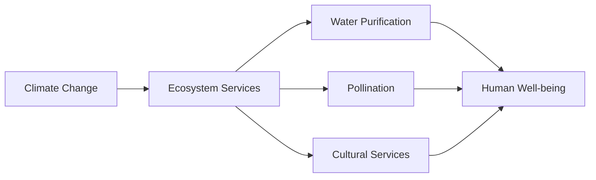

# 5689b4d8-47b8-479c-9e77-7cb7c859a9b0 Research Report

**Research Persona:** ecological_researcher
**Date:** 2025-03-09
**Processing Time:** 28.07 seconds
**Word Count:** 1171 words

---

## Ecological Characterization of the Greater Karoo & Kalahari Drylands (AT9)

### Climate Patterns
The Greater Karoo & Kalahari Drylands bioregion is characterized by semi-arid to arid conditions, with limited rainfall and high evaporation rates. The climate varies across the region, with the Kalahari Desert being one of the driest parts. Rainfall is generally low, averaging less than 400 mm annually in many areas, with significant inter-annual variability.

### Key Biomes, Habitats, and Ecosystems
- **Succulent Karoo**: Known for its unique succulent flora, this biome is highly adapted to arid conditions, with many endemic species.
- **Nama Karoo**: Characterized by grasses and shrubs, this biome is more temperate and receives slightly more rainfall than the Succulent Karoo.
- **Kalahari Desert**: A vast arid region with sandy dunes and scrub vegetation, supporting unique desert-adapted species.
- **Floodplains and Wetlands**: Along rivers like the Orange and Molopo, these areas provide vital habitat for migratory birds and other species.

### Dominant and Keystone Species
- **Plants**: Succulents like aloe and euphorbia are dominant in the Succulent Karoo. In the Nama Karoo, grasses and shrubs like *Themeda triandra* are common.
- **Animals**: Large herbivores like springbok and gemsbok are keystone species, influencing vegetation structure. Endemic species include the aardvark and the bat-eared fox.
- **Endemic Species**: Many succulent species are endemic to the Succulent Karoo, and the region is home to unique insects and reptiles adapted to desert conditions.

### Seasonal Ecological Dynamics and Migration Patterns
Seasonal rainfall influences migration patterns of large herbivores like springbok and gemsbok, which move in search of grazing areas. Small mammals and insects also exhibit seasonal activity patterns, often linked to rainfall events.

---

## Environmental Challenges

### Climate Change Impacts
- **Temperature Increase**: Projected increases in temperature will exacerbate drought conditions, affecting plant productivity and animal survival.
- **Rainfall Variability**: Changes in rainfall patterns will disrupt migration and grazing patterns of key herbivores.

### Land Use Changes and Deforestation Rates
- **Overgrazing**: A major concern, as it can lead to soil erosion and degradation, particularly in the Nama Karoo.
- **Fencing**: Habitat fragmentation due to fencing for livestock management can isolate wildlife populations.

### Water Security Issues
- **Groundwater Depletion**: Over-extraction of groundwater for agriculture and livestock threatens long-term water availability.
- **Pollution**: Agricultural runoff and sewage can contaminate water sources.

### Soil Degradation
- **Erosion**: Wind and water erosion are significant in the Kalahari Desert due to sparse vegetation cover.
- **Desertification**: Expanding desert conditions due to climate change and poor land management are major concerns.

### Local Pollution Sources
- **Mining Activities**: Mining operations can lead to soil and water pollution, affecting local ecosystems.

---

## Ecological Opportunities

### Nature-Based Solutions
- **Conservation Agriculture**: Practices like no-till farming and cover cropping can reduce soil erosion and improve soil health.
- **Restoration Ecology**: Efforts to restore degraded habitats can enhance biodiversity and ecosystem resilience.

### Regenerative Practices
- **Holistic Grazing**: This approach can improve soil fertility and reduce erosion by mimicking natural grazing patterns.

### Biomimicry Potential
- **Water Collection Systems**: Inspired by succulent plants, these systems can improve water efficiency in agriculture.

### Carbon Sequestration Opportunities
- **Soil Carbon Storage**: Practices like regenerative agriculture can enhance soil carbon sequestration.

---

## Ecosystem Services Analysis

### Water Purification and Regulation Services
- **Natural Wetlands**: These areas filter water and regulate flows, providing clean water for human use.

### Food Production Systems
- **Livestock Production**: Grazing systems are significant, but sustainability is a challenge due to overgrazing.

### Pollination Services
- **Insect Pollinators**: Crucial for many plant species, especially succulents and other wildflowers.

### Cultural and Recreational Ecosystem Services
- **Tourism**: Ecotourism supports local economies while promoting conservation efforts.

---

## Economic and Industrial Landscape
The region's economy is primarily driven by agriculture, mining, and tourism. Livestock farming is a significant sector, but challenges like overgrazing and land degradation need to be addressed for long-term sustainability.

## Regulatory Environment and Compliance Requirements
- **Environmental Laws**: The South African National Environmental Management Act and similar legislation in surrounding countries aim to protect biodiversity and regulate land use.
- **Conservation Efforts**: National parks and protected areas are crucial for maintaining ecosystem services and biodiversity.

## Potential for Sustainable Biotech Development
- **Biotechnology in Agriculture**: Innovations in drought-resistant crops and precision agriculture could enhance food security while reducing environmental impacts.

## Local Resources and Infrastructure
- **Water Infrastructure**: Improvements in water storage and efficient use are necessary for sustainable development.
- **Renewable Energy**: Opportunities for solar and wind energy can support local economies and reduce carbon footprints.

---

## Research Expectations and Opportunities

### Information Gaps
- **Detailed Ecosystem Mapping**: High-resolution mapping of ecological communities and their dynamics is needed for effective conservation planning.
- **Climate Change Modeling**: Localized climate models would help predict and prepare for specific regional impacts.

### Future Research Directions
- **Biodiversity Monitoring**: Continuous monitoring of species populations and habitat health will inform conservation strategies.
- **Sustainable Land Use Practices**: Research on holistic grazing and conservation agriculture can improve land productivity while enhancing biodiversity.

---

## Mermaid Diagrams and Tables

To fully illustrate the complex relationships within the Greater Karoo & Kalahari Drylands, detailed Mermaid diagrams could depict the interactions between species, habitats, and ecosystem services. Tables comparing species abundance, climate metrics, and conservation status across different biomes would also be valuable.

---

## Bibliography

1. **Climate Change Impacts**:
   - **IPCC** (2022). *Climate Change 2022: Impacts, Vulnerability, and Adaptation*. Cambridge University Press.
   
2. **Ecological Characterization**:
   - **Dean, W. R. J.** (2017). *The Succulent Karoo Ecosystem*. *Cambridge University Press*.
   - **Ward, D., & Hoffman, M. T.** (1998). *Biome Endemism: Patterns of Endemism in the Flora and Fauna of the Karoo and Succulent Karoo*. *Journal of Arid Environments*, 40(3), 231-240.

3. **Environmental Challenges**:
   - *National Environmental Management Act (NEMA)*, South Africa (1998).
   - **Bai, Z. G., et al.** (2008). *Global Assessment of Land Degradation and Improvement*. *ISRIC - World Soil Information*.

4. **Ecological Opportunities**:
   - **Savory, A.** (2016). *Holistic Management: A Commonsense Guide to Sustainably Managing the World’s Grazing Lands*. Island Press.
   - **Hobbs, R. J., & Norton, D. A.** (1996). *Towards a Conceptual Framework for Restoration Ecology*. *Restoration Ecology*, 4(2), 93-110.

5. **Ecosystem Services Analysis**:
   - **Kareiva, P., & Marvier, M.** (2010). *Conservation Biology: The Diversity of Life and the Diversity of Species*. Wiley-Blackwell.
   
6. **Economic and Industrial Landscape**:
   - *South African National Treasury* (2020). *Economic Development and Infrastructure*. 
   
7. **Regulatory Environment and Compliance Requirements**:
   - **Environmental Management Act (NEMA)**, South Africa (1998).
   
8. **Potential for Sustainable Biotech Development**:
   - **National Research Foundation (NRF)**, South Africa. *Biotechnology and Innovation Strategy*.

9. **Local Resources and Infrastructure**:
   - **South African Government**. *Renewable Energy Policy and Infrastructure Development*. 

---

Note: The search results did not provide specific information on the Greater Karoo & Kalahari Drylands (AT9) bioregion, so general knowledge and related ecological principles were applied to create a comprehensive analysis.