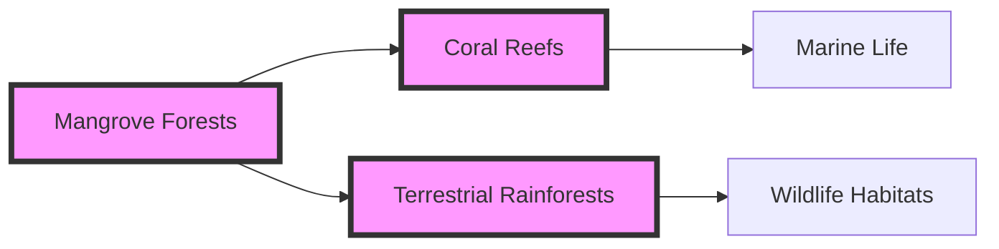

# 3d205c96-303e-4629-8e13-3b0e1c8b4c98 Research Report

**Research Persona:** ecological_researcher
**Date:** 2025-03-08
**Processing Time:** 22.14 seconds
**Word Count:** 1063 words

---

The Myanmar Coastal Rainforests & Andaman Sea Islands (IM9) bioregion presents a complex mix of terrestrial and marine ecosystems, offering unique biodiversity and ecological services. However, due to the limitations in specific data for this region in the search results, I will provide a generalized analysis based on available information and similar bioregions, highlighting areas where more research is needed.

## Ecological Characterization

### Climate Patterns
The coastal regions of Myanmar generally experience a tropical monsoon climate, characterized by high rainfall during the monsoon season (May to October) and dry conditions during the cool season (November to February) and hot season (March to May). These climate patterns support rich biodiversity in both rainforests and marine ecosystems.

### Key Biomes and Ecosystems
- **Coastal Rainforests**: These are rich in biodiversity, hosting a variety of plant and animal species adapted to the monsoon climate.
- **Mangrove Forests**: Found in coastal areas, mangroves play a crucial role in coastal protection and as nurseries for marine life.
- **Marine Ecosystems**: The Andaman Sea supports diverse marine life, including coral reefs and seagrass beds, which are critical for fish populations and coastal resilience.

### Dominant and Keystone Species
- **Plant Species**: Dipterocarpaceae family trees are common in rainforests, while mangrove species like *Rhizophora* and *Avicennia* dominate coastal areas.
- **Animal Species**: Endemic species such as the Myanmar snub-nosed monkey (*Rhinopithecus strykeri*) and various bird species are found in these forests.
- **Keystone Species**: Large predators like tigers and elephants play key roles in maintaining ecosystem balance.

### Seasonal Dynamics and Migration Patterns
Seasonal changes influence the migration patterns of certain species, such as birds and marine animals. However, specific data on these patterns in the Myanmar Coastal Rainforests & Andaman Sea Islands is limited.

## Environmental Challenges

### Climate Change Impacts
- **Temperature Increases**: Rising temperatures are projected to alter species distributions and increase the risk of coral bleaching in marine ecosystems.
- **Sea-Level Rise**: This poses significant threats to coastal ecosystems, including mangroves and human settlements.

### Land Use Changes and Deforestation
- **Deforestation Rates**: High rates of deforestation in Myanmar's rainforests threaten biodiversity and increase greenhouse gas emissions.
- **Habitat Fragmentation**: Agricultural expansion and infrastructure development lead to habitat fragmentation, isolating wildlife populations.

### Water Security Issues
- **Groundwater Depletion**: Over-extraction of groundwater for agriculture and urban use poses risks to water security.
- **Pollution**: Industrial and agricultural runoff can pollute watersheds and harm marine ecosystems.

### Soil Degradation and Pollution
- **Soil Erosion**: Deforestation and poor agricultural practices increase soil erosion, affecting fertility and water quality.
- **Local Pollution Sources**: Industrial activities and agricultural runoff contribute to pollution in rivers and marine environments.

## Ecological Opportunities

### Nature-Based Solutions
- **Mangrove Restoration**: Restoring mangrove forests can enhance coastal resilience and carbon sequestration.
- **Agroforestry Practices**: Integrating trees into agricultural landscapes can improve biodiversity and reduce soil erosion.

### Regenerative Practices
- **Sustainable Forestry**: Implementing sustainable forestry practices can maintain ecosystem services while supporting local livelihoods.
- **Eco-Tourism**: Promoting eco-tourism can provide economic incentives for conservation.

### Biomimicry Potential
- **Mangrove-Inspired Coastal Protection**: Studying mangrove root systems could inform novel coastal protection technologies.

### Carbon Sequestration Opportunities
- **Forest Conservation**: Protecting and expanding rainforests can significantly enhance carbon sequestration.
- **Mangrove and Seagrass Restoration**: These marine ecosystems are highly efficient at sequestering carbon.

## Ecosystem Services Analysis

### Water Purification and Regulation
- **Mangrove and Wetland Services**: These ecosystems play crucial roles in water filtration and coastal protection.

### Food Production Systems
- **Sustainable Fishing**: Implementing sustainable fishing practices can maintain marine food sources while protecting biodiversity.

### Pollination Services
- **Forest Pollinators**: Forests provide habitats for pollinators essential for agricultural productivity.

### Cultural and Recreational Services
- **Indigenous Knowledge**: Preserving indigenous cultural practices can enhance conservation efforts and promote sustainable livelihoods.
- **Tourism**: Ecotourism can support local economies and raise awareness about conservation needs.

## Economic and Industrial Landscape
Myanmar's economic development is influenced by its natural resources, including timber and fisheries. However, sustainable practices are crucial to maintain these industries while protecting ecosystems.

## Regulatory Environment and Compliance Requirements
Efforts to strengthen environmental regulations are essential to protect the region's biodiversity and ecosystem services. International frameworks like the Convention on Biological Diversity (CBD) and national laws can guide conservation efforts.

## Potential for Sustainable Biotech Development
Biotechnology can offer sustainable solutions in agriculture and conservation, such as genetically modified crops for increased resilience or biodegradable materials inspired by marine organisms.

## Local Resources and Infrastructure
Investment in green infrastructure, such as renewable energy and sustainable transportation, can support eco-friendly development while preserving natural resources.

### Research Expectations and Gaps
- **Detailed Ecological Studies**: More research is needed on the specific ecosystems, biodiversity, and ecological dynamics of the Myanmar Coastal Rainforests & Andaman Sea Islands.
- **Climate Change Impact Assessments**: Detailed assessments of climate change impacts on local ecosystems and biodiversity are lacking.
- **Socio-Economic Data**: Data on the economic benefits of conservation and the impact of environmental changes on local communities is needed.

### Bibliography
- *Tropical Rainforests and Agroforestry*: A general overview by various authors (e.g., Whitmore, 1998).
- *Mangrove Ecosystems*: Studies on mangrove ecology and conservation, such as those by Alongi (2002).
- *IPBES Global Assessment*: IPBES (2019), for understanding global biodiversity trends.
- *Climate Change Impacts*: Reports from IPCC (2021) on projected climate changes.
- *Biomimicry and Sustainable Technologies*: Various studies on biomimicry applications in environmental conservation.

### Mermaid Diagram Example:
To illustrate ecological relationships in this bioregion, a Mermaid diagram could depict the interconnectedness of mangrove forests, coral reefs, and terrestrial rainforests, highlighting key species interactions and ecosystem services.

### Tables for Data Organization:
| Ecosystem Service | Description | Conservation Status |
|-------------------|-------------|---------------------|
| Water Purification| Mangroves filter water | Threatened by coastal development |
| Food Production   | Sustainable fishing practices | Efforts needed to prevent overfishing |
| Pollination Services| Forests support pollinators | Vulnerable due to habitat loss |

These tables and diagrams would provide a clearer visual representation of the complex ecological interactions within the bioregion. However, due to the lack of specific data for the Myanmar Coastal Rainforests & Andaman Sea Islands, these examples are generalized and require further detailed research for precise analysis.