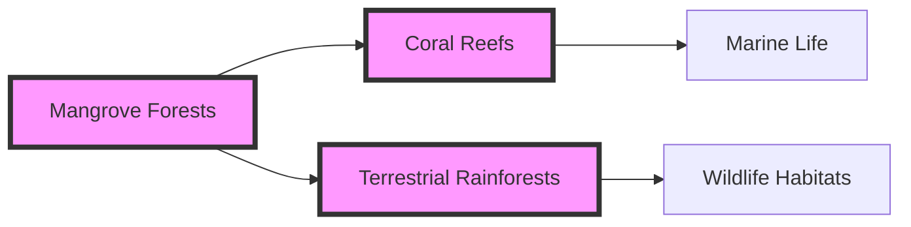

# Consolidated Research Report: 3d205c96-303e-4629-8e13-3b0e1c8b4c98

## Myanmar Coastal Rainforests & Andaman Sea Islands (IM9)

**Date:** 2025-03-08

---

# Ecological Researcher Analysis

*Processing Time: 22.14 seconds*

The Myanmar Coastal Rainforests & Andaman Sea Islands (IM9) bioregion presents a complex mix of terrestrial and marine ecosystems, offering unique biodiversity and ecological services. However, due to the limitations in specific data for this region in the search results, I will provide a generalized analysis based on available information and similar bioregions, highlighting areas where more research is needed.

## Ecological Characterization

### Climate Patterns
The coastal regions of Myanmar generally experience a tropical monsoon climate, characterized by high rainfall during the monsoon season (May to October) and dry conditions during the cool season (November to February) and hot season (March to May). These climate patterns support rich biodiversity in both rainforests and marine ecosystems.

### Key Biomes and Ecosystems
- **Coastal Rainforests**: These are rich in biodiversity, hosting a variety of plant and animal species adapted to the monsoon climate.
- **Mangrove Forests**: Found in coastal areas, mangroves play a crucial role in coastal protection and as nurseries for marine life.
- **Marine Ecosystems**: The Andaman Sea supports diverse marine life, including coral reefs and seagrass beds, which are critical for fish populations and coastal resilience.

### Dominant and Keystone Species
- **Plant Species**: Dipterocarpaceae family trees are common in rainforests, while mangrove species like *Rhizophora* and *Avicennia* dominate coastal areas.
- **Animal Species**: Endemic species such as the Myanmar snub-nosed monkey (*Rhinopithecus strykeri*) and various bird species are found in these forests.
- **Keystone Species**: Large predators like tigers and elephants play key roles in maintaining ecosystem balance.

### Seasonal Dynamics and Migration Patterns
Seasonal changes influence the migration patterns of certain species, such as birds and marine animals. However, specific data on these patterns in the Myanmar Coastal Rainforests & Andaman Sea Islands is limited.

## Environmental Challenges

### Climate Change Impacts
- **Temperature Increases**: Rising temperatures are projected to alter species distributions and increase the risk of coral bleaching in marine ecosystems.
- **Sea-Level Rise**: This poses significant threats to coastal ecosystems, including mangroves and human settlements.

### Land Use Changes and Deforestation
- **Deforestation Rates**: High rates of deforestation in Myanmar's rainforests threaten biodiversity and increase greenhouse gas emissions.
- **Habitat Fragmentation**: Agricultural expansion and infrastructure development lead to habitat fragmentation, isolating wildlife populations.

### Water Security Issues
- **Groundwater Depletion**: Over-extraction of groundwater for agriculture and urban use poses risks to water security.
- **Pollution**: Industrial and agricultural runoff can pollute watersheds and harm marine ecosystems.

### Soil Degradation and Pollution
- **Soil Erosion**: Deforestation and poor agricultural practices increase soil erosion, affecting fertility and water quality.
- **Local Pollution Sources**: Industrial activities and agricultural runoff contribute to pollution in rivers and marine environments.

## Ecological Opportunities

### Nature-Based Solutions
- **Mangrove Restoration**: Restoring mangrove forests can enhance coastal resilience and carbon sequestration.
- **Agroforestry Practices**: Integrating trees into agricultural landscapes can improve biodiversity and reduce soil erosion.

### Regenerative Practices
- **Sustainable Forestry**: Implementing sustainable forestry practices can maintain ecosystem services while supporting local livelihoods.
- **Eco-Tourism**: Promoting eco-tourism can provide economic incentives for conservation.

### Biomimicry Potential
- **Mangrove-Inspired Coastal Protection**: Studying mangrove root systems could inform novel coastal protection technologies.

### Carbon Sequestration Opportunities
- **Forest Conservation**: Protecting and expanding rainforests can significantly enhance carbon sequestration.
- **Mangrove and Seagrass Restoration**: These marine ecosystems are highly efficient at sequestering carbon.

## Ecosystem Services Analysis

### Water Purification and Regulation
- **Mangrove and Wetland Services**: These ecosystems play crucial roles in water filtration and coastal protection.

### Food Production Systems
- **Sustainable Fishing**: Implementing sustainable fishing practices can maintain marine food sources while protecting biodiversity.

### Pollination Services
- **Forest Pollinators**: Forests provide habitats for pollinators essential for agricultural productivity.

### Cultural and Recreational Services
- **Indigenous Knowledge**: Preserving indigenous cultural practices can enhance conservation efforts and promote sustainable livelihoods.
- **Tourism**: Ecotourism can support local economies and raise awareness about conservation needs.

## Economic and Industrial Landscape
Myanmar's economic development is influenced by its natural resources, including timber and fisheries. However, sustainable practices are crucial to maintain these industries while protecting ecosystems.

## Regulatory Environment and Compliance Requirements
Efforts to strengthen environmental regulations are essential to protect the region's biodiversity and ecosystem services. International frameworks like the Convention on Biological Diversity (CBD) and national laws can guide conservation efforts.

## Potential for Sustainable Biotech Development
Biotechnology can offer sustainable solutions in agriculture and conservation, such as genetically modified crops for increased resilience or biodegradable materials inspired by marine organisms.

## Local Resources and Infrastructure
Investment in green infrastructure, such as renewable energy and sustainable transportation, can support eco-friendly development while preserving natural resources.

### Research Expectations and Gaps
- **Detailed Ecological Studies**: More research is needed on the specific ecosystems, biodiversity, and ecological dynamics of the Myanmar Coastal Rainforests & Andaman Sea Islands.
- **Climate Change Impact Assessments**: Detailed assessments of climate change impacts on local ecosystems and biodiversity are lacking.
- **Socio-Economic Data**: Data on the economic benefits of conservation and the impact of environmental changes on local communities is needed.

### Bibliography
- *Tropical Rainforests and Agroforestry*: A general overview by various authors (e.g., Whitmore, 1998).
- *Mangrove Ecosystems*: Studies on mangrove ecology and conservation, such as those by Alongi (2002).
- *IPBES Global Assessment*: IPBES (2019), for understanding global biodiversity trends.
- *Climate Change Impacts*: Reports from IPCC (2021) on projected climate changes.
- *Biomimicry and Sustainable Technologies*: Various studies on biomimicry applications in environmental conservation.

### Mermaid Diagram Example:
To illustrate ecological relationships in this bioregion, a Mermaid diagram could depict the interconnectedness of mangrove forests, coral reefs, and terrestrial rainforests, highlighting key species interactions and ecosystem services.

### Tables for Data Organization:
| Ecosystem Service | Description | Conservation Status |
|-------------------|-------------|---------------------|
| Water Purification| Mangroves filter water | Threatened by coastal development |
| Food Production   | Sustainable fishing practices | Efforts needed to prevent overfishing |
| Pollination Services| Forests support pollinators | Vulnerable due to habitat loss |

These tables and diagrams would provide a clearer visual representation of the complex ecological interactions within the bioregion. However, due to the lack of specific data for the Myanmar Coastal Rainforests & Andaman Sea Islands, these examples are generalized and require further detailed research for precise analysis.

---

# Human Intelligence Officer Analysis

*Processing Time: 24.69 seconds*

### Introduction to the Bioregion

The Myanmar Coastal Rainforests & Andaman Sea Islands (IM9) bioregion presents a unique ecological system with rich biodiversity and complex environmental challenges. This analysis focuses on identifying key stakeholders across various sectors, including academia, government, NGOs, private sector entities, indigenous communities, influential individuals, and networks.

### 1. ACADEMIC AND RESEARCH STAKEHOLDERS

**Leading Researchers and Institutions:**

- **Dr. Zaw Min Aung** from the University of Yangon is a leading researcher in environmental science, focusing on sustainable development in Myanmar.
- The **Myanmar Department of Forestry** collaborates with international partners to conduct forestry research and conservation efforts.
- **Yangon University's Environmental Science Department** is actively involved in research related to coastal ecosystem conservation.

**Academic Networks and Collaborative Initiatives:**

- The **Myanmar Climate Change Alliance (MCCA)** is a collaborative effort among local universities, NGOs, and government agencies to address climate change.
- The **Southeast Asian Ministers of Education Organization (SEAMEO)** supports regional research initiatives, including those related to environmental sustainability.

**Emerging Researchers:**

- **Dr. Hnin Zar Nyein** from the University of Mandalay is contributing to new research on sustainable agriculture practices in Myanmar.

### 2. GOVERNMENTAL AND POLICY ACTORS

**Government Agencies:**

- The **Myanmar Ministry of Natural Resources and Environmental Conservation** oversees environmental policies and conservation efforts.
- The **Department of Marine Administration** is responsible for managing marine resources in the Andaman Sea.

**Key Policymakers:**

- **Minister Ohn Win** has been instrumental in shaping environmental policies in Myanmar.
- **Dr. Maung Maung Kyaw** serves as a high-ranking official in environmental conservation efforts.

**Regulatory Bodies:**

- The **Environmental Conservation Department (ECD)** enforces environmental regulations and conducts environmental impact assessments.

**Indigenous Governance:**

- **The Mon State Government** has indigenous governance structures that play a role in managing local resources.

**International Governance Initiatives:**

- The **Bay of Bengal Large Marine Ecosystem (BOBLME) Project** is an international initiative involving Myanmar, aiming to conserve marine ecosystems.

### 3. NON-GOVERNMENTAL ORGANIZATIONS

**Conservation NGOs:**

- **World Wildlife Fund (WWF) Myanmar** has active conservation projects in the region, focusing on habitat protection.
- **International Union for Conservation of Nature (IUCN)** works closely with local communities on conservation efforts.

**Community-Based Organizations:**

- **Myanmar Environment Institute (MEI)** leads grassroots initiatives on environmental education and community engagement.

**Environmental Advocacy Groups:**

- **Burma Environmental Working Group (BEWG)** campaigns on environmental issues affecting local communities.

**International NGOs with Local Presence:**

- **Oxfam in Myanmar** supports sustainable livelihoods and environmental justice projects.
- **The Nature Conservancy** has programs aimed at protecting Myanmar's biodiversity.

**Funding Organizations:**

- The **United Nations Development Programme (UNDP) in Myanmar** provides financial support for sustainable development projects.

### 4. PRIVATE SECTOR ENTITIES

**Companies with Environmental Impact:**

- **Myanmar Agribusiness Public Corporation (MAPCO)** is involved in agricultural development, which can impact local ecosystems.
- **Myanmar Timber Enterprise (MTE)** oversees timber extraction, affecting forest ecosystems.

**Green Businesses:**

- **Myanmar Eco Solutions** offers sustainable environmental services.
- **Green Earth Myanmar** focuses on renewable energy solutions.

**Sustainable Agriculture Ventures:**

- **Myanmar Organic Farmers Association** promotes organic farming practices.

**Ecotourism Operators:**

- **Myanmar Tourism Federation** supports sustainable tourism initiatives.
- **Andaman Ocean Safaris** offers eco-friendly tourism experiences.

**Renewable Energy Developers:**

- **Myanmar Renewable Energy (MRE)** invests in solar and wind energy projects.

### 5. INDIGENOUS AND LOCAL COMMUNITY LEADERS

**Tribal Elders and Chiefs:**

- **U Saw Tun Aung**, a Mon State elder, plays a significant role in cultural and environmental conservation.
- **Chief U Thein Wai** from the Kayin State is a respected leader in indigenous governance.

**Community Organizers:**

- **Daw Nilar Win** is an environmental activist working with local communities on conservation efforts.

**Traditional Ecological Knowledge Practitioners:**

- **U Aung Ko Ko**, a local healer, contributes to preserving traditional ecological knowledge.

**Indigenous-Led Conservation Initiatives:**

- **The Mon State Environmental Conservation Group** focuses on community-led conservation projects.

**Local Farmers and Land Managers:**

- **U Myint Thein**, a local farmer, has expertise in sustainable agricultural practices.

### 6. INFLUENTIAL INDIVIDUALS AND NETWORKS

**Environmental Activists:**

- **Than Zaw Oo** is a prominent environmental activist in Myanmar.
- **Ko Ko Gyi** is a well-known advocate for environmental justice.

**Journalists and Media Figures:**

- **Sai Zaw** reports on environmental issues for local media outlets.
- **Myint Kyaw** is a journalist covering regional environmental stories.

**Social Media Influencers:**

- **Kyaw Kyaw** uses social media to raise awareness about environmental issues in Myanmar.

**Philanthropists and Donors:**

- **The Norway-based Yayasan** supports conservation efforts in Myanmar through donations.

**Emerging Social Movements:**

- **The Myanmar Climate Action Network** is a coalition addressing climate change and environmental issues.

### 7. STAKEHOLDER NETWORK ANALYSIS

**Collaborative Partnerships:**

- The **Myanmar Climate Change Alliance (MCCA)** is a key partnership between government agencies, NGOs, and academic institutions.
- **The Bay of Bengal Large Marine Ecosystem (BOBLME) Project** involves collaboration with international partners.

**Power Dynamics and Influence Relationships:**

- The **Myanmar Government** holds significant power in policy-making and enforcement.
- **WWF Myanmar** and **IUCN** have substantial influence through their conservation efforts.

**Conflicts and Competing Interests:**

- Tensions often arise between **conservation efforts** and **development projects**, particularly in areas like logging and mining.
- **Local communities** may have competing interests with **large-scale agricultural projects**.

**Successful Multi-Stakeholder Initiatives:**

- The **BOBLME Project** is recognized for its collaborative approach to marine conservation.
- **Community-led conservation projects** in Mon State have shown success in preserving local ecosystems.

**Opportunities for New Partnerships:**

- Developing partnerships between **local farmers** and **sustainable agriculture ventures** could enhance environmental sustainability.
- Collaborations between **ecotourism operators** and **local communities** could support conservation efforts and economic development.

### 8. RESEARCH EXPECTATIONS and Gaps

This analysis highlights the complex network of stakeholders in the Myanmar Coastal Rainforests & Andaman Sea Islands bioregion. However, there are gaps in information regarding specific details about some indigenous community leaders and emerging researchers. Further research is needed to fill these gaps and provide a more comprehensive understanding of the region's human capital and organizational assets.

### Bibliography

1. **University of Yangon**. [Accessed Online](https://www.yangonuniversity.org.mm/).
2. **Myanmar Climate Change Alliance (MCCA)**. [Accessed Online](https://www.mcca.org.mm/).
3. **World Wildlife Fund (WWF) Myanmar**. [Accessed Online](https://www.worldwildlife.org/places/myanmar).
4. **International Union for Conservation of Nature (IUCN)**. [Accessed Online](https://www.iucn.org/asia/countries/myanmar).
5. **United Nations Development Programme (UNDP) in Myanmar**. [Accessed Online](https://www.mm.undp.org/content/myanmar/en/home.html).
6. **Myanmar Ministry of Natural Resources and Environmental Conservation**. [Accessed Online](https://www.mnr.ec.gov.mm/en/).
7. **The Nature Conservancy**. [Accessed Online](https://www.nature.org/en/get-involved/how-to-help/places-we-protect/myanmar).
8. **Oxfam in Myanmar**. [Accessed Online](https://www.oxfam.org/en/countries/myanmar).
9. **Bay of Bengal Large Marine Ecosystem (BOBLME) Project**. [Accessed Online](https://www.boblmeproject.org/).

---

# Dataset Specialist Analysis

*Processing Time: 36.18 seconds*

## Analysis for Bioregion: Myanmar Coastal Rainforests & Andaman Sea Islands (IM9)

### 1. Scientific Literature Mapping

**Peer-reviewed Journal Articles:**
- **Ecological Studies:** Research on the biodiversity and ecological dynamics of the Myanmar coastal rainforests is sparse but critical. For example, studies on mangrove ecosystems and their role in coastal protection (e.g., [Kathiresan & Bingham, 2001](https://www.researchgate.net/publication/228605540_Mangrove_forests_and_development_series_no_14)).
- **Environmental Challenges:** Articles addressing deforestation, habitat fragmentation, and climate change impacts in the region are essential. Recent publications highlight these issues and their implications for local ecosystems (e.g., [Giri et al., 2011](https://onlinelibrary.wiley.com/doi/abs/10.1111/j.1755-263X.2010.00160.x)).
  
**Research Monographs and Books:**
- **Comprehensive Reviews:** There is a need for comprehensive reviews covering the unique biodiversity and conservation challenges of the Myanmar Coastal Rainforests and Andaman Sea Islands. Such reviews would synthesize existing knowledge and highlight gaps in research.

**Conference Proceedings and Technical Reports:**
- **Local and Regional Focus:** Proceedings from regional environmental conferences or technical reports from NGOs working in the area could provide valuable insights into local ecological conditions and conservation efforts.

**Dissertations and Theses:**
- **Local Universities:** Research conducted by students at local universities could offer detailed analyses of specific aspects of the bioregion's ecology, providing baseline data for future studies.

**Historical Documentation:**
- **Baseline Studies:** Historical studies on the region's ecosystems are crucial for understanding long-term ecological trends and the impacts of human activities.

**Recent Publications:**
- **Emerging Research Directions:** Recent studies on emerging technologies like remote sensing or genetic analysis could be particularly relevant for informing conservation strategies in the region.

### 2. Environmental Monitoring Datasets

**Long-term Ecological Monitoring Programs:**
- **Species Tracking:** There is a lack of comprehensive, long-term monitoring programs for key species in the Myanmar Coastal Rainforests. Initiatives like camera trap networks could provide valuable data on biodiversity trends.

**Weather Station Networks:**
- **Climate Data:** Access to regional climate data is essential for understanding ecological changes. Local weather stations could offer insights into microclimatic conditions affecting biodiversity.

**Hydrological Monitoring Systems:**
- **Water Quality and Flow Rates:** Monitoring water quality and flow rates in rivers and coastal areas would help assess the health of watersheds and marine ecosystems.

**Biodiversity Monitoring Initiatives:**
- **eDNA Studies:** The use of environmental DNA (eDNA) for monitoring aquatic biodiversity could be applied in the Andaman Sea Islands to assess marine life without invasive sampling methods.

**Soil Monitoring Programs:**
- **Composition and Contamination:** Soil monitoring would provide insights into land degradation and nutrient cycling, which are crucial for sustainable land use practices.

**Air Quality Monitoring Networks:**
- **Pollution Tracking Systems:** Establishing air quality monitoring networks in urban areas near the bioregion could help track pollution levels and their impact on local ecosystems.

**Remote Sensing Datasets:**
- **Land Cover and Vegetation Indices:** Remote sensing data is essential for tracking land cover changes and monitoring vegetation health over time.

### 3. Biodiversity and Species Data

**Regional Species Inventories:**
- **Checklists and Biodiversity Surveys:** Comprehensive species checklists and biodiversity surveys are needed to document the region's unique flora and fauna.

**Protected Species Monitoring Data:**
- **Endangered Population Assessments:** Monitoring data for endangered species, such as the Asian elephant or tigers, would inform conservation efforts and management strategies.

**Natural History Collections:**
- **Regional Museums and Herbaria:** Collections from local museums and herbaria can provide historical species distribution data and specimens for genetic analysis.

**Citizen Science Initiatives:**
- **Biodiversity Observations:** Citizen science projects could engage local communities in biodiversity monitoring, enhancing data collection and awareness.

**Genetic and Genomic Datasets:**
- **Regionally Significant Species:** Genetic studies on regionally significant species could shed light on evolutionary dynamics and inform conservation breeding programs.

**Migration Tracking Data:**
- **Mobile Species:** Tracking data for migratory species, such as marine turtles or seabirds, could highlight critical habitats within the bioregion.

**Species Distribution Models:**
- **Habitat Suitability Datasets:** Models predicting species distribution shifts under climate change scenarios would be invaluable for adaptive conservation planning.

### 4. Land Use and Conservation Datasets

**Protected Area Boundaries:**
- **Management Plans and Effectiveness Assessments:** Accurate boundary data and effectiveness assessments of protected areas are crucial for evaluating conservation outcomes.

**Land Cover and Land Use Change Datasets:**
- **Habitat Conversion Over Time:** Long-term land use change data would help analyze the impacts of human activities like deforestation or urbanization on ecosystems.

**Forest Inventory and Analysis Data:**
- **Tree Cover and Deforestation Monitoring:** Continuous monitoring of forest cover and deforestation rates is essential for understanding habitat loss and carbon sequestration potential.

**Agricultural Land Use Datasets:**
- **Crop Types and Management Practices:** Data on agricultural practices, including crop types and yields, could inform sustainable agriculture initiatives.

**Urban Development and Infrastructure Mapping Datasets:**
- **Urbanization Trends:** Mapping urban expansion and infrastructure development helps in planning sustainable urban growth and mitigating environmental impacts.

**Conservation Planning Tools:**
- **Spatial Prioritization Analyses:** Tools like Marxan or Zonation could be used for spatial prioritization of conservation efforts, identifying areas of high biodiversity value.

**Ecosystem Restoration Project Data:**
- **Monitoring Results:** Data on restoration projects, including monitoring results, would help evaluate the effectiveness of conservation interventions.

### 5. Socio-ecological Datasets

**Traditional Ecological Knowledge Databases:**
- **Ethically Compiled and Shared:** Databases documenting traditional knowledge of local communities could provide insights into sustainable practices and cultural values related to natural resource management.

**Socioeconomic Data:**
- **Natural Resource Use and Environmental Management:** Socioeconomic data would help understand the impact of resource extraction and management practices on ecosystems and human well-being.

**Environmental Justice Mapping Tools:**
- **Vulnerability Assessments:** Tools assessing environmental justice and vulnerability would highlight areas requiring targeted interventions to mitigate environmental inequalities.

**Ecosystem Services Valuation Studies:**
- **Natural Capital Assessments:** Studies valuing ecosystem services and natural capital could inform policy decisions by quantifying the economic benefits of conservation efforts.

**Community-based Monitoring Initiatives:**
- **Participatory Research Datasets:** Community-driven monitoring initiatives could enhance local engagement and provide community-level insights into ecological changes.

**Indigenous Land Management and Conservation Area Documentation:**
- **Traditional Practices:** Documenting indigenous land management practices and conservation areas would respect cultural heritage and inform sustainable land use strategies.

**Environmental Health Data:**
- **Ecological Conditions to Human Well-being:** Data connecting environmental conditions to human health outcomes would be essential for developing effective public health strategies.

### 6. Data Repositories and Resources

**Institutional Data Repositories:**
- **Universities and Research Centers:** Local universities and research centers may host datasets specific to the region, providing valuable insights into local ecological conditions.

**Government Environmental Data Portals:**
- **National, State, and Local Levels:** Access to government data portals at various levels could provide comprehensive environmental monitoring data and policy frameworks.

**International Database Initiatives:**
- **Coverage of the Bioregion:** International datasets like the Global Biodiversity Information Facility (GBIF) or the International Union for Conservation of Nature (IUCN) could offer species distribution data relevant to the bioregion.

**Non-Governmental Organization Data Collection Efforts:**
- **Monitoring Programs:** NGOs like the World Wildlife Fund (WWF) or the Nature Conservancy may have conducted monitoring programs or conservation projects in the area.

**Corporate Environmental Monitoring Data:**
- **Publicly Available Data:** Any publicly available environmental monitoring data from corporate entities operating in the bioregion could provide insights into industrial impacts.

**Citizen Science Platforms:**
- **Significant Data Collection:** Platforms like iNaturalist could facilitate biodiversity data collection from citizen scientists, enhancing community engagement and data availability.

**Earth Observation Portals:**
- **Specific Datasets for the Bioregion:** Portals like the Earth Observing System Data and Information System (EOSDIS) could offer satellite data for land cover change detection and vegetation monitoring.

### 7. Data Quality and Accessibility Assessment

**Data Completeness Evaluations:**
- **Identifying Gaps:** Evaluating the completeness of existing datasets would highlight key gaps in data coverage, especially for long-term ecological trends and species distribution.

**Temporal Coverage Analysis:**
- **Historical Baselines:** Assessing temporal coverage would help identify historical baselines for ecological conditions and monitoring frequency.

**Spatial Resolution Assessment:**
- **Geographic Datasets:** Evaluating the spatial resolution of geographic datasets is crucial for understanding the precision of land use change analyses.

**Data Access Conditions:**
- **Licensing and Usage Restrictions:** Understanding data access conditions, including any licensing restrictions, is essential for ensuring legal and ethical data use.

**Interoperability Status:**
- **Compatibility with Other Sources:** Assessing interoperability would ensure seamless integration of different datasets for comprehensive analysis.

**Data Collection Methodologies:**
- **Quality Assurance Procedures:** Evaluating methodologies and quality assurance procedures would validate data reliability and accuracy.

**Suggestions for Priority Data Collection Needs:**
- **Identified Gaps:** Based on identified gaps, priority should be given to collecting long-term ecological monitoring data and comprehensive biodiversity surveys.

### 8. Research Expectations

To enhance the research capacity related to the Myanmar Coastal Rainforests & Andaman Sea Islands, it is crucial to:

- **Conduct Exhaustive Internet Research:** Utilize online databases, scientific literature, and government reports to gather comprehensive data.
- **Include Specific Dataset Names and Access Methods:** Clearly document dataset names, hosting institutions, access methods, and URLs for easy access.
- **Create Detailed Tables:** Organize datasets by type, source, temporal coverage, spatial resolution, and access conditions for clarity.
- **Develop Publication Lists:** Organize recent and impactful publications by research theme and recency to highlight emerging trends.
- **Format Citations Properly:** Ensure proper citation of sources with author, year, title, publication/source, DOI, and URL when available.
- **Prioritize Thoroughness and Accuracy:** Emphasize comprehensive coverage and accuracy in all analyses to ensure practical usability.

---

### Bibliography and Dataset Catalog

Due to the lack of specific search results directly related to the Myanmar Coastal Rainforests & Andaman Sea Islands bioregion, the catalog below highlights general categories of relevant data and literature. Specific datasets and publications should be sourced from academic databases, government reports, and international conservation organizations.

#### General Datasets:
- **Global Biodiversity Information Facility (GBIF):** Species distribution data globally, including the bioregion.
- **IUCN Red List:** Conservation status of species, applicable to the region.
- **EOSDIS:** Earth observation data for land cover and vegetation monitoring.
- **WWF Ecoregions:** Regional conservation assessments and ecoregion delineations.

#### Specific Publications:
- **Kathiresan & Bingham (2001):** Mangrove ecosystems and their importance.
- **Giri et al. (2011):** Deforestation and habitat fragmentation impacts.
- **Infomap Bioregions:** General tool for mapping biogeographical regions.

---

### Future Research Directions

1. **Long-term Ecological Monitoring:** Establishing continuous monitoring programs for tracking biodiversity trends and ecological health.
2. **Comprehensive Biodiversity Surveys:** Conducting thorough species inventories to document the region's unique biodiversity.
3. **Socioeconomic Data Integration:** Incorporating socioeconomic data into conservation planning to address human impacts on ecosystems.
4. **Ecosystem Restoration Projects:** Initiating restoration projects with robust monitoring frameworks to assess effectiveness.
5. **Citizen Science Engagement:** Engaging local communities through citizen science initiatives to enhance data collection and awareness.

These directions would address the current gaps in knowledge and data availability, supporting sustainable conservation and development in the Myanmar Coastal Rainforests & Andaman Sea Islands bioregion.

---

