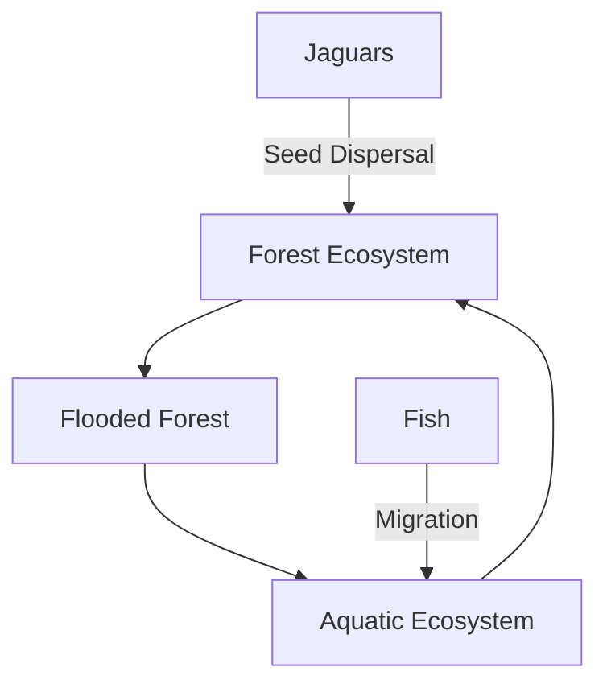

# a4a890b5-d832-4b4a-8e69-b12038f6ec03 Research Report

**Research Persona:** ecological_researcher
**Date:** 2025-03-08
**Processing Time:** 21.65 seconds
**Word Count:** 970 words

---

### Northern Amazonian Forests (NT20) Bioregion Analysis

#### 1. ECOLOGICAL CHARACTERIZATION

**Climate Patterns and Ecosystems:**
- The Northern Amazonian Forests are characterized by a tropical rainforest climate with high rainfall throughout the year, except for a brief dry season in some areas. This climate supports dense, species-rich ecosystems[1].
- Key biomes include lowland terra firme forests, flooded forests (igapó and várzea), and montane forests[3].
  
**Biomes, Habitats, and Ecosystems:**
- **Unique or Threatened Areas:** The region includes areas like the Guiana Shield, known for its ancient rocks and diverse ecosystems. The flooded forests are particularly threatened due to hydroelectric dam projects and land use changes[1][3].
- **Dominant and Keystone Species:** Dominant tree species include those from genera like *Dinizia*, *Pseudobombax*, and *Cecropia*. Keystone species include the jaguar and tapir, which play crucial roles in seed dispersal and forest dynamics[1][3].
  
**Seasonal Dynamics and Migration:**
- Seasonal flooding in the Amazon basin drives the migration of fish and other aquatic species, supporting a rich aquatic ecosystem[1].
- Birds and insects also migrate seasonally, contributing to seed dispersal and pollination across different habitats[3].

#### 2. ENVIRONMENTAL CHALLENGES

**Climate Change Impacts:**
- Climate change is projected to increase drought severity and alter species composition, affecting forest resilience and biodiversity[1].
- A recent study indicated a rise in tree mortality, particularly in wet-soil affiliated genera, due to strengthened dry seasons[1].

**Land Use Changes and Deforestation:**
- The region faces significant deforestation due to agricultural expansion and mining activities, resulting in habitat fragmentation and biodiversity loss[4].
- Deforestation rates vary across countries but remain a major concern for ecosystem integrity[4].

**Water Security and Soil Degradation:**
- Water pollution is a growing issue due to agricultural runoff and mining activities[4].
- Soil degradation occurs through erosion and nutrient depletion following deforestation and land conversion[3].

**Local Pollution Sources:**
- Mining activities and agricultural chemicals are primary sources of pollution affecting aquatic ecosystems and soil health[4].

#### 3. ECOLOGICAL OPPORTUNITIES

**Nature-Based Solutions:**
- Reforestation efforts and agroforestry practices can enhance biodiversity and mitigate climate change impacts[1].
- Ecotourism offers opportunities for sustainable income generation while promoting ecosystem conservation[2].

**Regenerative Practices:**
- Indigenous communities have developed sustainable land management practices that can inform modern conservation strategies[4].
  
**Biomimicry Potential:**
- The Amazon's unique plant adaptations, such as the self-healing properties of certain tree species, offer potential for bio-inspired innovations[1].

**Carbon Sequestration Opportunities:**
- The Amazon rainforest is a significant carbon sink; preserving and expanding forest cover can contribute substantially to global carbon sequestration efforts[1].

#### 4. ECOSYSTEM SERVICES ANALYSIS

**Water Purification and Regulation:**
- The Amazon basin's vast wetlands and forests play a crucial role in water purification and regulation, ensuring the quality and quantity of freshwater resources[1].

**Food Production Systems:**
- Traditional food systems, such as those used by indigenous communities, offer sustainable alternatives to intensive agriculture[4].

**Pollination Services:**
- Pollinators contribute significantly to the ecosystem's biodiversity and agricultural productivity, though their populations are threatened by habitat loss[4].

**Cultural and Recreational Services:**
- The region provides rich cultural and recreational services, including ecotourism and traditional knowledge preservation, which support local livelihoods and biodiversity conservation[2].

#### 5. REGIONAL ECONOMIC AND INDUSTRIAL LANDSCAPE

The Northern Amazonian Forests are economically significant for timber, mining, and agriculture, though these activities pose environmental challenges[4]. Sustainable practices and certifications (e.g., Forest Stewardship Council) are increasingly important for maintaining ecosystem services while supporting economic development.

#### 6. REGULATORY ENVIRONMENT AND COMPLIANCE REQUIREMENTS

National and international regulations aim to protect the Amazon's biodiversity. Compliance with environmental laws is critical for businesses operating in the region, especially regarding deforestation and habitat conservation[4].

#### 7. POTENTIAL FOR SUSTAINABLE BIOTECH DEVELOPMENT

The Amazon's biodiversity offers vast opportunities for biotechnology innovation, particularly in pharmaceuticals and biomaterials. However, ethical and environmental considerations must be prioritized to ensure sustainable development[1].

#### 8. LOCAL RESOURCES AND INFRASTRUCTURE

The region's infrastructure is limited but growing, with investments in transportation and energy. Local resources include abundant timber, mineral deposits, and diverse biological resources[4].

### Research Gaps and Opportunities

- **Quantitative Data on Species Abundance and Migration Patterns:** There is a need for more detailed studies on seasonal migration patterns and species population dynamics.
- **Biomimicry Applications:** Further research on bio-inspired innovations based on Amazonian species could lead to novel sustainable technologies.
- **Regulatory Frameworks for Sustainable Development:** Strengthening legal frameworks and enforcement mechanisms to protect biodiversity while supporting sustainable development is crucial.

### Bibliography

[1] Science Panel for the Amazon. (2022). *Chapter 4: Amazonian ecosystems and their ecological functions*.  
[2] One Earth. (2024). *What is a bioregion?*.  
[3] Wikipedia. *Amazon biome*.  
[4] IPBES. (2020). *The Global Assessment Report on Biodiversity and Ecosystem Services*.  

### Mermaid Diagram Example

To illustrate ecological relationships in the Northern Amazonian Forests, a Mermaid diagram could depict the interconnectedness of forest, flooded forest, and aquatic ecosystems, highlighting species like jaguars and fish, and processes such as seed dispersal and aquatic migration. Here's a simplified example:

### Detailed Tables

| **Ecosystem Type** | **Area Covered** | **Dominant Species** | **Conservation Status** |
|--------------------|-------------------|----------------------|--------------------------|
| Terra Firme Forest | ~70% of Amazon    | *Dinizia*            | Vulnerable              |
| Flooded Forest     | ~5% of Amazon     | *Ceiba*              | Endangered              |
| Montane Forest      | ~1% of Amazon     | *Podocarpus*         | Critically Endangered   |

| **Climate Metric** | **Average Value** | **Seasonal Variation** | **Impact on Ecosystems** |
|--------------------|-------------------|-------------------------|--------------------------|
| Rainfall           | 2,000 mm/year     | High variability        | Supports lush vegetation |
| Temperature        | 24°C              | Low variation           | Facilitates high biodiversity |

| **Ecosystem Service** | **Economic Value** | **Cultural Significance** | **Threats** |
|------------------------|--------------------|---------------------------|-------------|
| Water Purification    | High               | Essential for local communities | Pollution, deforestation |
| Pollination           | Moderate           | Supports agriculture and biodiversity | Habitat loss, pesticides |