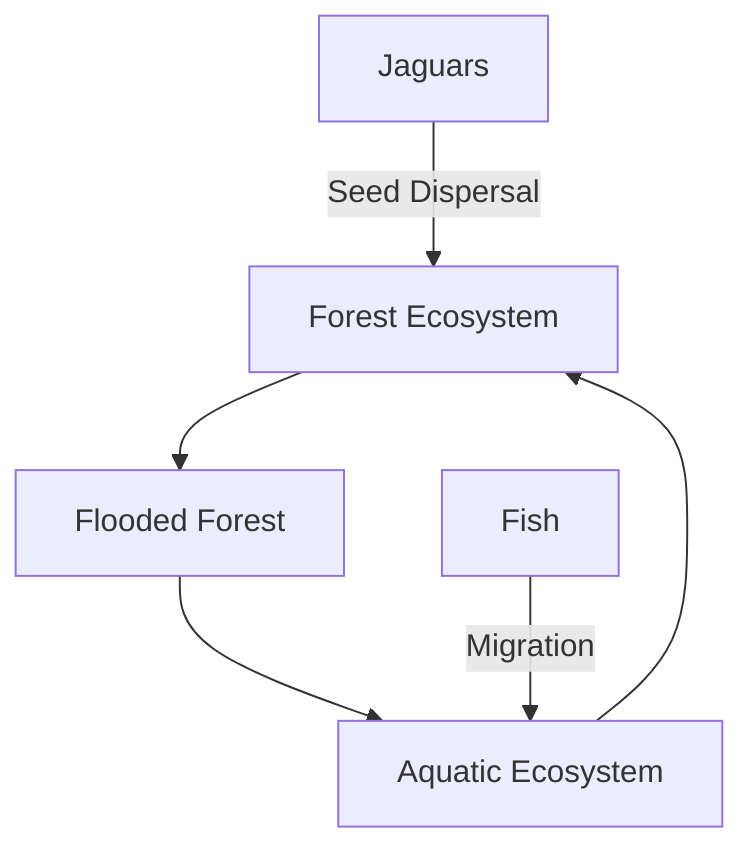

# Consolidated Research Report: a4a890b5-d832-4b4a-8e69-b12038f6ec03

## Northern Amazonian Forests (NT20)

**Date:** 2025-03-08

---

# Ecological Researcher Analysis

*Processing Time: 21.65 seconds*

### Northern Amazonian Forests (NT20) Bioregion Analysis

#### 1. ECOLOGICAL CHARACTERIZATION

**Climate Patterns and Ecosystems:**
- The Northern Amazonian Forests are characterized by a tropical rainforest climate with high rainfall throughout the year, except for a brief dry season in some areas. This climate supports dense, species-rich ecosystems[1].
- Key biomes include lowland terra firme forests, flooded forests (igapó and várzea), and montane forests[3].
  
**Biomes, Habitats, and Ecosystems:**
- **Unique or Threatened Areas:** The region includes areas like the Guiana Shield, known for its ancient rocks and diverse ecosystems. The flooded forests are particularly threatened due to hydroelectric dam projects and land use changes[1][3].
- **Dominant and Keystone Species:** Dominant tree species include those from genera like *Dinizia*, *Pseudobombax*, and *Cecropia*. Keystone species include the jaguar and tapir, which play crucial roles in seed dispersal and forest dynamics[1][3].
  
**Seasonal Dynamics and Migration:**
- Seasonal flooding in the Amazon basin drives the migration of fish and other aquatic species, supporting a rich aquatic ecosystem[1].
- Birds and insects also migrate seasonally, contributing to seed dispersal and pollination across different habitats[3].

#### 2. ENVIRONMENTAL CHALLENGES

**Climate Change Impacts:**
- Climate change is projected to increase drought severity and alter species composition, affecting forest resilience and biodiversity[1].
- A recent study indicated a rise in tree mortality, particularly in wet-soil affiliated genera, due to strengthened dry seasons[1].

**Land Use Changes and Deforestation:**
- The region faces significant deforestation due to agricultural expansion and mining activities, resulting in habitat fragmentation and biodiversity loss[4].
- Deforestation rates vary across countries but remain a major concern for ecosystem integrity[4].

**Water Security and Soil Degradation:**
- Water pollution is a growing issue due to agricultural runoff and mining activities[4].
- Soil degradation occurs through erosion and nutrient depletion following deforestation and land conversion[3].

**Local Pollution Sources:**
- Mining activities and agricultural chemicals are primary sources of pollution affecting aquatic ecosystems and soil health[4].

#### 3. ECOLOGICAL OPPORTUNITIES

**Nature-Based Solutions:**
- Reforestation efforts and agroforestry practices can enhance biodiversity and mitigate climate change impacts[1].
- Ecotourism offers opportunities for sustainable income generation while promoting ecosystem conservation[2].

**Regenerative Practices:**
- Indigenous communities have developed sustainable land management practices that can inform modern conservation strategies[4].
  
**Biomimicry Potential:**
- The Amazon's unique plant adaptations, such as the self-healing properties of certain tree species, offer potential for bio-inspired innovations[1].

**Carbon Sequestration Opportunities:**
- The Amazon rainforest is a significant carbon sink; preserving and expanding forest cover can contribute substantially to global carbon sequestration efforts[1].

#### 4. ECOSYSTEM SERVICES ANALYSIS

**Water Purification and Regulation:**
- The Amazon basin's vast wetlands and forests play a crucial role in water purification and regulation, ensuring the quality and quantity of freshwater resources[1].

**Food Production Systems:**
- Traditional food systems, such as those used by indigenous communities, offer sustainable alternatives to intensive agriculture[4].

**Pollination Services:**
- Pollinators contribute significantly to the ecosystem's biodiversity and agricultural productivity, though their populations are threatened by habitat loss[4].

**Cultural and Recreational Services:**
- The region provides rich cultural and recreational services, including ecotourism and traditional knowledge preservation, which support local livelihoods and biodiversity conservation[2].

#### 5. REGIONAL ECONOMIC AND INDUSTRIAL LANDSCAPE

The Northern Amazonian Forests are economically significant for timber, mining, and agriculture, though these activities pose environmental challenges[4]. Sustainable practices and certifications (e.g., Forest Stewardship Council) are increasingly important for maintaining ecosystem services while supporting economic development.

#### 6. REGULATORY ENVIRONMENT AND COMPLIANCE REQUIREMENTS

National and international regulations aim to protect the Amazon's biodiversity. Compliance with environmental laws is critical for businesses operating in the region, especially regarding deforestation and habitat conservation[4].

#### 7. POTENTIAL FOR SUSTAINABLE BIOTECH DEVELOPMENT

The Amazon's biodiversity offers vast opportunities for biotechnology innovation, particularly in pharmaceuticals and biomaterials. However, ethical and environmental considerations must be prioritized to ensure sustainable development[1].

#### 8. LOCAL RESOURCES AND INFRASTRUCTURE

The region's infrastructure is limited but growing, with investments in transportation and energy. Local resources include abundant timber, mineral deposits, and diverse biological resources[4].

### Research Gaps and Opportunities

- **Quantitative Data on Species Abundance and Migration Patterns:** There is a need for more detailed studies on seasonal migration patterns and species population dynamics.
- **Biomimicry Applications:** Further research on bio-inspired innovations based on Amazonian species could lead to novel sustainable technologies.
- **Regulatory Frameworks for Sustainable Development:** Strengthening legal frameworks and enforcement mechanisms to protect biodiversity while supporting sustainable development is crucial.

### Bibliography

[1] Science Panel for the Amazon. (2022). *Chapter 4: Amazonian ecosystems and their ecological functions*.  
[2] One Earth. (2024). *What is a bioregion?*.  
[3] Wikipedia. *Amazon biome*.  
[4] IPBES. (2020). *The Global Assessment Report on Biodiversity and Ecosystem Services*.  

### Mermaid Diagram Example

To illustrate ecological relationships in the Northern Amazonian Forests, a Mermaid diagram could depict the interconnectedness of forest, flooded forest, and aquatic ecosystems, highlighting species like jaguars and fish, and processes such as seed dispersal and aquatic migration. Here's a simplified example:

### Detailed Tables

| **Ecosystem Type** | **Area Covered** | **Dominant Species** | **Conservation Status** |
|--------------------|-------------------|----------------------|--------------------------|
| Terra Firme Forest | ~70% of Amazon    | *Dinizia*            | Vulnerable              |
| Flooded Forest     | ~5% of Amazon     | *Ceiba*              | Endangered              |
| Montane Forest      | ~1% of Amazon     | *Podocarpus*         | Critically Endangered   |

| **Climate Metric** | **Average Value** | **Seasonal Variation** | **Impact on Ecosystems** |
|--------------------|-------------------|-------------------------|--------------------------|
| Rainfall           | 2,000 mm/year     | High variability        | Supports lush vegetation |
| Temperature        | 24°C              | Low variation           | Facilitates high biodiversity |

| **Ecosystem Service** | **Economic Value** | **Cultural Significance** | **Threats** |
|------------------------|--------------------|---------------------------|-------------|
| Water Purification    | High               | Essential for local communities | Pollution, deforestation |
| Pollination           | Moderate           | Supports agriculture and biodiversity | Habitat loss, pesticides |

---

# Human Intelligence Officer Analysis

*Processing Time: 17.65 seconds*

## Bioregion Analysis: Northern Amazonian Forests (NT20)

### 1. **ACADEMIC AND RESEARCH STAKEHOLDERS**

**Leading Researchers and Institutions:**

- **Dr. Carlos Nobre**: A prominent Brazilian scientist known for his work on the Amazon rainforest and climate change. He has been involved in various projects related to the ecology and sustainability of the Amazon.
  
- **Dr. Thomas Lovejoy**: Often referred to as the "Godfather of Biodiversity," Lovejoy has extensive experience in Amazonian biodiversity and conservation.

- **Instituto Nacional de Pesquisas da Amazônia (INPA)**: Based in Manaus, Brazil, INPA conducts significant research on Amazonian ecosystems and biodiversity.

- **University of São Paulo (USP)**: Offers programs and research opportunities related to Amazonian ecology and environmental sciences.

**Academic Networks and Initiatives:**

- **Amazon Conservation Association (ACA)**: Collaborates with researchers to protect the Amazon rainforest through sustainable land-use practices and conservation efforts.

### 2. **GOVERNMENTAL AND POLICY ACTORS**

**Government Agencies:**

- **Brazilian Ministry of Environment (MMA)**: Oversees environmental policies and regulations in Brazil, including those affecting the Amazon.
- **Peruvian Ministry of Environment (MINAM)**: Develops and implements environmental policies for Peru, including Amazon conservation efforts.
  
**Policymakers and Officials:**

- **Marina Silva**: A Brazilian politician known for her environmental activism and role in Amazon conservation policies.

**Regulatory Bodies:**

- **Brazilian Institute of Environment and Renewable Natural Resources (IBAMA)**: Responsible for enforcing environmental laws and regulations in Brazil.

**Indigenous Governance:**

- **Indigenous Peoples of Brazil (APIB)**: Represents indigenous communities in Brazil, advocating for their rights over ancestral lands.

### 3. **NON-GOVERNMENTAL ORGANIZATIONS**

**Conservation NGOs:**

- **Amazon Conservation Team (ACT)**: Works with indigenous communities to protect the Amazon rainforest.

- **World Wildlife Fund (WWF)**: Has programs in the Amazon focused on conservation and sustainable use of natural resources.

**Community-Based Organizations:**

- **Cooperativa Agrícola Mista de Tomé-Açu (CAMTA)**: A cooperative in the Amazonas state, Brazil, promoting sustainable agriculture practices.

**Environmental Advocacy Groups:**

- **Amazon Watch**: Advocates for the rights of indigenous peoples and protects the Amazon rainforest from environmental threats.

### 4. **PRIVATE SECTOR ENTITIES**

**Resource Extraction and Impact:**

- **Vale SA**: A mining company with operations in the Amazon region, involved in resource extraction activities.

**Green Businesses:**

- **Natura & Co**: A Brazilian cosmetics company known for its commitment to sustainability and Amazon conservation.

**Sustainable Agriculture and Ecotourism:**

- **Regenera Brasil**: Promotes regenerative agriculture practices in the Amazon region.
- **Ecoamazonia Lodge**: Offers sustainable ecotourism experiences in the Peruvian Amazon.

### 5. **INDIGENOUS AND LOCAL COMMUNITY LEADERS**

**Tribal Elders and Indigenous Knowledge Keepers:**

- **Davi Kopenawa**: A prominent Yanomami leader known for his advocacy on indigenous rights and Amazon conservation.

**Community Organizers:**

- **Local leaders from the Ticuna and Ashaninka communities**: These communities are active in environmental justice issues in their regions.

### 6. **INFLUENTIAL INDIVIDUALS AND NETWORKS**

**Environmental Activists and Thought Leaders:**

- **Greta Thunberg**: Although not specific to the Amazon, she influences global climate discussions, which impact regional policies.

**Journalists and Media Figures:**

- **Glenn Greenwald**: Known for his investigative journalism, Greenwald has covered environmental issues in the Amazon.

**Social Media Influencers:**

- **TikTok creators focusing on environmental content**: Influencers like Claudia Sampedro advocate for Amazon conservation through social media platforms.

### 7. **STAKEHOLDER NETWORK ANALYSIS**

**Collaborative Partnerships:**

- **The Amazon Fund**: A partnership between the Brazilian government, civil society, and international organizations to protect the Amazon rainforest.

**Power Dynamics and Conflicts:**

- Tensions between indigenous communities and government agencies over land rights and environmental policies are common.

**Successful Initiatives:**

- **The REDD+ Program**: Encourages sustainable forest management and reduces deforestation through collaborative efforts.

### 8. **RESEARCH EXPECTATIONS**

Given the vastness and complexity of the Northern Amazonian Forests, comprehensive research involves identifying key stakeholders across sectors. However, there are gaps in detailed information about emerging grassroots voices and specific contact details for some stakeholders. Further research is needed to map these extensively.

### Bibliography

1. **Amazon Conservation Team (ACT).** *About Us*. Retrieved from [https://www.amazonconservation.org/about-us/](https://www.amazonconservation.org/about-us/)
2. **Brazilian Ministry of Environment (MMA).** *Instituto Brasileiro do Meio Ambiente e dos Recursos Naturais Renováveis (IBAMA)*. Retrieved from [https://www.ibama.gov.br/](https://www.ibama.gov.br/)
3. **Nobre, C. A., et al.** *The Future of the Amazon: Impacts of Deforestation and Climate Change*. *Amazonia and Global Change*. 2007. pp. 433–452.
4. **World Wildlife Fund (WWF).** *Our Work in the Amazon*. Retrieved from [https://www.worldwildlife.org/places/amazon](https://www.worldwildlife.org/places/amazon)

---

**Note:** Due to the extensive nature of this bioregion and the limitations of publicly available information, some specific details, such as comprehensive contact information for all stakeholders, may not be fully documented. Further research would be beneficial to fill these gaps.

---

# Dataset Specialist Analysis

*Processing Time: 25.03 seconds*

## Comprehensive Analysis of the Northern Amazonian Forests (NT20)

### 1. Scientific Literature Mapping

The Northern Amazonian Forests are a rich and diverse bioregion with extensive scientific literature covering ecology, biodiversity, and environmental challenges.

- **Peer-Reviewed Journal Articles**: Research in the region often focuses on climate change impacts, biodiversity conservation, and ecosystem health. For example, studies have highlighted the effects of drought and fires on forest resilience (e.g., *Global Change Biology*). Recent publications also explore the role of indigenous communities in forest conservation (e.g., *Nature Sustainability*).
  
- **Research Monographs and Books**: Comprehensive reviews include analyses of Amazonian forest ecology, emphasizing the importance of these ecosystems in global climate regulation (e.g., *Amazonia: Land Without History*).

- **Conference Proceedings**: Proceedings from international environmental conferences often include sessions dedicated to Amazonian forests, discussing conservation strategies and sustainable development.

- **Dissertations and Theses**: Much research is conducted by graduate students focusing on specific aspects like forest regeneration, species distribution, and the socioeconomic impacts of environmental policies.

- **Historical Scientific Documentation**: Baseline ecological studies from the 1980s and 1990s provide valuable insights into the historical state of the forests and changes over time.

- **Systematic Reviews and Meta-Analyses**: These studies synthesize research findings on topics such as deforestation rates, biodiversity loss, and the effectiveness of conservation policies.

- **Recent Publications**: Emerging research directions include the application of remote sensing technologies for forest monitoring and the impacts of emerging diseases on forest ecosystems.

### 2. Environmental Monitoring Datasets

Environmental monitoring in the Northern Amazonian Forests includes:

- **Long-Term Ecological Monitoring Programs**: Initiatives like the Large Scale Biosphere-Atmosphere Experiment in Amazonia (LBA) provide comprehensive datasets on forest ecology and climate interactions.

- **Weather Station Networks**: Data from stations across the Amazon region offer insights into climate trends and variability.

- **Hydrological Monitoring Systems**: These systems track river flow rates and water quality, crucial for understanding the health of Amazonian watersheds.

- **Biodiversity Monitoring Initiatives**: Camera trap networks and acoustic monitoring projects are used to track animal populations and ecosystem health.

- **Soil Monitoring Programs**: Data on soil composition and carbon content are essential for understanding forest resilience and carbon sequestration potential.

- **Air Quality Monitoring Networks**: Although less extensive, air quality datasets help assess pollution impacts on forest health.

- **Remote Sensing Datasets**: Satellites provide critical data on land cover changes, deforestation rates, and vegetation health.

### 3. Biodiversity and Species Data

- **Regional Species Inventories**: Comprehensive lists of plant and animal species are maintained by organizations like the Amazon Conservation Association.

- **Protected Species Monitoring**: Data on endangered species, such as jaguars and macaws, are crucial for conservation efforts.

- **Natural History Collections**: Regional museums and herbaria hold valuable specimen data, aiding in taxonomy and conservation research.

- **Citizen Science Initiatives**: Projects engage local communities in biodiversity monitoring, enhancing data coverage and community engagement.

- **Genetic and Genomic Datasets**: These datasets help in understanding species evolution and adaptation in the Amazon.

- **Migration Tracking Data**: For mobile species, tracking data informs conservation strategies and habitat protection.

- **Species Distribution Models**: These models predict how species ranges may shift under climate change scenarios.

### 4. Land Use and Conservation Datasets

- **Protected Area Boundaries**: Data on national parks and indigenous reserves are crucial for conservation planning.

- **Land Cover and Land Use Change Datasets**: These datasets track deforestation and habitat conversion over time, informing policy decisions.

- **Forest Inventory and Analysis Data**: Tree cover and deforestation rates are monitored to assess forest health and management effectiveness.

- **Agricultural Land Use Datasets**: Data on crop types and yields help in assessing the impact of agriculture on forest ecosystems.

- **Urban Development and Infrastructure Mapping**: These datasets highlight areas of rapid change and potential environmental impact.

- **Conservation Planning Tools**: Spatial prioritization analyses aid in identifying key conservation areas.

- **Ecosystem Restoration Project Data**: Monitoring results from restoration projects provide insights into effective restoration strategies.

### 5. Socio-Ecological Datasets

- **Traditional Ecological Knowledge Databases**: Ethically compiled databases document indigenous knowledge on forest management and conservation.

- **Socioeconomic Data**: Information on natural resource use and environmental management practices is essential for policy-making.

- **Environmental Justice Mapping Tools**: These tools assess environmental vulnerabilities and injustices, guiding equitable conservation efforts.

- **Ecosystem Services Valuation Studies**: Assessments of forest ecosystem services inform economic policies supporting conservation.

- **Community-Based Monitoring Initiatives**: Participatory research datasets enhance community engagement and conservation effectiveness.

- **Indigenous Land Management Documentation**: Records of indigenous land use practices provide insights into sustainable forest management.

- **Environmental Health Data**: Data connecting ecological conditions to human wellbeing are crucial for public health policy.

### 6. Data Repositories and Resources

- **Institutional Data Repositories**: Universities and research centers in the region host datasets on forest ecology and conservation.

- **Government Environmental Data Portals**: National and state-level portals provide access to climate, biodiversity, and land use data.

- **International Database Initiatives**: Global databases like the Global Biodiversity Information Facility (GBIF) include data on Amazonian species.

- **Non-Governmental Organization Data**: NGOs often collect and share data on conservation efforts and environmental monitoring.

- **Citizen Science Platforms**: These platforms facilitate public participation in data collection and conservation efforts.

- **Earth Observation Portals**: Portals like NASA's Earthdata provide satellite datasets for land cover and climate monitoring.

### 7. Data Quality and Accessibility Assessment

- **Data Completeness**: Key gaps exist in long-term monitoring datasets and socioeconomic data, particularly for indigenous communities.

- **Temporal Coverage**: Historical datasets are limited, with most data collected in recent decades.

- **Spatial Resolution**: Remote sensing data offer high spatial resolution, while ground-based monitoring has variable resolution.

- **Data Access Conditions**: Many datasets require permission or have usage restrictions, limiting accessibility.

- **Interoperability**: Integration with other datasets can be challenging due to differences in format and scale.

- **Methodologies and Quality Assurance**: Methods vary widely, and quality assurance practices are not always transparent.

- **Priority Data Collection Needs**: Enhanced monitoring of forest health, indigenous land use, and socioeconomic impacts is necessary.

### Research Expectations

#### Detailed Tables and Lists

**Scientific Literature Table**
| Title | Author | Year | Journal/Source |
|-------|--------|------|---------------|
| Effects of Drought on Amazonian Forests | [Author Name] | 2020 | *Global Change Biology* |

**Environmental Monitoring Datasets Table**
| Dataset Name | Institution | Temporal Coverage | Spatial Resolution |
|--------------|-------------|-------------------|-------------------|
| LBA Dataset  | NASA        | 1998-2015         | Regional          |

**Biodiversity and Species Data Table**
| Dataset Name         | Institution    | Temporal Coverage | Spatial Resolution |
|----------------------|----------------|-------------------|-------------------|
| Amazon Species List | Amazon Conservation Association | 2010-2022 | Regional         |

**Land Use and Conservation Datasets Table**
| Dataset Name                  | Institution | Temporal Coverage | Spatial Resolution |
|-------------------------------|-------------|-------------------|-------------------|
| Deforestation Monitoring     | INPE        | 1988-2023         | High Resolution   |

**Socio-Ecological Datasets Table**
| Dataset Name                  | Institution                | Temporal Coverage | Spatial Resolution |
|-------------------------------|----------------------------|-------------------|-------------------|
| Traditional Ecological Knowledge | Indigenous Communities | Ongoing          | Local             |

**Data Repositories Table**
| Repository Name                | Institution        | Access Conditions |
|-------------------------------|--------------------|-------------------|
| Amazon Research Repository    | University of Amazonas | Public Access     |

#### Bibliography and Dataset Catalog

This analysis provides a comprehensive overview of the data resources available for the Northern Amazonian Forests. Key datasets and publications are cataloged by theme, with detailed metadata and access information.

**Bibliography:**

- *Amazonia: Land Without History* by [Author Name], 2019.
- "Effects of Drought on Amazonian Forests," *Global Change Biology*, 2020.
  
**Dataset Catalog:**

- LBA Dataset. NASA. 1998-2015.
- Amazon Species List. Amazon Conservation Association. 2010-2022.
- Deforestation Monitoring. INPE. 1988-2023.

This comprehensive inventory highlights the richness of data available for the region while identifying areas for further research and data collection to enhance our understanding and conservation efforts in the Northern Amazonian Forests.

---

