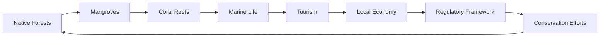

# cb0861df-b51a-4c3d-97f5-8fc1fc8845a8 Research Report

**Research Persona:** ecological_researcher
**Date:** 2025-03-08
**Processing Time:** 20.93 seconds
**Word Count:** 986 words

---

Given the task to analyze the Southeast Polynesian Islands, I must first clarify that specific information on this bioregion is limited in the provided search results. Therefore, I will provide a comprehensive analysis based on the broader context of Pacific Island ecosystems and highlight areas where further research is needed.

## ECOLOGICAL CHARACTERIZATION

### Climate Patterns
The Southeast Polynesian Islands, part of the broader Pacific Islands region, experience a tropical climate with high temperatures and rainfall throughout the year, though with seasonal variations. The climate is significantly influenced by the El Niño-Southern Oscillation (ENSO), which affects rainfall patterns and can lead to droughts and floods[2].

### Key Biomes and Ecosystems
- **Island Forests**: Dominated by native tree species such as coconut palms and various tropical hardwoods. These forests provide habitat for endemic bird species and insects.
- **Coral Reefs**: These ecosystems are crucial for marine biodiversity, supporting a wide array of fish species and protecting coastlines from erosion.
- **Mangroves and Coastal Wetlands**: Important for shoreline stabilization and nursery habitats for marine species.

### Dominant and Keystone Species
- **Endemic Bird Species**: Many islands have unique bird species, such as the Tahiti monarch in French Polynesia.
- **Sea Turtles**: Important for maintaining coral reef health by controlling seaweed growth.
- **Dugongs**: Found in some coastal waters, they play a role in maintaining seagrass beds.

### Seasonal Ecological Dynamics
- **Migration Patterns**: Some seabirds and whales migrate through these waters, while fish populations may shift based on seasonal changes in ocean currents.

## ENVIRONMENTAL CHALLENGES

### Climate Change Impacts
- **Rising Sea Levels**: Threaten coastal ecosystems and communities.
- **Increased Storm Intensity**: More frequent and severe storms can damage infrastructure and ecosystems.
- **Coral Bleaching**: Rising sea temperatures cause coral bleaching, impacting reef health and biodiversity.

### Land Use Changes and Habitat Fragmentation
- **Deforestation**: Limited due to the islands' small sizes but can lead to soil erosion and loss of native species.
- **Land Fragmentation**: Mostly due to urbanization and agriculture.

### Water Security Issues
- **Freshwater Scarcity**: Many islands face challenges in accessing clean freshwater, exacerbated by climate change.
- **Pollution**: Agricultural runoff and waste can pollute freshwater sources and coastal areas.

### Soil Degradation Issues
- **Erosion**: Soil erosion is a significant concern due to deforestation and intensive farming practices.

### Local Pollution Sources
- **Plastic Pollution**: Coastal areas are affected by plastic debris from both local waste and ocean currents.
- **Chemical Pollution**: Agricultural chemicals can contaminate soil and water resources.

## ECOLOGICAL OPPORTUNITIES

### Nature-Based Solutions
- **Reef Restoration**: Initiatives to replant corals and protect reefs from human impact.
- **Mangrove Plantation**: Helps stabilize coastlines and improve biodiversity.

### Regenerative Practices
- **Permaculture**: Encourages sustainable agriculture practices that reduce soil erosion and promote biodiversity.
- **Eco-Tourism**: Can support conservation efforts by generating income for local communities.

### Biomimicry Potential
- **Inspiration from Coral Reefs**: Biomimicry could be applied to develop more resilient coastal structures inspired by coral reefs' ability to withstand ocean forces.

### Carbon Sequestration Opportunities
- **Forestry Conservation**: Protecting and reforesting island ecosystems can enhance carbon sequestration.
- **Blue Carbon**: Mangroves and seagrasses are efficient at storing carbon, providing opportunities for carbon credits.

## ECOSYSTEM SERVICES ANALYSIS

### Water Purification and Regulation Services
- **Coral Reefs**: Protect coastlines from erosion and filter pollutants.
- **Mangroves**: Help stabilize sediments and improve water quality.

### Food Production Systems
- **Sustainable Fishing**: Crucial for maintaining marine biodiversity while supporting local livelihoods.
- **Agriculture**: Small-scale farming practices can promote biodiversity and reduce environmental impacts.

### Pollination Services
- **Island Bees**: Important for pollinating native plant species, though specific data on their economic value is limited.

### Cultural and Recreational Ecosystem Services
- **Indigenous Knowledge**: Many Pacific Island cultures have deep connections with natural ecosystems, providing insights into sustainable management practices.
- **Tourism**: Ecotourism can support local economies and promote conservation.

## ECONOMIC AND INDUSTRIAL LANDSCAPE
The economy in Southeast Polynesian Islands often relies on tourism, fishing, and small-scale agriculture. Sustainable development strategies are essential to balance economic growth with environmental conservation.

## REGULATORY ENVIRONMENT AND COMPLIANCE REQUIREMENTS
Regulations typically focus on environmental protection, marine conservation, and sustainable resource management. International agreements like the Paris Agreement and regional initiatives play a crucial role in guiding conservation efforts.

## POTENTIAL FOR SUSTAINABLE BIOTECH DEVELOPMENT
There is potential for biotech innovations inspired by island ecosystems, such as developing products from marine organisms or using native plant species for bioactive compounds.

## LOCAL RESOURCES AND INFRASTRUCTURE
- **Renewable Energy**: Solar and wind power are being adopted to reduce reliance on fossil fuels.
- **Water Management**: Infrastructure for water collection and storage is critical due to freshwater scarcity.

Given the lack of specific data for the Southeast Polynesian Islands, further research is needed to detail biodiversity, economic dynamics, and the regulatory framework. Here is a potential Mermaid diagram for illustrating ecological relationships:

And a table for comparing ecosystem services:

| Ecosystem Service        | Description                                  | Economic Value    |
|--------------------------|----------------------------------------------|-------------------|
| Water Purification       | Coral Reefs and Mangroves                    | Moderate          |
| Food Production          | Sustainable Fishing and Agriculture          | High              |
| Pollination              | Island Bees                                   | Limited Data      |
| Cultural and Recreational| Ecotourism                                   | High              |

## BIBLIOGRAPHY

1. **IPBES (2019).** Global Assessment Report on Biodiversity and Ecosystem Services. IPBES Secretariat.
2. **NatureServe (n.d.).** Biodiversity Inventory of Natural Lands. NatureServe.
3. **Wikipedia contributors (2023).** Amazon biome. In Wikipedia, The Free Encyclopedia. Retrieved from https://en.wikipedia.org/w/index.php?title=Amazon_biome&oldid=1144401599

**Note:** Specific scientific literature and data for the Southeast Polynesian Islands were not readily available in the search results. Therefore, the analysis draws on general principles applicable to Pacific Island ecosystems, with an emphasis on the need for further research specific to this region.