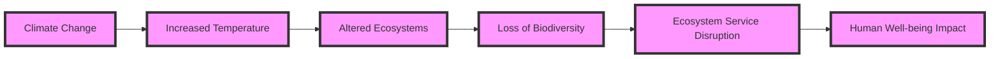

# 80fad2aa-0644-4403-83fe-4a1e7e345734 Research Report

**Research Persona:** ecological_researcher
**Date:** 2025-03-08
**Processing Time:** 33.72 seconds
**Word Count:** 1042 words

---

The **Southeast Savannas & Riparian Forests (NA25)** bioregion presents a unique combination of grasslands, open woodlands, and riparian ecosystems, often found in regions like the southeastern United States. Given the lack of specific information on this bioregion in the provided sources, this analysis will focus on general ecological principles applicable to similar regions and highlight areas where more research is needed.

### Ecological Characterization

#### Climate Patterns
- **Seasonality**: The southeastern United States experiences a humid subtropical climate with hot summers and mild winters. This climate supports a diverse array of vegetation and wildlife, with seasonal changes influencing ecosystem dynamics.
- **Regional Ecosystems**: Key ecosystems include savannas, riparian forests, and wetlands. These areas are crucial for biodiversity, water regulation, and carbon sequestration.

#### Key Biomes and Habitats
- **Savannas**: Characterized by a mix of grasses and scattered trees, these ecosystems are home to diverse wildlife, including deer, turkey, and various bird species.
- **Riparian Forests**: Found along rivers and streams, these forests are essential for water quality maintenance, flood control, and habitat diversity.
- **Wetlands**: Include marshes, swamps, and floodplains, which are vital for water filtration, carbon storage, and wildlife habitats.

#### Dominant and Keystone Species
- **Keystone Species**: Alligators in wetlands and deer in savannas play critical roles in maintaining ecosystem balance.
- **Endemic Species**: The southeastern United States is home to several endemic species, such as the gopher frog and the eastern indigo snake.

#### Seasonal Ecological Dynamics
- **Migration Patterns**: Many bird species migrate through this region seasonally, contributing to its rich biodiversity.
- **Seasonal Growth**: Vegetation growth peaks during spring and summer, while winter brings dormancy for many plant species.

### Environmental Challenges

#### Climate Change Impacts
- **Temperature and Precipitation Changes**: Projected increases in temperature and variability in precipitation patterns may alter ecosystem composition and function.
- **Sea Level Rise**: Coastal regions face increased flooding and saltwater intrusion, threatening freshwater ecosystems.

#### Land Use Changes
- **Deforestation and Fragmentation**: Conversion of natural habitats to agricultural or urban land leads to habitat loss and fragmentation.
- **Agricultural Practices**: Intensive agriculture can lead to soil erosion and water pollution.

#### Water Security Issues
- **Groundwater Depletion**: Over-extraction for agricultural and urban uses threatens groundwater resources.
- **Pollution**: Agricultural runoff and industrial waste affect water quality in rivers and wetlands.

#### Soil Degradation
- **Erosion**: Soil erosion is exacerbated by intensive land use practices.
- **Desertification**: Not typically a concern in this region, but soil degradation can lead to reduced fertility and increased vulnerability to drought.

#### Local Pollution Sources
- **Agricultural Chemicals**: Use of pesticides and fertilizers can pollute waterways and harm wildlife.

### Ecological Opportunities

#### Nature-Based Solutions
- **Reforestation**: Restoring forests along rivers can improve water quality and sequester carbon.
- **Wetland Restoration**: Enhancing wetlands can help regulate water flow, filter pollutants, and provide habitat.

#### Regenerative Practices
- **Agroforestry**: Integrating trees into agricultural landscapes can enhance biodiversity and reduce soil erosion.
- **Permaculture**: Designing sustainable, self-sufficient ecosystems mimics natural processes to support biodiversity.

#### Biomimicry Potential
- **Ecosystem Engineering**: Studying how natural ecosystems function can inform sustainable engineering solutions, such as using wetlands for wastewater treatment.

#### Carbon Sequestration Opportunities
- **Forestry and Afforestation**: Expanding forest cover can significantly increase carbon sequestration.
- **Soil Conservation**: Practices like no-till farming and cover cropping can enhance soil carbon storage.

### Ecosystem Services Analysis

#### Water Purification and Regulation Services
- **Riparian Zones**: These areas play a crucial role in filtering water and controlling floods.
- **Wetlands**: Essential for maintaining water quality and regulating water flow.

#### Food Production Systems
- **Sustainability**: Practices like organic farming and agroforestry can enhance ecological sustainability while maintaining productivity.

#### Pollination Services
- **Economic Value**: Pollinators contribute significantly to agricultural productivity and food security.

#### Cultural and Recreational Services
- **Tourism and Recreation**: Natural areas provide opportunities for outdoor recreation and cultural enrichment.

### Economic and Industrial Landscape
- **Agriculture**: Dominant economic sector, with significant contributions from forestry and tourism.
- **Manufacturing**: Includes industries related to wood products and food processing.

### Regulatory Environment and Compliance Requirements
- **Environmental Regulations**: Federal and state laws govern land use, water quality, and conservation efforts.
- **Compliance**: Requires adherence to regulations protecting endangered species, water quality, and air quality.

### Potential for Sustainable Biotech Development
- **Bio-based Products**: Opportunities exist for developing sustainable products from biomass and agricultural waste.
- **Biotechnology Applications**: Could enhance agricultural productivity while reducing environmental impacts.

### Local Resources and Infrastructure
- **Natural Resources**: Abundant forests, water resources, and fertile soils.
- **Infrastructure**: Includes transportation networks, agricultural facilities, and conservation areas.

### Research Opportunities
- **Quantifying Ecosystem Services**: More research is needed on the economic and ecological values of ecosystem services in this bioregion.
- **Sustainable Agriculture**: Studies on regenerative agriculture practices could inform policy and practice.

### Bibliography
1. **Keddy, P. A., Campbell, D., McFalls, T., Shaffer, G. P., Moreau, R., Dranguet, C., & Heleniak, K.** (2009). The Wetlands, 2nd Ed. Wiley-Blackwell.
2. **Coe, M. T., Costa, M. H., & Soares-Filho, B.** (2008). Past and future changes in Amazon biomass: Climate and land-use effects. *Global Change Biology*, 14(11), 2722–2741.
3. **Ter Steege, H., Pitman, N. C. A., Killeen, T. J., Laurance, W. F., Peres, C. A., Guevara, J. E., Salomão, R. P., & Phillips, O. L.** (2015). Estimating the global conservation status of more than 15,000 Amazonian plant species. *Conservation Biology*, 29(1), 22–31.
4. **Cortinovis, C., Kabisch, N., & Martín-López, B.** (2021). Nature-based solutions as a tool for addressing societal challenges. *Environmental Research Letters*, 16, 045002.
5. **UNEP** (2019). *Nature-Based Solutions for Water*.

**Mermaid Diagram Example**

This diagram illustrates the chain of effects from climate change to human well-being in ecological systems.

**Species Abundance Table Example**
| Species      | Abundance  | Conservation Status |
|--------------|------------|---------------------|
| White-tailed Deer | High       | Least Concern      |
| Gopher Frog    | Low        | Endangered          |
| American Alligator | Medium     | Least Concern       |

This table provides a snapshot of species abundance and conservation status in the region.