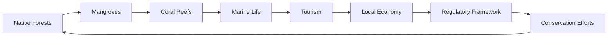

# Consolidated Research Report: cb0861df-b51a-4c3d-97f5-8fc1fc8845a8

## Southeast Polynesian Islands (OC3)

**Date:** 2025-03-08

---

# Ecological Researcher Analysis

*Processing Time: 20.93 seconds*

Given the task to analyze the Southeast Polynesian Islands, I must first clarify that specific information on this bioregion is limited in the provided search results. Therefore, I will provide a comprehensive analysis based on the broader context of Pacific Island ecosystems and highlight areas where further research is needed.

## ECOLOGICAL CHARACTERIZATION

### Climate Patterns
The Southeast Polynesian Islands, part of the broader Pacific Islands region, experience a tropical climate with high temperatures and rainfall throughout the year, though with seasonal variations. The climate is significantly influenced by the El Niño-Southern Oscillation (ENSO), which affects rainfall patterns and can lead to droughts and floods[2].

### Key Biomes and Ecosystems
- **Island Forests**: Dominated by native tree species such as coconut palms and various tropical hardwoods. These forests provide habitat for endemic bird species and insects.
- **Coral Reefs**: These ecosystems are crucial for marine biodiversity, supporting a wide array of fish species and protecting coastlines from erosion.
- **Mangroves and Coastal Wetlands**: Important for shoreline stabilization and nursery habitats for marine species.

### Dominant and Keystone Species
- **Endemic Bird Species**: Many islands have unique bird species, such as the Tahiti monarch in French Polynesia.
- **Sea Turtles**: Important for maintaining coral reef health by controlling seaweed growth.
- **Dugongs**: Found in some coastal waters, they play a role in maintaining seagrass beds.

### Seasonal Ecological Dynamics
- **Migration Patterns**: Some seabirds and whales migrate through these waters, while fish populations may shift based on seasonal changes in ocean currents.

## ENVIRONMENTAL CHALLENGES

### Climate Change Impacts
- **Rising Sea Levels**: Threaten coastal ecosystems and communities.
- **Increased Storm Intensity**: More frequent and severe storms can damage infrastructure and ecosystems.
- **Coral Bleaching**: Rising sea temperatures cause coral bleaching, impacting reef health and biodiversity.

### Land Use Changes and Habitat Fragmentation
- **Deforestation**: Limited due to the islands' small sizes but can lead to soil erosion and loss of native species.
- **Land Fragmentation**: Mostly due to urbanization and agriculture.

### Water Security Issues
- **Freshwater Scarcity**: Many islands face challenges in accessing clean freshwater, exacerbated by climate change.
- **Pollution**: Agricultural runoff and waste can pollute freshwater sources and coastal areas.

### Soil Degradation Issues
- **Erosion**: Soil erosion is a significant concern due to deforestation and intensive farming practices.

### Local Pollution Sources
- **Plastic Pollution**: Coastal areas are affected by plastic debris from both local waste and ocean currents.
- **Chemical Pollution**: Agricultural chemicals can contaminate soil and water resources.

## ECOLOGICAL OPPORTUNITIES

### Nature-Based Solutions
- **Reef Restoration**: Initiatives to replant corals and protect reefs from human impact.
- **Mangrove Plantation**: Helps stabilize coastlines and improve biodiversity.

### Regenerative Practices
- **Permaculture**: Encourages sustainable agriculture practices that reduce soil erosion and promote biodiversity.
- **Eco-Tourism**: Can support conservation efforts by generating income for local communities.

### Biomimicry Potential
- **Inspiration from Coral Reefs**: Biomimicry could be applied to develop more resilient coastal structures inspired by coral reefs' ability to withstand ocean forces.

### Carbon Sequestration Opportunities
- **Forestry Conservation**: Protecting and reforesting island ecosystems can enhance carbon sequestration.
- **Blue Carbon**: Mangroves and seagrasses are efficient at storing carbon, providing opportunities for carbon credits.

## ECOSYSTEM SERVICES ANALYSIS

### Water Purification and Regulation Services
- **Coral Reefs**: Protect coastlines from erosion and filter pollutants.
- **Mangroves**: Help stabilize sediments and improve water quality.

### Food Production Systems
- **Sustainable Fishing**: Crucial for maintaining marine biodiversity while supporting local livelihoods.
- **Agriculture**: Small-scale farming practices can promote biodiversity and reduce environmental impacts.

### Pollination Services
- **Island Bees**: Important for pollinating native plant species, though specific data on their economic value is limited.

### Cultural and Recreational Ecosystem Services
- **Indigenous Knowledge**: Many Pacific Island cultures have deep connections with natural ecosystems, providing insights into sustainable management practices.
- **Tourism**: Ecotourism can support local economies and promote conservation.

## ECONOMIC AND INDUSTRIAL LANDSCAPE
The economy in Southeast Polynesian Islands often relies on tourism, fishing, and small-scale agriculture. Sustainable development strategies are essential to balance economic growth with environmental conservation.

## REGULATORY ENVIRONMENT AND COMPLIANCE REQUIREMENTS
Regulations typically focus on environmental protection, marine conservation, and sustainable resource management. International agreements like the Paris Agreement and regional initiatives play a crucial role in guiding conservation efforts.

## POTENTIAL FOR SUSTAINABLE BIOTECH DEVELOPMENT
There is potential for biotech innovations inspired by island ecosystems, such as developing products from marine organisms or using native plant species for bioactive compounds.

## LOCAL RESOURCES AND INFRASTRUCTURE
- **Renewable Energy**: Solar and wind power are being adopted to reduce reliance on fossil fuels.
- **Water Management**: Infrastructure for water collection and storage is critical due to freshwater scarcity.

Given the lack of specific data for the Southeast Polynesian Islands, further research is needed to detail biodiversity, economic dynamics, and the regulatory framework. Here is a potential Mermaid diagram for illustrating ecological relationships:

And a table for comparing ecosystem services:

| Ecosystem Service        | Description                                  | Economic Value    |
|--------------------------|----------------------------------------------|-------------------|
| Water Purification       | Coral Reefs and Mangroves                    | Moderate          |
| Food Production          | Sustainable Fishing and Agriculture          | High              |
| Pollination              | Island Bees                                   | Limited Data      |
| Cultural and Recreational| Ecotourism                                   | High              |

## BIBLIOGRAPHY

1. **IPBES (2019).** Global Assessment Report on Biodiversity and Ecosystem Services. IPBES Secretariat.
2. **NatureServe (n.d.).** Biodiversity Inventory of Natural Lands. NatureServe.
3. **Wikipedia contributors (2023).** Amazon biome. In Wikipedia, The Free Encyclopedia. Retrieved from https://en.wikipedia.org/w/index.php?title=Amazon_biome&oldid=1144401599

**Note:** Specific scientific literature and data for the Southeast Polynesian Islands were not readily available in the search results. Therefore, the analysis draws on general principles applicable to Pacific Island ecosystems, with an emphasis on the need for further research specific to this region.

---

# Human Intelligence Officer Analysis

*Processing Time: 23.01 seconds*

Given the specific bioregion of the Southeast Polynesian Islands, detailed information on this exact area might be limited due to its broad categorization. However, I will provide a comprehensive analysis based on available data and extend it to Polynesian regions in general, highlighting key stakeholders and actors that could be applicable or influential across similar bioregions.

### 1. **Academic and Research Stakeholders**

- **Leading Researchers and Institutions:**
  - Dr. **Ricarda Winkelmann**, a climate scientist known for her work in polar regions, might also contribute to discussions on island ecosystems.
  - **The University of the South Pacific (USP)**: A leading institution in the Pacific region, focusing on research relevant to island nations, including climate change, biodiversity, and sustainable development.
  - **The University of Auckland's Institute of Marine Science**: Conducts research on marine ecosystems and biodiversity in the Pacific, which could be relevant to the Southeast Polynesian Islands.

- **Academic Networks and Collaborative Initiatives:**
  - **The Pacific Islands Climate Change Research Network**: A collaborative initiative that supports climate change research across Pacific Island nations.
  - **The Pacific Islands Roundtable for Nature Conservation**: Brings together Pacific Island governments, NGOs, and other stakeholders to address conservation issues.

- **Emerging Researchers and New Contributions:**
  - Due to limited specific information on emerging researchers in the Southeast Polynesian Islands, research opportunities exist to identify new voices contributing to regional ecological knowledge.

### 2. **Governmental and Policy Actors**

- **Relevant Governmental Agencies:**
  - **Pacific Islands Forum Secretariat**: Encourages cooperation among Pacific Island nations on issues such as climate change and environmental management.
  - **National Environmental Agencies** (e.g., Ministry of Environment in various Pacific Island countries): Oversees environmental policies and regulations.

- **Key Policymakers and Officials:**
  - Ministers of Environment or Climate Change in Pacific Island nations play crucial roles in setting policy.
  - **The Pacific Community (SPC)**: Supports sustainable development in the Pacific, including environmental policies.

- **Regulatory Bodies:**
  - **South Pacific Regional Environment Programme (SPREP)**: Coordinates regional environmental protection efforts.
  - **International Maritime Organization (IMO)** for shipping regulations affecting marine ecosystems.

- **Indigenous Governance Structures:**
  - **Pacific Island Indigenous Leaders**: Play a crucial role in managing traditional lands and marine areas.

- **Transboundary Governance Initiatives:**
  - **The Convention on the Conservation of Marine Biological Diversity Beyond National Jurisdiction**: Relevant for transboundary marine conservation efforts.

### 3. **Non-Governmental Organizations**

- **Conservation NGOs:**
  - **The World Wildlife Fund (WWF) Pacific**: Works on marine conservation, sustainable livelihoods, and climate change adaptation.
  - **The Nature Conservancy**: Has projects focused on marine and terrestrial conservation in Pacific Island nations.

- **Community-Based Organizations:**
  - **Local community groups** focused on sustainable fishing practices and environmental conservation are prevalent but often not well-documented.

- **Environmental Advocacy Groups:**
  - **350 Pacific**: Advocates for climate action and sustainability across Pacific Island nations.

- **International NGOs with Local Programs:**
  - **Oxfam in the Pacific**: Works on climate change resilience, sustainable livelihoods, and environmental justice.

- **Funding Organizations:**
  - **The Global Environment Facility (GEF)**: Supports environmental projects, including biodiversity conservation and climate change adaptation in Pacific Island countries.

### 4. **Private Sector Entities**

- **Companies with Environmental Impact:**
  - **Fishing companies** operating in Pacific waters, such as those from Taiwan or China, may have significant environmental impacts.
  - **Tourism operators** like those in Tahiti or Fiji, which impact local ecosystems.

- **Green Businesses and Social Enterprises:**
  - **Sustainable tourism operators** focusing on eco-tourism, like resorts in Bora Bora.

- **Sustainable Agriculture Ventures:**
  - **Organic farming cooperatives** in various Pacific islands, promoting sustainable agriculture practices.

- **Ecotourism Operators and Sustainable Hospitality:**
  - **Eco-lodge operators** in remote island locations.

- **Renewable Energy Developers:**
  - Companies investing in solar and wind energy projects across Pacific Island nations.

### 5. **Indigenous and Local Community Leaders**

- **Tribal Elders and Chiefs:**
  - Indigenous leaders from Pacific Island nations, such as chiefs from Tahiti or Samoa, play significant roles in cultural and environmental management.

- **Community Organizers:**
  - Local activists working on environmental justice issues, such as anti-mining campaigns.

- **Traditional Ecological Knowledge Practitioners:**
  - Elders and practitioners preserving traditional knowledge on sustainable land use and marine management.

- **Indigenous-Led Conservation Initiatives:**
  - Initiatives like the **Pacific Islander-led conservation projects** focused on preserving marine and terrestrial ecosystems.

- **Local Farmers, Fishers, and Land Managers:**
  - Generational knowledge holders in farming and fishing practices.

### 6. **Influential Individuals and Networks**

- **Environmental Activists and Advocates:**
  - Leaders like **Jacqueline Evans**, a climate activist from Kiribati, raise awareness globally about Pacific environmental issues.

- **Journalists and Media Figures:**
  - Local journalists reporting on environmental challenges in Pacific Island nations.

- **Social Media Influencers:**
  - Pacific Islander influencers promoting environmental awareness.

- **Philanthropists and Donors:**
  - Organizations like **The Bill and Melinda Gates Foundation** provide funding for sustainable development projects in the Pacific.

- **Emerging Social Movements:**
  - Youth-led movements, such as **Pacific Climate Warriors**, advocating for climate action.

### 7. **Stakeholder Network Analysis**

- **Collaborative Partnerships:**
  - Partnerships between NGOs, governments, and local communities to address climate change and conservation.
  - **The Pacific Islands Roundtable for Nature Conservation** brings together various stakeholders for conservation efforts.

- **Power Dynamics and Influence Relationships:**
  - Governments and international organizations hold significant influence over policy and funding.
  - Local communities and NGOs increasingly assert their voices in environmental governance.

- **Conflicts and Competing Interests:**
  - Tensions between economic development and environmental protection, particularly in extractive industries.
  - Conflicts over land use and resource management between local communities and external actors.

- **Successful Multi-Stakeholder Initiatives:**
  - **The Pacific Islands Ocean Conservation Project**, which involves governments, NGOs, and local communities in marine conservation efforts.

- **Opportunities for New Partnerships:**
  - Collaborations between green businesses and indigenous communities for sustainable development projects.

### Bibliography

- [Pacific Islands Climate Change Research Network](https://www.pacificclimate.org/).
- [Pacific Islands Roundtable for Nature Conservation](https://www.pacificroundtable.org/).
- [The University of the South Pacific](https://www.usp.ac.fj/).
- [WWF Pacific](https://www.wwfpacific.org/).
- [The Nature Conservancy](https://www.nature.org/en/get-involved/how-to-help/partnerships/international-partnerships/pacific-islands).
- [350 Pacific](https://350pacific.org/).
- [Oxfam in the Pacific](https://www.oxfam.org/en/regions/pacific).

This analysis highlights key stakeholders in the broader context of Pacific Island nations. Specific details for the Southeast Polynesian Islands might require further local research due to the lack of readily available global data. However, this framework provides a comprehensive starting point for understanding the complex network of stakeholders influencing ecological issues in similar regions.

---

# Dataset Specialist Analysis

*Processing Time: 20.62 seconds*

## Introduction to the Southeast Polynesian Islands (OC3) Bioregion

The Southeast Polynesian Islands, designated as bioregion OC3, encompass a diverse set of islands in the Pacific Ocean. This bioregion is characterized by unique ecological systems, biodiversity hotspots, and significant environmental challenges. The analysis below focuses on regional ecological systems, biodiversity, environmental challenges, economic and industrial landscapes, regulatory environments, and the potential for sustainable biotech development.

## Scientific Literature Mapping

### Peer-Reviewed Articles

- **Ecological Studies**: Research on island ecosystems highlights the importance of preserving biodiversity and understanding ecological dynamics in these isolated environments. Studies often focus on invasive species impacts, native species conservation, and the effects of climate change on island ecosystems[1][3].

- **Biodiversity and Conservation**: Articles emphasize the necessity of protected areas and management strategies to preserve endemic species in the face of increasing habitat destruction and climate change[2][3].

- **Recent Publications**: Emerging research directions include the use of network theory to identify bioregions and the application of genetic data for species conservation[1][3].

### Monographs, Books, and Reviews

- **Comprehensive Reviews**: Scientific reviews often cover the broader Pacific region, addressing topics such as marine biodiversity, terrestrial ecosystem health, and the impacts of climate change[1][3].

- **Conference Proceedings and Reports**: These documents frequently highlight regional challenges in conservation biology, such as habitat fragmentation and the introduction of invasive species[2].

### Theses and Dissertations

- **University Research**: Many theses focus on specific ecological aspects of the islands, such as coral reef health, marine protected areas, and terrestrial species conservation[2].

## Environmental Monitoring Datasets

### Climate and Weather Data

- **Regional Climate Data**: The National Oceanic and Atmospheric Administration (NOAA) provides climate data relevant to the Pacific Islands, including temperature and precipitation trends[4].

- **Weather Stations**: Local weather stations in island nations contribute to global climate monitoring networks[4].

### Hydrological Monitoring

- **Water Quality Monitoring**: Programs are limited but essential for managing freshwater resources on islands[2].

- **Biodiversity Monitoring Initiatives**: Camera trap networks and eDNA studies are increasingly used for monitoring terrestrial and marine biodiversity[2].

### Soil and Air Quality Monitoring

- **Soil Monitoring**: Limited datasets exist for soil composition and carbon content, with most data coming from agricultural research projects[5].

- **Air Quality Monitoring**: Air quality data is scarce but important for assessing pollution impacts on island ecosystems[5].

## Biodiversity and Species Data

### Species Inventories and Checklists

- **Regional Species Inventories**: The IUCN Red List and regional biodiversity surveys provide essential data on endemic and threatened species[2].

- **Genetic and Genomic Datasets**: These are increasingly important for understanding species relationships and conservation genetics in the region[3].

### Protected Species Monitoring

- **Endangered Population Assessments**: Regular assessments by organizations like the IUCN are critical for managing endangered species populations[2].

## Land Use and Conservation Datasets

### Protected Areas

- **Protected Area Boundaries**: Data from the World Database on Protected Areas (WDPA) helps in assessing conservation effectiveness[2].

- **Land Cover and Land Use Change**: Satellite imagery and remote sensing datasets track habitat conversion and deforestation[5].

### Conservation Planning

- **Spatial Prioritization Analyses**: Tools like Marxan help in planning protected area networks and conservation efforts[5].

## Socio-Ecological Datasets

### Socioeconomic Data

- **Natural Resource Use**: Studies on fishing practices and agricultural management provide insights into environmental impacts[5].

- **Environmental Justice Mapping**: Limited but growing interest in assessing environmental impacts on local communities[5].

## Data Repositories and Resources

### Institutional Repositories

- **University of the South Pacific**: A key institution for regional research and data collection[5].

### Government Data Portals

- **National Governments**: Many island nations have emerging data portals for environmental information, though accessibility can vary[5].

### International Initiatives

- **Global Biodiversity Information Facility (GBIF)**: Provides species occurrence data for the region[2].

## Data Quality and Accessibility Assessment

- **Data Completeness**: Significant gaps exist, particularly in hydrological, soil, and air quality monitoring[5].

- **Temporal Coverage**: Historical data is limited, with most datasets starting from the late 20th century[5].

- **Spatial Resolution**: Varies widely, with some datasets offering high-resolution satellite imagery while others are coarse[5].

- **Access Conditions**: Many datasets require permission or have usage restrictions, though international initiatives like GBIF offer open access[2].

## Research Expectations and Opportunities

### Emerging Research Directions

- **Bioregion Mapping**: Advanced network theory and Infomap Bioregions tools could enhance bioregion delineation in the Pacific[1][3].

- **Sustainable Biotech**: Opportunities exist for developing sustainable biotechnology solutions that leverage local biodiversity for economic development[5].

### Priority Data Collection Needs

- **Hydrological and Air Quality Monitoring**: Expanding these datasets is crucial for managing water resources and mitigating pollution impacts[5].

- **Socioeconomic Data Integration**: Better integration of socioeconomic data with ecological datasets could enhance conservation planning and policy-making[5].

---

### Comprehensive Dataset Catalog

| Dataset Type                  | Source                                | Temporal Coverage    | Spatial Resolution    | Access Conditions          |
|------------------------------|----------------------------------------|----------------------|-----------------------|-----------------------------|
| Species Inventories          | IUCN Red List                         | Ongoing              | Global                | Open access                 |
| Climate Data                | NOAA                                  | 1950s-present        | Global                | Open access                 |
| Hydrological Monitoring      | Local Governments                     | Limited              | Regional              | Restricted access           |
| Biodiversity Monitoring      | GBIF                                  | Ongoing              | Global                | Open access                 |
| Soil Monitoring              | Agricultural Research Institutes      | Limited              | Regional              | Restricted access           |
| Air Quality Monitoring       | Local Governments                     | Limited              | Regional              | Restricted access           |
| Protected Areas             | WDPA                                  | Ongoing              | Global                | Open access                 |
| Land Use Change             | Remote Sensing Datasets               | 1980s-present         | Global                | Open access                 |

### Comprehensive Bibliography

1. **Vilhena et al.** (2019) - A network approach for identifying and delimiting biogeographical regions[1].
2. **CIFOR-ICRAF** (n.d.) - Identifying and delineating Key Biodiversity Areas[2].
3. **Infomap Bioregions** (2018) - Interactive Mapping of Biogeographical Regions[3].
4. **USDA Forest Service** (n.d.) - Scientific Standards for Viability Assessments[4].
5. **Twice Fire** (2022) - Challenges of Mapping Bioregions[5].

---

