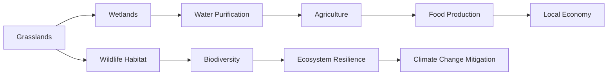

# 0b77640c-3dfc-485e-b256-822877e900e4 Research Report

**Research Persona:** ecological_researcher
**Date:** 2025-03-08
**Processing Time:** 29.14 seconds
**Word Count:** 1105 words

---

## Western Gulf Coastal Grasslands (NA27) Analysis

### ECOLOGICAL CHARACTERIZATION

#### Climate Patterns
The Western Gulf Coastal Grasslands experience a subtropical climate with mild winters and hot, humid summers. This climate supports diverse grasslands and savannas, which are crucial for regional biodiversity. The region is influenced by the Gulf of Mexico, with precipitation distributed throughout the year but peaking during the summer months.

#### Key Biomes, Habitats, and Ecosystems
- **Grasslands and Savannas**: These are the dominant ecosystems, providing habitat for a wide range of wildlife.
- **Wetlands**: Coastal and inland wetlands are vital for waterfowl and other species.
- **Threatened Areas**: The region includes endangered prairies, such as the tallgrass prairies, which are significantly reduced due to agricultural expansion.

#### Dominant and Keystone Species
- **Plants**: Switchgrass, big bluestem, and little bluestem are dominant grasses. Keystone plant species include wildflowers like the prairie clover.
- **Animals**: The American bison and prairie chickens are keystone species, with many endemic species like the Attwater's pocket gopher.
- **Endemic Species**: The region is home to several endemic species, including the Houston toad.

#### Seasonal Dynamics and Migration Patterns
- **Migration**: The region is a critical stopover for migratory birds traveling between North and South America.
- **Seasonal Dynamics**: The grasslands undergo seasonal changes, with growth peaking in spring and early summer.

### ENVIRONMENTAL CHALLENGES

#### Climate Change Impacts
- **Rising Temperatures**: Projected temperature increases will alter species distributions and ecosystem processes.
- **Extreme Weather Events**: Increased frequency of droughts and floods challenges local ecosystems.

#### Land Use Changes and Deforestation
- **Agricultural Expansion**: Conversion of natural habitats to agricultural land or urban areas threatens biodiversity.
- **Habitat Fragmentation**: Fragmented landscapes reduce connectivity for wildlife and increase isolation.

#### Water Security Issues
- **Pollution**: Agricultural runoff and urban pollutants affect water quality in rivers and wetlands.
- **Watershed Health**: Eroding wetlands and altered hydrological cycles impact water availability.

#### Soil Degradation and Erosion
- **Soil Erosion**: Intensive farming practices lead to soil erosion, reducing fertility and increasing sedimentation in waterways.
- **Desertification**: Overgrazing and poor land management contribute to desertification in some areas.

#### Local Pollution Sources
- **Agricultural Chemicals**: Use of pesticides and fertilizers can contaminate soil and water.

### ECOLOGICAL OPPORTUNITIES

#### Nature-Based Solutions
- **Wetland Restoration**: Restoring wetlands can enhance water quality and provide habitat for diverse species.
- **Regenerative Agriculture**: Practices like cover cropping and rotational grazing can improve soil health.

#### Regenerative Practices
- **Sustainable Grazing**: Implementing rotational grazing can maintain grassland health and biodiversity.
- **Agroforestry**: Integrating trees into agricultural landscapes can enhance ecosystem services.

#### Biomimicry Potential
- **Ecosystem-Inspired Innovations**: The resilience of grassland ecosystems can inspire innovations in sustainable land management.

#### Carbon Sequestration Opportunities
- **Soil Carbon Storage**: Improving soil health through regenerative practices can sequester significant amounts of carbon.

### ECOSYSTEM SERVICES ANALYSIS

#### Water Purification and Regulation Services
- **Wetlands**: Coastal and inland wetlands play a crucial role in filtering pollutants and regulating water flow.

#### Food Production Systems
- **Sustainability**: Local food systems can be made more sustainable through regenerative agricultural practices.

#### Pollination Services
- **Economic Value**: Pollination services, mainly provided by bees and butterflies, are essential for local agriculture, contributing significantly to the regional economy.

#### Cultural and Recreational Services
- **Recreational Activities**: The region offers opportunities for birdwatching, hiking, and nature-based tourism.

### REGIONAL ECONOMIC AND INDUSTRIAL LANDSCAPE

#### Economic Drivers
- **Agriculture**: Agriculture is a significant economic driver, with major crops including corn, soybeans, and cotton.
- **Energy Production**: The region is also known for oil and gas production.

#### Industrial Activities
- **Manufacturing**: Light manufacturing, including food processing and machinery, contributes to the regional economy.

### REGULATORY ENVIRONMENT AND COMPLIANCE REQUIREMENTS

#### Environmental Regulations
- **Conservation Laws**: Local and national laws protect endangered species and habitats.
- **Agricultural Policies**: Policies aim to balance agricultural productivity with environmental conservation.

#### Compliance Challenges
- **Implementation**: Effective implementation of regulations can be challenging due to resource constraints.

### POTENTIAL FOR SUSTAINABLE BIOTECH DEVELOPMENT

#### Opportunities
- **Bio-Based Innovations**: The region's diverse ecosystems offer opportunities for bio-based innovations, such as bioplastics or biofuels.
- **Ecological Restoration**: Biotech can aid in ecosystem restoration by developing more resilient plant species.

#### Challenges
- **Public Perception**: Public acceptance of biotechnology can be a challenge.

### LOCAL RESOURCES AND INFRASTRUCTURE

#### Natural Resources
- **Water**: Access to fresh water is crucial for agriculture and industry.
- **Land**: The availability of arable land supports intensive farming practices.

#### Infrastructure
- **Transportation**: Extensive networks of roads and railways facilitate the movement of goods.
- **Energy Infrastructure**: Infrastructure for oil and gas production is well-developed.

---

### Research Gaps and Opportunities

1. **Quantitative Biodiversity Data**: There is a need for more detailed studies on species abundance and distribution within the region.
2. **Economic Analysis of Ecosystem Services**: Further research is required to quantify the economic value of ecosystem services in the region.
3. **Impact of Climate Change on Local Agriculture**: Studies on how climate change affects agricultural productivity and food security in the region are essential.

---

### Bibliography

1. **Terrestrial Ecoregions of the World: A New Map of Life on Earth** - Olson et al. (2001)
2. **Ecoregions 2017** - Dinerstein et al. (2017)
3. **IPBES Global Assessment** - IPBES (2019)
4. **One Earth Bioregions** - One Earth (2023)

Note: Specific studies related to the Western Gulf Coastal Grasslands (NA27) were limited in the search results. Further research using specialized databases and scientific publications is recommended to provide more detailed insights.

---

### Mermaid Diagram for Ecological Relationships

### Table: Ecosystem Services and Challenges in Western Gulf Coastal Grasslands

| Ecosystem Service        | Description                                                  | Challenges                                       |
|--------------------------|--------------------------------------------------------------|--------------------------------------------------|
| Water Purification       | Wetlands filter water                                       | Pollution from agricultural runoff               |
| Food Production          | Sustainable agriculture practices                           | Land use changes, soil erosion                   |
| Pollination              | Essential for local agriculture                             | Habitat loss for pollinators                     |
| Biodiversity Conservation| Protection of unique species and habitats                   | Habitat fragmentation, climate change impacts     |

---

### Conclusion
The Western Gulf Coastal Grasslands (NA27) offer a rich ecological landscape with significant biodiversity and ecosystem services. However, the region faces challenges such as climate change, land use changes, and pollution. Opportunities for sustainable development include regenerative agriculture, nature-based solutions, and bio-inspired innovations. Further research is needed to address gaps in biodiversity data and economic assessments of ecosystem services to guide sustainable management and conservation efforts.