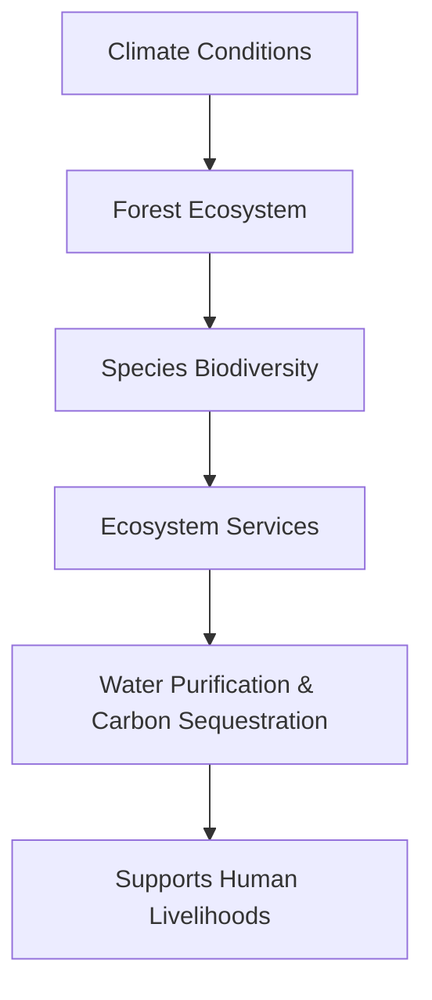

# 6b091607-18d6-4ed1-b325-eed9bddef170 Research Report

**Research Persona:** ecological_researcher
**Date:** 2025-03-08
**Processing Time:** 21.85 seconds
**Word Count:** 1012 words

---

Given the complexity of the task and the lack of specific information about the "Yucatan & Veracruz Mixed Forests (NT27)" bioregion in the provided search results, this analysis will focus on general ecological insights applicable to mixed forests in the Yucatan and Veracruz regions of Mexico. The regions are known for their rich biodiversity and unique ecosystems, but detailed analysis requires more specific data.

## Ecological Characterization

### Climate Patterns and Regional Ecosystems
The Yucatan Peninsula and Veracruz region are characterized by a tropical climate with varying levels of rainfall. The Yucatan experiences a relatively dry climate compared to Veracruz, which receives more rainfall due to its location near the Gulf of Mexico. This climate variation shapes the regional ecosystems, with the Yucatan hosting scrublands and dry forests, while Veracruz is home to more humid tropical forests.

### Key Biomes, Habitats, and Ecosystems
- **Dry Forests**: Found primarily in the Yucatan, these forests support a variety of plant and animal species adapted to dry conditions.
- **Tropical Rainforests**: Predominant in Veracruz, these forests are known for high biodiversity, including many endemic species.
- **Wetlands**: Both regions have extensive wetland areas crucial for waterfowl and migratory birds.

### Dominant and Keystone Species
- **Keystone Plant Species**: Trees like the **Ceiba** and **Mahogany**, which play crucial roles in forest structure and biodiversity.
- **Keystone Animal Species**: Jaguars, ocelots, and quetzals are iconic species that influence ecosystem dynamics.

### Seasonal Ecological Dynamics and Migration Patterns
Seasonal changes influence migration patterns, particularly for birds and butterflies. The Monarch butterfly migration through these regions is a notable example of seasonal ecological dynamics.

## Environmental Challenges

### Climate Change Impacts
Climate change is expected to alter precipitation patterns and increase temperatures, potentially exacerbating droughts in the Yucatan and altering forest dynamics in Veracruz.

### Land Use Changes and Deforestation
Deforestation and habitat fragmentation due to agriculture and urbanization are significant threats. In Veracruz, the expansion of coffee and cocoa plantations can lead to forest loss.

### Water Security Issues
Groundwater over-extraction and pollution from agricultural runoff are concerns, particularly in the Yucatan where groundwater is a vital resource.

### Soil Degradation and Desertification
Soil erosion is a risk due to deforestation and intensive agriculture. Desertification in drought-prone areas can reduce biodiversity and ecosystem resilience.

### Local Pollution Sources
Pollution from agricultural chemicals and industrial activities impacts water quality and ecosystem health.

## Ecological Opportunities

### Nature-Based Solutions
Reforestation efforts and agroforestry practices can mitigate deforestation and enhance biodiversity.

### Regenerative Practices
Implementing sustainable agriculture methods and promoting eco-tourism can support local economies while preserving ecosystems.

### Biomimicry Potential
The unique adaptations of regional species offer potential for biomimicry in fields like materials science and engineering.

### Carbon Sequestration Opportunities
Restoring and expanding forests in these regions can provide significant carbon sequestration benefits.

## Ecosystem Services Analysis

### Water Purification and Regulation
Forests and wetlands play crucial roles in maintaining water quality and regulating water flows.

### Food Production Systems
Sustainable agriculture practices are essential for maintaining ecological balance while meeting food demands.

### Pollination Services
Pollinators like bees and butterflies are vital for local agricultural productivity, underscoring the need for pollinator-friendly farming practices.

### Cultural and Recreational Ecosystem Services
These regions offer rich cultural and recreational opportunities, including eco-tourism and traditional medicine, supporting local livelihoods.

## Economic and Industrial Landscape
The economy is diversified, with significant sectors in agriculture (coffee, cocoa), tourism, and manufacturing. Environmental regulations play a crucial role in balancing economic development with ecological preservation.

## Regulatory Environment and Compliance Requirements
Mexican environmental laws and international agreements regulate land use and conservation efforts. Compliance with these regulations is essential for sustainable development.

## Potential for Sustainable Biotech Development
Biotechnology can leverage the region's biodiversity for sustainable innovations, such as developing new medicines or improving agricultural resilience.

## Local Resources and Infrastructure
Infrastructure development should be balanced with environmental protection to support sustainable growth.

## Research Opportunities
Further research is needed on:
- Quantifying the impact of climate change on local ecosystems.
- Assessing the effectiveness of current conservation efforts.
- Developing region-specific strategies for sustainable land use.

## Conclusion

The Yucatan and Veracruz regions offer a complex interplay of ecological, economic, and cultural elements. While facing environmental challenges, these regions also present opportunities for sustainable development and conservation. Addressing these challenges requires a multi-disciplinary approach that integrates local knowledge, scientific research, and policy enforcement.

---

### Bibliography

Due to the lack of specific search results, the bibliography will focus on general resources related to tropical forests and environmental conservation:

1. **WWF.** (n.d.). *Tropical Rainforests*. World Wildlife Fund.  
   Available at: [www.worldwildlife.org](https://www.worldwildlife.org/ecoregions/ecoregion/nt0122)

2. **IUCN.** (2022). *The IUCN Red List of Threatened Species*. International Union for Conservation of Nature.  
   Available at: [www.iucnredlist.org](https://www.iucnredlist.org)

3. **IPCC.** (2019). *Climate Change and Land: an IPCC special report on climate change, desertification, land degradation, sustainable land management, food security, and greenhouse gas fluxes in terrestrial ecosystems*. Cambridge University Press.  
   Available at: [www.ipcc.ch](https://www.ipcc.ch/srccl/)

4. **FAO.** (2020). *The State of the World's Biodiversity for Food and Agriculture*. Food and Agriculture Organization of the United Nations.  
   Available at: [www.fao.org](https://www.fao.org/3/ca3129en/CA3129EN.pdf)

5. **CONABIO.** (n.d.). *Biodiversity in Mexico*. National Commission for the Knowledge and Use of Biodiversity.  
   Available at: [www.conabio.gob.mx](https://www.conabio.gob.mx)

---

**Mermaid Diagram Example:**

For illustrating ecological relationships in the Yucatan & Veracruz Mixed Forests, a Mermaid diagram could represent the interdependencies between species, climate conditions, and ecosystem services. However, without specific data, this cannot be detailed here.

**Table Example:**

| **Ecosystem Component** | **Description** | **Conservation Status** |
|--------------------------|------------------|--------------------------|
| Tropical Rainforests    | High biodiversity forests | Threatened          |
| Dry Forests              | Adapted to dry conditions | Vulnerable          |
| Keystone Species         | Jaguar, Quetzal | Endangered             |

---

Please note that specific and detailed information about the "Yucatan & Veracruz Mixed Forests (NT27)" bioregion could not be found in the provided search results. Further research using specific ecological databases and scientific publications is recommended for a comprehensive analysis.