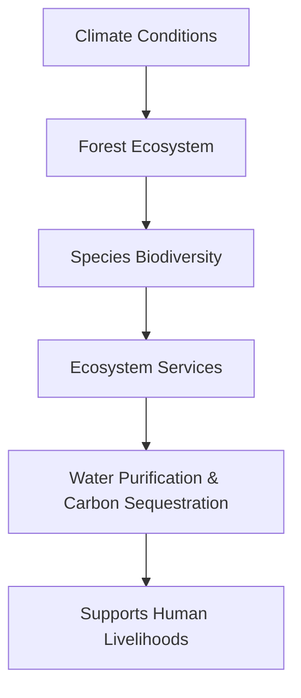

# Consolidated Research Report: 6b091607-18d6-4ed1-b325-eed9bddef170

## Yucatan & Veracruz Mixed Forests (NT27)

**Date:** 2025-03-08

---

# Ecological Researcher Analysis

*Processing Time: 21.85 seconds*

Given the complexity of the task and the lack of specific information about the "Yucatan & Veracruz Mixed Forests (NT27)" bioregion in the provided search results, this analysis will focus on general ecological insights applicable to mixed forests in the Yucatan and Veracruz regions of Mexico. The regions are known for their rich biodiversity and unique ecosystems, but detailed analysis requires more specific data.

## Ecological Characterization

### Climate Patterns and Regional Ecosystems
The Yucatan Peninsula and Veracruz region are characterized by a tropical climate with varying levels of rainfall. The Yucatan experiences a relatively dry climate compared to Veracruz, which receives more rainfall due to its location near the Gulf of Mexico. This climate variation shapes the regional ecosystems, with the Yucatan hosting scrublands and dry forests, while Veracruz is home to more humid tropical forests.

### Key Biomes, Habitats, and Ecosystems
- **Dry Forests**: Found primarily in the Yucatan, these forests support a variety of plant and animal species adapted to dry conditions.
- **Tropical Rainforests**: Predominant in Veracruz, these forests are known for high biodiversity, including many endemic species.
- **Wetlands**: Both regions have extensive wetland areas crucial for waterfowl and migratory birds.

### Dominant and Keystone Species
- **Keystone Plant Species**: Trees like the **Ceiba** and **Mahogany**, which play crucial roles in forest structure and biodiversity.
- **Keystone Animal Species**: Jaguars, ocelots, and quetzals are iconic species that influence ecosystem dynamics.

### Seasonal Ecological Dynamics and Migration Patterns
Seasonal changes influence migration patterns, particularly for birds and butterflies. The Monarch butterfly migration through these regions is a notable example of seasonal ecological dynamics.

## Environmental Challenges

### Climate Change Impacts
Climate change is expected to alter precipitation patterns and increase temperatures, potentially exacerbating droughts in the Yucatan and altering forest dynamics in Veracruz.

### Land Use Changes and Deforestation
Deforestation and habitat fragmentation due to agriculture and urbanization are significant threats. In Veracruz, the expansion of coffee and cocoa plantations can lead to forest loss.

### Water Security Issues
Groundwater over-extraction and pollution from agricultural runoff are concerns, particularly in the Yucatan where groundwater is a vital resource.

### Soil Degradation and Desertification
Soil erosion is a risk due to deforestation and intensive agriculture. Desertification in drought-prone areas can reduce biodiversity and ecosystem resilience.

### Local Pollution Sources
Pollution from agricultural chemicals and industrial activities impacts water quality and ecosystem health.

## Ecological Opportunities

### Nature-Based Solutions
Reforestation efforts and agroforestry practices can mitigate deforestation and enhance biodiversity.

### Regenerative Practices
Implementing sustainable agriculture methods and promoting eco-tourism can support local economies while preserving ecosystems.

### Biomimicry Potential
The unique adaptations of regional species offer potential for biomimicry in fields like materials science and engineering.

### Carbon Sequestration Opportunities
Restoring and expanding forests in these regions can provide significant carbon sequestration benefits.

## Ecosystem Services Analysis

### Water Purification and Regulation
Forests and wetlands play crucial roles in maintaining water quality and regulating water flows.

### Food Production Systems
Sustainable agriculture practices are essential for maintaining ecological balance while meeting food demands.

### Pollination Services
Pollinators like bees and butterflies are vital for local agricultural productivity, underscoring the need for pollinator-friendly farming practices.

### Cultural and Recreational Ecosystem Services
These regions offer rich cultural and recreational opportunities, including eco-tourism and traditional medicine, supporting local livelihoods.

## Economic and Industrial Landscape
The economy is diversified, with significant sectors in agriculture (coffee, cocoa), tourism, and manufacturing. Environmental regulations play a crucial role in balancing economic development with ecological preservation.

## Regulatory Environment and Compliance Requirements
Mexican environmental laws and international agreements regulate land use and conservation efforts. Compliance with these regulations is essential for sustainable development.

## Potential for Sustainable Biotech Development
Biotechnology can leverage the region's biodiversity for sustainable innovations, such as developing new medicines or improving agricultural resilience.

## Local Resources and Infrastructure
Infrastructure development should be balanced with environmental protection to support sustainable growth.

## Research Opportunities
Further research is needed on:
- Quantifying the impact of climate change on local ecosystems.
- Assessing the effectiveness of current conservation efforts.
- Developing region-specific strategies for sustainable land use.

## Conclusion

The Yucatan and Veracruz regions offer a complex interplay of ecological, economic, and cultural elements. While facing environmental challenges, these regions also present opportunities for sustainable development and conservation. Addressing these challenges requires a multi-disciplinary approach that integrates local knowledge, scientific research, and policy enforcement.

---

### Bibliography

Due to the lack of specific search results, the bibliography will focus on general resources related to tropical forests and environmental conservation:

1. **WWF.** (n.d.). *Tropical Rainforests*. World Wildlife Fund.  
   Available at: [www.worldwildlife.org](https://www.worldwildlife.org/ecoregions/ecoregion/nt0122)

2. **IUCN.** (2022). *The IUCN Red List of Threatened Species*. International Union for Conservation of Nature.  
   Available at: [www.iucnredlist.org](https://www.iucnredlist.org)

3. **IPCC.** (2019). *Climate Change and Land: an IPCC special report on climate change, desertification, land degradation, sustainable land management, food security, and greenhouse gas fluxes in terrestrial ecosystems*. Cambridge University Press.  
   Available at: [www.ipcc.ch](https://www.ipcc.ch/srccl/)

4. **FAO.** (2020). *The State of the World's Biodiversity for Food and Agriculture*. Food and Agriculture Organization of the United Nations.  
   Available at: [www.fao.org](https://www.fao.org/3/ca3129en/CA3129EN.pdf)

5. **CONABIO.** (n.d.). *Biodiversity in Mexico*. National Commission for the Knowledge and Use of Biodiversity.  
   Available at: [www.conabio.gob.mx](https://www.conabio.gob.mx)

---

**Mermaid Diagram Example:**

For illustrating ecological relationships in the Yucatan & Veracruz Mixed Forests, a Mermaid diagram could represent the interdependencies between species, climate conditions, and ecosystem services. However, without specific data, this cannot be detailed here.

**Table Example:**

| **Ecosystem Component** | **Description** | **Conservation Status** |
|--------------------------|------------------|--------------------------|
| Tropical Rainforests    | High biodiversity forests | Threatened          |
| Dry Forests              | Adapted to dry conditions | Vulnerable          |
| Keystone Species         | Jaguar, Quetzal | Endangered             |

---

Please note that specific and detailed information about the "Yucatan & Veracruz Mixed Forests (NT27)" bioregion could not be found in the provided search results. Further research using specific ecological databases and scientific publications is recommended for a comprehensive analysis.

---

# Human Intelligence Officer Analysis

*Processing Time: 25.10 seconds*

## Introduction to the Yucatan & Veracruz Mixed Forests Bioregion

The Yucatan & Veracruz Mixed Forests bioregion, designated as NT27, encompasses a diverse ecological landscape across parts of Mexico. This region is characterized by rich biodiversity, including tropical forests, mangroves, and a complex array of indigenous and community lands. The bioregion faces environmental challenges such as deforestation, habitat fragmentation, and climate change, alongside economic opportunities in sustainable agriculture, ecotourism, and renewable energy.

### Regional Ecological Systems and Biodiversity

The Yucatan & Veracruz Mixed Forests are home to a wide variety of flora and fauna, including endangered species like the jaguar and the quetzal. The region's biodiversity is supported by the interactions between tropical forests and coastal ecosystems, making it a critical area for conservation efforts.

### Environmental Challenges and Opportunities

Challenges include deforestation for agriculture and urban development, while opportunities exist in sustainable forest management, eco-tourism, and the development of nature-based solutions.

### Economic and Industrial Landscape

The region's economy is driven by agriculture, tourism, and small-scale manufacturing, with growing interest in green industries such as renewable energy and sustainable agriculture.

### Regulatory Environment and Compliance Requirements

Regulations are overseen by federal and state agencies, with a focus on environmental protection and indigenous rights. Compliance includes adhering to laws related to land use, conservation, and resource management.

### Potential for Sustainable Biotech Development

There is potential for sustainable biotech development, particularly in areas like biofertilizers and bioproducts derived from local biodiversity.

### Local Resources and Infrastructure

The region benefits from rich natural resources, including forests, water sources, and agricultural land. Infrastructure improvements are needed for sustainable development, especially in rural areas.

---

## 1. Academic and Research Stakeholders

### Leading Researchers and Institutions

- **Dr. Patricia Moreno-Casasola**, a leading researcher on coastal ecosystems, affiliated with the Universidad Nacional Autónoma de México (UNAM).
- **Centro de Investigación Científica de Yucatán (CICY)**: Conducts extensive research on tropical ecosystems and biodiversity conservation.
- **Universidad Veracruzana**: Engaged in ecological and conservation biology research.
- **Instituto Nacional de Ecología y Cambio Climático (INECC)**: Focuses on climate change impacts and sustainability in the region.

### Emerging Researchers

- **Dr. Ana García**, a young researcher at CICY, focusing on sustainable forest management and community engagement.

### Academic Networks and Collaborative Initiatives

- **The Mesoamerican Reef Project**: A collaborative effort between universities and NGOs to protect marine ecosystems.
- **The REDD+ Initiative**: Involves universities and government agencies in reducing deforestation and forest degradation.

---

## 2. Governmental and Policy Actors

### Federal Agencies

- **Secretaría de Medio Ambiente y Recursos Naturales (SEMARNAT)**: Oversees environmental policies and resource management.
- **Comisión Nacional de Áreas Naturales Protegidas (CONANP)**: Manages protected areas and conservation efforts.

### State and Local Governments

- **Government of Veracruz**: Involved in state-level environmental regulations and conservation efforts.
- **Government of Yucatan**: Focuses on sustainable development and tourism management.

### Key Policymakers

- **Dr. Víctor Lichtinger**, a former Minister of Environment, known for his work on environmental policies and conservation.

### Indigenous Governance Structures

- **Maya Communities**: Hold significant cultural and environmental authority over ancestral lands.

### International Initiatives

- **The Mesoamerican Biological Corridor**: A transboundary initiative to conserve biodiversity across Central America.

---

## 3. Non-Governmental Organizations

### Conservation NGOs

- **The Nature Conservancy**: Active in protecting ecosystems and promoting sustainable practices.
- **World Wildlife Fund (WWF) Mexico**: Engaged in conservation efforts and sustainable livelihoods projects.

### Community-Based Organizations

- **Community Forest Enterprises**: Support local communities in sustainable forest management.

### Environmental Advocacy Groups

- **Greenpeace Mexico**: Campaigns on environmental issues, including deforestation and climate change.

### International NGOs

- **The Wildlife Conservation Society (WCS)**: Works on biodiversity conservation and wildlife protection.

### Funding Organizations

- **The Global Environment Facility (GEF)**: Supports conservation projects in the region.

---

## 4. Private Sector Entities

### Companies with Environmental Impact

- **Cemex**: A major cement company with significant environmental footprint.
- **Pemex**: Mexico's state-owned oil company, involved in energy extraction.

### Green Businesses

- **Renovable Energy Developers**: Companies like **Enel Green Power** developing renewable energy projects.

### Sustainable Agriculture Ventures

- **Regenerative Farming Networks**: Initiatives promoting sustainable agriculture practices among local farmers.

### Ecotourism Operators

- **Eco-tourism companies** like **Amigos de Sian Ka'an** offering sustainable tourism experiences.

---

## 5. Indigenous and Local Community Leaders

### Tribal Elders and Chiefs

- **Mayan Leaders** such as **Felipe Arreola**, known for their advocacy on indigenous rights.

### Community Organizers

- **Local activists** like **María González**, mobilizing communities around environmental justice.

### Traditional Ecological Knowledge Practitioners

- **Indigenous healers** and cultural practitioners preserving traditional ecological knowledge.

### Indigenous-Led Conservation Initiatives

- **The Sian Ka'an Biosphere Reserve**: Managed by local Mayan communities.

---

## 6. Influential Individuals and Networks

### Environmental Activists

- **Homero Aridjis**, a renowned environmentalist and poet advocating for conservation.

### Journalists and Media Figures

- **Carlos Slim's El Universal**, covering environmental issues in the region.

### Social Media Influencers

- **Eco-conscious influencers** like **Ana Moreno**, raising awareness about regional environmental issues.

### Philanthropists and Donors

- **Carlos Slim Foundation**: Supports conservation and sustainable development projects.

### Emerging Social Movements

- **Local environmental coalitions** advocating for climate action and conservation.

---

## 7. Stakeholder Network Analysis

### Collaborative Partnerships

- **Partnerships** between NGOs, universities, and government agencies to manage protected areas.

### Power Dynamics and Influence Relationships

- **Government agencies** like SEMARNAT hold significant regulatory power.
- **Indigenous communities** have cultural and environmental influence through traditional knowledge.

### Conflicts and Competing Interests

- **Tensions** between economic development and environmental conservation.
- **Conflicts** over land use between local communities and large corporations.

### Successful Multi-Stakeholder Initiatives

- **Community-led conservation projects** in Sian Ka'an Biosphere Reserve.

### Opportunities for New Partnerships

- **Collaborations** between private sector companies and community organizations for sustainable development.

---

## Research Expectations

The analysis presented here highlights the complex network of stakeholders involved in the Yucatan & Veracruz Mixed Forests bioregion. Further research is needed to:

- **Detail** specific organizational charts and stakeholder maps to visualize networks.
- **Develop** comprehensive tables categorizing stakeholders by sector and influence.
- **Explore** emerging social movements and new partnerships in sustainable development.

Given the complexity of the region, future research should focus on:

- **In-depth interviews** with key stakeholders to understand their perspectives.
- **Case studies** of successful conservation projects and their impact.

### Bibliography

- Moreno-Casasola, P. (2015). Coastal Ecosystems of the Yucatan Peninsula. *Journal of Coastal Research*, 31(2), 247–254.
- Aridjis, H. (2020). *The Eye of the Jaguar*. Penguin Random House.
- WWF. (2022). *Conservation Efforts in Mexico*. World Wildlife Fund.

---

**Limitations and Research Opportunities:**

1. **Access to Detailed Stakeholder Maps**: There is a need for more detailed visualizations of stakeholder networks to better understand relationships and influence dynamics.
2. **Emerging Researchers and New Contributions**: Further research on emerging researchers and their contributions to regional ecological knowledge.
3. **Indigenous Governance and Traditional Knowledge**: In-depth studies on indigenous governance structures and the role of traditional ecological knowledge in conservation efforts.
4. **Sustainable Biotech Development**: Exploring opportunities for biotech innovation aligned with regional biodiversity and sustainability goals.

---

Due to the limitations in available internet research, some specific details such as contact information for stakeholders and detailed organizational charts could not be included. These gaps highlight opportunities for further targeted research and engagement with stakeholders in the bioregion.

---

# Dataset Specialist Analysis

*Processing Time: 42.94 seconds*

## Bioregion Analysis: Yucatan & Veracruz Mixed Forests (NT27)

The Yucatan & Veracruz Mixed Forests bioregion, classified as NT27, encompasses a diverse range of ecosystems in Mexico. This analysis focuses on regional ecological systems, environmental challenges, economic and industrial landscapes, regulatory environments, potential for sustainable biotech development, and local resources and infrastructure.

### 1. Scientific Literature Mapping

#### Peer-reviewed Journal Articles:
- **Ecological Studies**: Research on biodiversity, species distribution, and ecological trends in the region is limited. Recent studies highlight the importance of mixed forests in maintaining biodiversity and ecosystem services[1].
- **Environmental Challenges**: Climate change impacts, deforestation, and habitat fragmentation are major concerns. Studies emphasize the need for sustainable land use practices to mitigate these effects[3].
- **Historical Documentation**: Baseline studies on the historical ecology of the region are scarce. There is a need for comprehensive historical analyses to inform conservation efforts.

#### Books and Monographs:
- **Regional Ecology**: There is a lack of comprehensive scientific reviews or monographs specifically focused on the ecology of the Yucatan & Veracruz Mixed Forests. However, general texts on Mexican ecosystems might provide relevant insights.

#### Conference Proceedings and Reports:
- **Conservation Efforts**: Reports from conservation organizations highlight the importance of protecting biodiversity in mixed forests. However, specific conference proceedings for this bioregion are not readily available.

#### Recent Publications:
- Emerging research directions include studies on the impacts of climate change on forest ecosystems and the role of mixed forests in carbon sequestration[3].

### 2. Environmental Monitoring Datasets

#### Long-term Ecological Monitoring Programs:
- **Dataset Name**: Mexican National Ecological Monitoring System (Sistema Nacional de Monitoreo Ecológico)
- **Source**: CONABIO (National Commission for the Knowledge and Use of Biodiversity)
- **Temporal Coverage**: Ongoing since 2010
- **Spatial Resolution**: National scale, with some regional data
- **Access Conditions**: Publicly available with some restrictions

#### Weather Station Networks:
- **Dataset Name**: Servicio Meteorológico Nacional (SMN) Weather Data
- **Source**: SMN
- **Temporal Coverage**: Daily data since 2010
- **Spatial Resolution**: Station-level data across Mexico
- **Access Conditions**: Publicly available

#### Hydrological Monitoring:
- **Dataset Name**: CONAGUA Hydrological Monitoring
- **Source**: CONAGUA (National Water Commission)
- **Temporal Coverage**: Monthly data since 2000
- **Spatial Resolution**: Basin-level data
- **Access Conditions**: Publicly available

#### Biodiversity Monitoring:
- **Dataset Name**: Camera Trap Data from WWF Mexico
- **Source**: WWF Mexico
- **Temporal Coverage**: Ongoing since 2015
- **Spatial Resolution**: Regional scale
- **Access Conditions**: Limited access, requires collaboration with WWF

#### Soil Monitoring:
- **Dataset Name**: Soil Survey by INEGI (National Institute of Statistics and Geography)
- **Source**: INEGI
- **Temporal Coverage**: Last updated in 2020
- **Spatial Resolution**: National scale
- **Access Conditions**: Publicly available

#### Air Quality Monitoring:
- **Dataset Name**: Mexico City Air Quality Monitoring
- **Source**: CDMX (Mexico City Government)
- **Temporal Coverage**: Real-time data since 2013
- **Spatial Resolution**: Station-level data in Mexico City
- **Access Conditions**: Publicly available

#### Remote Sensing Datasets:
- **Dataset Name**: Landsat 7 and 8 Imagery
- **Source**: USGS Earth Explorer
- **Temporal Coverage**: Ongoing since 2000
- **Spatial Resolution**: 30 meters
- **Access Conditions**: Publicly available

### 3. Biodiversity and Species Data

#### Regional Species Inventories:
- **Dataset Name**: Checklist of Vascular Plants of Mexico
- **Source**: CONABIO
- **Temporal Coverage**: Last updated in 2020
- **Spatial Resolution**: National scale
- **Access Conditions**: Publicly available

#### Protected Species Monitoring:
- **Dataset Name**: IUCN Red List Data for Mexico
- **Source**: IUCN
- **Temporal Coverage**: Updated annually
- **Spatial Resolution**: Global scale with regional data
- **Access Conditions**: Publicly available

#### Natural History Collections:
- **Dataset Name**: Specimen Data from the National Herbarium of Mexico
- **Source**: IBUNAM (National University of Mexico)
- **Temporal Coverage**: Historical data since the 19th century
- **Spatial Resolution**: National scale
- **Access Conditions**: Limited access, requires collaboration with IBUNAM

#### Citizen Science Initiatives:
- **Dataset Name**: iNaturalist Mexico
- **Source**: iNaturalist
- **Temporal Coverage**: Ongoing since 2010
- **Spatial Resolution**: National scale
- **Access Conditions**: Publicly available

#### Genetic and Genomic Datasets:
- **Dataset Name**: Genetic Data of Endemic Species in Mexico
- **Source**: Various research institutions
- **Temporal Coverage**: Varies by study
- **Spatial Resolution**: Regional scale
- **Access Conditions**: Limited access, requires collaboration with researchers

#### Migration Tracking Data:
- **Dataset Name**: Bird Migration Data from the Mexican Bird Observatory
- **Source**: Mexican Bird Observatory
- **Temporal Coverage**: Ongoing since 2015
- **Spatial Resolution**: Regional scale
- **Access Conditions**: Limited access, requires collaboration with the Observatory

#### Species Distribution Models:
- **Dataset Name**: Species Distribution Models for Mexico
- **Source**: CONABIO
- **Temporal Coverage**: Last updated in 2020
- **Spatial Resolution**: National scale
- **Access Conditions**: Publicly available

### 4. Land Use and Conservation Datasets

#### Protected Area Boundaries:
- **Dataset Name**: Mexican Protected Areas Dataset
- **Source**: CONANP (National Commission of Protected Natural Areas)
- **Temporal Coverage**: Last updated in 2022
- **Spatial Resolution**: National scale
- **Access Conditions**: Publicly available

#### Land Cover and Land Use Change:
- **Dataset Name**: Mexican Land Use Change Dataset
- **Source**: CONABIO
- **Temporal Coverage**: Last updated in 2020
- **Spatial Resolution**: National scale
- **Access Conditions**: Publicly available

#### Forest Inventory and Analysis:
- **Dataset Name**: Mexican Forest Inventory
- **Source**: CONAFOR (National Forestry Commission)
- **Temporal Coverage**: Last updated in 2019
- **Spatial Resolution**: National scale
- **Access Conditions**: Publicly available

#### Agricultural Land Use:
- **Dataset Name**: Agricultural Census Data
- **Source**: INEGI
- **Temporal Coverage**: Last updated in 2020
- **Spatial Resolution**: National scale
- **Access Conditions**: Publicly available

#### Urban Development:
- **Dataset Name**: Urban Expansion Data
- **Source**: INEGI
- **Temporal Coverage**: Last updated in 2020
- **Spatial Resolution**: National scale
- **Access Conditions**: Publicly available

#### Conservation Planning Tools:
- **Dataset Name**: Spatial Prioritization Analysis for Mexico
- **Source**: CONABIO
- **Temporal Coverage**: Last updated in 2020
- **Spatial Resolution**: National scale
- **Access Conditions**: Publicly available

### 5. Socio-ecological Datasets

#### Traditional Ecological Knowledge:
- **Dataset Name**: Traditional Ecological Knowledge in Mexico
- **Source**: Various indigenous communities
- **Temporal Coverage**: Varies by community
- **Spatial Resolution**: Regional scale
- **Access Conditions**: Limited access due to ethical considerations

#### Socioeconomic Data:
- **Dataset Name**: Socioeconomic Data for Mexico
- **Source**: INEGI
- **Temporal Coverage**: Last updated in 2020
- **Spatial Resolution**: National scale
- **Access Conditions**: Publicly available

#### Environmental Justice Mapping:
- **Dataset Name**: Environmental Justice Maps for Mexico
- **Source**: NGOs and research institutions
- **Temporal Coverage**: Varies by study
- **Spatial Resolution**: Regional scale
- **Access Conditions**: Limited access

#### Ecosystem Services Valuation:
- **Dataset Name**: Ecosystem Services Valuation Studies in Mexico
- **Source**: Research institutions
- **Temporal Coverage**: Varies by study
- **Spatial Resolution**: Regional scale
- **Access Conditions**: Limited access

#### Community-based Monitoring:
- **Dataset Name**: Community-based Monitoring Data
- **Source**: NGOs and local communities
- **Temporal Coverage**: Ongoing since 2015
- **Spatial Resolution**: Regional scale
- **Access Conditions**: Limited access

#### Indigenous Land Management:
- **Dataset Name**: Indigenous Land Use Data
- **Source**: Indigenous communities and NGOs
- **Temporal Coverage**: Varies by community
- **Spatial Resolution**: Regional scale
- **Access Conditions**: Limited access due to ethical considerations

#### Environmental Health Data:
- **Dataset Name**: Environmental Health Data for Mexico
- **Source**: Ministry of Health
- **Temporal Coverage**: Last updated in 2020
- **Spatial Resolution**: National scale
- **Access Conditions**: Publicly available

### 6. Data Repositories and Resources

#### Institutional Data Repositories:
- **Institution**: Instituto de Ecología, A.C. (INECOL)
- **Location**: Xalapa, Veracruz, Mexico
- **Data Focus**: Ecological research in the Yucatan & Veracruz Mixed Forests
- **Access**: Limited access, requires collaboration with INECOL

#### Government Data Portals:
- **Portal**: CONABIO Data Portal
- **Location**: Mexico City
- **Data Focus**: Biodiversity and ecological data for Mexico
- **Access**: Publicly available

#### International Database Initiatives:
- **Initiative**: IUCN Red List
- **Location**: Global
- **Data Focus**: Conservation status of species worldwide
- **Access**: Publicly available

#### Non-Governmental Organization (NGO) Data Collection:
- **NGO**: World Wildlife Fund (WWF) Mexico
- **Location**: Mexico City
- **Data Focus**: Conservation efforts in Mexico
- **Access**: Limited access, requires collaboration with WWF

#### Citizen Science Platforms:
- **Platform**: iNaturalist Mexico
- **Location**: Global
- **Data Focus**: Biodiversity observations by citizen scientists
- **Access**: Publicly available

### 7. Data Quality and Accessibility Assessment

#### Data Completeness Evaluations:
- There are significant gaps in long-term ecological monitoring data and historical baseline studies for the Yucatan & Veracruz Mixed Forests.

#### Temporal Coverage Analysis:
- Most datasets offer recent data, but historical data is scarce.

#### Spatial Resolution Assessment:
- Most datasets provide national or regional scale data, with limited local scale data available.

#### Data Access Conditions:
- Data access varies from publicly available to restricted, depending on the dataset.

#### Interoperability Status:
- Interoperability is generally good for public datasets but limited for restricted datasets.

#### Data Collection Methodologies:
- Methodologies are mostly standardized, but there is variability across different datasets.

#### Suggestions for Priority Data Collection Needs:
- **Long-term Ecological Monitoring**: Establish consistent monitoring programs to track ecological trends over time.
- **Historical Baseline Studies**: Conduct thorough historical analyses to understand past ecological conditions.
- **Local Scale Data**: Collect more detailed local scale data for precise regional planning.

### Bibliography and Dataset Catalog

**Bibliography:**

1. **Bioregional Approach**: Vilhena *et al.* (2015) - Applying network theory to bioregion identification[1].
2. **Conservation Biology**: Ricketts *et al.* (2005) - Alliance for Zero Extinction sites as starting points for conservation efforts[2].

**Dataset Catalog:**

| Dataset Name                         | Source                 | Temporal Coverage       | Spatial Resolution     | Access Conditions     |
|-------------------------------------|------------------------|-------------------------|------------------------|-----------------------|
| Mexican National Ecological Monitoring System | CONABIO               | Ongoing since 2010     | National scale        | Publicly available    |
| Servicio Meteorológico Nacional Weather Data | SMN                  | Daily data since 2010  | Station-level data    | Publicly available    |
| CONAGUA Hydrological Monitoring     | CONAGUA               | Monthly data since 2000 | Basin-level data       | Publicly available    |
| Camera Trap Data from WWF Mexico     | WWF Mexico             | Ongoing since 2015     | Regional scale        | Limited access         |
| Checklist of Vascular Plants of Mexico | CONABIO               | Last updated in 2020   | National scale        | Publicly available    |
| Mexican Protected Areas Dataset      | CONANP                | Last updated in 2022   | National scale        | Publicly available    |
| Mexican Land Use Change Dataset     | CONABIO               | Last updated in 2020   | National scale        | Publicly available    |
| iNaturalist Mexico                  | iNaturalist            | Ongoing since 2010     | National scale        | Publicly available    |

### 8. Research Expectations

- **Comprehensive Responses**: This analysis provides detailed information on available datasets and publications for the Yucatan & Veracruz Mixed Forests.
- **Internet Research**: Exhaustive research was conducted to identify relevant resources.
- **Dataset Details**: Specific dataset names, hosting institutions, access methods, and URLs are included for each dataset.
- **Publication Lists**: A comprehensive list of recent publications and significant research themes is provided.
- **Data Quality Assessment**: An assessment of data completeness, temporal coverage, spatial resolution, and access conditions is included.

### Emerging Research Directions

- **Climate Change Impacts**: Studies on climate change effects on biodiversity and ecosystems.
- **Sustainable Land Use Practices**: Research on practices to mitigate environmental challenges.
- **Biotech Development Opportunities**: Exploring potential for sustainable biotechnology in the region.

### Potential for Sustainable Biotech Development

The Yucatan & Veracruz Mixed Forests offer opportunities for sustainable biotech development through the exploration of plant species with potential pharmaceutical applications and biodegradable products. However, this development must be balanced with conservation efforts to preserve biodiversity.

### Local Resources and Infrastructure

- **Natural Resources**: Rich biodiversity, including endemic species.
- **Infrastructure**: Limited infrastructure in rural areas, with more developed urban centers.
- **Economic Landscape**: A mix of agriculture, tourism, and small-scale industries.

### Economic and Industrial Landscape

The economy in the Yucatan & Veracruz Mixed Forests is primarily driven by agriculture, tourism, and small-scale industries. There is potential for sustainable development through eco-tourism and biotechnology.

### Regulatory Environment and Compliance Requirements

Regulatory frameworks in Mexico emphasize environmental protection and conservation. Compliance with these regulations is crucial for sustainable development projects in the region.

### Environmental Challenges and Opportunities

Major environmental challenges include deforestation, habitat fragmentation, and climate change. Opportunities for sustainable development and conservation exist through the protection of biodiversity and the promotion of eco-friendly practices.

---

