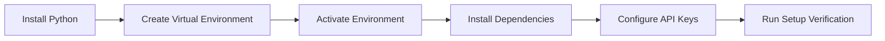
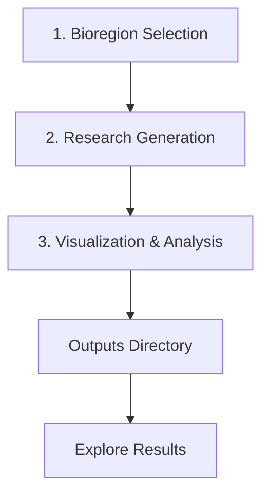

# One Earth: Quickstart Guide

This guide will help you quickly set up and start using the One Earth Bioregion Analysis System. Follow these steps to get started with analyzing bioregions and generating visualizations.

## Table of Contents
- [Prerequisites](#prerequisites)
- [Installation](#installation)
- [Basic Usage](#basic-usage)
- [Visualization Guide](#visualization-guide)
- [Troubleshooting](#troubleshooting)
- [Next Steps](#next-steps)

## Prerequisites

Before you begin, ensure you have the following:

- Python 3.7+ installed on your system
- Git for accessing the repository
- 2GB+ of free disk space
- Internet connection for initial setup and API access

## Installation

### Step 1: Clone the Repository

```bash
git clone https://github.com/username/OneEarth.git
cd OneEarth
```

### Step 2: Set Up a Virtual Environment (Recommended)



Creating a virtual environment is strongly recommended to avoid dependency conflicts:

```bash
# Create a virtual environment
python3 -m venv oneearth_env

# Activate the environment
# On macOS/Linux:
source oneearth_env/bin/activate
# On Windows:
# oneearth_env\Scripts\activate

# Verify activation
which python  # Should point to your virtual environment
```

### Step 3: Install Dependencies

```bash
# Install required packages
pip install -r requirements.txt

# Install optional visualization dependencies
pip install scikit-learn matplotlib seaborn networkx wordcloud plotly spacy
python -m spacy download en_core_web_sm
```

### Step 4: Configure API Keys (if needed)

If you plan to use the research generation features, you'll need to set up API keys:

1. Create a file named `OneEarth_Perplexity_keys.key` in the project root
2. Add your API key in the following format:
   ```
   PERPLEXITY_API_KEY=your_api_key_here
   ```

## Basic Usage

The One Earth system workflow consists of three main steps:



### Step 1: Select Bioregions for Analysis

Run the bioregion selection script to choose which areas to analyze:

```bash
python 1_OneEarth_Bioregions.py
```

This will:
- Display available bioregions
- Allow you to select specific regions or use default selections
- Create initial directory structure for outputs

**Quick Tip**: For your first run, accept the default selections to process a manageable number of regions.

### Step 2: Generate Research Reports

Run the research generation script to collect and analyze information about the selected bioregions:

```bash
python 2_OneEarth_Research.py
```

This will:
- Query information sources for each selected bioregion
- Generate comprehensive research reports
- Save raw data and processed reports in the output directories

**Note**: This step requires internet access and may take 10-30 minutes per bioregion.

### Step 3: Create Visualizations

Run the visualization script to generate insights from the research data:

```bash
python 3_OneEarth_Vizualization.py
```

This will:
- Process the research reports
- Generate various visualizations
- Create summary insights
- Save all outputs to the visualization directories

## Visualization Guide

After running the pipeline, you'll find visualizations organized by type in the output directories:

```
Outputs/
├── [Bioregion_Name]/
│   ├── Research/
│   │   └── [research reports]
│   └── Visualizations/
│       ├── general/
│       ├── regions/
│       ├── comparisons/
│       ├── network_analysis/
│       ├── topic_analysis/
│       └── comparative/
```

### Key Visualization Types

1. **General Visualizations**: Overview statistics and summary insights
2. **Regional Visualizations**: Bioregion-specific analyses
3. **Comparison Visualizations**: Cross-bioregion comparisons
4. **Network Analysis**: Relationship mappings between entities
5. **Topic Analysis**: Topic distribution and keyword analysis
6. **Comparative Analysis**: Side-by-side bioregion comparisons

## Quick Examples

### Run the Complete Pipeline

To run the entire pipeline in sequence:

```bash
python run_pipeline.py
```

### Process a Single Bioregion

To focus on a specific bioregion:

```bash
python run_pipeline.py --region "Amazon Rainforest"
```

### Generate Only Visualizations

If you've already generated research and want to create new visualizations:

```bash
python 3_OneEarth_Vizualization.py
```

## Troubleshooting

### Common Issues

#### Missing Dependencies

If you see warnings about missing libraries:

```
WARNING: sklearn is not installed. Some visualization features will be limited.
WARNING: networkx is not installed. Network visualization will be disabled.
```

Solution: Install the missing dependencies in your virtual environment:

```bash
pip install scikit-learn networkx wordcloud plotly spacy
```

#### Externally-Managed Environment Error

If you see this error when the script tries to install dependencies:

```
error: externally-managed-environment
× This environment is externally managed
```

Solution: This is common on macOS with Homebrew Python. Use a virtual environment as described in the installation section.

#### Script Not Found

If you get a "file not found" error:

```
No such file or directory: '3_OneEarth_Vizualization.py'
```

Solution: Make sure you're in the correct directory:

```bash
cd /path/to/OneEarth
ls *.py  # Verify the script exists
```

### Additional Help

For more detailed troubleshooting:
- Check the `TROUBLESHOOTING.md` document for in-depth solutions
- Review log files (`pipeline.log`, `visualization.log`)
- See the full documentation in `README.md`

## Next Steps

Once you've successfully run the basic pipeline:

1. **Explore the Visualizations**:
   - Open the HTML and PNG files in the visualization directories
   - Review the summary reports for key insights

2. **Customize Your Analysis**:
   - Edit the configuration files to focus on specific aspects
   - Adjust visualization parameters for different outputs

3. **Learn Advanced Features**:
   - Explore comparative analysis between multiple bioregions
   - Try the network analysis for stakeholder mapping
   - Use the topic analysis for thematic exploration

4. **Contribute**:
   - Share your insights and results
   - Suggest improvements to the visualization methods
   - Contribute additional bioregion data

For more information on advanced usage and features, see the full documentation in `README.md` and `VISUALIZATION.md`.

---

*For detailed visualization interpretation guidance, see `VISUALIZATION_INTERPRETATION.md`* 