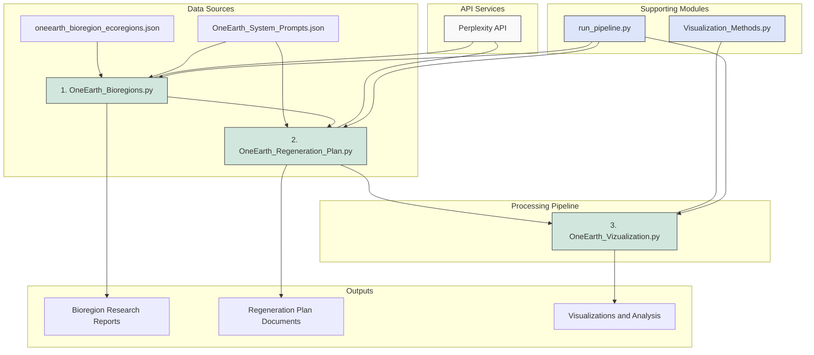
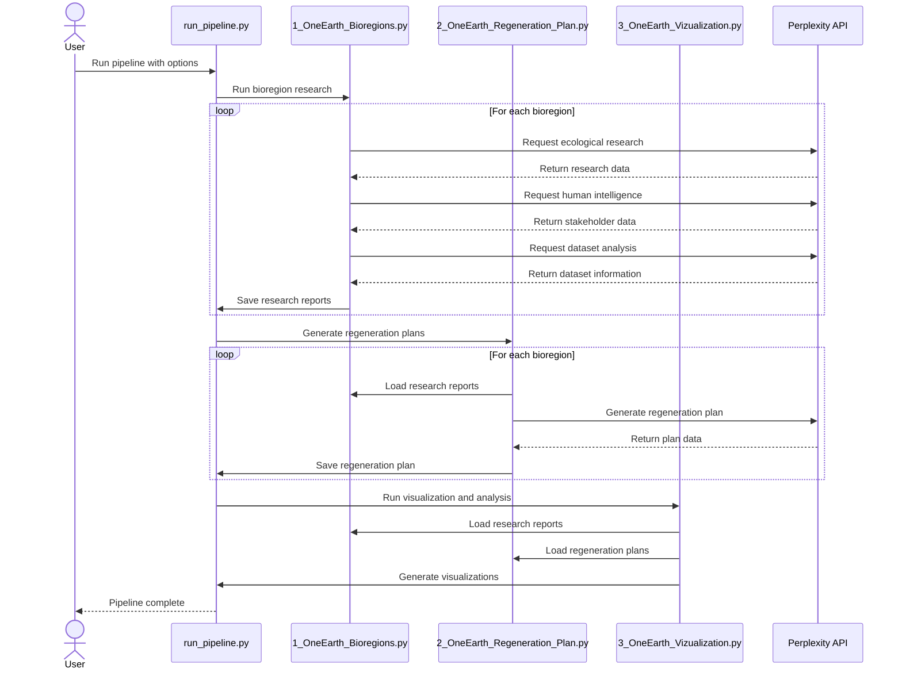
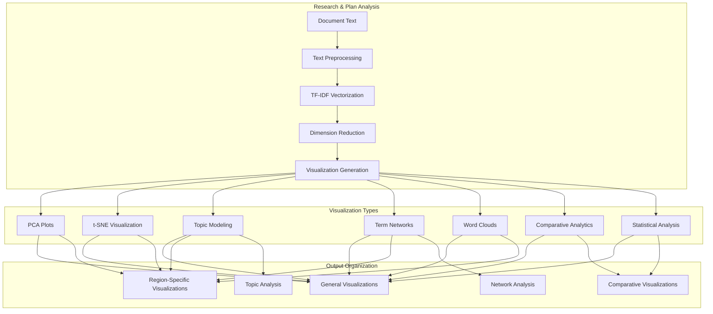
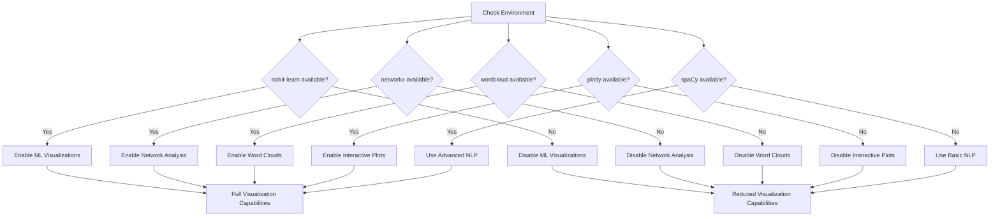

# One Earth Bioregion Analysis System

## 📝 Project Overview

The One Earth Bioregion Analysis System is a comprehensive framework for analyzing global bioregions through the lens of sustainability, regeneration, and ecological stewardship. This project leverages AI-powered research capabilities to:

1. **Research bioregions** across the world using specialized domain expert perspectives
2. **Generate regeneration plans** and sustainability opportunities for each region
3. **Visualize and compare** insights across regions to identify patterns and unique characteristics

The system processes all 185 bioregions defined in the One Earth framework, creating a comprehensive knowledge base for ecological understanding and regenerative action planning.

## 🏗️ System Architecture

The system consists of three primary components in a sequential pipeline architecture:



### Main Components:

1. **Bioregion Research (1_OneEarth_Bioregions.py)**
   - Processes bioregion data from the One Earth framework
   - Utilizes specialized research personas to gather comprehensive information:
     - Ecological Researcher: Focuses on ecosystem characteristics and environmental challenges
     - Human Intelligence Officer: Maps key stakeholders and actors in the region
     - Dataset Specialist: Identifies scientific datasets and publications

2. **Regeneration Planning (2_OneEarth_Regeneration_Plan.py)**
   - Takes research outputs and develops regeneration plans for each bioregion
   - Focuses on ecological restoration, community engagement, and sustainable practices
   - Creates actionable frameworks for implementation

3. **Visualization and Analysis (3_OneEarth_Vizualization.py)**
   - Processes all research and regeneration plans 
   - Creates visual analytics to compare regions and identify patterns
   - Generates insights through topic modeling, network analysis, and dimensionality reduction

### Supporting Modules:

- **Visualization_Methods.py**: Contains specialized visualization and analysis techniques
- **run_pipeline.py**: Orchestrates the entire pipeline with error handling and logging
- **create_dirs.py**: Sets up the required directory structure

## 🔄 Workflow Process

The system follows a sequential workflow with each stage building on the previous:



## 🛠️ Installation and Setup

### Prerequisites

- Python 3.8 or higher
- Perplexity API key
- 2+ GB of free disk space for outputs

### Setup Instructions

1. **Clone the repository:**
   ```bash
   git clone https://github.com/your-org/One_Earth.git
   cd One_Earth
   ```

2. **Install required dependencies:**
   ```bash
   pip install -r requirements.txt
   ```

3. **Set up API key:**
   - Obtain a Perplexity API key
   - Create or edit `OneEarth_Perplexity_keys.key` file:
     ```
     PERPLEXITY_API_KEY=your_api_key_here
     ```

4. **Create directory structure:**
   ```bash
   python create_dirs.py
   ```

## 🚀 Usage

### Running the Complete Pipeline

The simplest way to run the entire system:

```bash
# Run all steps with default settings (testing model)
python run_pipeline.py

# Run with production model (higher quality, more expensive)
python run_pipeline.py --model production

# Run with limited regions for testing
python run_pipeline.py --max-regions 2

# Skip specific stages
python run_pipeline.py --skip-research --skip-regeneration
```

### Running Individual Components

Each component can be run separately:

```bash
# Run only the bioregion research
python 1_OneEarth_Bioregions.py --model [testing|production] --max-regions [number]

# Run only the regeneration planning
python 2_OneEarth_Regeneration_Plan.py --model [testing|production]

# Run only the visualization and analysis
python 3_OneEarth_Vizualization.py
```

## 📊 Visualization Capabilities

The visualization system provides multiple ways to analyze and compare bioregions:



### Visualization Features

The system generates the following types of visualizations:

1. **Dimensionality Reduction**
   - PCA plots to identify key differences between regions
   - t-SNE visualizations for non-linear relationships
   - Interactive 3D plots (when Plotly is available)

2. **Text Analysis**
   - Word clouds showing prominent terms by region
   - Term frequency distributions
   - Topic modeling with hierarchical clustering

3. **Network Analysis**
   - Term co-occurrence networks
   - Concept relationship graphs
   - Stakeholder connection mapping

4. **Comparative Analysis**
   - Cross-regional comparisons of key attributes
   - Similarity metrics between bioregions
   - Statistical confidence intervals for term importance

## 📁 Directory Structure

```
One_Earth/
├── 1_OneEarth_Bioregions.py             # Research generation script
├── 2_OneEarth_Regeneration_Plan.py      # Regeneration plan generation
├── 3_OneEarth_Vizualization.py          # Visualization script
├── README.md                            # This documentation
├── WORKFLOW.md                          # Detailed workflow documentation
├── QUICKSTART.md                        # Quick reference guide
├── OneEarth_Architecture.md             # Technical architecture details
├── OneEarth_System_Prompts.json         # System prompts for research personas
├── oneearth_bioregion_ecoregions.json   # Bioregion data file
├── Visualization_Methods.py             # Visualization utility functions
├── run_pipeline.py                      # Pipeline orchestration script
├── requirements.txt                     # Project dependencies
├── create_dirs.py                       # Directory setup utility
├── Outputs/                             # Generated research and plans
│   └── {Region_Name}/                   # Organized by region
│       ├── region_ecological_researcher_*.md
│       ├── region_human_intelligence_officer_*.md
│       ├── region_dataset_specialist_*.md
│       ├── region_consolidated_research_*.md
│       └── region_regeneration_plan_*.md
└── Visualizations/                      # Generated visualizations
    ├── general/                         # Overall analysis visualizations
    ├── regions/                         # Region-specific visualizations
    ├── comparisons/                     # Cross-region comparisons
    ├── topic_analysis/                  # Topic modeling results
    ├── network_analysis/                # Term network visualizations
    └── comparative/                     # Statistical comparisons
```

## 🔍 Model Options

The system supports various levels of research quality through different AI models:

| Mode | Model | Description | Approximate Cost |
|------|-------|-------------|------------------|
| `testing` | `sonar` | Basic research model for testing | $1/$1 per million tokens |
| `production` | `sonar-deep-research` | Comprehensive research with higher quality | $2/$8 per million tokens |

## 🚦 Dependency Management

The system handles varying levels of dependency availability to ensure robustness:



## 📋 Customization Options

The system can be customized in several ways:

1. **System Prompts**: Edit `OneEarth_System_Prompts.json` to modify research personas and their specializations
2. **Bioregions**: Add or modify regions in the bioregion data file
3. **Visualization Methods**: Add new visualization techniques to `Visualization_Methods.py`
4. **API Models**: Change models in the configuration section of system prompts file

## 🔧 Troubleshooting

If you encounter issues:

1. **Check the logs**:
   ```bash
   cat pipeline.log
   grep ERROR pipeline.log
   ```

2. **Verify API key**:
   - Ensure the key file exists and is properly formatted
   - Check account balance and rate limits

3. **Dependency issues**:
   - Run `pip install -r requirements.txt` again
   - For visualization issues, check if optional dependencies are installed

4. **Directory structure**:
   - Run `python create_dirs.py` to reset the directory structure

## 🏆 Best Practices

1. **Start with limited regions** for testing before running the full dataset
2. **Use the testing model** for development and the production model for final runs
3. **Check logs regularly** during long-running processes
4. **Back up outputs** periodically during large batch processing

## 🔮 Future Development

Planned enhancements for future versions:

1. **Interactive Dashboard**: Web-based visualization of insights
2. **Enhanced Comparative Analysis**: More sophisticated cross-regional comparison
3. **GIS Integration**: Geographic information system mapping
4. **Extended Expert Network**: Expanded stakeholder mapping and connection features
5. **Real-time Monitoring**: Integration with ongoing ecological monitoring

## 📄 License

[License information goes here]

## 👥 Contributors

[Contributors information goes here] 