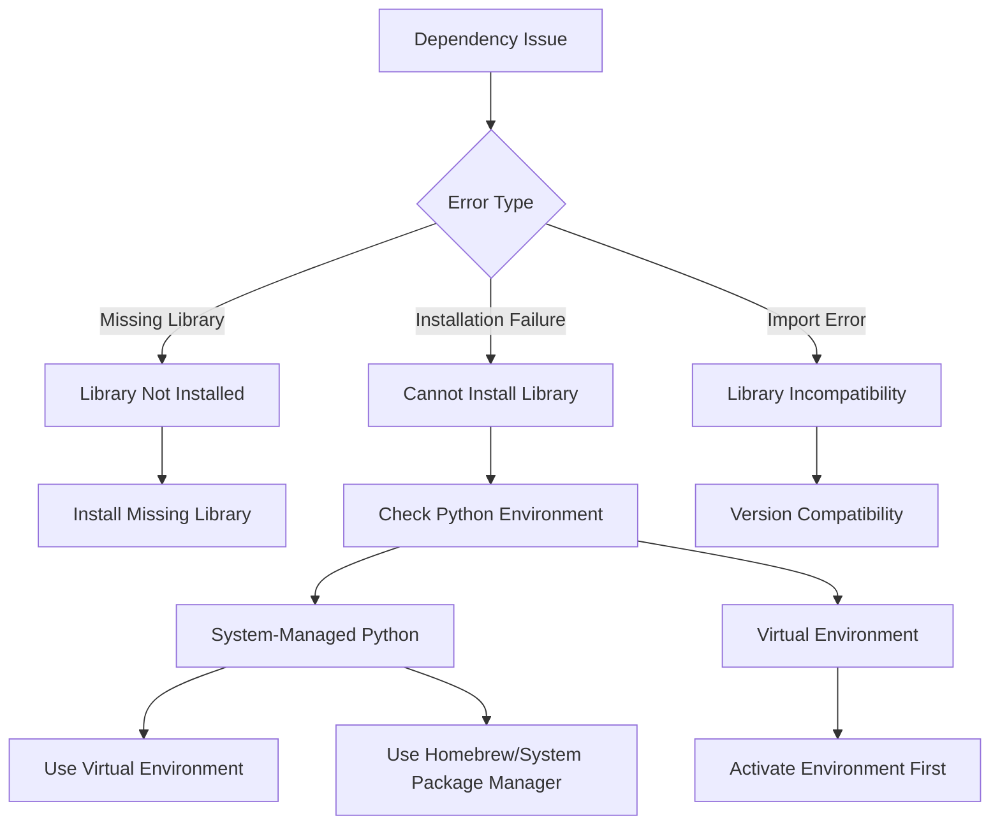

# One Earth Troubleshooting Guide

This guide addresses common issues you might encounter when using the One Earth Bioregion Analysis System and provides solutions to resolve them.

## Dependency Management Issues

The One Earth system uses multiple Python libraries for different visualization and analysis features. Sometimes you may encounter warnings or errors related to missing dependencies.



### Missing Dependencies

**Problem**: You see warnings like these when running scripts:

```
WARNING:__main__:scikit-learn not available. Some visualization features will be limited.
WARNING: networkx is not installed. Network visualization will be disabled.
WARNING: wordcloud is not installed. Word cloud generation will be disabled.
WARNING: plotly is not installed. Interactive visualizations will be disabled.
```

**Solution**: 
1. The script will still run with limited functionality
2. To enable all features, install the missing dependencies:

```bash
# Create a virtual environment first (recommended)
python3 -m venv oneearth_env
source oneearth_env/bin/activate

# Install dependencies
pip install scikit-learn networkx wordcloud plotly spacy
python -m spacy download en_core_web_sm
```

### Externally-Managed Environment Error

**Problem**: You see errors like this when the script tries to install dependencies:

```
error: externally-managed-environment
× This environment is externally managed
```

**Solution**: This happens with system Python installations (particularly with Homebrew on macOS). You have several options:

1. **Create a virtual environment (Recommended)**:
   ```bash
   # Create a virtual environment
   python3 -m venv oneearth_env
   
   # Activate it
   source oneearth_env/bin/activate
   
   # Install dependencies
   pip install -r requirements.txt
   
   # Run script from virtual environment
   python 3_OneEarth_Vizualization.py
   ```

2. **Use Homebrew to install packages**:
   ```bash
   brew install python-networkx python-wordcloud
   ```

3. **Use pipx for isolated packages**:
   ```bash
   brew install pipx
   pipx install networkx wordcloud
   ```

4. **Use the `--break-system-packages` flag (Not Recommended)**:
   ```bash
   pip install --break-system-packages networkx wordcloud
   ```

## Script Execution Errors

### Script Not Found

**Problem**: Error message like:
```
can't open file '/path/to/3_OneEarth_Vizualization.py': [Errno 2] No such file or directory
```

**Solution**:
1. Make sure you're in the correct directory:
   ```bash
   cd /path/to/One_Earth
   ```

2. Verify the script exists:
   ```bash
   ls -la *.py
   ```

3. Run the script with the correct path:
   ```bash
   python3 One_Earth/3_OneEarth_Vizualization.py
   ```

### Permission Denied

**Problem**: Cannot execute the script due to permission issues.

**Solution**:
```bash
# Make the script executable
chmod +x 3_OneEarth_Vizualization.py

# Run with
./3_OneEarth_Vizualization.py
```

## Data Processing Issues

### No Research Reports Found

**Problem**: Warning message like:
```
WARNING:__main__:No research reports found for region: __MACOSX
```

**Solution**:
1. This is usually harmless - the system is ignoring macOS system files
2. Check that your data files are properly organized in the expected directories:
   ```bash
   ls -la Outputs/*/
   ```
3. If research reports are missing for actual regions, run the research generation script:
   ```bash
   python 1_OneEarth_Bioregions.py
   ```

## Visualization Quality Issues

### Poor or Limited Visualizations

**Problem**: Visualizations are missing or of poor quality.

**Solution**:
1. Ensure all visualization dependencies are installed:
   ```bash
   pip install scikit-learn matplotlib seaborn networkx wordcloud plotly
   ```

2. Check available memory - some visualizations require significant RAM:
   ```bash
   # On Linux/macOS
   free -h
   ```

3. For large datasets, try processing fewer regions:
   ```bash
   python 3_OneEarth_Vizualization.py --max-regions 5
   ```

## API-Related Issues

### API Key Problems

**Problem**: API requests failing due to authentication issues.

**Solution**:
1. Check that your API key file exists and is correctly formatted:
   ```bash
   cat OneEarth_Perplexity_keys.key
   ```

2. The file should contain:
   ```
   PERPLEXITY_API_KEY=your_api_key_here
   ```

3. Set the API key as an environment variable:
   ```bash
   export PERPLEXITY_API_KEY=your_api_key_here
   ```

### Rate Limiting

**Problem**: API requests failing due to rate limits.

**Solution**:
1. Reduce the number of regions processed at once:
   ```bash
   python run_pipeline.py --max-regions 2
   ```
   
2. Add delays between API requests (edit the script):
   ```python
   import time
   time.sleep(2)  # Add 2-second delay between requests
   ```

## Logging and Diagnostics

When troubleshooting, always check the log files for more detailed information:

```bash
# Check the main log file
cat pipeline.log

# Filter for errors only
grep ERROR pipeline.log

# Check visualization-specific logs
cat visualization.log
```

## Getting Help

If you continue to experience issues:

1. **Check Documentation**:
   - Review the README.md and DEPENDENCY_MANAGEMENT.md files

2. **Search Issues**:
   - Look for similar issues in the project repository

3. **Submit Detailed Reports**:
   - When reporting issues, include:
     - Exact error messages
     - Your environment information (OS, Python version)
     - Steps to reproduce the problem
     - Log file contents

## Preventing Common Problems

### Use Virtual Environments

Always use virtual environments to avoid dependency conflicts:


1. **Create a virtual environment**:
   ```bash
   python3 -m venv oneearth_env
   ```

2. **Activate it before use**:
   ```bash
   # On macOS/Linux
   source oneearth_env/bin/activate
   
   # On Windows
   oneearth_env\Scripts\activate
   ```

3. **Install project dependencies**:
   ```bash
   pip install -r requirements.txt
   ```

4. **Deactivate when finished**:
   ```bash
   deactivate
   ```

### Keep Dependencies Updated

Regularly update dependencies to avoid compatibility issues:

```bash
pip list --outdated
pip install --upgrade package_name
```

### Check for System Resources

Ensure your system has adequate resources:

1. **Memory**: At least 8GB RAM recommended
2. **Disk Space**: 2GB+ free space for outputs
3. **Processing Power**: Multi-core processor recommended

## Advanced Troubleshooting

### Debugging Mode

Run scripts in debug mode for more verbose output:

```bash
python3 -m pdb 3_OneEarth_Vizualization.py
```

### Profiling Performance Issues

For performance problems:

```bash
python3 -m cProfile -o visualization_profile.prof 3_OneEarth_Vizualization.py
python3 -m pstats visualization_profile.prof
```

This will help identify bottlenecks in the code execution. 