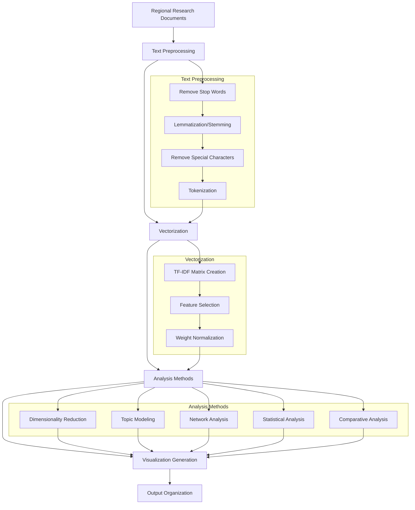
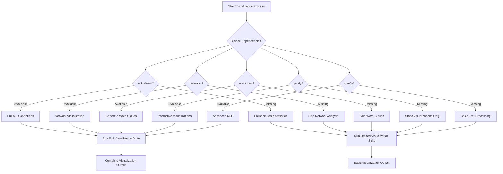

# One Earth Visualization System

This document provides comprehensive documentation of the visualization capabilities of the One Earth Bioregion Analysis System. It covers the visualization process, available methods, dependency management, and interpretation guidance.

## Visualization Pipeline

The visualization system processes bioregion research data through a multi-stage pipeline to generate insights:



## Visualization Modules

The visualization system consists of two primary files:

1. **3_OneEarth_Vizualization.py**: Main script that orchestrates the visualization process
2. **Visualization_Methods.py**: Library of specialized visualization functions

### Main Visualization Script (3_OneEarth_Vizualization.py)

This script handles:
- Loading research and regeneration plan documents
- Managing directory structure for outputs
- Coordinating the analysis process
- Error handling and fallback mechanisms for missing dependencies
- Logging and process monitoring

### Visualization Methods Module (Visualization_Methods.py)

This module contains specialized functions for:
- Text preprocessing and cleaning
- TF-IDF vectorization
- Dimensionality reduction techniques
- Visualization generation functions
- Statistical analysis methods

## Adaptive Dependency Management

The system dynamically adapts to available dependencies, ensuring it can run in various environments:



The system never fails due to missing dependencies - it gracefully degrades functionality instead.

## Visualization Types and Methods

### 1. Dimensionality Reduction Visualizations

**Purpose**: Reduce high-dimensional text data into 2D or 3D representations to reveal patterns and similarities between documents.

**Methods**:
- **PCA (Principal Component Analysis)**
  - Reveals linear relationships between documents
  - Shows primary directions of variance
  - Enables eigenvector analysis

- **t-SNE (t-Distributed Stochastic Neighbor Embedding)**
  - Shows non-linear relationships
  - Better preserves local similarities
  - Reveals clusters of similar documents

- **3D Interactive Plots** (requires Plotly)
  - Three-dimensional PCA visualization
  - Interactive rotation and zooming
  - Enhanced pattern discovery

**Examples**:
- Grouping of similar bioregions based on ecological characteristics
- Separation of regions by primary environmental challenges
- Identification of outlier regions with unique characteristics

### 2. Text Analysis Visualizations

**Purpose**: Explore and understand the textual content across documents.

**Methods**:
- **Word Clouds** (requires wordcloud)
  - Visual representation of term frequency
  - Region-specific term importance
  - Comparative word clouds across regions

- **Term Frequency Distributions**
  - Statistical distribution of key terms
  - Comparative term usage across regions
  - Identification of region-specific terminology

- **Important Term Analysis**
  - Extraction of statistically significant terms
  - Importance scoring by TF-IDF weights
  - Comparative term importance across documents

**Examples**:
- Identifying characteristic species in each bioregion
- Comparing environmental challenges across regions
- Tracking key sustainability terms across different regions

### 3. Network Analysis Visualizations

**Purpose**: Reveal connections between concepts and terms across documents.

**Methods**:
- **Term Co-occurrence Networks** (requires networkx)
  - Visualization of term relationships
  - Identification of central concepts
  - Community detection within terminology

- **Concept Maps**
  - Hierarchical organization of related terms
  - Visualization of concept clusters
  - Connection strength indicators

**Examples**:
- Identifying closely connected ecological concepts
- Mapping relationships between environmental challenges
- Visualizing connections between solutions and problems

### 4. Comparative Analysis

**Purpose**: Direct comparison between different bioregions and document types.

**Methods**:
- **Heatmaps**
  - Visualization of term frequency matrices
  - Cross-document term usage comparisons
  - Hierarchical clustering of similar documents

- **Confidence Intervals**
  - Statistical comparisons with confidence bounds
  - Significance testing for term differences
  - Regional variation analysis

- **Similarity Metrics**
  - Cosine similarity between documents
  - Jaccard indices for term overlap
  - Regional similarity rankings

**Examples**:
- Identifying the most similar bioregions
- Comparing research focus across different region types
- Measuring document similarity across research personas

### 5. Topic Modeling

**Purpose**: Discover latent topics and themes across documents.

**Methods**:
- **Hierarchical Topic Extraction**
  - Identification of document themes
  - Topic clustering and organization
  - Regional topic distribution analysis

- **Topic Distribution Visualization**
  - Proportional topic allocation by region
  - Cross-regional topic comparison
  - Topic evolution and relationships

**Examples**:
- Identifying common environmental challenges across regions
- Discovering unique ecological themes in specific regions
- Comparing topic distribution between research and regeneration documents

## Output Organization

Visualizations are organized into structured directories:

```
Visualizations/
├── general/                  # Overall analysis across all regions
│   ├── pca_by_region.png      # PCA plot colored by region
│   ├── tsne_by_type.png       # t-SNE plot colored by document type
│   └── overall_word_cloud.png # Word cloud for all documents
│
├── regions/                  # Region-specific visualizations
│   ├── Region_Name_1/
│   │   ├── pca_plot.png       # PCA for this region's documents
│   │   ├── term_network.png   # Term network for this region
│   │   └── word_cloud.png     # Word cloud for this region
│   └── Region_Name_2/
│       └── ...
│
├── comparisons/              # Cross-regional comparisons
│   ├── term_frequency.png     # Term frequency distribution
│   └── similarity_matrix.png  # Region similarity matrix
│
├── network_analysis/         # Detailed network visualizations
│   └── detailed_term_network.png # Detailed term relationships
│
├── topic_analysis/           # Topic modeling results
│   └── all_topics.png         # Topic distribution across regions
│
└── comparative/              # Statistical comparisons
    ├── confidence_by_region.png # Confidence intervals by region
    └── confidence_by_type.png   # Confidence intervals by document type
```

## Interpreting Visualizations

### PCA Plots

- **Document clusters**: Points close together represent similar documents
- **Axes**: Principal components representing directions of maximum variance
- **Color coding**: Used to distinguish regions or document types
- **Distance**: Greater distance indicates greater difference in content

### Term Networks

- **Nodes**: Individual terms from documents
- **Edges**: Co-occurrence relationships between terms
- **Node size**: Term frequency or importance
- **Edge thickness**: Strength of co-occurrence relationship
- **Clusters**: Groups of interconnected terms representing related concepts

### Topic Models

- **Topics**: Clusters of related terms that frequently co-occur
- **Distribution**: Allocation of topics across documents
- **Dominance**: Regions with high proportion of specific topics
- **Uniqueness**: Topics appearing primarily in specific regions

## Fallback Mechanisms

When dependencies are unavailable, the system provides fallbacks:

| Missing Dependency | Feature Impact | Fallback Mechanism |
|--------------------|----------------|-------------------|
| scikit-learn | ML-based visualizations | Basic statistical summaries |
| networkx | Network visualizations | Skips network analysis |
| wordcloud | Word cloud generation | Text summaries of frequent terms |
| plotly | Interactive visualizations | Static matplotlib plots only |
| spaCy | Advanced NLP | Basic regex-based text processing |

## Usage Examples

### Basic Visualization Run

```bash
# Generate all visualizations using default settings
python 3_OneEarth_Vizualization.py

# Specify input and output directories
python 3_OneEarth_Vizualization.py --input Outputs --output Custom_Visualizations
```

### Checking Visualization Status

```bash
# Check visualization log
cat visualization.log

# List generated visualizations
ls -la Visualizations/general/
ls -la Visualizations/regions/
```

## Visualization Insights

The visualization system helps answer key questions:

1. **Which bioregions face similar environmental challenges?**
   - Use PCA/t-SNE plots to identify clusters of regions
   - Examine term networks for common challenge patterns

2. **What unique characteristics define specific bioregions?**
   - Analyze region-specific word clouds
   - Check outlier positions in dimensionality reduction plots

3. **How do regeneration approaches differ across regions?**
   - Compare regeneration plan documents in topic models
   - Use confidence interval plots to identify statistical differences

4. **What common themes emerge across all bioregions?**
   - Examine the overall word cloud and term frequency distribution
   - Look at the central nodes in the complete term network

5. **Which regions would benefit from knowledge sharing?**
   - Use similarity matrices to identify closely related regions
   - Look for regions with similar challenges but different solutions

## Extending the Visualization System

The visualization framework is designed to be extensible:

1. **Adding New Visualization Types**
   - Add new visualization functions to `Visualization_Methods.py`
   - Register them in the main visualization script

2. **Customizing Existing Visualizations**
   - Modify parameters in the visualization functions
   - Adjust color schemes, sizes, and layouts

3. **Adding New Analysis Dimensions**
   - Create new preprocessing steps in the visualization pipeline
   - Add new metrics for comparison and analysis

4. **Creating Custom Reports**
   - Combine multiple visualizations into comprehensive reports
   - Create region-specific visualization dashboards

## Technical Details

### Preprocessing Pipeline


### TF-IDF Implementation

The TF-IDF (Term Frequency-Inverse Document Frequency) vectorization:

1. **Term Frequency (TF)**: Measures how frequently a term appears in a document
2. **Inverse Document Frequency (IDF)**: Measures how important a term is across all documents
3. **TF-IDF Score**: TF × IDF, giving higher weight to important terms that appear frequently in a document but rarely across all documents

### Dimension Reduction Mathematics

PCA reduces dimensionality by:
1. Computing the covariance matrix of the data
2. Finding eigenvectors and eigenvalues
3. Projecting data onto principal components

t-SNE uses probability distributions to:
1. Convert high-dimensional distances to probabilities
2. Create similar probabilities in low-dimensional space
3. Minimize the difference between these distributions

## Conclusion

The visualization system provides powerful tools for exploring and understanding the One Earth bioregion data. By generating multiple visualization types and adapting to available dependencies, it ensures useful outputs can be generated in any environment while providing deep insights into ecological patterns across global bioregions. 