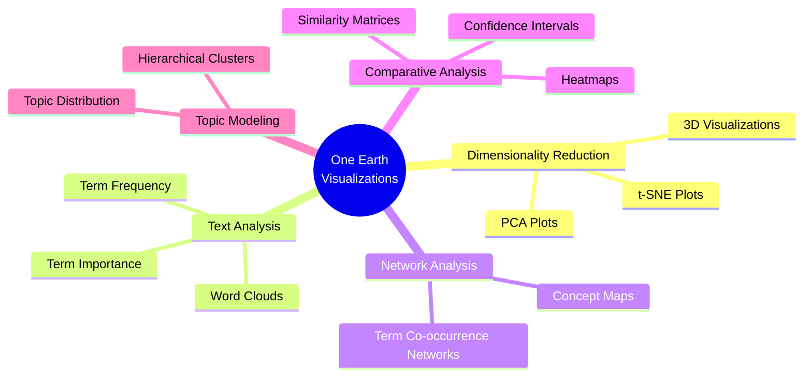

# Interpreting One Earth Visualizations

This guide provides comprehensive instructions for interpreting the visualizations generated by the One Earth system. It explains each visualization type, what to look for, and how to derive meaningful insights.

## Overview of Visualization Types

The One Earth system generates several categories of visualizations:

## 1. Dimensionality Reduction Visualizations

### PCA (Principal Component Analysis) Plots

**Location**: `Visualizations/general/pca_by_region.png` and `Visualizations/regions/[Region_Name]/pca_plot.png`

**How to Interpret**:

1. **Points**: Each point represents a document (research report or regeneration plan)
2. **Proximity**: Documents closer together have similar content
3. **Clusters**: Groups of points indicate documents with related themes or content
4. **Axes**: 
   - X-axis (PC1): Represents the direction of maximum variance in the data
   - Y-axis (PC2): Represents the second most significant variance direction
5. **Colors**: Typically represent different regions or document types

**Example Insights**:
- Bioregions that cluster together (e.g., "Western_Amazonian_Forests" and "Eastern_Amazonian_Forests") likely share similar ecological characteristics or challenges
- Outlier points might represent regions with unique challenges or characteristics
- If research reports and regeneration plans for the same region appear close together, this suggests the regeneration plan directly addresses the research findings

**Advanced Analysis**:
- Look for general patterns like clear separations between continental regions, climate zones, or ecosystem types
- Check if bioregions that should be similar (e.g., from the same continent) actually cluster together
- Identify unexpected groupings that might reveal non-obvious similarities

### t-SNE Plots

**Location**: `Visualizations/general/tsne_by_region.png` and `Visualizations/regions/[Region_Name]/tsne_plot.png`

**How to Interpret**:

1. **Focus on Local Structure**: Unlike PCA, t-SNE emphasizes local similarities over global structure
2. **Clusters**: More pronounced and often better at revealing subtle groupings
3. **Distance**: Similar documents appear closer together, but overall distances are less meaningful than in PCA

**Example Insights**:
- Tighter clusters may reveal sub-categories within bioregion types
- Easier identification of distinct region groups with similar characteristics
- Better visualization of complex relationships that might not be linear

### 3D PCA Visualizations (Plotly)

**Location**: `Visualizations/comparative/pca_3d.html` (interactive file)

**How to Interact**:
- Open in a web browser
- Rotate view by clicking and dragging
- Zoom with scroll wheel
- Hover over points for detailed information

**Example Insights**:
- Additional dimension allows for more nuanced separation of region types
- Interactive exploration helps identify patterns not visible in 2D projections
- Reveals complex relationships between multiple factors simultaneously

## 2. Text Analysis Visualizations

### Word Clouds

**Location**: `Visualizations/general/overall_word_cloud.png` and `Visualizations/regions/[Region_Name]/word_cloud.png`

**How to Interpret**:

1. **Word Size**: Larger words appear more frequently or have higher importance in the documents
2. **Color**: Often used to group related terms or indicate secondary factors
3. **Position**: Generally random, but some implementations cluster related terms

**Example Insights**:
- Dominant ecological features in a bioregion (e.g., "coral", "reef", "ocean" for marine bioregions)
- Key environmental challenges (e.g., "drought", "deforestation", "pollution")
- Characteristic species or ecosystems (e.g., "mangrove", "tiger", "savanna")
- Recurring themes in regeneration approaches (e.g., "community", "restoration", "sustainable")

### Term Frequency Distributions

**Location**: `Visualizations/comparisons/term_frequency.png`

**How to Interpret**:

1. **X-axis**: Terms ordered by frequency
2. **Y-axis**: Frequency or TF-IDF score
3. **Bars**: Higher bars indicate more common or important terms

**Example Insights**:
- Most common environmental challenges across all bioregions
- Frequently mentioned species or ecosystems
- Common regeneration approaches
- Differences in terminology between research reports and regeneration plans

### Term Importance Analysis

**Location**: `Visualizations/general/overall_important_terms.png` and `Visualizations/regions/[Region_Name]/important_terms.png`

**How to Interpret**:

1. **Bars**: Length represents statistical importance (not just raw frequency)
2. **Colors**: Often grouped by topic or document type
3. **Error Bars**: Represent uncertainty or variance in importance

**Example Insights**:
- Terms that are distinctively important in specific bioregions
- Specialized ecological terms that characterize particular regions
- Key concepts that differentiate research areas

## 3. Network Analysis Visualizations

### Term Co-occurrence Networks

**Location**: `Visualizations/network_analysis/detailed_term_network.png` and `Visualizations/regions/[Region_Name]/term_network.png`

**How to Interpret**:

1. **Nodes**: Each node represents a term from the documents
2. **Node Size**: Often proportional to term frequency or importance
3. **Edges**: Connections between terms that co-occur in documents
4. **Edge Thickness**: Strength of co-occurrence relationship
5. **Colors**: Often represent different communities or clusters of related terms
6. **Centrality**: Central nodes connect to many others and represent key concepts

**Example Insights**:
- Core ecological concepts that link multiple topics
- Relationships between environmental challenges and potential solutions
- Clusters of terms representing distinct ecosystem components
- Bridging concepts that connect different ecological domains

**Advanced Analysis**:
- Identify central terms (high degree centrality) that connect multiple concept areas
- Look for "bridge terms" that connect otherwise separate clusters
- Note isolated clusters that represent specialized topics or unique regional features
- Compare different regions' networks to see how ecological concept relationships differ

### Concept Maps

**Location**: Various visualization files with "concept" in the filename

**How to Interpret**:
- Similar to networks but often hierarchically arranged
- Top-level concepts branch into more specific terms
- Connection direction often indicates relationship type (is-a, has-a, etc.)

**Example Insights**:
- Hierarchical organization of environmental challenges
- Taxonomic relationships in biodiversity assessments
- Causal relationships between problems and impacts

## 4. Comparative Analysis Visualizations

### Heatmaps

**Location**: `Visualizations/regions/[Region_Name]/term_heatmap.png`

**How to Interpret**:

1. **Rows**: Documents or regions
2. **Columns**: Terms or features
3. **Color Intensity**: Darker/brighter colors indicate higher values
4. **Dendrograms**: Hierarchical clustering of similar documents or terms (if present)

**Example Insights**:
- Similarity patterns across multiple bioregions
- Groups of terms that frequently appear together
- Document clusters that share common themes
- Distinctive terminology patterns by region type

**Advanced Analysis**:
- Look for blocks of similar coloration that indicate related document groups
- Identify terms that are consistently high or low across certain region types
- Notice unexpected patterns that might reveal non-obvious connections

### Confidence Intervals

**Location**: `Visualizations/comparative/confidence_by_region.png` and `Visualizations/comparative/confidence_by_type.png`

**How to Interpret**:

1. **Points**: Mean values for each term/feature
2. **Error Bars**: Statistical confidence intervals
3. **Non-overlapping Intervals**: Indicate statistically significant differences

**Example Insights**:
- Terms that appear significantly more in certain region types
- Statistically significant differences in focus between research and regeneration documents
- Confidence in the importance of specific terms for particular regions

### Similarity Matrices

**Location**: `Visualizations/comparisons/similarity_matrix.png`

**How to Interpret**:

1. **Cells**: Color intensity shows similarity between regions/documents
2. **Diagonal**: Always highest similarity (self-comparison)
3. **Clusters**: Blocks of similar color indicate groups of related regions/documents

**Example Insights**:
- Identify the most similar bioregion pairs
- Discover clusters of related regions
- Find potential "knowledge transfer" opportunities between similar regions
- Identify outlier regions with few similarities to others

## 5. Topic Modeling Visualizations

### Topic Distribution

**Location**: `Visualizations/topic_analysis/all_topics.png` and `Visualizations/regions/[Region_Name]/topic_analysis.png`

**How to Interpret**:

1. **Topics**: Each color represents a discovered latent topic
2. **Segments**: Size represents the proportion of each topic in documents
3. **Labels**: Often show the top terms defining each topic

**Example Insights**:
- Dominant themes across all bioregions
- Unique topic profiles for different regions
- Balance between different ecological concerns in each region
- Hidden connections between seemingly unrelated areas

**Advanced Analysis**:
- Compare topic distributions between different region types (desert vs. forest vs. marine)
- Look for unexpected topics in certain regions
- Identify regions with the most balanced vs. most focused topic distributions

### Hierarchical Topic Clusters

**Location**: `Visualizations/topic_analysis/topic_hierarchy.png`

**How to Interpret**:
- Tree-like structure showing relationships between topics
- Topics closer in the hierarchy are more related
- Branch length often indicates similarity distance

**Example Insights**:
- How ecological concepts relate to each other
- Natural groupings of environmental challenges
- Hierarchy of related regeneration approaches

## Case Studies: From Visualization to Insight

### Case Study 1: Identifying Climate Vulnerability Patterns

**Visualization Used**: PCA plot colored by region type

**Observation**: Desert and semi-arid bioregions cluster together in the upper right quadrant, separate from forest bioregions.

**Analysis Process**:
1. Note the clear separation between region types
2. Examine the term importance visualization for these regions
3. Discover terms like "drought", "water scarcity", and "desertification" are highly important
4. Check the term networks to see connections between these terms and "climate change"

**Insight**: Desert and semi-arid regions show distinct climate vulnerability patterns centered around water security, while forest regions focus more on biodiversity loss and carbon sequestration.

### Case Study 2: Cross-Regional Solutions Transfer

**Visualization Used**: Similarity matrix and topic models

**Observation**: "Andean Mountain Forests" and "Himalayan Mixed Forests" show high similarity despite geographic separation.

**Analysis Process**:
1. Note the high similarity score between these mountain forest regions
2. Compare their word clouds and term importance visualizations
3. Find common challenges: "erosion", "altitude adaptation", "watershed protection"
4. Compare regeneration approaches through topic modeling

**Insight**: Despite being on different continents, these mountain regions face similar challenges and could benefit from shared solutions and knowledge transfer in high-altitude forest management and watershed protection.

### Case Study 3: Identifying Research Gaps

**Visualization Used**: Term network analysis

**Observation**: In marine bioregions, terms related to "plastic pollution" have few connections to solution terms.

**Analysis Process**:
1. Examine the term networks for coral reef and coastal bioregions
2. Notice that while "plastic pollution" appears prominently, it has fewer connections to solution terms than other challenges
3. Compare to other challenges like "overfishing" which connect strongly to multiple solution approaches

**Insight**: Marine plastic pollution appears to have fewer established solution pathways in the research than other marine challenges, potentially indicating a research or innovation gap.

## Best Practices for Visualization Analysis

1. **Start Broad, Then Narrow**: Begin with overview visualizations (PCA, word clouds) before diving into specific analyses.

2. **Compare Multiple Visualizations**: Cross-reference insights between different visualization types.

3. **Look for Patterns and Outliers**: Both regular patterns and exceptions can provide valuable insights.

4. **Consider Geographic Context**: Use your knowledge of world geography to contextualize clusters and relationships.

5. **Examine Term Relationships**: Don't just focus on individual terms but how they relate to each other.

6. **Iterate Your Analysis**: Use initial insights to guide more focused exploration.

7. **Document Your Insights**: Record observations and hypotheses as you analyze visualizations.

## Common Interpretation Pitfalls

1. **Overinterpreting Distance in t-SNE**: Unlike PCA, distances in t-SNE don't have consistent meaning.

2. **Assuming Causation**: Correlated terms or clustered regions don't necessarily have causal relationships.

3. **Ignoring Data Limitations**: Missing research for certain regions may affect visualization accuracy.

4. **Neglecting Context**: Interpret terms within their ecological and regional context.

5. **Confirmation Bias**: Be open to unexpected patterns rather than just looking for expected relationships.

## Conclusion

The One Earth visualization system provides a powerful toolkit for exploring ecological data across global bioregions. By systematically interpreting these visualizations, you can uncover meaningful patterns, identify shared challenges and opportunities, and develop strategies for knowledge sharing and collaborative conservation efforts.

Remember that visualizations are tools for generating insights and hypotheses - they should be the starting point for deeper investigation rather than definitive answers in themselves. 