# OneEarth Visualization Methods

This document provides a comprehensive technical overview of the visualization methods implemented in the OneEarth system, with detailed diagrams explaining how visualizations are selected, generated, and interpreted.

## Visualization Selection Process

The OneEarth system uses a decision tree to select the most appropriate visualization methods based on data characteristics and analysis goals:

```mermaid
flowchart TD
    A[Data for Visualization] --> B{Data Type}
    
    B -->|Geographical| C1{Geographic Level}
    B -->|Network| C2{Network Complexity}
    B -->|Statistical| C3{Statistical Features}
    B -->|Temporal| C4{Time Scale}
    B -->|Text| C5{Text Analysis Type}
    
    C1 -->|Global| D1[World Map Visualization]
    C1 -->|Regional| D2[Regional Map]
    C1 -->|Local| D3[Local Area Map]
    
    C2 -->|Simple| E1[Basic Network Graph]
    C2 -->|Moderate| E2[Interactive Network]
    C2 -->|Complex| E3[Hierarchical Network]
    
    C3 -->|Distribution| F1[Distribution Charts]
    C3 -->|Correlation| F2[Correlation Plots]
    C3 -->|Comparison| F3[Comparative Charts]
    C3 -->|Composition| F4[Compositional Charts]
    
    C4 -->|Point-in-time| G1[Snapshot Visualization]
    C4 -->|Short-term| G2[Trend Visualization]
    C4 -->|Long-term| G3[Historical Visualization]
    
    C5 -->|Topic| H1[Topic Visualization]
    C5 -->|Sentiment| H2[Sentiment Visualization]
    C5 -->|Entity| H3[Entity Visualization]
    
    D1 & D2 & D3 --> I1[Choropleth Maps]
    D1 & D2 & D3 --> I2[Point Maps]
    D1 & D2 & D3 --> I3[Heat Maps]
    
    E1 & E2 & E3 --> J1[Force-directed Graphs]
    E1 & E2 & E3 --> J2[Circular Layouts]
    E1 & E2 & E3 --> J3[Sankey Diagrams]
    
    F1 --> K1[Histograms]
    F1 --> K2[Box Plots]
    F2 --> K3[Scatter Plots]
    F2 --> K4[Heat Maps]
    F3 --> K5[Bar Charts]
    F3 --> K6[Radar Charts]
    F4 --> K7[Pie Charts]
    F4 --> K8[Tree Maps]
    
    G1 & G2 & G3 --> L1[Line Charts]
    G1 & G2 & G3 --> L2[Area Charts]
    
    H1 --> M1[Word Clouds]
    H1 --> M2[Topic Networks]
    H2 --> M3[Sentiment Meters]
    H2 --> M4[Emotion Radars]
    H3 --> M5[Entity Networks]
    H3 --> M6[Entity Co-occurrence]
    
    classDef data fill:#f9d5e5,stroke:#333
    classDef decision fill:#fff2cc,stroke:#333
    classDef category fill:#d1e7dd,stroke:#333
    classDef method fill:#d0e8f2,stroke:#333
    
    class A data
    class B,C1,C2,C3,C4,C5 decision
    class D1,D2,D3,E1,E2,E3,F1,F2,F3,F4,G1,G2,G3,H1,H2,H3 category
    class I1,I2,I3,J1,J2,J3,K1,K2,K3,K4,K5,K6,K7,K8,L1,L2,M1,M2,M3,M4,M5,M6 method
```

## Visualization Component Architecture

The architecture of the visualization components in the OneEarth system:

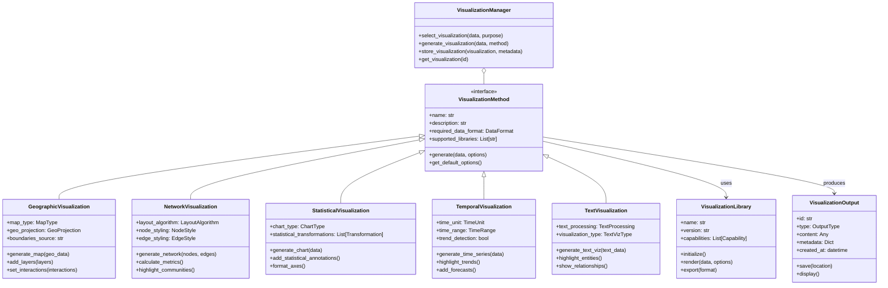

## Visualization Generation Sequence

This sequence diagram shows the process of generating visualizations:

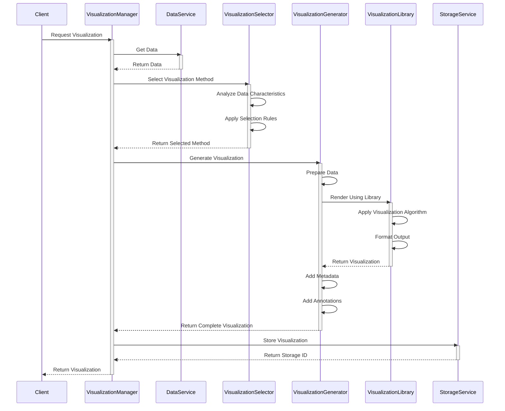

## Geographic Visualization Types

The main types of geographic visualizations used in the system:

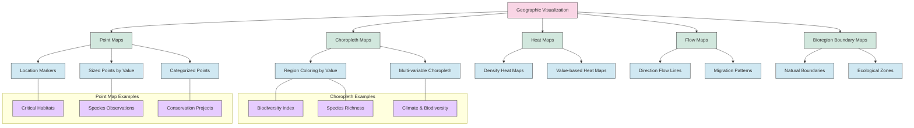

## Network Visualization Types

Different network visualizations used to show relationships between entities:

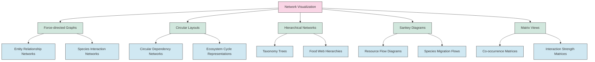

## Statistical Visualization Types

Statistical visualizations used for data analysis:

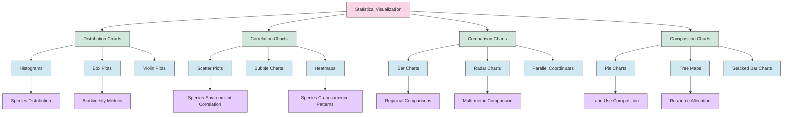

## Text Visualization Types

Methods for visualizing text data and analysis:

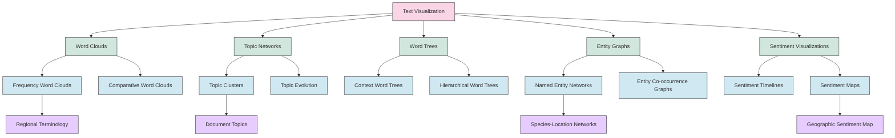

## Temporal Visualization Types

Visualizations for time-series and temporal data:

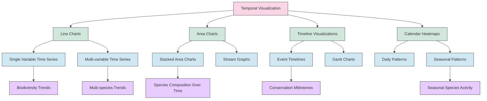

## Interactive Visualization Features

The interactive features available in the visualizations:

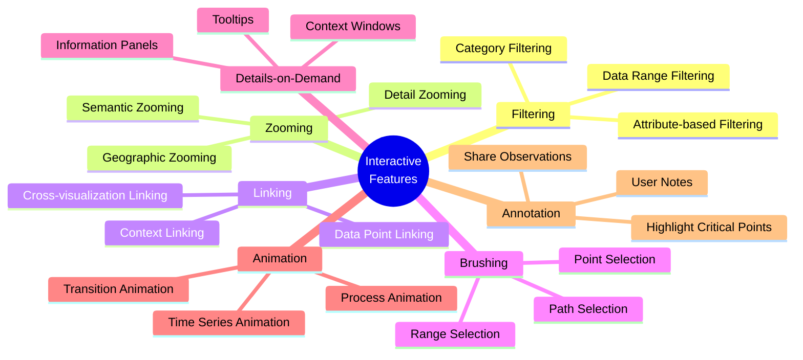

## Visualization Libraries

The visualization libraries used in the OneEarth system and their capabilities:

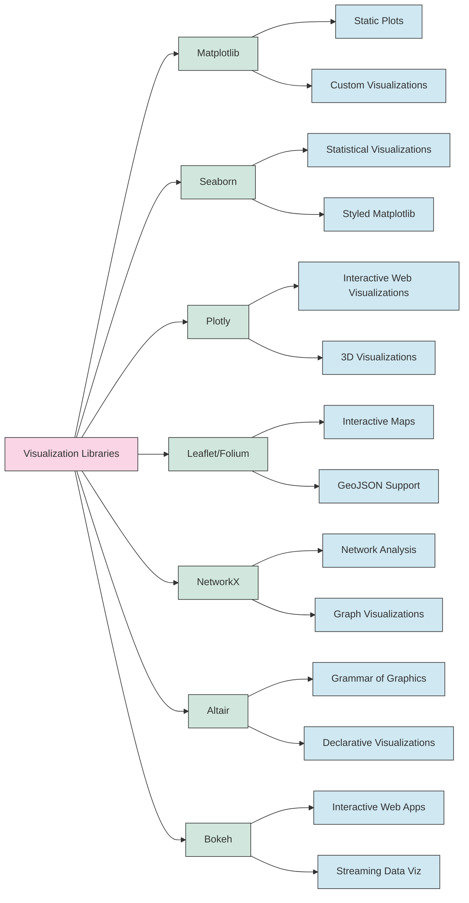

## Visualization Dependency Management

How the system manages visualization library dependencies:

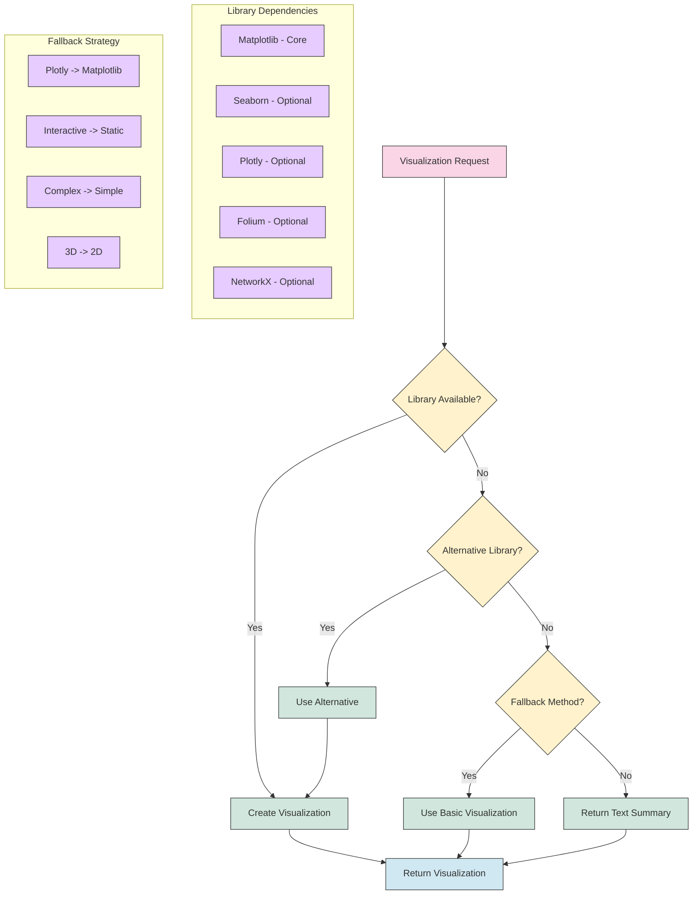

## Visualization Output Organization

How visualization outputs are organized in the system:

```mermaid
flowchart TD
    A[Visualization Outputs] --> B[By Region]
    A --> C[By Analysis Type]
    A --> D[By Visualization Type]
    A --> E[By Time Period]
    
    B --> B1[Global]
    B --> B2[Continental]
    B --> B3[National]
    B --> B4[Bioregional]
    B --> B5[Local]
    
    C --> C1[Overview Analysis]
    C --> C2[Comparative Analysis]
    C --> C3[Network Analysis]
    C --> C4[Temporal Analysis]
    C --> C5[Thematic Analysis]
    
    D --> D1[Maps]
    D --> D2[Charts]
    D --> D3[Networks]
    D --> D4[Textual Visualizations]
    D --> D5[Composite Visualizations]
    
    E --> E1[Historical]
    E --> E2[Current]
    E --> E3[Predictive]
    
    classDef main fill:#f9d5e5,stroke:#333
    classDef category fill:#d1e7dd,stroke:#333
    classDef subcategory fill:#d0e8f2,stroke:#333
    
    class A main
    class B,C,D,E category
    class B1,B2,B3,B4,B5,C1,C2,C3,C4,C5,D1,D2,D3,D4,D5,E1,E2,E3 subcategory
```

## Visualization Interpretation Guide

A framework for interpreting the generated visualizations:

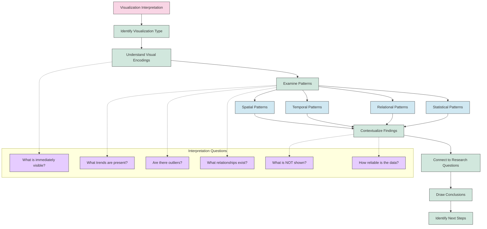

## Common Visualization Patterns

Common patterns to look for in OneEarth visualizations:

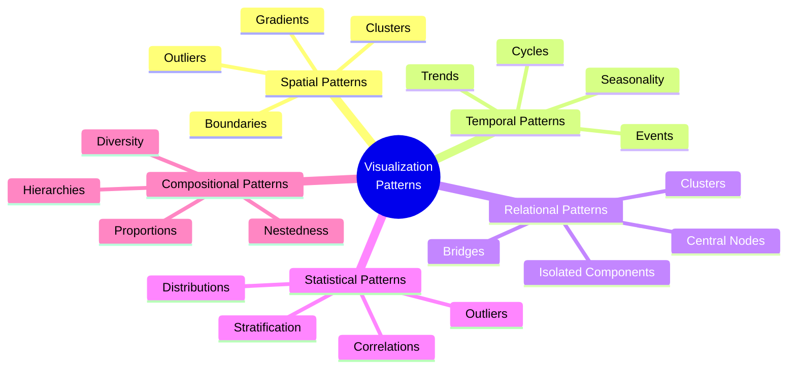

## Visualization Accessibility Features

Accessibility features for the visualization system:

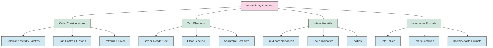

## Visualization Quality Assessment

Criteria for assessing visualization quality:

```mermaid
graph TD
    A[Visualization Quality] --> B[Accuracy]
    A --> C[Clarity]
    A --> D[Efficiency]
    A --> E[Aesthetics]
    A --> F[Engagement]
    
    B --> B1[Data Accuracy]
    B --> B2[Visual Accuracy]
    B --> B3[Statistical Accuracy]
    
    C --> C1[Clear Purpose]
    C --> C2[Understandable Encodings]
    C --> C3[Appropriate Labels]
    
    D --> D1[Data-Ink Ratio]
    D --> D2[Cognitive Load]
    D --> D3[Information Density]
    
    E --> E1[Visual Harmony]
    E --> E2[Professional Appearance]
    E --> E3[Color Coordination]
    
    F --> F1[Interactivity]
    F --> F2[Storytelling]
    F --> F3[Relevance]
    
    classDef main fill:#f9d5e5,stroke:#333
    classDef category fill:#d1e7dd,stroke:#333
    classDef criterion fill:#d0e8f2,stroke:#333
    
    class A main
    class B,C,D,E,F category
    class B1,B2,B3,C1,C2,C3,D1,D2,D3,E1,E2,E3,F1,F2,F3 criterion
```

## Visualization Export Formats

Available export formats for visualizations:

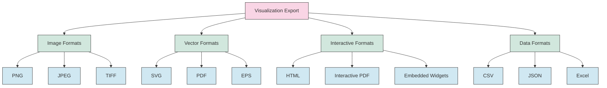

---

This comprehensive documentation provides a detailed overview of the visualization methods used in the OneEarth system. By understanding the selection process, component architecture, and various visualization types, users can effectively generate, interpret, and work with visualizations to gain insights from environmental data. 