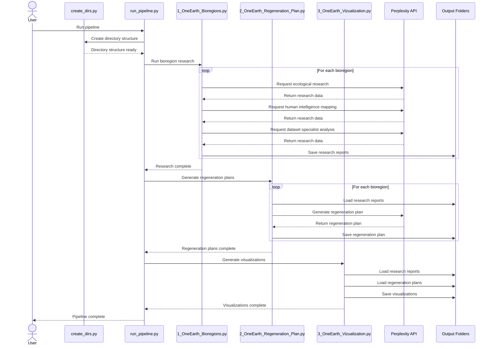
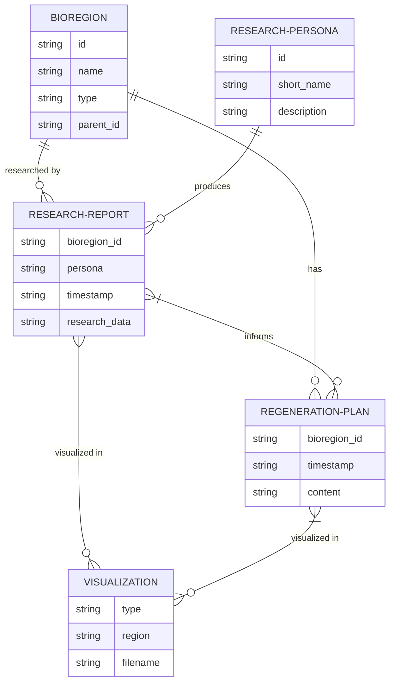
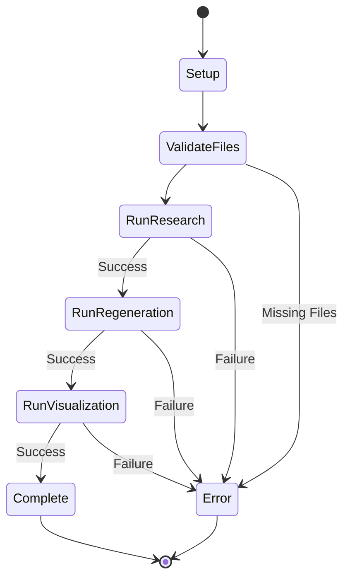

# OneEarth Workflow

This document provides a detailed visualization of the complete OneEarth processing pipeline, showing data flow and processing steps.

## System Components

```mermaid
graph TD
    subgraph "Input Data"
        A1[oneearth_bioregion_ecoregions.json]
        A2[OneEarth_System_Prompts.json]
        A3[RR_LLM_keys.key]
    end

    subgraph "Processing Scripts"
        B1[1_OneEarth_Bioregions.py]
        B2[2_OneEarth_Regeneration_Plan.py]
        B3[3_OneEarth_Vizualization.py]
        B4[Visualization_Methods.py]
        B5[run_pipeline.py]
        B6[create_dirs.py]
    end

    subgraph "External Services"
        C1[Perplexity API]
    end

    subgraph "Output Data"
        D1[Research Reports]
        D2[Regeneration Plans]
        D3[Visualizations]
    end

    % Data connections
    A1 --> B1
    A2 --> B1
    A2 --> B2
    A3 --> B1
    A3 --> B2

    % Processing flow
    B1 --> D1
    D1 --> B2
    B2 --> D2
    D1 --> B3
    D2 --> B3
    B3 --> D3
    B4 -.-> B3
    B5 -.-> B1
    B5 -.-> B2
    B5 -.-> B3
    B6 -.-> B5

    % API connection
    C1 --- B1
    C1 --- B2
```

## Detailed Processing Flow



## Data Structure



## File Dependencies

```mermaid
flowchart TD
    subgraph "Helper Scripts"
        A[run_pipeline.py]
        B[create_dirs.py]
    end

    subgraph "Core Processing"
        C[1_OneEarth_Bioregions.py]
        D[2_OneEarth_Regeneration_Plan.py]
        E[3_OneEarth_Vizualization.py]
    end

    subgraph "Support Modules"
        F[Visualization_Methods.py]
    end

    subgraph "Input Files"
        G[oneearth_bioregion_ecoregions.json]
        H[OneEarth_System_Prompts.json]
        I[RR_LLM_keys.key]
    end

    subgraph "Output Directories"
        J[Outputs/]
        K[Visualizations/]
    end

    % Dependencies
    A --> B
    A --> C
    A --> D
    A --> E
    
    C --> G
    C --> H
    C --> I
    C --> J
    
    D --> H
    D --> I
    D --> J
    
    E --> F
    E --> J
    E --> K
    
    B --> J
    B --> K
```

## Run Sequence

