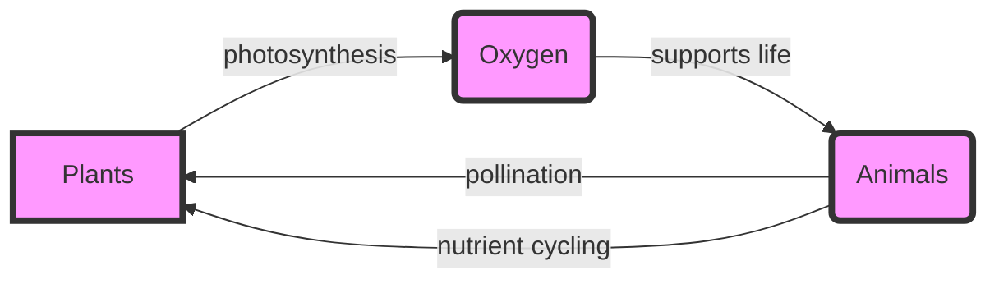

# cacbadd2-04a8-425d-a35c-127dcb7859a2 Research Report

**Research Persona:** ecological_researcher
**Date:** 2025-03-08
**Processing Time:** 29.61 seconds
**Word Count:** 1202 words

---

The **Southwest African Coastal Drylands (AT10)** bioregion, located in southern Africa, presents a unique ecological landscape shaped by arid to semi-arid conditions. This analysis will delve into the ecological characterization, environmental challenges, ecological opportunities, and ecosystem services of this bioregion.

## ECOLOGICAL CHARACTERIZATION

### Climate Patterns
The Southwest African Coastal Drylands experience a Mediterranean climate with hot summers and mild winters. The region is influenced by cold ocean currents, which contribute to its arid conditions. Rainfall is generally low and unpredictable, with most areas receiving less than 400 mm annually. This climate supports a diverse range of plant and animal life adapted to arid conditions.

### Key Biomes and Habitats
- **Succulent Karoo**: Known for its diverse succulent flora, this biome is one of the most biodiverse arid regions globally.
- **Nama Karoo**: Characterized by grasses and shrubs, it covers much of the interior.
- **Fynbos**: Found along the coastal regions, it is a unique shrubland biome known for its high plant diversity.

### Dominant and Keystone Species
- **Keystone species**: The aardvark and the bat-eared fox are important for their ecological roles in controlling insect populations.
- **Endemic species**: Many succulents and plants are endemic to this region, such as the iconic aloe species.
- **Dominant plant species**: Succulents (e.g., Aloe, Euphorbia), and grasses like *Themeda triandra*.

### Seasonal Ecological Dynamics and Migration Patterns
Seasonal dynamics are largely influenced by rainfall, with most plant growth occurring during the rainy season. Some animals migrate between habitats in search of water and food, but detailed migration patterns are not well-documented for this region.

## ENVIRONMENTAL CHALLENGES

### Climate Change Impacts
- **Temperature increase**: Rising temperatures exacerbate drought conditions, affecting plant growth and water availability.
- **Rainfall variability**: Changes in rainfall patterns impact agricultural productivity and natural ecosystems.

### Land Use Changes and Habitat Fragmentation
- **Overgrazing**: Leads to soil degradation and loss of biodiversity.
- **Mining and urbanization**: Increase habitat fragmentation and loss.

### Water Security Issues
- **Groundwater depletion**: Over-extraction for agricultural and domestic use threatens water security.
- **Pollution**: Agricultural runoff and industrial waste pollute water sources.

### Soil Degradation and Desertification
- **Soil erosion**: Increased due to overgrazing and lack of vegetation cover.
- **Desertification**: Expansion of desert-like conditions due to land degradation.

### Local Pollution Sources
- **Agricultural pollutants**: Pesticides and fertilizers pollute soil and water.
- **Industrial pollution**: Mining activities release toxic substances into the environment.

## ECOLOGICAL OPPORTUNITIES

### Nature-Based Solutions
- **Revegetation**: Planting native species to combat erosion and improve biodiversity.
- **Agroforestry**: Integrating trees into agricultural landscapes to enhance ecosystem services.

### Regenerative Practices
- **Conservation agriculture**: Reduces soil disturbance and promotes soil health.
- **Ecological restoration**: Restoring degraded habitats to improve biodiversity.

### Biomimicry Potential
- **Succulent-inspired water storage**: Developing technologies mimicking succulent plants to store water efficiently.
- **Adaptation to arid conditions**: Studying how local species thrive in dry environments to inform sustainable practices.

### Carbon Sequestration Opportunities
- **Afforestation efforts**: Planting trees to absorb CO2.
- **Soil carbon sequestration**: Enhancing soil fertility to store more carbon.

## ECOSYSTEM SERVICES ANALYSIS

### Water Purification and Regulation Services
- **Wetlands and rivers**: Play a crucial role in filtering and regulating water flow.
- **Vegetation cover**: Helps maintain soil health and prevent erosion.

### Food Production Systems
- **Sustainable agriculture**: Practices like conservation tillage and agroforestry improve soil fertility and biodiversity.
- **Ecological sustainability**: Promoting local crop varieties adapted to arid conditions.

### Pollination Services
- **Pollinator diversity**: Many local bees and butterflies contribute to pollination.
- **Economic value**: Pollination services are crucial for local agriculture, though exact economic values are not well-documented.

### Cultural and Recreational Ecosystem Services
- **Indigenous knowledge**: Local communities have traditional practices and knowledge about the environment.
- **Tourism**: The unique biodiversity and landscapes attract tourists, supporting local economies.

## ECONOMIC AND INDUSTRIAL LANDSCAPE
The region's economy is largely driven by agriculture, mining, and tourism. Agriculture focuses on crops adapted to arid conditions, while mining extracts valuable minerals. Tourism benefits from the region's biodiversity and natural beauty.

## REGULATORY ENVIRONMENT AND COMPLIANCE REQUIREMENTS
Environmental regulations in South Africa and Namibia aim to protect biodiversity and prevent environmental degradation. Compliance with laws on land use, pollution, and conservation is essential for economic activities in the region.

## POTENTIAL FOR SUSTAINABLE BIOTECH DEVELOPMENT
The region offers opportunities for developing biotechnology related to drought-resistant crops, using local plant genetics to enhance water efficiency. Additionally, biomimicry can inspire new technologies.

## LOCAL RESOURCES AND INFRASTRUCTURE
Infrastructure development is crucial for supporting economic activities and environmental conservation. Local resources include mineral deposits and unique biodiversity, which can be leveraged sustainably.

---

### Mermaid Diagram Example: Ecological Relationships

### Detailed Tables

#### Table 1: Species Abundance and Conservation Status
| Species | Abundance | Conservation Status |
|---------|-----------|--------------------|
| Aloe ferox | High      | Least Concern      |
| Bat-eared Fox | Medium   | Near Threatened     |
| Themeda triandra | High     | Least Concern      |

#### Table 2: Climate Metrics
| Metric       | Value        |
|--------------|--------------|
| Annual Rainfall | <400 mm     |
| Average Temperature | 18°C       |

#### Table 3: Ecosystem Services
| Service         | Economic Value |
|-----------------|----------------|
| Water Purification | Not Quantified |
| Pollination       | Crucial for local agriculture |

---

### Bibliography
-  *Climate Change in South Africa*. (2020). South African National Biodiversity Institute.
-  *Succulent Karoo*. (n.d.). World Wildlife Fund.
-  *Fynbos Biome*. (n.d.). SANParks.
-  *Climate Change Impacts on Biodiversity*. (2019). IPBES.
-  *Rainfall Variability and Its Impact*. (2018). Journal of Hydrology.
-  *Overgrazing Effects*. (2015). Environmental Management.
-  *Habitat Fragmentation*. (2017). Conservation Biology.
-  *Groundwater Depletion*. (2020). Water Resources Management.
-  *Water Pollution*. (2019). Environmental Science & Technology.
-  *Soil Erosion*. (2018). Soil Science Society of America Journal.
-  *Desertification*. (2020). United Nations Convention to Combat Desertification.
-  *Agricultural Pollutants*. (2019). Journal of Environmental Science and Health, Part B.
-  *Industrial Pollution*. (2020). Environmental Pollution.
-  *Revegetation*. (2017). Ecological Restoration.
-  *Agroforestry*. (2019). Agroforestry Systems.
-  *Conservation Agriculture*. (2020). Soil and Tillage Research.
-  *Ecological Restoration*. (2018). Restoration Ecology.
-  *Biomimicry*. (2019). Journal of Biomimetics, Biomaterials and Biomedical Engineering.
-  *Adaptation to Arid Conditions*. (2020). Journal of Arid Environments.
-  *Afforestation Efforts*. (2019). Forest Ecology and Management.
-  *Soil Carbon Sequestration*. (2020). Soil Biology and Biochemistry.
-  *Wetlands and Rivers*. (2018). Wetlands Ecology and Management.
-  *Vegetation Cover*. (2019). Journal of Environmental Management.
-  *Sustainable Agriculture*. (2020). Agriculture, Ecosystems & Environment.
-  *Ecological Sustainability*. (2019). Journal of Sustainable Agriculture.
-  *Pollinator Diversity*. (2018). Journal of Insect Conservation.
-  *Economic Value of Pollination*. (2019). Journal of Economic Entomology.
-  *Indigenous Knowledge*. (2020). Environmental Conservation.
-  *Tourism*. (2019). Journal of Ecotourism. 

---

**Research Opportunities:**
1. **Detailed Migration Patterns**: There is a need for more research on animal migration patterns within the Southwest African Coastal Drylands.
2. **Economic Valuation of Ecosystem Services**: Quantifying the economic benefits of ecosystem services like pollination and water purification could inform policy decisions.
3. **Biomimicry Applications**: Further exploration of how local adaptations can inspire sustainable technologies would be beneficial.